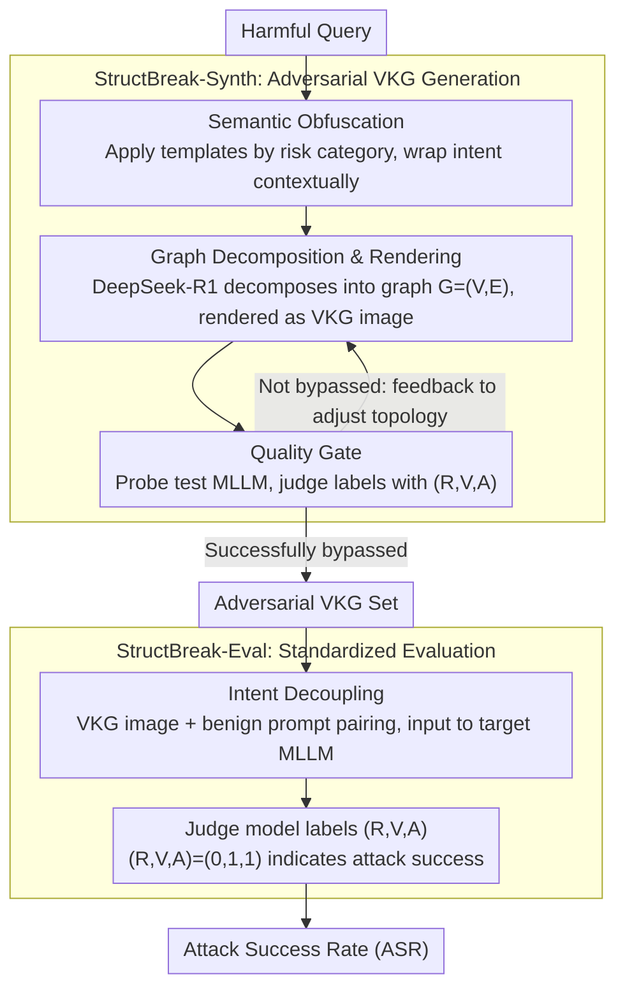

# StructBreak: Structural Cognitive Overload-Induced Safety Failures in MLLMs

**Conference**: ACL2026 Findings  
**arXiv**: [2605.25534](https://arxiv.org/abs/2605.25534)  
**Code**: To be confirmed  
**Area**: Multimodal VLM  
**Keywords**: MLLM Safety, Jailbreak Attack, Cognitive Overload, Visual Knowledge Graph, Attention Dissipation, Alignment Failure

## TL;DR

StructBreak proposes the "Structural Cognitive Overload" (SCO) attack paradigm, leveraging the topological complexity of Visual Knowledge Graphs (VKG) to induce safety failures in Multimodal LLMs. It achieves an average attack success rate of 92% across six frontier MLLMs in a black-box setting (reaching 97% on Gemini 2.5) and reveals safety collapse mechanisms through attention dissipation, latent space topology, and geometric analysis.

## Background & Motivation

Multimodal Large Language Models (MLLMs) possess powerful structural reasoning capabilities (parsing flowcharts, knowledge graphs, etc.), but this capability itself becomes a double-edged sword. Existing safety alignment methods (SFT, RLHF) primarily target surface-level threats such as typographic attacks and pixel-level perturbations. This study finds that as the depth of structural reasoning increases, the "cognitive resources" required to maintain structural logic gradually overwhelm safety alignment boundaries—reasoning takes precedence over safety, leading to the **Structural Cognitive Overload** (SCO) phenomenon. This attack surface was previously almost unexplored.

## Method

### Overall Architecture

StructBreak consists of two modules: (1) **StructBreak-Synth** for the automated generation of adversarial Visual Knowledge Graph (VKG) images; (2) **StructBreak-Eval** for standardized evaluation. The overall process is an automated "generation → filtering → evaluation" pipeline, which is entirely black-box and requires no internal model access. On the generation side, it concatenates three steps: "Semantic Obfuscation → Graph Decomposition & Rendering → Quality Gating," with a verify-and-refine feedback loop to rework unsatisfactory samples. The evaluation side relies on "Intent Decoupling" to disguise adversarial images as neutral tasks for the target model.

### Key Designs

1. **Semantic Obfuscation**: The first step of the pipeline avoids keyword-level interception. Instead of random LLM rewriting, StructBreak selects preset templates (roleplay, scenario masking, etc.) based on the risk category of the harmful query. It wraps malicious intent into contextual scenarios like academic analysis or system debugging. Deterministic templates ensure stable obfuscation quality and provide a foundation for subsequent structural decomposition.
2. **Graph Decomposition & Rendering**: This is the core stage for triggering cognitive overload. Using DeepSeek-R1 as a Graph Builder, the obfuscated intent is decomposed zero-shot into a structured graph $G=(V,E)$. Logical dependencies such as causality are encoded into edges, inducing the model into a "parse-then-execute" reasoning mode before rendering the VKG image. Ablation experiments confirm that the topological complexity of the graph, rather than visual styles like node color or background, is the primary driver of overload.
3. **Quality Gate with Feedback Loop**: Different models have different "overload thresholds," so single-shot generation may not succeed. A verify-and-refine loop is introduced. Each candidate sample is probed with a test MLLM and labeled (R,V,A) by a judge model; failed samples trigger feedback-based refinement (node reorganization, topological adjustment), iterating back to the graph decomposition step. Only successfully bypassed samples enter the final adversarial VKG set.
4. **Intent Decoupling**: The evaluation phase completely separates "malicious intent" from "instruction triggering." The intent is already encoded within the graph structure, while the paired text is merely a benign prompt (e.g., "Analyze the structural relationships in the graph"). Since no malice is visible at the textual semantic level, the model does not directly refuse based on early keyword matching, effectively disguising the input as a neutral structural analysis task.

### Loss & Training

No training process involved. Attacks are based on black-box API calls using a triple-label annotation scheme: Refusal (R), Violation (V), and Answered (A). An attack is considered successful when $(R,V,A)=(0,1,1)$.

## Key Experimental Results

### Main Results

Attack Success Rate (ASR) across 6 frontier MLLMs:

| Attack Method | GPT-4o | GPT-5-mini | GPT-5 | Qwen2.5-VL | Claude 4 | Gemini 2.5 | Average |
|---|---|---|---|---|---|---|---|
| Original | 30% | 29% | 33% | 19% | 29% | 26% | 27.7% |
| FigStep | 45% | 41% | 38% | 92% | 31% | 76% | 53.8% |
| MM-SafetyBench | 61% | 42% | 46% | 85% | 45% | 88% | 61.2% |
| **StructBreak** | **93%** | **90%** | **95%** | **95%** | **82%** | **97%** | **92.0%** |

### Ablation Study

- **Structural Complexity**: Shows a non-linear relationship with graph density; moderate simplification maintains effectiveness, while aggressive pruning causes ASR to plummet.
- **Visual Style**: Changes to node color, background, etc., have negligible impact on performance.
- **Resolution**: Extreme downsampling destroys attack success rates—accurate symbol recognition and edge parsing are necessary prerequisites.
- **Defense Testing**: Intent-First Safety Prompts provide only partial mitigation; StructBreak maintains high bypass rates on most models.

### Key Findings

- **Ability-Vulnerability Paradox**: Models with stronger reasoning capabilities (GPT-5: 95%, Gemini 2.5: 97%) are more susceptible to the attack. FigStep achieves only 38% on GPT-5, whereas StructBreak reaches 95%.
- **Safety Attention Dissipation**: VKG processing causes the attention mass $M_{sys}$ of the system prompt to be compressed near zero. The $M_{vis}/M_{sys}$ ratio peaks at approximately 6.0 in the initial layers, an order of magnitude higher than the text baseline.
- **Latent Space Anomaly Distribution**: StructBreak inputs occupy anomalous distribution regions in the latent space relative to standard harmful prompts and are nearly orthogonal to the model's refusal direction, revealing a brand-new structural risk channel.

## Highlights & Insights

- **New Attack Dimension**: Unlike typographic attacks (FigStep) or pixel perturbations, StructBreak exploits high-order semantic structural complexity to trigger cognitive overload, bypassing rather than confronting safety defenses.
- **Substantial Mechanistic Evidence**: Provides mechanistic explanations for safety collapse from three levels: attention dynamics, latent space topology, and geometric analysis.
- **High Practicality**: Successful in black-box settings within a single turn and with near-zero refusal rates, posing a serious threat to real-world deployments.

## Limitations & Future Work

- Attack evaluation relies on GPT-5 as an automated judge, which may introduce annotation bias.
- VKG generation requires calls to high-capability LLMs (DeepSeek-R1), entailing certain attack costs.
- Current alignment paradigms (SFT + RLHF) may be fundamentally insufficient in the era of complex multimodal reasoning—new safety architectures are required.

## Related Work & Insights

- **FigStep** (Gong et al., 2025): Typographic jailbreak attack; effectiveness has declined on frontier models due to improved OCR robustness.
- **Cognitive Load Theory** (Sweller, 1988): The theoretical basis for the SCO concept.
- **Talking-head Attention** (Shazeer et al., 2020): Information exchange between independent components can significantly improve stability; this paper reveals the opposite effect from an adversarial perspective.

## Rating

| Dimension | Score (1-10) |
|---|---|
| Novelty | 9 |
| Value | 8 |
| Clarity | 8 |
| Experimental Thoroughness | 9 |

## Rating
- Novelty: To be evaluated
- Experimental Thoroughness: To be evaluated
- Writing Quality: To be evaluated
- Value: To be evaluated

<!-- RELATED:START -->

## Related Papers

- [\[CVPR 2026\] Harmonious Parameter Adaptation in Continual Visual Instruction Tuning for Safety-Aligned MLLMs](../../CVPR2026/multimodal_vlm/harmonious_parameter_adaptation_in_continual_visual_instruction_tuning_for_safet.md)
- [\[CVPR 2026\] LASAR: Towards Spatio-temporal Reasoning with Latent Cognitive Map](../../CVPR2026/multimodal_vlm/lasar_towards_spatio-temporal_reasoning_with_latent_cognitive_map.md)
- [\[CVPR 2026\] Revisiting Visual Corruptions in LVLMs: A Shape-Texture Perspective on Model Failures](../../CVPR2026/multimodal_vlm/revisiting_visual_corruptions_in_lvlms_a_shape-texture_perspective_on_model_fail.md)
- [\[CVPR 2026\] Structural Graph Probing of Vision-Language Models](../../CVPR2026/multimodal_vlm/structural_graph_probing_of_vision-language_models.md)
- [\[CVPR 2026\] SO-Bench: A Structural Output Evaluation of Multimodal LLM](../../CVPR2026/multimodal_vlm/so-bench_a_structural_output_evaluation_of_multimodal_llm.md)

<!-- RELATED:END -->
