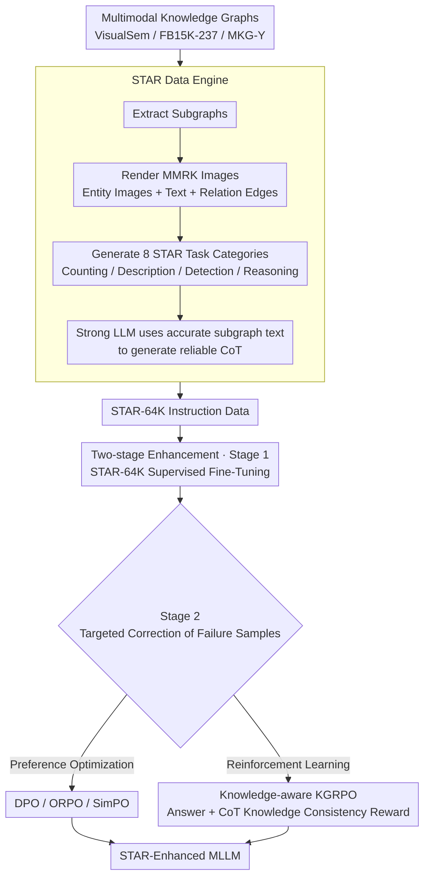

# Structured and Abstractive Reasoning on Multi-modal Relational Knowledge Images

**Conference**: ACL2026 Findings  
**arXiv**: [2510.21828](https://arxiv.org/abs/2510.21828)  
**Code**: https://github.com/zjukg/STAR  
**Area**: Multimodal VLM / Knowledge Graphs / Structured Reasoning  
**Keywords**: MMRK Images, STAR Task, Multimodal Knowledge Graphs, KGRPO, Synthetic Instruction Data  

## TL;DR
This paper proposes the STAR data engine and a two-stage training framework for multi-modal relational knowledge (MMRK) images. Using STAR-64K synthetic data, CoT annotations, and knowledge-aware KGRPO, it significantly improves the capability of MLLMs in understanding and reasoning over abstract structured knowledge images.

## Background & Motivation
**Background**: Multimodal Large Language Models (MLLMs) are already capable of handling natural images, charts, OCR, and visual math problems. Many benchmarks are also testing the understanding of "abstract visual information," such as charts, diagrams, mathematical figures, and structured documents.

**Limitations of Prior Work**: Multi-modal relational knowledge images remain systematically under-studied. These images are not ordinary photographs but organize entities, text descriptions, images, and relation edges into node-edge structures, requiring models to simultaneously identify entities, understand edge types, track graph structures, and perform reasoning based on them.

**Key Challenge**: While the visual understanding of MLLMs is strengthening, they are often trained on natural scenes and general charts. The key semantics of MMRK images come from human-defined high-level relations. If a model only "sees nodes" but cannot process the relationships between nodes as a knowledge structure, it fails in counting, error detection, entity completion, and relational reasoning.

**Goal**: The authors aim to bridge two gaps: the lack of large-scale, high-quality MMRK instruction data, and the absence of training and evaluation protocols specifically designed for STAR capabilities.

**Key Insight**: The paper converts existing multi-modal knowledge graphs (MMKGs) into visual subgraphs and generates eight categories of tasks along with reliable CoT from these subgraphs. This avoids manual annotation costs while binding the ground-truth answers of the graph structure, reasoning paths, and visual presentations.

**Core Idea**: Automatically synthesize STAR-64K using MMKGs, then optimize MLLMs using SFT followed by preference/RL optimization. Specifically, KGRPO provides extra rewards for knowledge correctness within the CoT to reduce hallucinations during structural reasoning.

## Method
The actual contribution of this paper is a full stack: a data engine, training protocols, evaluation tasks, reinforcement learning strategies, and systematic experiments.

Focusing only on model training would underestimate its value; what matters is that the authors turn "abstract structured visual knowledge" into a family of tasks that can be generated at scale, trained, and evaluated.

### Overall Architecture
Input data comes from three public multimodal knowledge graphs: VisualSem, FB15K-237, and MKG-Y.

Each knowledge graph can be represented as a combination of entity sets, relationship sets, triple sets, entity image sets, and entity text description sets.

The data engine extracts subgraphs from the graphs, visualizing the entity images and texts along with relational edges to form MMRK images.

The engine then generates eight STAR task categories around the same type of MMRK image: Entity Counting, Relation Counting, Image-Entity Counting, Triple Counting, Subgraph Description, Error Detection, Entity Reasoning, and Relation Reasoning.

For tasks requiring reasoning paths, instead of letting a weak MLLM generate CoT directly from the image, the authors use the accurate subgraph text (pre-visualization) as a prompt to let a strong LLM generate more reliable thought processes and answers.

Training is conducted in two stages: Stage 1 uses STAR-64K for Supervised Fine-Tuning (SFT) to establish basic STAR capabilities; Stage 2 targets failure samples by constructing preference data or using RL for further optimization.

Evaluation considers not only the final answer but also CoT quality; Task 5 (Description) uses similarity scores, while other tasks are evaluated via accuracy and CoT judge.

### Key Designs

**1. STAR Data Engine: Batch converting MMKG entities, relations, images, and text into trainable instruction data**

Direct manual annotation of MMRK images is slow and makes structural correctness difficult to guarantee. Since the key semantics of MMRK images come from high-level relations, any annotation error leads to the model learning incorrect structural knowledge. Therefore, the engine treats existing MMKGs as the source of truth: it extracts subgraphs from VisualSem, FB15K-237, and MKG-Y, renders them into MMRK images, and generates questions and answers for eight task categories.

The CoT generation is a highlight: the authors do not force weak MLLMs to fabricate reasoning chains from images; instead, they feed the accurate subgraph structure text to a strong LLM to produce thought processes. This ensures the image, structure, answer, and reasoning basis are naturally aligned, keeping the reasoning trace consistent with ground-truth triples and suppressing hallucinations at the source.

**2. Two-stage STAR Capability Enhancement: Learning task formats first, then targeting failure samples**

SFT is crucial for capability injection, but it only fits data in an average sense and struggles with hallucinations, incorrect CoT, and hard samples in complex graph reasoning. Thus, Stage 1 uses STAR-64K for SFT to maximize the probability of "generating an answer given an image and question," building baseline STAR skills. Stage 2 specifically optimizes training samples that still fail after Stage 1.

Stage 2 offers two paths: preference optimization (DPO/ORPO/SimPO), using the gold answer as the "preferred" and the model's own incorrect output as the "unpreferred"; or GRPO/KGRPO, using diverse group sampling and reward functions to optimize reasoning behavior. Both paths upgrade the training signal from "average fitting" to "targeted correction," addressing the missing link in structured graph reasoning.

**3. Knowledge-aware KGRPO: Explicitly rewarding factual knowledge correctness in CoT beyond the final answer**

Failures in MMRK reasoning often involve fabricating non-existent relations or misreading nodes rather than simple "math errors." Standard GRPO only monitors the final result and cannot suppress such process hallucinations. KGRPO adds a knowledge-informed reward to the standard answer reward, using ground-truth knowledge and a CoT judge to check if entities, relations, and triples in the reasoning chain are consistent with the graph structure.

In other words, the model must not only be right but also be right for the right reasons. By encoding structural knowledge consistency as a hard constraint in the training objective, relational hallucinations in the CoT are directly punished. This explains why KGRPO significantly outperformed DPO and standard GRPO in later experiments.

### Loss & Training
The SFT stage uses next-token prediction to train the MLLM to generate answers and CoTs conditioned on images and questions.

Stage 1 is trained for 3 epochs using LoRA, with a maximum sequence length of 8192, BF16 precision, AdamW optimizer, and a cosine scheduler.

In Stage 2, preference data (PA) is derived from instances where the Stage 1 model failed: the correct answer serves as the positive sample, and the incorrect generation as the negative sample.

KGRPO inherits the group-relative advantage concept from GRPO, but the reward function includes both final answer quality and the consistency of knowledge facts within the CoT.

The evaluation phase uses Qwen2.5-VL-72B as a judge to score CoT or unstructured outputs.

This strategy binds "visual image understanding," "knowledge structure consistency," and "reasoning path quality" together, avoiding optimization of a superficial answer metric alone.

## Key Experimental Results

### Main Results
The main table shows that two-stage training significantly improves the STAR performance of Qwen2.5-VL-3B/7B, with KGRPO being the strongest in Stage 2.

| Model / Setting | Task#1 ACC | Task#2 ACC | Task#3 ACC | Task#5 Score | Task#8 ACC | AVG |
|-----------------|------------|------------|------------|--------------|------------|-----|
| GPT-4v | 37.75 | 41.25 | 14.00 | 59.25 | 39.13 | 33.11 |
| GPT-4o-mini | 67.50 | 72.25 | 29.88 | 69.13 | 23.00 | 40.72 |
| Qwen2.5-VL-3B Zero-shot | 18.25 | 20.13 | 3.50 | 57.71 | 38.25 | 25.56 |
| Qwen2.5-VL-3B S1 Full | 42.75 | 67.00 | 57.13 | 59.94 | 56.00 | 53.24 |
| Qwen2.5-VL-3B S2 KGRPO | 75.00 | 85.38 | 68.63 | 71.51 | 68.57 | 63.64 |
| Qwen2.5-VL-7B Zero-shot | 6.13 | 12.25 | 0.13 | 68.62 | 42.88 | 21.24 |
| Qwen2.5-VL-7B S1 Full | 64.88 | 92.75 | 71.37 | 75.71 | 71.52 | 66.98 |
| Qwen2.5-VL-7B S2 KGRPO | 79.88 | 94.88 | 79.50 | 77.19 | 74.48 | 73.06 |

The most interesting phenomenon is that 3B/7B models, after specialized training, can surpass stronger closed-source models in zero-shot STAR performance, suggesting the capability gap stems primarily from data and training protocols rather than model scale alone.

### Ablation Study
The authors verified modality contributions, confirming that both entity images and entity texts in MMRK images are important, with text information usually having a larger impact.

| Backbone / Config | Task#1 | Task#2 | Task#3 | Task#4 | Task#5 | Task#6 | Task#7 | Task#8 |
|-------------------|--------|--------|--------|--------|--------|--------|--------|--------|
| Qwen2.5-VL-7B w/o ent. images | 55.50 | 75.88 | 48.62 | 26.63 | 67.99 | 32.00 | 52.63 | 65.75 |
| Qwen2.5-VL-7B w/o ent. texts | 59.13 | 74.62 | 47.88 | 25.37 | 67.90 | 34.87 | 41.50 | 68.12 |
| Qwen2.5-VL-7B full dataset | 64.88 | 92.75 | 71.37 | 27.62 | 75.71 | 55.87 | 67.50 | 80.13 |
| Qwen2.5-VL-32B w/o ent. images | 49.75 | 83.25 | 42.25 | 29.88 | 66.05 | 29.63 | 42.50 | 68.00 |
| Qwen2.5-VL-32B w/o ent. texts | 58.25 | 82.25 | 41.00 | 25.88 | 65.61 | 28.63 | 46.25 | 66.88 |
| Qwen2.5-VL-32B full dataset | 67.75 | 93.63 | 63.13 | 27.50 | 75.07 | 54.00 | 73.50 | 81.75 |

Another key analysis compared training settings: multi-task hybrid training generally outperformed single-task training. Removing the CoT prompt led to performance drops across five backbones, proving STAR is not just a visual recognition task but requires explicit structured thinking.

| Config | Key Metric | Description |
|--------|------------|-------------|
| S1 Single-task | Qwen2.5-VL-7B AVG 66.06 | Improves target tasks but weak cross-task transfer |
| S1 Full STAR-64K | Qwen2.5-VL-7B AVG 66.98 | Hybrid tasks bring more stable structural capabilities |
| S2 DPO | Qwen2.5-VL-7B AVG 68.84 | Preference optimization improves difficult samples |
| S2 GRPO | Qwen2.5-VL-7B AVG 69.91 | RL further boosts reasoning performance |
| S2 KGRPO | Qwen2.5-VL-7B AVG 73.06 | Knowledge rewards yield the strongest average effect |

### Key Findings
- Existing MLLMs are significantly deficient in zero-shot handling of MMRK images; many identify visual elements but fail to perform stable relation-level reasoning.
- SFT is the largest source of Gain, indicating the STAR-64K data itself is critical; Stage 2 KGRPO further reduces CoT hallucinations and errors on hard samples.
- Multi-task hybrid training is more transferable than training on a single STAR task, especially for complex reasoning tasks.
- The contribution of entity text is generally greater than entity images, but removal of either modality weakens performance, confirming MMRK semantics are inherently multimodal.
- The scaling patterns for Task#1 and Task#4 are unique; the former relates to basic entity recognition, while the latter is hindered by complex counting and graph structure, not improving linearly with data volume.

## Highlights & Insights
- The paper transforms MMKGs from "KG completion data sources" into "abstract visual reasoning benchmarks," a valuable perspective. It forces MLLMs to read structured knowledge graphs organized by humans rather than just natural images.
- The strength of the STAR data engine lies in verifiable answers and CoTs generated from ground-truth subgraphs. This approach controls the source of hallucinations better than letting an LLM simply "guess" reasoning from an image.
- The logic of KGRPO is highly transferable: if task answers derive from structured knowledge, the RL reward should not only look at the final label but check whether the entities and relations in the reasoning process are factual.
- Small models outperformed GPT-4o zero-shot after specialized training, suggesting many "abstract visual reasoning capabilities" are not mysterious emergences but results of insufficient training distribution coverage.

## Limitations & Future Work
- Data sources are mainly general encyclopedic MMKGs; specialized domains (scientific, medical, etc.) are not yet fully covered.
- While the eight task types are systematic, they are fixed templates; real-world knowledge image needs may be more open-ended, such as path explanation, counterfactual editing, cross-graph alignment, and multi-jump evidence citation.
- KGRPO experiments were limited by compute, primarily targeting models under 8B; training efficiency and stability on larger models still need validation.
- CoT judge uses a strong MLLM for automatic scoring; while scalable, it may miss fine-grained knowledge errors.
- Image rendering methods themselves (node layout, text density, edge occlusion) may affect results; layout robustness could be included in future evaluations.

## Related Work & Insights
- **vs M3STR**: M3STR focuses more on evaluating MLLM understanding of multimodal structured knowledge; this paper provides a data engine and training framework, moving from "measuring capability" to "enhancing capability."
- **vs MM-Instruct**: MM-Instruct also uses abstract image synthesis, but this work focuses specifically on relational knowledge images with stronger task structures and verifiability.
- **vs ChartQA / MathVista / MMMU**: These benchmarks test charts, math figures, and multi-disciplinary visual knowledge; this work tests structured abstract reasoning in entity-relationship graphs, where failure causes are closer to KG reasoning than visual perception.
- **vs Standard GRPO**: Standard GRPO is effective for result optimization, but in STAR, it prone to ignoring relation hallucinations in CoTs. KGRPO's insight is: reasoning task rewards should encompass intermediate knowledge consistency.

## Rating
- Novelty: ⭐⭐⭐⭐⭐ The combination of STAR data engine and KGRPO for MMRK images is highly novel, and task definitions are clear.
- Experimental Thoroughness: ⭐⭐⭐⭐☆ Main experiments cover 8 open-source MLLMs and multiple training strategies, though RL on larger scales was somewhat limited.
- Writing Quality: ⭐⭐⭐⭐☆ Complete structure and solid tables, though task numbering and numerous ACC/CoT metrics require high reading effort.
- Value: ⭐⭐⭐⭐⭐ Directly valuable for multimodal KGs, VLM evaluation, and structured reasoning training.

<!-- RELATED:START -->

## Related Papers

- [\[ACL 2026\] Leave My Images Alone: Preventing Multi-Modal Large Language Models from Analyzing Unauthorized Images](leave_my_images_alone_preventing_multi-modal_large_language_models_from_analyzin.md)
- [\[CVPR 2026\] StaR-KVQA: Structured Reasoning Traces for Implicit-Knowledge Visual Question Answering](../../CVPR2026/multimodal_vlm/star-kvqa_structured_reasoning_traces_for_implicit-knowledge_visual_question_ans.md)
- [\[CVPR 2026\] Hierarchical Attacks for Multi-Modal Multi-Agent Reasoning](../../CVPR2026/multimodal_vlm/hierarchical_attacks_for_multi-modal_multi-agent_reasoning.md)
- [\[ICML 2025\] Core Knowledge Deficits in Multi-Modal Language Models](../../ICML2025/multimodal_vlm/core_knowledge_deficits_in_multi-modal_language_models.md)
- [\[CVPR 2026\] Relational Visual Similarity](../../CVPR2026/multimodal_vlm/relational_visual_similarity.md)

<!-- RELATED:END -->
