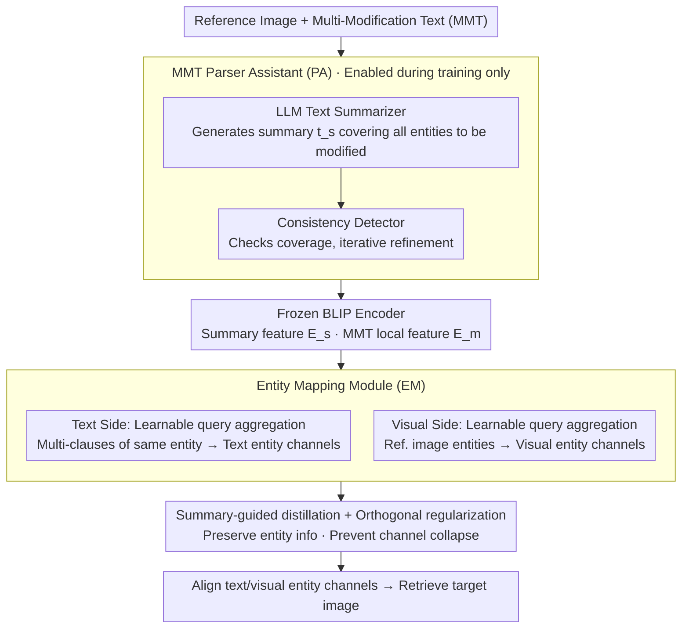

# TEMA: Anchor the Image, Follow the Text for Multi-Modification Composed Image Retrieval

**Conference**: ACL 2026  
**arXiv**: [2604.21806](https://arxiv.org/abs/2604.21806)  
**Code**: [https://github.com/lee-zixu/ACL26-TEMA/](https://github.com/lee-zixu/ACL26-TEMA/)  
**Area**: Image Retrieval / Multi-modal  
**Keywords**: Composed Image Retrieval, Multi-modification Text, Entity Mapping, Fine-grained Retrieval, Vision-Language Pre-training

## TL;DR

This paper proposes TEMA (Text-oriented Entity Mapping Architecture), the first framework for Composed Image Retrieval (CIR) oriented toward multi-modification texts. It enhances modified entity coverage through an MMT Parser Assistant (PA) and addresses the clause-entity alignment problem with an Entity Mapping (EM) module. Furthermore, it constructs two multi-modification benchmarks, M-FashionIQ and M-CIRR, achieving state-of-the-art performance in both original and multi-modification scenarios.

## Background & Motivation

**Background**: Composed Image Retrieval (CIR) utilizes multi-modal queries consisting of a "reference image + modification text" to retrieve target images. Existing methods have made significant progress under the setting of short modification texts that cover only a few salient changes.

**Limitations of Prior Work**: Existing CIR settings have two limitations highly relevant to practical applications: (1) Insufficient entity coverage—when multiple entities require modification, training signals concentrate on salient regions, missing some entities (the proportion of modification texts explicitly referencing all modified entities is small); (2) Clause-entity misalignment—in practice, multiple modification clauses may constrain the same entity (e.g., simultaneously modifying the hem, shoulder decoration, and belt of a dress), or a single clause may constrain multiple entities of the same category (e.g., changing three Golden Retrievers to Huskies).

**Key Challenge**: The performance of existing CIR models drops sharply when facing multi-modification requirements (experiments show a significant performance cliff). The root cause is the lack of multi-modification annotations during training, preventing models from establishing "one-to-many" clause-entity correspondences.

**Goal**: (1) Construct multi-modification CIR benchmarks that better reflect real-world scenarios; (2) Design the first CIR framework adaptable to both simple and multi-modification scenarios.

**Key Insight**: Address the problem at both data and model levels—generate Multi-Modification Texts (MMT) using MLLMs with human verification to build datasets, and design specialized modules to handle multi-entity coverage and clause aggregation.

**Core Idea**: Extract a list of entities to be modified via LLM-generated summaries, use learnable queries to aggregate multiple modification clauses of the same entity into a unified representation, and align them with corresponding entities on the visual side.

## Method

### Overall Architecture

TEMA consists of two core components: (1) An MMT Parser Assistant (PA), including an LLM text summarizer and a consistency detector, used to extract entities to be modified and perform entity coverage checks during training (disabled during inference); (2) An MMT-oriented Entity Mapping (EM) module, which aggregates multiple MMT clauses of the same entity under the guidance of a summary through text and visual entity mapping. BLIP is used as the underlying feature extraction backbone.

### Key Designs

**1. MMT Parser Assistant (PA): Explicitly listing entities to be modified**

In multi-modification texts, entities to be modified are often scattered across long sentences. During training, models tend to focus only on salient regions, missing other entities—the root cause of "insufficient entity coverage." The PA utilizes an LLM (GPT-3.5-Turbo) to generate a summary $t_s$ for each MMT, strictly requiring that this summary mentions all entities to be modified. Summary features $\mathbf{E}_s = \Phi_\mathbb{T}(t_s)$ are then extracted by a frozen BLIP text encoder, serving as a clear guidance signal for downstream entity mapping.

To ensure reliability, the PA includes a consistency detector (also an LLM) that checks whether the summary precisely covers all entities mentioned in the MMT without adding extras, performing iterative corrections if necessary. This produces a clean entity list. Notably, the PA is only enabled during training and disabled during inference to avoid LLM dependency and latency.

**2. MMT-oriented Entity Mapping Module (EM): Aggregating "one-to-many" clauses to entity channels**

In reality, multiple modification clauses often constrain the same entity (e.g., modifying hem, shoulder, and belt), or one clause constrains multiple similar entities. Global features cannot distinguish these needs. EM introduces a set of learnable queries $\mathbf{a}_q = \{a_1, ..., a_k\}$, which are fed into a Transformer along with summary features $\mathbf{E}_s$ and MMT local features $\mathbf{E}_m^l$:

$$\hat{\mathbf{a}}_q = \text{Transformer}([\mathbf{E}_s, \mathbf{E}_m^l, \mathbf{a}_q])$$

Since the summary includes all entities to be modified in a concise manner, learnable queries can adaptively aggregate scattered clauses (like "change shoulder to lace" and "change hem to irregular") into the same entity channel via attention. The visual side aggregates visual entity features $\hat{\mathbf{b}}_q$ from the reference image similarly, ensuring text and visual entities are aligned at the channel level.

**3. Summary-guided Distillation + Orthogonal Regularization: Preserving information and preventing collapse**

The EM aggregation has two risks: generated text tokens might lose entity information, and multiple learnable query channels might collapse onto the same entity. Summary-guided distillation aligns tokens produced by EM with the entity list parsed by the PA to ensure full information preservation. Orthogonal regularization constrains different query channels to be orthogonal to each other, forcing them to focus on different entities and avoiding redundancy. Together, these allow EM to maintain a clean mapping where one channel corresponds to one entity.

### Loss & Training

BLIP is used as the backbone with a frozen image encoder. The model is optimized using AdamW (learning rate 2e-5), batch size 64, feature dimension 256, and $N=3$ learnable query channels. The loss function includes three parts: batch-based classification loss (contrastive learning), summary-guided distillation loss, and orthogonal regularization loss. The PA module is used only during training. All experiments were conducted on a single NVIDIA A40 48GB GPU.

## Key Experimental Results

### Main Results

**Performance on M-FashionIQ and M-CIRR datasets (R@K %)**

| Method | M-FashionIQ Avg R@10 | M-FashionIQ Avg R@50 | M-CIRR Avg |
|------|---------------------|---------------------|------------|
| TIRG | 9.20 | 18.05 | 22.83 |
| BLIP4CIR | 40.99 | 62.44 | 70.92 |
| BLIP4CIR+Bi | 40.78 | 62.05 | 72.54 |
| Candidate | 47.38 | 66.71 | 72.75 |
| **TEMA (Ours)** | **50.59** | **72.09** | **75.76** |

### Ablation Study

| Configuration | M-FashionIQ R@10 | Δ | M-CIRR Avg | Δ |
|------|-----------------|---|------------|---|
| Full TEMA | 50.59 | - | 75.76 | - |
| w/o PA | 47.80 | -2.79 | 71.59 | -4.17 |
| w/o CD (Consistency Detection) | 49.14 | -1.45 | 73.87 | -1.89 |
| w/o EM | 45.41 | -5.18 | 70.99 | -4.77 |
| w/o EM_txt | 46.11 | -4.48 | 71.20 | -4.56 |
| w/o EM_img | 46.17 | -4.42 | 71.64 | -4.12 |
| w/o Summ (Distillation) | 49.40 | -1.19 | 74.16 | -1.60 |
| w/o Ortho (Orthogonal) | 49.38 | -1.21 | 75.02 | -0.74 |

### Key Findings

- The EM module provides the greatest contribution: its removal decreases R@10 by 5.18, indicating that clause-entity alignment is the core bottleneck for multi-modification CIR.
- Entity mapping on both text and visual sides is equally important; removing either side leads to a drop of approximately 4.5.
- The PA consistency detector is significant (drop of 1.45 if removed), showing that LLM summary hallucinations affect downstream performance.
- VLP methods with a BLIP backbone significantly outperform traditional ResNet+LSTM architectures, suggesting that pre-trained language understanding is crucial for multi-modification scenarios.
- TEMA also achieves the best performance on original CIR datasets (FashionIQ, CIRR), indicating that the multi-modification design does not sacrifice performance in simple scenarios.

## Highlights & Insights

- Precise problem definition—the paper formalizes two core challenges of multi-modification CIR (insufficient entity coverage and clause-entity misalignment) and provides corresponding data and model solutions.
- The "PA for training enrichment, disabled for inference" design is practical—it avoids reliance on LLMs during inference while maintaining efficiency.
- Using learnable queries as "entity proxies" is transferable to other multi-modal tasks requiring multi-entity aggregation.

## Limitations & Future Work

- Restricted by the token length of the BLIP text encoder, CLIP backbones could not be used, limiting fair comparison with more methods.
- The number of learnable query channels $N$ is fixed at 3, which might lack flexibility for scenarios with varying numbers of entities.
- Dataset construction relies on MLLM generation, which may introduce systematic biases.
- Future work could explore dynamic channel allocation and end-to-end entity discovery mechanisms.

## Related Work & Insights

- **vs BLIP4CIR**: BLIP4CIR uses global feature combinations and cannot handle multi-entity scenarios; TEMA achieves fine-grained entity-level alignment through the EM module.
- **vs FineCIR**: FineCIR parses modification semantics but does not guarantee coverage of all entities; TEMA explicitly ensures coverage through the PA's consistency detection.
- **vs Cola/MagicLens**: These works focus on multi-object interference but do not solve the aggregation of multiple modification clauses.

## Rating

- Novelty: ⭐⭐⭐⭐ First to propose the multi-modification CIR problem with a complete data+model solution.
- Experimental Thoroughness: ⭐⭐⭐⭐⭐ Four datasets, detailed ablation, and comprehensive baseline comparisons.
- Writing Quality: ⭐⭐⭐⭐ Clear problem definition and intuitive method flowcharts.
- Value: ⭐⭐⭐⭐ Fills the gap in multi-modification CIR; both the dataset and method have strong practical value.

<!-- RELATED:START -->

## Related Papers

- [\[CVPR 2026\] Adapting In-context Generation for Enhanced Composed Image Retrieval](../../CVPR2026/multimodal_vlm/adapting_in-context_generation_for_enhanced_composed_image_retrieval.md)
- [\[CVPR 2026\] ReCALL: Recalibrating Capability Degradation for MLLM-based Composed Image Retrieval](../../CVPR2026/multimodal_vlm/recall_recalibrating_capability_degradation_for_mllm-based_composed_image_retrie.md)
- [\[CVPR 2026\] Self-guided Semantic Inspection for Zero-Shot Composed Image Retrieval](../../CVPR2026/multimodal_vlm/self-guided_semantic_inspection_for_zero-shot_composed_image_retrieval.md)
- [\[CVPR 2025\] CoLLM: A Large Language Model for Composed Image Retrieval](../../CVPR2025/multimodal_vlm/collm_a_large_language_model_for_composed_image_retrieval.md)
- [\[CVPR 2026\] ConeSep: Cone-based Robust Noise-Unlearning Compositional Network for Composed Image Retrieval](../../CVPR2026/multimodal_vlm/conesep_cone-based_robust_noise-unlearning_compositional_network_for_composed_im.md)

<!-- RELATED:END -->
