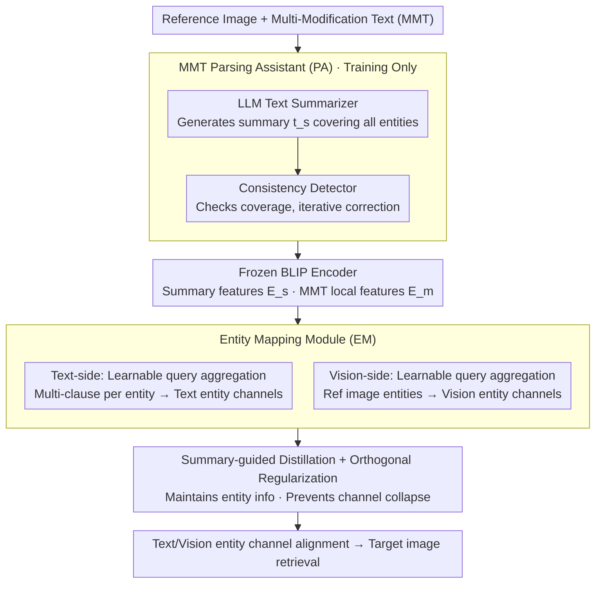

# TEMA: Anchor the Image, Follow the Text for Multi-Modification Composed Image Retrieval

**Conference**: ACL 2026  
**arXiv**: [2604.21806](https://arxiv.org/abs/2604.21806)  
**Code**: [https://github.com/lee-zixu/ACL26-TEMA/](https://github.com/lee-zixu/ACL26-TEMA/)  
**Area**: Image Retrieval / Multi-modal  
**Keywords**: Composed Image Retrieval (CIR), Multi-Modification Text (MMT), Entity Mapping, Fine-grained Retrieval, Vision-Language Pre-training

## TL;DR

This paper proposes TEMA (Text-oriented Entity Mapping Architecture), the first Composed Image Retrieval (CIR) framework designed specifically for Multi-Modification Text (MMT). It enhances entity coverage through an MMT Parsing Assistant (PA), resolves clause-entity alignment issues via an Entity Mapping (EM) module, and introduces two new multi-modification benchmarks, M-FashionIQ and M-CIRR, achieving state-of-the-art performance in both original and multi-modification scenarios.

## Background & Motivation

**Background**: Composed Image Retrieval (CIR) uses a multi-modal query consisting of a "reference image + modification text" to retrieve a target image. Existing methods have made significant progress under the setting of short modification texts covering only a few salient changes.

**Limitations of Prior Work**: Existing CIR settings have two limitations highly relevant to practical applications: (1) Insufficient entity coverage—when multiple entities require modification, training signals concentrate on salient regions, missing certain entities (the proportion of explicit references to target entities in modification text is small); (2) Clause-entity misalignment—in practice, multiple modification clauses may constrain the same entity (e.g., modifying the hem, shoulder decoration, and belt of a dress simultaneously), or a single clause may constrain multiple similar entities.

**Key Challenge**: Existing CIR models show a sharp performance drop in multi-modification scenarios (a "performance cliff"). The root cause is the lack of multi-modification annotations during training, preventing models from establishing "one-to-many" clause-entity correspondences.

**Goal**: (1) Construct multi-modification CIR benchmarks closer to real-world scenarios; (2) Design the first CIR framework adaptable to both simple and multi-modification scenarios.

**Key Insight**: Address the problem at both data and modeling levels—use MLLMs to generate Multi-Modification Text (MMT) with human verification for dataset construction, and design specialized modules to handle multi-entity coverage and clause aggregation.

**Core Idea**: Extract a list of entities to be modified via LLM-generated summaries, aggregate multiple modification clauses for the same entity into unified representations using learnable queries, and align them with corresponding entities on the visual side.

## Method

### Overall Architecture

TEMA consists of two core components: (1) An MMT Parsing Assistant (PA), including an LLM text summarizer and a consistency detector, used during training to extract target entities and perform coverage checks (disabled during inference); (2) An MMT-oriented Entity Mapping (EM) module that aggregates multiple MMT clauses for the same entity under summary guidance via textual and visual entity mapping. BLIP is utilized as the feature extraction backbone.

### Key Designs

**1. MMT Parsing Assistant (PA): Explicitly listing entities to be modified**

Entities to be modified in multi-modification text are often scattered across long sentences. Models tend to focus on salient regions and miss others, leading to "insufficient entity coverage." The PA uses an LLM (gpt-3.5-turbo) to generate a summary $t_s$ for each MMT, strictly requiring it to cover all target entities. The summary feature $\mathbf{E}_s = \Phi_\mathbb{T}(t_s)$ is extracted by a frozen BLIP text encoder to serve as a clear guidance signal for downstream entity mapping.

To prevent LLM hallucinations, the PA includes a Consistency Detector to verify that the summary exactly covers all entities in the MMT without adding extras, performing iterative corrections if necessary. PA is only used during training, avoiding LLM dependency during inference.

**2. MMT-oriented Entity Mapping (EM): Aggregating "one-to-many" clauses into entity channels**

In reality, multiple clauses often constrain one entity (e.g., changing the hem, shoulder, and belt of a dress), making global features insufficient. EM introduces learnable queries $\mathbf{a}_q = \{a_1, ..., a_k\}$ processed with $\mathbf{E}_s$ and MMT local features $\mathbf{E}_m^l$ via a Transformer:

$$\hat{\mathbf{a}}_q = \text{Transformer}([\mathbf{E}_s, \mathbf{E}_m^l, \mathbf{a}_q])$$

Since the summary includes all entities concisely, learnable queries can adaptively aggregate scattered clauses (e.g., "change shoulder to lace") into specific entity channels via attention. The visual side similarly aggregates reference image features $\hat{\mathbf{b}}_q$, aligning text and vision entities at the channel level.

**3. Summary-guided Distillation + Orthogonal Regularization: Preserving entity information and preventing collapse**

EM faces two risks: losing entity information in generated tokens or multiple queries collapsing onto the same entity. Summary-guided distillation aligns EM output tokens with the PA-extracted entity list to ensure completeness. Orthogonal regularization constrains different query channels to be orthogonal, ensuring they focus on distinct entities and reducing redundancy.

### Loss & Training

BLIP is used as the backbone with a frozen image encoder. Optimization uses AdamW (LR 2e-5, batch size 64, dimension 256, $N=3$ query channels). The loss function includes batch-based classification loss (contrastive learning), summary-guided distillation loss, and orthogonal regularization loss. PA is training-only. Experiments were conducted on a single NVIDIA A40 48GB GPU.

## Key Experimental Results

### Main Results

**Performance on M-FashionIQ and M-CIRR datasets (R@K %)**

| Method | M-FashionIQ Avg R@10 | M-FashionIQ Avg R@50 | M-CIRR Avg |
|------|---------------------|---------------------|------------|
| TIRG | 9.20 | 18.05 | 22.83 |
| BLIP4CIR | 40.99 | 62.44 | 70.92 |
| BLIP4CIR+Bi | 40.78 | 62.05 | 72.54 |
| Candidate | 47.38 | 66.71 | 72.75 |
| **TEMA (Ours)** | **50.59** | **72.09** | **75.76** |

### Ablation Study

| Configuration | M-FashionIQ R@10 | Δ | M-CIRR Avg | Δ |
|------|-----------------|---|------------|---|
| Full TEMA | 50.59 | - | 75.76 | - |
| w/o PA | 47.80 | -2.79 | 71.59 | -4.17 |
| w/o CD (Consistency Detector) | 49.14 | -1.45 | 73.87 | -1.89 |
| w/o EM | 45.41 | -5.18 | 70.99 | -4.77 |
| w/o EM_txt | 46.11 | -4.48 | 71.20 | -4.56 |
| w/o EM_img | 46.17 | -4.42 | 71.64 | -4.12 |
| w/o Summ (Distillation) | 49.40 | -1.19 | 74.16 | -1.60 |
| w/o Ortho (Regularization) | 49.38 | -1.21 | 75.02 | -0.74 |

### Key Findings

- The EM module provides the largest contribution: removing it drops R@10 by 5.18, identifying clause-entity alignment as the primary bottleneck in multi-modification CIR.
- Textual and visual entity mappings are equally important; removing either leads to a drop of approximately 4.5.
- The PA Consistency Detector contributes significantly (1.45 drop if removed), indicating that LLM summary hallucinations affect downstream performance.
- VLP methods with BLIP backbones significantly outperform traditional ResNet+LSTM architectures, highlighting the importance of pre-trained language understanding in complex scenarios.
- TEMA achieves state-of-the-art performance on original CIR datasets (FashionIQ, CIRR) without sacrificing simple-scene performance for multi-modification designs.

## Highlights & Insights

- Precise problem definition—First to formalize two core challenges (insufficient entity coverage and clause-entity misalignment) for multi-modification CIR, providing both data and modeling solutions.
- Practical "Train-with-PA, Infer-without-PA" design—Avoids inference-time LLM dependency while maintaining efficiency.
- Use of learnable queries as "entity proxies"—A design transferable to other multi-modal tasks requiring multi-entity aggregation.

## Limitations & Future Work

- Restricted by BLIP text encoder token length, preventing the use of CLIP backbones for broader comparisons.
- The number of learnable query channels $N$ is fixed at 3, which may lack flexibility for scenes with varying entity counts.
- Dataset construction relies on MLLM generation, which may introduce systematic biases.
- Future work could explore dynamic channel allocation and end-to-end entity discovery mechanisms.

## Related Work & Insights

- **vs BLIP4CIR**: BLIP4CIR uses global feature composition and cannot handle multi-entity scenarios; TEMA achieves fine-grained entity-level alignment through the EM module.
- **vs FineCIR**: FineCIR parses modification semantics but doesn't guarantee full entity coverage; TEMA ensures coverage via PA consistency checks.
- **vs Cola/MagicLens**: These works focus on multi-object interference but do not address the aggregation of multiple modification clauses.

## Rating

- Novelty: ⭐⭐⭐⭐ First to propose multi-modification CIR with complete data + model solutions.
- Experimental Thoroughness: ⭐⭐⭐⭐⭐ Four datasets, detailed ablations, and extensive baseline comparisons.
- Writing Quality: ⭐⭐⭐⭐ Clear problem definition and intuitive methodology diagrams.
- Value: ⭐⭐⭐⭐ Fills the gap in multi-modification CIR; both datasets and methods have high practical utility.

<!-- RELATED:START -->

## Related Papers

- [\[CVPR 2026\] ReCALL: Recalibrating Capability Degradation for MLLM-based Composed Image Retrieval](../../CVPR2026/multimodal_vlm/recall_recalibrating_capability_degradation_for_mllm-based_composed_image_retrie.md)
- [\[CVPR 2026\] Self-guided Semantic Inspection for Zero-Shot Composed Image Retrieval](../../CVPR2026/multimodal_vlm/self-guided_semantic_inspection_for_zero-shot_composed_image_retrieval.md)
- [\[CVPR 2026\] ConeSep: Cone-based Robust Noise-Unlearning Compositional Network for Composed Image Retrieval](../../CVPR2026/multimodal_vlm/conesep_cone-based_robust_noise-unlearning_compositional_network_for_composed_im.md)
- [\[CVPR 2025\] CoLLM: A Large Language Model for Composed Image Retrieval](../../CVPR2025/multimodal_vlm/collm_a_large_language_model_for_composed_image_retrieval.md)
- [\[CVPR 2026\] STiTch: Semantic Transition and Transportation in Collaboration for Training-Free Zero-Shot Composed Image Retrieval](../../CVPR2026/multimodal_vlm/stitch_semantic_transition_and_transportation_in_collaboration_for_training-free.md)

<!-- RELATED:END -->
