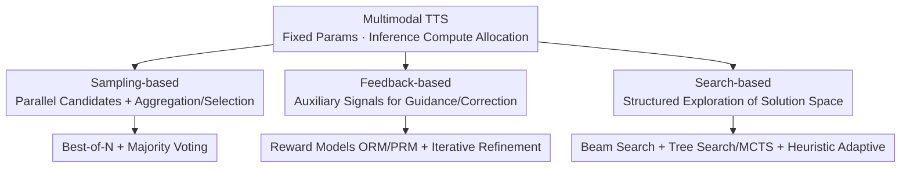

# Test-Time Scaling in Multimodal Foundation Models: A Comprehensive Survey of Generation and Reasoning

**Conference**: ACL 2026  
**arXiv**: [2606.08231](https://arxiv.org/abs/2606.08231)  
**Code**: TBD  
**Area**: Multimodal VLM / Test-Time Scaling / Survey / Multimodal Reasoning / Multimodal Generation  
**Keywords**: Test-Time Scaling, Multimodal Foundation Models, Sampling, Feedback, Search, Survey

## TL;DR
The first survey dedicated to **Test-Time Scaling (TTS) in Multimodal Foundation Models (MFM)**: it unifies various methods of "dynamically allocating compute at the inference stage" into a framework of $\pi^*=\arg\max_\pi \mathbb{E}[U(x,y)]$ s.t. compute budget constraints. It categorizes these into three paradigms: **Sampling-based, Feedback-based, and Search-based**, covering both multimodal generation and reasoning tasks, and provides a roadmap of representative methods, benchmarks, and open challenges.

## Background & Motivation
**Background**: The capabilities of foundation models have primarily relied on scaling parameters, data, and compute during pre-training (scaling laws). However, marginal returns from training-side scaling are diminishing, shifting the focus to "extracting the potential of pre-trained models during the **inference stage**." TTS (Test-time Scaling) follows this path: instead of updating parameters, it trades additional compute at inference (multiple samplings, searching, verification, iterative refinement) for higher performance. While proven effective in LLMs through search/sampling/verification, it is now expanding into Multimodal Foundation Models (MFM).

**Limitations of Prior Work**: MFM TTS research is exploding, yet **it lacks a unified taxonomy and theoretical framework**. Existing surveys almost exclusively cover LLM TTS. Multimodal components (image/video generation, multimodal reasoning) are scattered with inconsistent terminology, leaving new researchers without a clear map.

**Key Challenge**: Multimodal TTS appears to mirror LLM TTS but is **inherently more difficult**. While text requires compute allocation along a single modality's reasoning chain, MFMs must scale compute across **perceptual evidence, spatial grounding, and temporal context**. Evaluating intermediate steps requires strict **cross-modal consistency** (not just internal textual logic, but faithfulness to visual and spatial relations), and the modality gap often necessitates additional VLMs or reward models for scoring.

**Goal**: (1) Provide the first systematic survey of TTS on MFMs; (2) propose a unified taxonomy to clarify mechanisms and applicability; (3) summarize benchmarks and identify open challenges as a roadmap for future research.

**Key Insight**: The authors formalize TTS as "selecting an inference pipeline $\pi$ for a fixed model to maximize task utility within a compute budget," then converge diverse methods into three main branches categorized by application (multimodal generation vs. multimodal reasoning).

**Core Idea**: Organize all MFM TTS work using three mechanisms of "how to spend test-time compute": **Sampling-based, Feedback-based, and Search-based**.

## Method

### Overall Architecture
The survey formalizes TTS as: given fixed parameters $\theta$, select an inference pipeline $\pi$ to query the model, maximizing expected utility within a test-time budget $B$:

$$\pi^*=\arg\max_{\pi}\ \mathbb{E}_{y\sim\pi(\cdot\mid x,\theta)}[U(x,y)]\quad \text{s.t.}\ C(\pi,x)\le B,\ \theta\ \text{fixed}.$$

Where $x$ is the input, $y$ is the output, $U$ is the task utility, and $C(\pi,x)$ is the compute cost of applying $\pi$ to $x$. This formula highlights that TTS scales the **inference process** rather than model parameters, allowing adaptive compute. The authors distinguish between three test-time resources: **Compute** (the core of TTS), **Memory/State** (retrieval banks, episodic memory, KV cache), and **Weights** (test-time training/adaptation via gradients). This survey focuses on **compute-centric, parameter-static** methods, treating memory and weight updates as auxiliary. Two base architectures support MFM TTS: MLLMs (autoregressive processing of vision/audio/video tokens, supporting CoT and multi-step verification) and Diffusion Models (iterative denoising + CFG, allowing trade-offs between sampling steps/candidates and fidelity).

### Key Designs

**1. Sampling-based: Parallel Candidates + Aggregation/Selection**

The most direct way to "spend compute"—generating multiple solutions in parallel to explore a larger space. Two sub-paths: **Best-of-N (BoN)** uses a scoring function or "MLLM-as-a-judge" to evaluate $N$ candidates and pick the best (e.g., TTGen uses CLIP to pick optimal latents per diffusion step; SANA-1.5 uses tournament comparison; CoDe uses local BoN to save cost; UniGen uses CoT verification). **Majority Voting** aggregates candidates to find the most consistent output without an external verifier (e.g., CoT-Vid uses path clustering for video reasoning consistency; Video-RTS uses multi-path voting; RoboMonkey votes on VLA actions under Gaussian noise).

**2. Feedback-based: Guidance via Auxiliary Evaluation Signals**

Filters, guides, or corrects outputs using external signals during inference. Two sub-paths: **Reward Models** are split into Outcome Reward Models (ORM) and Process Reward Models (PRM)—the former evaluates final results (e.g., Guo et al. using LLaVA-OneVision as a zero-shot ORM), while the latter provides step-by-step feedback for search (e.g., Athena using consistency labels, RoVer refining 6D orientation via PRM, VisualPRM as a BoN verifier). **Iterative Refinement** emphasizes a "Generate-Evaluate-Refine" loop (e.g., Reflect-DiT combines VLM feedback with history to guide image editing; CyberV corrects attention drift via sensor-controller feedback; GenPilot iteratively rewrites prompts via visual verification).

**3. Search-based: Structured Exploration in Solution Space**

Models inference/generation as an explorable structure, using pruning, backtracking, or dynamic scheduling. Three sub-paths: **Beam Search** maintains the Top-K trajectories (e.g., LLaVA-CoT generates per-stage candidates with backtracking; MindJourney uses world models for spatial reasoning). **Tree Search / MCTS** expands reasoning into trees with self-rewards (e.g., VReST uses MCTS; Visuothink performs vision-language tree search with rollback; ZoomEye uses hierarchical search for perception; VLA-Reasoner optimizes actions via MCTS + world models). **Heuristic / Adaptive Search** provides flexibility (e.g., evolutionary search for gradient-free alignment; adaptive diffusion cycles that allocate compute as needed).

### Application & Tasks
The survey cross-cuts the three paradigms across two task categories: **Multimodal Generation** (Image/Video generation, alignment, UI-to-Code, where TTS manifests as candidate filtering and iterative prompt/image refinement) and **Multimodal Reasoning** (Math, spatial, video, embodied QA, VLA, where TTS involves process rewards, tree search, and consistency voting).

## Key Experimental Results

> This is a survey; no new experiments were conducted. The tables below summarize representative methods and mechanisms.

### Comparison of the Three Paradigms

| Paradigm | Core Mechanism | Verifier/Reward Required? | Representative Methods |
|----------|----------------|---------------------------|------------------------|
| Sampling-based | Parallel candidates + aggregation | Scoring for BoN; None for Voting | TTGen, SANA-1.5, CoDe, UniGen, CoT-Vid |
| Feedback-based | Guidance via evaluation/correction | Requires ORM/PRM or VLM feedback | Reflect-DiT, CyberV, Athena, RoVer, VisualPRM |
| Search-based | Structured exploration (Pruning/Backtracking) | Often pairs with PRM or World Models | LLaVA-CoT, MindJourney, Visuothink, VLA-Reasoner |

### TTS Focus: Generation vs. Reasoning

| Task Category | Typical Scenarios | Common TTS Techniques | Evaluation Focus |
|----------|----------|---------------|----------|
| Multimodal Generation | Image/Video Gen, Alignment, UI/Charts | BoN on latents, Iterative prompt/image refinement | Cross-modal fidelity & alignment |
| Multimodal Reasoning | Math/Spatial/Video/Embodied QA, VLA | Process rewards + Tree Search, Voting | Cross-modal faithfulness of steps |

### Key Findings
- **Multimodal TTS is harder than pure text TTS**: It requires scaling compute across perception, spatial grounding, and temporal context simultaneously. Intermediate verification requires cross-modal faithfulness, often necessitating external VLMs.
- **Paradigms are not mutually exclusive**: Many works use hybrid approaches (e.g., Tree Search with PRM, BoN with CoT verification).
- **Diffusion and MLLMs are the primary carriers**: Diffusion's iterative nature supports step/candidate trade-offs, while MLLM's autoregressive CoT facilitates multi-step verification and search.

## Highlights & Insights
- **Unified Formalization $\pi^*=\arg\max_\pi \mathbb{E}[U]$ s.t. $C\le B$**: Frame's test-time compute as an inference pipeline selection problem under budget constraints, providing a common coordinate system.
- **Clear Resource Boundaries**: Explicitly distinguishes "parameter-invariant compute scaling" from memory-augmented and test-time training methods.
- **Decomposition of "Multimodal Difficulty"**: Breaking down difficulty into perception, grounding, and temporal dimensions provides a checklist for designing new methods.
- **Two-dimensional Organization**: Allows readers to find methods either by mechanism (Sampling/Feedback/Search) or by task (Generation/Reasoning).

## Limitations & Future Work
- **Open Challenges Identified by Authors**: Lack of unified multimodal TTS benchmarks, difficulty in acquiring high-quality verification signals, and lack of theoretical characterization for the compute-utility trade-off.
- **Self-identified Limitations**: The survey focuses on categorization; it lacks quantitative horizontal comparisons of the three paradigms on a single benchmark. Heuristic search categories remain somewhat heterogeneous.
- **Future Directions**: Developing a unified evaluation to quantify "utility gain per unit of compute" and exploring the synergy between memory-augmented and compute-centric TTS.

## Related Work & Insights
- **vs. LLM TTS Surveys (e.g., Zhang et al. 2025c, Ji et al. 2025)**: These only cover text-based LLMs. This is the first systematic survey for Multimodal Foundation Models.
- **vs. Single-paradigm Papers**: This survey integrates scattered techniques (BoN, PRM, MCTS) into a unified Sampling-Feedback-Search map.
- **vs. Test-Time Training**: This paper clearly excludes parameter updates from the core definition of "compute-centric TTS," refining the conceptual scope.

## Rating
- Novelty: ⭐⭐⭐⭐ First MFM TTS survey with a unified formalization and three-paradigm taxonomy.
- Experimental Thoroughness: ⭐⭐⭐⭐ Extensive coverage of methods and benchmarks (though lacks unified quantitative comparison).
- Writing Quality: ⭐⭐⭐⭐ Clear formalization, distinct resource boundaries, and intuitive structure.
- Value: ⭐⭐⭐⭐ Provides a clear roadmap and self-check criteria for the rapidly expanding MFM TTS field.

<!-- RELATED:START -->

## Related Papers

- [\[CVPR 2026\] Scaling Spatial Intelligence with Multimodal Foundation Models](../../CVPR2026/multimodal_vlm/scaling_spatial_intelligence_with_multimodal_foundation_models.md)
- [\[ACL 2026\] A Survey of Deep Learning for Geometry Problem Solving](a_survey_of_deep_learning_for_geometry_problem_solving.md)
- [\[ICLR 2026\] MME-Unify: A Comprehensive Benchmark for Unified Multimodal Understanding and Generation Models](../../ICLR2026/multimodal_vlm/mme-unify_a_comprehensive_benchmark_for_unified_multimodal_understanding_and_gen.md)
- [\[ICML 2026\] CHARM: Using Multimodal JEPA + Channel Descriptions for Time Series Foundation Embedding](../../ICML2026/multimodal_vlm/giving_sensors_a_voice_multimodal_jepa_for_semantic_time-series_embeddings.md)
- [\[NeurIPS 2025\] TOMCAT: Test-time Comprehensive Knowledge Accumulation for Compositional Zero-Shot Learning](../../NeurIPS2025/multimodal_vlm/tomcat_test-time_comprehensive_knowledge_accumulation_for_compositional_zero-sho.md)

<!-- RELATED:END -->
