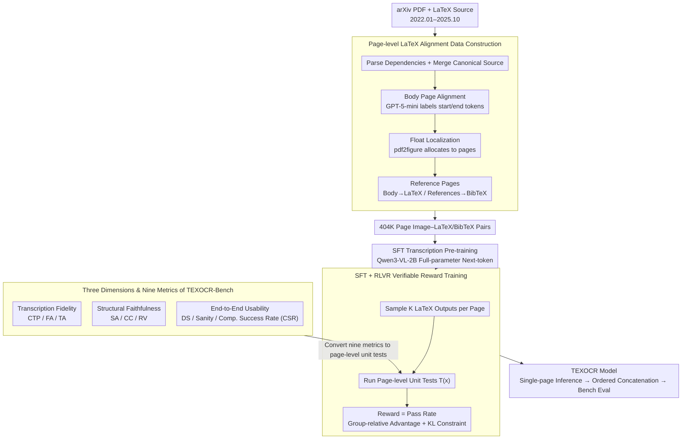

# TeXOCR: Advancing Document OCR Models for Compilable Page-to-LaTeX Reconstruction

**Conference**: ACL2026  
**arXiv**: [2604.22880](https://arxiv.org/abs/2604.22880)  
**Code**: To be confirmed (The paper page contains Data & Models / Code anchors, but specific links are not currently preserved in the arXiv abs cache)  
**Area**: Document OCR / Reinforcement Learning  
**Keywords**: Page-to-LaTeX, Document OCR, Compilable LaTeX, RLVR, Unit Test Reward

## TL;DR
This paper advances scientific PDF OCR from "converting to text/Markdown" to "reconstructing page-level LaTeX that is compilable without manual intervention." It proposes TEXOCR-Bench, TEXOCR-Train, and a two-stage SFT+RLVR training paradigm, enabling a Qwen3-VL-2B derivative model to significantly outperform open-source baselines of the same scale in structural consistency, citation validity, and compilation success rate.

## Background & Motivation
**Background**: Scientific papers are still widely disseminated as PDFs, but the truly reusable research assets are often LaTeX source files. LaTeX preserves formulas, tables, sections, citations, float objects, and numbering structures, and can be recompiled, edited, and integrated into publishing workflows. Recent document OCR has shifted from traditional modular pipelines to end-to-end MLLM recognition, with many systems capable of converting PDFs into plain text or Markdown.

**Limitations of Prior Work**: Markdown-level OCR is helpful for content that "looks like text," but many errors in scientific documents are more complex than simple character mistakes. A missing closing bracket, incorrect environment boundaries, corrupted `\ref{}` tags, or misaligned table column separators can render an entire LaTeX project uncompilable or, worse, silently alter the semantics of citations and numbering.

**Key Challenge**: Existing OCR evaluations mostly focus on local transcription similarity, whereas usable LaTeX requires global invariants: section hierarchies must be correct, floats must fall on reasonable pages, formula and table syntax must be closed, label-reference links must be parsable, and the final project must compile without manual intervention. Simply applying SFT to learn "LaTeX-like strings" is not equivalent to learning these executable constraints.

**Goal**: The authors aim to establish a benchmark for evaluating page-level PDF-to-LaTeX reconstruction, construct a large-scale page-aligned training set, and verify whether verifiable rewards can push models from token imitation toward functional correctness.

**Key Insight**: The paper treats LaTeX reconstruction as an "OCR with Unit Tests" problem. The evaluation side defines nine metrics covering transcription, structure, and end-to-end usability. The training side reformulates these metrics into page-level pass/fail unit tests, using RLVR to directly reward outputs that are compilable, parsable, and citation-consistent.

**Core Idea**: Use LaTeX compilers and structural checkers as verifiable supervision to transform the OCR model training objective from "generating similar text" to "generating LaTeX projects that pass document unit tests."

## Method
The TeXOCR method consists of three components: TEXOCR-Bench for task definition and evaluation; TEXOCR-Train for large-scale page-level supervision; and TEXOCR model training, which first employs SFT for transcription and then uses RLVR to optimize for LaTeX unit tests.

### Overall Architecture
The input is a rendered image of a single page from a scientific PDF, and the output is the corresponding LaTeX or BibTeX snippet for that page. During training, the authors collected LaTeX source packages and PDFs from arXiv (January 2022 to October 2025), parsed `.tex` dependencies, merged source files, restored section/figure structures, and then sliced the PDFs into single-page screenshots aligned with LaTeX snippets. Based on Qwen3-VL-2B, the model undergoes full-parameter SFT on 404K page image-LaTeX pairs, followed by sampling multiple outputs per page and assigning rewards based on automatically constructed unit tests for Group-Relative Policy Optimization (GRPO) style updates.

During evaluation, all models follow a unified page-level inference protocol: outputting LaTeX for each page independently, concatenating them in document order, and calculating nine metrics plus an Overall score. The authors compared single-image, multi-image, and merged multi-page image inference granularities, finding single-page images to be the most stable.

### Key Designs

**1. Three Dimensions and Nine Metrics of TEXOCR-Bench: Decomposing "Usability" into Quantifiable Engineering Constraints**

The real risks of scientific document OCR often hide in outputs that "look similar but are fundamentally unusable"—where the body text OCR score is high, but a single missing environment boundary or a corrupted `\ref{}` prevents the entire document from compiling. Thus, the benchmark decomposes quality into three dimensions and nine metrics to prevent models from succeeding through transcription alone: Transcription Fidelity (Complex Text Preservation CTP, Formula Accuracy FA, Table Accuracy TA); Structural Faithfulness (Section Accuracy SA, Citation Coverage CC, Reference Validity RV); and End-to-End Usability (Document-level Similarity DS, basic sanity checks, and Compilation Success Rate CSR).

Crucially, evaluation is not just page-by-page scoring; page outputs are merged in document order into a complete project to run structural parsing and standard LaTeX compilation. Engineering constraints like sections, citations, floats, formulas, tables, and the compiler are included—a model that only writes "LaTeX-like strings" but fails to compile will be exposed by the CSR metric.

**2. Page-level LaTeX Alignment Data Construction: Resolving the Natural Mismatch between Source Order and Visual Order**

The writing order of LaTeX source code often deviates from the visual order in a PDF, especially for float objects like figures and tables. If this page-source mismatch is not explicitly handled, the model will learn incorrect mappings that even the strongest training objectives cannot fix. Data construction addresses this by first parsing LaTeX dependencies into canonical sources. For body pages, GPT-5-mini aids in identifying start/end tokens to align with source snippets. Floats are localized within the global PDF using pdf2figure and assigned to the most appropriate page. Reference pages supervise the body area with LaTeX and the reference area with BibTeX. This ensures that every single-page sample has truly aligned image and LaTeX/BibTeX targets.

**3. SFT + RLVR Verifiable Reward Training: Transforming "Compilability" into Training Signals**

Standard token loss cannot express discrete constraints such as "whether this LaTeX compiles," "whether this label exists," or "whether table columns are closed." Consequently, SFT alone only learns character-level similarity. Training is thus two-staged: Stage I uses standard next-token prediction to learn high-fidelity transcription, aiming to maximize $\log \pi_\theta(y_t \mid x,p,y_{<t})$. Stage II (RLVR) samples $K$ completions for each page and runs a set of page-level unit tests $T(x)$ on each output. The reward is defined as the pass rate:

$$R(x,y)=|T(x)|^{-1}\sum_{\tau\in T(x)}\mathbb{I}[\tau(y)=\text{pass}]$$

The optimization uses group-relative advantage with a KL constraint to keep the policy near the SFT reference. This verifiable reward directly transforms discrete constraints like compilation, citations, and structure into gradient signals, addressing gaps left by token loss.

### Loss & Training
Training consists of two stages. Stage I performs full-parameter SFT on Qwen3-VL-2B for 1 epoch with a learning rate of $1e-5$, where each sample consists of a single-page PDF screenshot, format instructions, and the corresponding LaTeX/BibTeX target. Stage II applies RLVR to the SFT model: $K$ outputs are sampled per page to execute binary unit tests for transcription, structure, and usability. The reward is the pass rate, and the policy is updated using group-relative advantage combined with a KL penalty to maintain stable output style. Analysis of group sizes $K\in\{4,8,12,16,20,24\}$ shows that larger $K$ reduces variance and stabilizes RLVR gains.

## Key Experimental Results

### Main Results
TEXOCR-Bench includes 2,135 expert-annotated documents; TEXOCR-Train includes 57K papers and 404K page image-LaTeX/BibTeX pairs, covering 181K images, 231K tables, and 488K formulas. The main experiment evaluates 21 leading MLLM/OCR models, including GPT-5.3, Qwen3-VL, Qwen2.5-VL, InternVL, DeepSeek-OCR, olmOCR-2, etc.

| Model | Structural Avg | Usability Avg | Transcription Avg | CSR | Overall | Key Conclusion |
|------|----------------|---------------|-------------------|-----|---------|----------|
| GPT-5.3 | 78.2 | 84.6 | 72.7 | 82.7 | 78.5 | Most stable closed-source, 1st overall |
| TEXOCR (SFT + RLVR) | 83.1 | 68.4 | 73.5 | 45.2 | 75.0 | Strongest open-source, highest structure score |
| TEXOCR (SFT) | 74.0 | 66.0 | 70.1 | 44.3 | 70.0 | SFT beats base models but lacks structural constraints |
| Qwen3-VL-32B | 55.5 | 74.7 | 76.1 | 58.9 | 68.8 | Strong transcription, unstable refs/structure |
| Qwen3-VL-8B | 39.4 | 74.6 | 72.1 | 59.0 | 62.2 | Decent text/formulas, low structural score |
| Qwen3-VL-2B | 24.3 | 68.5 | 63.8 | 57.4 | 52.2 | Very weak structural capability without training |
| olmOCR-2-7B | 14.8 | 66.2 | 61.4 | 36.5 | 47.5 | Markdown/PDF OCR skills don't transfer to LaTeX |
| DeepSeek-OCR | 1.5 | 59.5 | 31.5 | 50.1 | 30.8 | Mostly outputs Markdown style; invalid LaTeX structure |

RLVR gains are concentrated in structure and usability. Moving from SFT to SFT+RLVR improves the Overall score from 70.0 to 75.0, Structural Avg from 74.0 to 83.1, Reference Validity from 74.1 to 86.8, and Citation Coverage from 74.5 to 85.9. This indicates that verifiable rewards effectively compel the model to respect constraints like labels, references, and sections that are difficult to optimize with token loss alone.

### Ablation Study
Ablation of the unit test reward is straightforward: removing any test category results in a performance drop, with the Overall score falling from 75.0 to approximately 70-71. Specifically, removing Structural Faithfulness unit tests drops the structural average from 83.1 to 73.1; removing Transcription Fidelity drops formula accuracy from 58.4 to 53.4 and complex text preservation from 72.8 to 65.6.

| RLVR Configuration | Structural Avg | Usability Avg | Transcription Avg | CSR | Overall | Note |
|-----------|----------------|---------------|-------------------|-----|---------|------|
| SFT+RLVR | 83.1 | 68.4 | 73.5 | 45.2 | 75.0 | Full unit test reward |
| w/o Transcription Fidelity | 77.4 | 67.5 | 68.9 | 48.9 | 71.3 | Significant CTP/FA/TA drop |
| w/o Structural Faithfulness | 73.1 | 67.2 | 70.6 | 46.4 | 70.3 | Section/citation/reference heavily damaged |
| w/o End-to-End Usability | 75.1 | 66.5 | 70.1 | 46.3 | 70.5 | Decline in doc similarity and usability |

Inference granularity ablation shows that while the final task is document-centric, simply feeding multiple pages to the model performs worse. Multi-image input causes cross-page interference, while merged images lead to resolution loss and reduced visual clarity.

| Model | Single-Image | Multi-Image | Merged | Conclusion |
|------|--------------|-------------|--------|------|
| Qwen3-VL-2B | 52.2 | 39.1 | 36.9 | Single-page is significantly more stable |
| GPT-5.3 | 78.5 | 56.9 | 42.6 | Even closed-source models suffer from multi-page interference |

Error analysis categorizes common failures into five types: truncation of paragraphs at page boundaries, errors in mathematical symbols or delimiters, corrupted table column separators or multi-row cells, missing or malformed citation/reference tags, and compilation failures caused by the above. These errors align closely with the focus of the TEXOCR-Bench and RLVR rewards.

### Key Findings
- Compilable LaTeX reconstruction is significantly harder than Markdown OCR. Many models retain body text but fail in section, citation, reference, and table syntax.
- The role of RLVR is not merely to increase text similarity, but to push the model toward LaTeX invariants: closed environments, legal citations, stable numbering, and compilable snippets.
- GPT-5.3 remains first Overall, but TEXOCR (SFT+RLVR) surpasses it in Structural Faithfulness Avg, proving that targeted training can compensate for a smaller model's capacity disadvantage.
- CSR is an extremely strict metric. TEXOCR's CSR is only 45.2 compared to GPT-5.3's 82.7, indicating significant room for improvement in reliable automatic publishing for page-level LaTeX OCR.
- Single-page inference is currently superior to multi-page input, but this highlights a limitation: document-level consistency is not fully resolved.

## Highlights & Insights
- The paper's greatest contribution is defining document OCR goals with "engineering realism." Most benchmarks stop at Markdown, but research workflows require source files acceptable to a LaTeX compiler that preserve citation semantics.
- Using unit tests for RLVR rewards is a natural fit. LaTeX is one of the few generative tasks where grammar, citations, tables, and formulas can be automatically verified, making RL independent of fragile preference models.
- Handling float placement in data construction is critical. The mismatch between float locations in source and PDF is a basic LaTeX property; without addressing this, page-to-LaTeX supervision would be naturally noisy.
- The evaluation dimensions are transferable to other "executable document/code generation" tasks, such as notebook OCR, HTML/CSS restoration, or CAD script reconstruction.

## Limitations & Future Work
- The paper focus remains primarily on page-level reconstruction. Real LaTeX projects involve cross-page structures, global macros, shared bibliographies, long-range references, and multi-page floats, which are difficult to guarantee via single-page concatenation.
- CSR is vital for usability but is sensitive to compilation environments, missing packages, and preamble strategies. Different templates or custom commands increase complexity.
- Data primarily comes from arXiv and open scanned sources; coverage for non-English papers, complex templates, handwritten annotations, and low-quality scans needs expansion.
- RLVR reward is a pass/fail unit test, representing a sparse signal. Future work could integrate differentiable rendering similarity or compilation log localization for finer-grained rewards.

## Related Work & Insights
- **vs PDF-to-Markdown OCR**: READoc, OmniDocBench, and olmOCRBench focus on text/Markdown extraction. This work further requires LaTeX structure, citations, and compilation, aligning closer with scientific publishing workflows.
- **vs formula/table LaTeX transcription**: CMER-Bench and Table2LaTeX-RL focus on local elements. TeXOCR unifies formulas, tables, sections, citations, and full-text compilation into page-level reconstruction.
- **vs RL in olmOCR2 / DianJin-OCR-R1**: These works use task-specific or verifiable rewards for OCR (reading order, tables, or Markdown). This work extends verifiable rewards to compilable LaTeX invariants.
- **vs General MLLM OCR**: Models like Qwen, InternVL, and LLaVA have strong visual recognition but lag in structural metrics when not trained for LaTeX engineering constraints.

## Rating
- Novelty: ⭐⭐⭐⭐☆ Page-to-LaTeX is not entirely new, but the combination of benchmark, training set, and RLVR unit tests is very complete.
- Experimental Thoroughness: ⭐⭐⭐⭐⭐ 21 models, nine metrics, training ablation, inference granularity, and error analysis provide a solid chain of evidence.
- Writing Quality: ⭐⭐⭐⭐☆ Motivations and system design are clear.
- Value: ⭐⭐⭐⭐⭐ Highly valuable for scientific OCR, executable document generation, and RLVR applications.

<!-- RELATED:START -->

## Related Papers

- [\[ACL 2026\] SlideAgent: Hierarchical Agentic Framework for Multi-Page Visual Document Understanding](slideagent_hierarchical_agentic_framework_for_multi-page_visual_document_underst.md)
- [\[AAAI 2026\] Seeing Justice Clearly: Handwritten Legal Document Translation with OCR and Vision-Language Models](../../AAAI2026/multimodal_vlm/seeing_justice_clearly_handwritten_legal_document_translation_with_ocr_and_visio.md)
- [\[CVPR 2026\] M3DocDep: Multi-modal, Multi-page, Multi-document Dependency Chunking with Large Vision-Language Models](../../CVPR2026/multimodal_vlm/m3docdep_multi-modal_multi-page_multi-document_dependency_chunking_with_large_vi.md)
- [\[ICLR 2026\] Reconstruction Alignment Improves Unified Multimodal Models](../../ICLR2026/multimodal_vlm/reconstruction_alignment_improves_unified_multimodal_models.md)
- [\[ACL 2025\] Improving MLLM's Document Image Machine Translation via Synchronously Self-reviewing Its OCR Proficiency](../../ACL2025/multimodal_vlm/improving_mllms_document_image_machine_translation_via_synchronously_self-review.md)

<!-- RELATED:END -->
