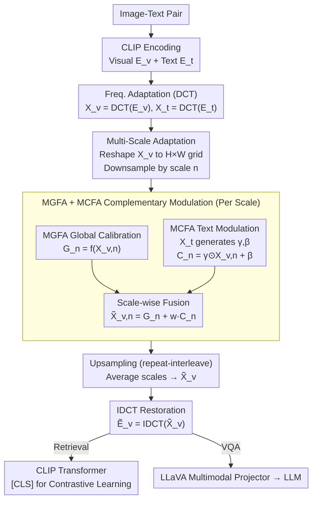

# Text-Guided Multi-Scale Frequency Representation Adaptation

**Conference**: ACL2026  
**arXiv**: [2605.08181](https://arxiv.org/abs/2605.08181)  
**Code**: https://github.com/Kelvin-ywc/FreqAdapter  
**Area**: Multimodal VLM / Parameter-Efficient Fine-Tuning  
**Keywords**: Frequency domain adaptation, DCT, Multi-scale features, Text-guided, CLIP/LLaVA

## TL;DR
This paper proposes FreqAdapter: visual and text embeddings from CLIP/LLaVA are transformed into the DCT frequency domain. Subsequently, text-guided multi-scale global adaptation and cross-modal modulation are used to fine-tune visual frequency representations. With approximately 0.11% additional parameters, it consistently outperforms common prompt/adapter methods in image-text retrieval and VQA.

## Background & Motivation
**Background**: Multimodal foundation models like CLIP and LLaVA possess strong vision-text representation capabilities but still require adaptation for new data distributions or downstream tasks. To reduce training costs, the community commonly uses prompt tuning, adapter tuning, LoRA, or visual prompting to update minimal parameters for tasks such as image-text retrieval and VQA.

**Limitations of Prior Work**: Most parameter-efficient fine-tuning methods perform uniform adjustments directly in the spatial or feature domains. This presents two issues: first, spatial/patch representations contain significant redundant information, making limited parameters prone to fitting noise or local distributions; second, many methods treat all tokens or feature channels equally, failing to explicitly exploit the multi-scale structure of visual signals or fully involve text semantics in visual adaptation.

**Key Challenge**: Multimodal tasks require capturing both fine details and global semantics simultaneously, yet parameter-efficient fine-tuning cannot significantly alter the backbone. If the adaptation module is too weak, it only performs shallow linear corrections; if the module is too strong or involves excessive cross-modal interaction, it may interfere with the pre-learned unimodal representations.

**Goal**: The authors aim to identify a lightweight and stable adaptation space where visual features can be selectively adjusted according to frequency and scale under text conditions, thereby reducing redundancy, enhancing cross-modal alignment, and maintaining low parameter counts and FLOPs.

**Key Insight**: The paper first analyzes the information distribution of visual embeddings using DCT, finding that semantic information is more concentrated in low-frequency components: retaining 198/768 low-frequency components achieves a reconstruction cosine similarity of 0.5, while similarity exceeds 0.8 and 0.9 with 495 and 626 components, respectively. This observation supports compact adaptation in the frequency domain.

**Core Idea**: Both visual and text embeddings are mapped to the frequency domain. Text-generated modulation parameters are applied across different spatial scales, and the adjusted visual frequency representations are restored to the spatial domain via IDCT as plug-and-play multimodal adaptation features.

## Method
The basic workflow of FreqAdapter is: CLIP encodes images and text to obtain visual and text embeddings; DCT is applied to both to obtain frequency domain representations; multi-scale aggregation of visual features is performed in the frequency domain; each scale passes through MGFA and MCFA; the outputs of each scale are upsampled and fused by averaging; finally, IDCT restores the features to the spatial domain, which are then fed into the subsequent CLIP transformer or LLaVA projector.

### Overall Architecture
Given an image-text pair, CLIP generates visual embeddings $E_v\in\mathbb{R}^{S_v\times D_v}$ and text embeddings $E_t\in\mathbb{R}^{S_t\times D_t}$. FreqAdapter first computes $X_v=DCT(E_v)$ and $X_t=DCT(E_t)$ to obtain more compact representations with controllable frequency bands. The visual token sequence is reshaped into an $H\times W\times D_v$ grid and downsampled at multiple scales; each scale's output is calibrated by a Global Frequency Adapter (MGFA) and then injected with text guidance via a Cross-modal Frequency Adapter (MCFA). The outputs are restored to the original resolution via repeat-interleave. The outputs of all scales are averaged to obtain $\tilde{X}_v$, followed by IDCT to yield the adapted visual features $\tilde{E}_v$.

In CLIP retrieval tasks, the adapted visual embeddings enter the final transformer layer, and the `[CLS]` visual features are used for contrastive learning with text features. In LLaVA, FreqAdapter can be inserted directly between the CLIP vision encoder and the LLaVA multimodal projector to provide more text-relevant visual features to the LLM.

### Key Designs

**1. Frequency Domain instead of Spatial Domain Adaptation: Concentrating limited parameters on the most information-dense frequency components.**

Spatial domain adapters can easily fit local noise in patch representations within limited training steps—visual embeddings are highly redundant, and a small number of parameters can easily learn suboptimal patterns. FreqAdapter operates in the frequency domain: DCT is an orthogonal transform that converts embeddings into frequency coefficients. Empirical observations show semantic information is highly concentrated in low-frequency components. Adaptation in the frequency domain allows for more controllable corrections across different bands, naturally separating low-frequency structures, high-frequency details, and noise, leading to smoother parameter updates and convergence within a single epoch.

**2. Multi-Scale Adaptation Strategy: Allowing a single module to capture both local details and global structures.**

Image-text matching requires both local object recognition and overall scene understanding. A single scale either modifies details or over-smoothes, failing to address both. FreqAdapter downsamples the visual frequency grid by scale $n$ to obtain $X_{v,n}$. Each scale is equipped with its own MGFA and MCFA, outputting $\tilde{X}_{v,n}=G_n+wC_n$, which is then restored via interleave-repeat and averaged across $N$ scales. This allows different receptive fields to be selected based on the semantic emphasis of the caption. The appendix indicates $N=3$ performs best; excessively large receptive fields can lead to loss of local information.

**3. Complementary Frequency Modulation of MGFA + MCFA: Stable visual calibration + text-conditioned cross-modal alignment.**

Visual global calibration alone lacks text conditions, while text modulation alone might interfere with pre-learned visual representations. MGFA is a lightweight bottleneck (two projection layers plus ReLU) that performs global transformation $G_n=f(X_{v,n})$ for stability. MCFA predicts modulation parameters $\gamma, \beta$ from text frequency representations $X_t$ to apply affine modulation $C_n=\gamma\odot X_{v,n}+\beta$, injecting text semantics into the visual frequency domain. A weight $w$ controls the cross-modal injection intensity ($w=0.01$ for retrieval, $w=1.0$ for VQA). The addition of two modules ensures visual representation stability while achieving fine-grained alignment under text conditions.

### Loss & Training
FreqAdapter is trained using the CLIP contrastive loss on image-text pairs. The backbone remains frozen, and only the adaptation modules are optimized. For retrieval experiments, training is conducted on the COCO 2017 train set for 1 epoch with a batch size of 128 and an AdamW learning rate of 0.001. The multimodal weight is $w=0.01$ for retrieval and $w=1.0$ for VQA. All CLIP experiments were performed on a single A100-40G. The authors note that smaller cross-modal weights are generally better for retrieval as excessive text information may interfere with intra-modal feature extraction.

## Key Experimental Results

### Main Results
Image-text retrieval experiments were evaluated on COCO 2017 validation and Flickr30K validation/test using R@1/R@5/R@10 for image-to-text and text-to-image. FreqAdapter consistently outperformed CoOp, MaPLe, CLIP-Adapter, MMA, and LoR-VP across CLIP-B/16, CLIP-L/14, and CLIP-L/14-336 backbones.

| Backbone | Method | COCO I2T R@1 | COCO T2I R@1 | Flickr30K I2T R@1 | Flickr30K T2I R@1 | Note |
|----------|------|--------------|--------------|-------------------|-------------------|------|
| CLIP-B/16 | Original CLIP | 51.82 | 32.65 | 85.30 | 62.28 | Unadapted Baseline |
| CLIP-B/16 | CLIP-Adapter | 56.30 | 41.60 | 83.90 | 71.26 | Improved COCO, slight Flickr I2T drop |
| CLIP-B/16 | FreqAdapter | 57.96 | 43.30 | 86.80 | 73.42 | Balanced retrieval improvements |
| CLIP-L/14 | CLIP-Adapter | 60.38 | 43.18 | 87.30 | 75.76 | Strong adapter baseline |
| CLIP-L/14 | FreqAdapter | 61.02 | 44.18 | 87.50 | 75.72 | Stronger on COCO, comparable on Flickr |
| CLIP-L/14-336 | CLIP-Adapter | 60.42 | 44.62 | 90.00 | 77.28 | High-res baseline |
| CLIP-L/14-336 | FreqAdapter | 61.42 | 45.23 | 90.90 | 77.60 | Best overall; COCO T2I R@1 reaches 45.23 |

VQA experiments integrated the FreqAdapter (trained on CLIP) into LLaVA 1.5. Results show FreqAdapter improves image understanding in visual question answering, with significant gains for LLaVA 13B on MM-Vet.

| Base Model | Method | MM-Vet | LLaVA-Bench | Interpretation |
|------------|------|--------|-------------|------|
| LLaVA 1.5-7B | w/o prompt | 30.9 | 64.3 | Baseline |
| LLaVA 1.5-7B | CLIP-Adapter | 27.1 | 61.8 | Generalization drop after specialization |
| LLaVA 1.5-7B | FreqAdapter | 31.8 | 64.8 | Exceeds 7B baseline on both metrics |
| LLaVA 1.5-13B | w/o prompt | 32.8 | 71.9 | 13B baseline |
| LLaVA 1.5-13B | CLIP-Adapter | 32.9 | 64.9 | Significant drop on LLaVA-Bench |
| LLaVA 1.5-13B | FreqAdapter | 37.4 | 72.4 | Massive gain on MM-Vet |
| LLaVA 1.5-13B | API (LLaVA) | 36.6 | 74.8 | FreqAdapter beats API(LLaVA) on MM-Vet |

### Ablation Study
Module ablation proves both MGFA and MCFA are effective, with MCFA's text modulation contributing more; the combination is optimal. Experiments used CLIP-L/14-336 on MSCOCO.

| MGFA | MCFA | I2T R@1 | I2T R@5 | I2T R@10 | T2I R@1 | T2I R@5 | T2I R@10 | Conclusion |
|------|------|---------|---------|----------|---------|---------|----------|------|
| - | - | 57.34 | 80.38 | 87.64 | 36.08 | 60.70 | 70.66 | Original CLIP-L/14-336 |
| - | ✓ | 58.16 | 81.90 | 88.94 | 42.81 | 67.86 | 77.43 | Text-guided modulation boosts T2I |
| ✓ | - | 58.70 | 82.28 | 89.54 | 43.47 | 68.66 | 78.04 | Global freq calibration is effective |
| ✓ | ✓ | 61.42 | 83.64 | 90.10 | 45.23 | 70.92 | 80.02 | Complementarity yields best results |

Multi-scale ablation shows $N=3$ is most suitable. For $N=1$ (single scale), I2T R@1 is 60.18; $N=2$ improves to 61.32; $N=3$ reaches 61.42 and T2I R@1 45.23; $N=4$ shows a slight decline.

Computational complexity analysis shows FreqAdapter is lightweight. It uses significantly fewer parameters than MaPLe, and GFLOPs are nearly identical to CLIP-Adapter and MMA.

| Method | Params | % of Model | GFLOPs | Note |
|------|--------|----------|--------|------|
| CLIP | - | - | 362.5 | Backbone |
| CoOp | 16.4k | 0.003% | 370.8 | Least params but highest computation |
| MaPLe | 798.7k | 0.19% | 362.9 | Most parameters |
| CLIP-Adapter | 524.3k | 0.12% | 362.5 | Common baseline |
| MMA | 118.7k | 0.03% | 362.7 | More lightweight |
| FreqAdapter | 476.4k | 0.11% | 362.6 | Fewer params than CLIP-Adapter, negligible compute overhead |

### Key Findings
- Frequency domain adaptation is more stable than spatial domain adaptation. Comparisons with SpatialAdapter show that spatial methods suffer from overfitting and loss rebounds mid-epoch, while FreqAdapter remains smooth.
- MCFA is the key to performance surges, particularly for text-to-image retrieval; MGFA further stabilizes adjustments across frequency bands.
- Moderate cross-modal interaction is crucial. A small $w=0.01$ is better for retrieval, as excessive text injection interferes with unimodal features.
- FreqAdapter is transferable to LLaVA, although gains are not superior across all metrics compared to the API baseline, suggesting the limits of frequency domain adapters for generative VQA are still influenced by the backbone and projector.

## Highlights & Insights
- This paper offers an interesting perspective on the "adaptation space" for parameter-efficient fine-tuning. Unlike previous works that focus on architecture (prompt vs. adapter), it emphasizes shifting to the frequency domain to reduce redundancy before performing updates.
- The combination of DCT and multi-scale is natural. The frequency domain handles information decomposition by band, while multi-scale handles aggregation by spatial receptive field, corresponding to the "frequency" and "region" dimensions of visual semantics.
- MCFA's text-condition modulation is highly reusable. For any CLIP-like VLM, text frequency features can generate $\gamma, \beta$ to adjust visual frequency representations.
- Frequency and spatial domain adaptations are not mutually exclusive. Appendix discussions on merging FreqAdapter with CLIP-Adapter show they can be complementary, leaving room for hybrid PEFT.

## Limitations & Future Work
- Theoretical explanations remain largely empirical. Although information concentration and training curves suggest the stability of the frequency domain, there is no rigorous proof of which frequencies map to which semantics.
- Experiments focus on CLIP-based architectures and LLaVA 1.5. Performance on larger VLMs or purely end-to-end multimodal LLMs requires further validation.
- The method relies on text guidance; in scenarios with poor-quality prompts, MCFA modulation might introduce erroneous semantic bias.
- Improvements are often within 1-2 points. Future work requires larger-scale benchmarks and statistical significance analysis.
- DCT is a fixed basis. Future research could explore learnable frequency bases, wavelets, or dynamic frequency band selection.

## Related Work & Insights
- **vs CLIP-Adapter**: CLIP-Adapter adds adapters to spatial/feature outputs; this work transforms embeddings to the frequency domain first and performs global calibration and text modulation there for better generalization.
- **vs CoOp / MaPLe**: Prompt tuning modifies input or cross-modal prompts; FreqAdapter modifies visual frequency representations, suitable for tasks requiring fine-grained image feature adjustment.
- **vs LoRA / LoR-VP**: LoRA-like methods change weights or visual prompts via low-rank parameters; FreqAdapter keeps the backbone frozen and uses an external module for plug-and-play capability.
- **vs Freq-based Vision Methods**: SpectFormer and others show frequency improves visual representation; this work extends frequency processing to cross-modal adaptation for CLIP/LLaVA.

## Rating
- Novelty: ⭐⭐⭐⭐☆ Frequency domain ideas are established in vision, but text-guided multi-scale VLM adaptation is innovative.
- Experimental Thoroughness: ⭐⭐⭐⭐☆ Covers retrieval, VQA, modules, scale, computation, and domain comparisons, though task diversity remains limited.
- Writing Quality: ⭐⭐⭐⭐☆ Clear methodology and complete tables.
- Value: ⭐⭐⭐⭐☆ Provides insights for PEFT and VLM adaptation, particularly for low-cost enhancement of CLIP-like models.

<!-- RELATED:START -->

## Related Papers

- [\[CVPR 2026\] Language-guided Frequency Modulation for Large Vision-Language Models](../../CVPR2026/multimodal_vlm/language-guided_frequency_modulation_for_large_vision-language_models.md)
- [\[CVPR 2026\] FlashCache: Frequency-Domain-Guided Outlier-KV-Aware Multimodal KV Cache Compression](../../CVPR2026/multimodal_vlm/flashcache_frequency_kv_cache_compression.md)
- [\[CVPR 2026\] ORION: ORthonormal Text Encoding for Universal VLM Adaptation](../../CVPR2026/multimodal_vlm/orion_orthonormal_text_encoding_for_universal_vlm_adaptation.md)
- [\[ACL 2026\] TRACE: Unleashing Spatial Reasoning in Multimodal Large Language Models via Textual Representation Guided Reasoning](unleashing_spatial_reasoning_in_multimodal_large_language_models_via_textual_rep.md)
- [\[ACL 2026\] AFMRL: Attribute-Enhanced Fine-Grained Multi-Modal Representation Learning in E-commerce](afmrl_attribute-enhanced_fine-grained_multi-modal_representation_learning_in_e-c.md)

<!-- RELATED:END -->
