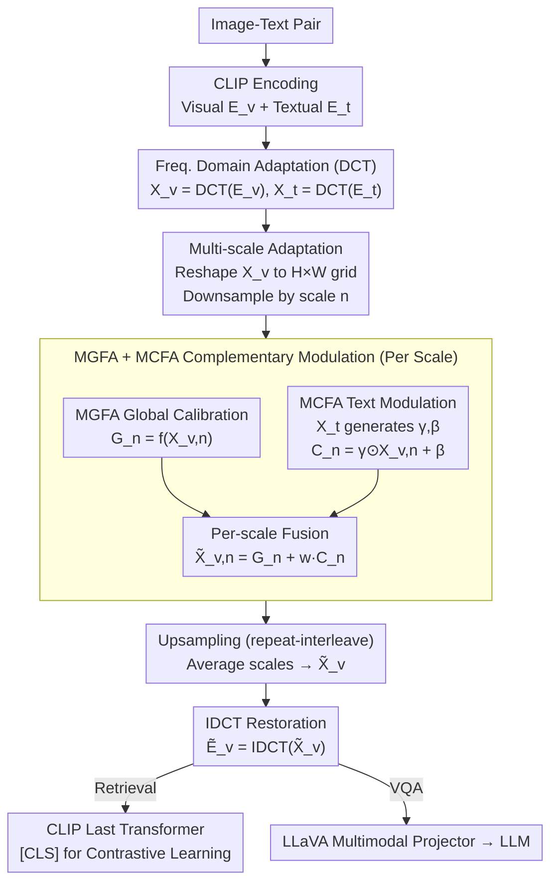

# Text-Guided Multi-Scale Frequency Representation Adaptation

**Conference**: ACL2026  
**arXiv**: [2605.08181](https://arxiv.org/abs/2605.08181)  
**Code**: https://github.com/Kelvin-ywc/FreqAdapter  
**Area**: Multimodal VLM / Parameter-Efficient Fine-Tuning  
**Keywords**: Frequency Domain Adaptation, DCT, Multi-scale Features, Text-guided, CLIP/LLaVA

## TL;DR
This paper proposes FreqAdapter, which transforms visual and textual embeddings of CLIP/LLaVA into the DCT frequency domain. It employs text-guided multi-scale global adaptation and cross-modal modulation to fine-tune visual frequency representations. With approximately 0.11% additional parameters, it consistently outperforms common prompt/adapter methods in image-text retrieval and VQA.

## Background & Motivation
**Background**: Multimodal foundation models like CLIP and LLaVA possess strong vision-language representation capabilities but still require adaptation for new data distributions or downstream tasks. To reduce training costs, the community commonly uses prompt tuning, adapter tuning, LoRA, or visual prompting methods, updating only a small number of parameters to improve performance on tasks such as image-text retrieval and VQA.

**Limitations of Prior Work**: Most parameter-efficient fine-tuning methods perform uniform adjustments directly in the spatial or feature domains. This presents two issues: first, spatial/patch representations contain significant redundant information, making limited parameters prone to fitting noise or local distributions; second, many methods treat all tokens or feature channels equally, failing to explicitly utilize the multi-scale structure of visual signals or fully involve textual semantics in visual adaptation.

**Key Challenge**: Multimodal tasks require capturing both fine-grained details and global semantics, yet parameter-efficient fine-tuning cannot significantly alter the backbone. If the adaptation module is too weak, it only provides shallow linear corrections; if it is too strong or involves excessive cross-modal interaction, it may interfere with the well-learned unimodal representations of the original model.

**Goal**: The authors aim to identify a lightweight yet stable adaptation space where visual features can be selectively adjusted based on frequency and scale under textual conditions, thereby reducing redundancy, enhancing cross-modal alignment, and maintaining low parameter counts and FLOPs.

**Key Insight**: The paper first analyzes visual embeddings using DCT and finds that semantic information is more concentrated in low-frequency components: retaining 198/768 low-frequency components achieves a reconstruction cosine similarity of 0.5, while retaining 495 and 626 components results in similarities exceeding 0.8 and 0.9, respectively. This observation supports compact adaptation in the frequency domain.

**Core Idea**: Both visual and textual embeddings are mapped to the frequency domain. Text-generated modulation parameters are applied across different spatial scales, and the adjusted visual frequency representations are restored to the spatial domain via IDCT, serving as plug-and-play multimodal adaptation features.

## Method
The basic workflow of FreqAdapter involves: CLIP encoding images and text to obtain visual and textual embeddings; applying DCT to both to obtain frequency domain representations; performing multi-scale aggregation of visual features in the frequency domain; applying MGFA and MCFA at each scale; upsampling and average-fusing the outputs from each scale; and finally returning to the spatial domain via IDCT to be fed into the subsequent CLIP transformer or LLaVA projector.

### Overall Architecture
Given an image-text pair, CLIP generates visual embeddings $E_v\in\mathbb{R}^{S_v\times D_v}$ and textual embeddings $E_t\in\mathbb{R}^{S_t\times D_t}$. FreqAdapter first computes $X_v=DCT(E_v)$ and $X_t=DCT(E_t)$ to obtain more compact, bandwidth-controllable representations. The visual token sequence is reshaped into an $H\times W\times D_v$ grid and downsampled at multiple scales. Each scale's output is calibrated by a Multi-scale Global Frequency Adapter (MGFA) and then subjected to text-guided modulation via a Multi-scale Cross-modal Frequency Adapter (MCFA). The results are restored to the original resolution through repeat-interleave operations. The outputs from all scales are averaged to obtain $\tilde{X}_v$, which is converted back to spatial features $\tilde{E}_v$ via IDCT.

In CLIP retrieval tasks, the adapted visual embeddings enter the final transformer layer, and the `[CLS]` visual feature is used for contrastive learning with textual features. In LLaVA, FreqAdapter can be inserted between the CLIP vision encoder and the LLaVA multimodal projector to provide more text-relevant visual features to the LLM.

### Key Designs

**1. Frequency Domain Adaptation over Spatial Domain: Spending limited parameters on high-density information frequency components**

Spatial domain adapters can easily fit local noise in patch representations within limited training steps—visual embeddings are highly redundant, and a small number of parameters can easily be misaligned. FreqAdapter operates in the frequency domain: DCT is an orthogonal transform that converts embeddings from spatial/channel forms into frequency coefficients. Empirical observations show that semantic information is highly concentrated in low-frequency components. Adaptation in the frequency domain allows for more controllable correction across different bands, naturally separating low-frequency structures, high-frequency details, and noise, leading to smoother parameter updates and convergence within a single epoch.

**2. Multi-Scale Adaptation Strategy: Enabling a module to perceive both local details and global structures**

Image-text matching requires both local object recognition and overall scene understanding. A single scale either modifies only details or over-smooths features. FreqAdapter downsamples the visual frequency grid by scale $n$ to obtain $X_{v,n}$. Each scale is assigned its own MGFA and MCFA, outputting $\tilde{X}_{v,n}=G_n+wC_n$, then uses interleave-repeat to restore the original size and averages across $N$ scales. This allows different scales to select different receptive fields based on the caption's semantic focus. Appendix results suggest $N=3$ is optimal, as excessively large receptive fields may lose local information.

**3. Complementary Frequency Modulation of MGFA + MCFA: Stable visual calibration + text-conditioned cross-modal alignment**

Relying solely on visual global calibration lacks textual conditioning, while relying solely on text modulation might interfere with well-learned visual representations. MGFA is a lightweight bottleneck (two projection layers plus ReLU) that performs global transformation $G_n=f(X_{v,n})$ on visual frequency features at each scale for stable calibration. MCFA predicts modulation parameters $\gamma, \beta$ from textual frequency representation $X_t$ to perform affine modulation $C_n=\gamma\odot X_{v,n}+\beta$, injecting textual semantics into visual frequencies. A weight $w$ controls the intensity of cross-modal injection ($w=0.01$ for retrieval, $w=1.0$ for VQA). Combining both modules ensures visual representation stability and achieves fine-grained alignment under textual conditions.

### Loss & Training
FreqAdapter is trained using the CLIP contrastive loss on image-text pairs, with the backbone mostly frozen and only the adaptation modules optimized. Retrieval experiments involve training for 1 epoch on the COCO 2017 train set with a batch size of 128 and an AdamW learning rate of 0.001. All CLIP experiments were performed on a single A100-40G. The paper notes that smaller cross-modal weights are generally better for retrieval, as excessive textual information can interfere with unimodal feature extraction.

## Key Experimental Results

### Main Results
Image-text retrieval experiments were evaluated on COCO 2017 validation and Flickr30K validation/test sets using R@1/R@5/R@10 for image-to-text and text-to-image. FreqAdapter outperformed CoOp, MaPLe, CLIP-Adapter, MMA, and LoR-VP across CLIP-B/16, CLIP-L/14, and CLIP-L/14-336 backbones.

| Backbone | Method | COCO I2T R@1 | COCO T2I R@1 | Flickr30K I2T R@1 | Flickr30K T2I R@1 | Note |
|----------|------|--------------|--------------|-------------------|-------------------|------|
| CLIP-B/16 | Original CLIP | 51.82 | 32.65 | 85.30 | 62.28 | Unadapted baseline |
| CLIP-B/16 | CLIP-Adapter | 56.30 | 41.60 | 83.90 | 71.26 | COCO gain, Flickr I2T slight loss |
| CLIP-B/16 | FreqAdapter | 57.96 | 43.30 | 86.80 | 73.42 | Balanced retrieval gain |
| CLIP-L/14 | CLIP-Adapter | 60.38 | 43.18 | 87.30 | 75.76 | Strong adapter baseline |
| CLIP-L/14 | FreqAdapter | 61.02 | 44.18 | 87.50 | 75.72 | Superior on COCO |
| CLIP-L/14-336 | CLIP-Adapter | 60.42 | 44.62 | 90.00 | 77.28 | High-res baseline |
| CLIP-L/14-336 | FreqAdapter | 61.42 | 45.23 | 90.90 | 77.60 | Best overall; COCO T2I R@1 to 45.23 |

VQA experiments integrated FreqAdapter trained on CLIP into LLaVA 1.5. FreqAdapter not only functions as a retrieval adapter but also improves image understanding in VQA, particularly showing significant gains for LLaVA 13B on MM-Vet.

| Base Model | Method | MM-Vet | LLaVA-Bench | Interpretation |
|------------|------|--------|-------------|------|
| LLaVA 1.5-7B | w/o prompt | 30.9 | 64.3 | Direct response baseline |
| LLaVA 1.5-7B | CLIP-Adapter | 27.1 | 61.8 | Generalization drops after distribution specialization |
| LLaVA 1.5-7B | FreqAdapter | 31.8 | 64.8 | Outperforms 7B baseline on both metrics |
| LLaVA 1.5-13B | w/o prompt | 32.8 | 71.9 | Original 13B baseline |
| LLaVA 1.5-13B | CLIP-Adapter | 32.9 | 64.9 | Significant drop on LLaVA-Bench |
| LLaVA 1.5-13B | FreqAdapter | 37.4 | 72.4 | Notable gain on MM-Vet |
| LLaVA 1.5-13B | API (LLaVA) | 36.6 | 74.8 | FreqAdapter exceeds API (LLaVA) on MM-Vet |

### Ablation Study
Module ablation proves both MGFA and MCFA are effective, with MCFA's text-guided modulation contributing more; the combination of both is optimal. This experiment used CLIP-L/14-336 and was evaluated on MSCOCO retrieval.

| MGFA | MCFA | I2T R@1 | I2T R@5 | I2T R@10 | T2I R@1 | T2I R@5 | T2I R@10 | Conclusion |
|------|------|---------|---------|----------|---------|---------|----------|------|
| - | - | 57.34 | 80.38 | 87.64 | 36.08 | 60.70 | 70.66 | Original CLIP-L/14-336 |
| - | ✓ | 58.16 | 81.90 | 88.94 | 42.81 | 67.86 | 77.43 | Text-guided modulation brings large T2I gain |
| ✓ | - | 58.70 | 82.28 | 89.54 | 43.47 | 68.66 | 78.04 | Global frequency calibration is also effective |
| ✓ | ✓ | 61.42 | 83.64 | 90.10 | 45.23 | 70.92 | 80.02 | Modules are complementary |

Multi-scale ablation shows $N=3$ is most suitable. $N=1$ provides single-scale adaptation with I2T R@1 at 60.18; $N=2$ increases it to 61.32; $N=3$ reaches 61.42 and T2I R@1 45.23; $N=4$ sees a decline, suggesting excessive aggregation windows lose detail.

| Scale Count N | I2T R@1 | I2T R@5 | I2T R@10 | T2I R@1 | T2I R@5 | T2I R@10 | Note |
|----------|---------|---------|----------|---------|---------|----------|------|
| 1 | 60.18 | 81.78 | 87.50 | 44.08 | 69.80 | 77.28 | Single scale; insufficient detail/global balance |
| 2 | 61.32 | 82.76 | 88.42 | 44.81 | 70.20 | 79.47 | Multi-scale begins stable improvement |
| 3 | 61.42 | 83.64 | 90.10 | 45.23 | 70.92 | 80.02 | Optimal configuration |
| 4 | 60.36 | 82.58 | 88.12 | 45.06 | 70.70 | 79.36 | Excessive receptive field causes info loss |

In terms of computational complexity, FreqAdapter is very lightweight in both parameters and FLOPs. It has significantly fewer parameters than MaPLe, and its GFLOPs are nearly identical to CLIP-Adapter and MMA.

| Method | Params | Param % | GFLOPs | Note |
|------|--------|----------|--------|------|
| CLIP | - | - | 362.5 | Backbone |
| CoOp | 16.4k | 0.003% | 370.8 | Fewest params but higher computation |
| MaPLe | 798.7k | 0.19% | 362.9 | Most parameters |
| CLIP-Adapter | 524.3k | 0.12% | 362.5 | Common adapter baseline |
| MMA | 118.7k | 0.03% | 362.7 | More lightweight |
| FreqAdapter | 476.4k | 0.11% | 362.6 | Lower params than CLIP-Adapter; negligible overhead |

### Key Findings
- Frequency domain adaptation is more stable than spatial domain adaptation. Comparisons with SpatialAdapter show that spatial methods suffer from overfitting and loss spikes in the latter half of an epoch, while FreqAdapter remains smoother.
- MCFA is the key to performance jumps, especially for text-to-image retrieval; MGFA further stabilizes adjustments across frequency bands.
- Moderate cross-modal interaction is crucial. A smaller $w=0.01$ is better for retrieval tasks; excessive text injection interferes with unimodal features.
- FreqAdapter can be transferred to LLaVA, although gains do not lead all metrics against API baselines, indicating that the upper limit of frequency adapters for complex generative VQA is still influenced by the backbone and projector.

## Highlights & Insights
- This paper provides an interesting "adaptation space" perspective for parameter-efficient fine-tuning. Unlike previous comparisons between prompt, adapter, and LoRA structures, it emphasizes switching to the frequency domain for adaptation to reduce redundancy before updating modules.
- The combination of DCT and multi-scale is natural. The frequency domain decomposes information by bands, while multi-scale aggregation handles spatial receptive fields, corresponding to "frequency" and "region" dimensions in visual semantics.
- MCFA's text-conditioned modulation is highly reusable. For any CLIP-like model or VLM, textual frequency features can generate $\gamma, \beta$ to tune visual frequency representations.
- Frequency and spatial domain adaptations are not mutually exclusive. Appendix discussions on merging FreqAdapter with CLIP-Adapter suggest the two can be complementary, leaving room for future hybrid PEFT research.

## Limitations & Future Work
- Theoretical explanations remain somewhat empirical. While the paper uses information density and training curves to demonstrate stability, it lacks a rigorous proof of which frequencies correspond to specific semantics and why DCT is optimal for certain tasks.
- Experiments focus on CLIP-based architectures and LLaVA 1.5; model scales are relatively limited. Performance on larger VLMs or end-to-end multimodal LLMs requires further validation.
- The method relies on text guidance; in scenarios with poor textual prompt quality, MCFA modulation might introduce erroneous semantic biases.
- Many improvements in the tables are within 1-2 points; while stable, they are not overwhelming. Future work requires larger-scale benchmarks and statistical significance analysis.
- DCT is a fixed frequency basis and may not be optimal for all learned embeddings. Future research could explore learnable bases, wavelets, multi-resolution spectral decomposition, or dynamic band selection.

## Related Work & Insights
- **vs CLIP-Adapter**: CLIP-Adapter adds adapters to spatial/feature outputs; Ours converts embeddings to frequency domain first, performing calibration and modulation for more stable generalization.
- **vs CoOp / MaPLe**: Prompt tuning primarily modifies input prompts or cross-modal prompts; FreqAdapter modifies visual frequency representations, suitable for tasks requiring fine-grained feature adjustment.
- **vs LoRA / LoR-VP**: LoRA-based methods change model weights or visual prompts via low-rank parameters; FreqAdapter keeps the backbone frozen and uses external frequency modules for plug-and-play capability.
- **vs Frequency-based Vision Methods**: SpectFormer and VFPT show frequency domain improvements for visual representation; this work extends frequency processing to text-guided cross-modal adaptation for CLIP/LLaVA.

## Rating
- Novelty: ⭐⭐⭐⭐☆ The frequency domain idea is established in vision, but the application to text-guided multi-scale VLM adapters is innovative.
- Experimental Thoroughness: ⭐⭐⭐⭐☆ Covers retrieval, VQA, ablation, multi-scale, complexity, and spatial-frequency comparisons, though task types are somewhat limited.
- Writing Quality: ⭐⭐⭐⭐☆ Clear methodology and comprehensive tables; theoretical depth could be improved.
- Value: ⭐⭐⭐⭐☆ Insightful for PEFT and VLM adaptation, particularly for low-cost enhancement of perception capabilities in CLIP-like models.

<!-- RELATED:START -->

## Related Papers

- [\[CVPR 2026\] Language-guided Frequency Modulation for Large Vision-Language Models](../../CVPR2026/multimodal_vlm/language-guided_frequency_modulation_for_large_vision-language_models.md)
- [\[CVPR 2026\] ORION: ORthonormal Text Encoding for Universal VLM Adaptation](../../CVPR2026/multimodal_vlm/orion_orthonormal_text_encoding_for_universal_vlm_adaptation.md)
- [\[ICLR 2026\] Flatness-Guided Test-Time Adaptation for Vision-Language Models](../../ICLR2026/multimodal_vlm/flatness_guided_test-time_adaptation_for_vision-language_models.md)
- [\[ACL 2026\] AFMRL: Attribute-Enhanced Fine-Grained Multi-Modal Representation Learning in E-commerce](afmrl_attribute-enhanced_fine-grained_multi-modal_representation_learning_in_e-c.md)
- [\[ACL 2026\] TEMA: Anchor the Image, Follow the Text for Multi-Modification Composed Image Retrieval](tema_anchor_the_image_follow_the_text_for_multi-modification_composed_image_retr.md)

<!-- RELATED:END -->
