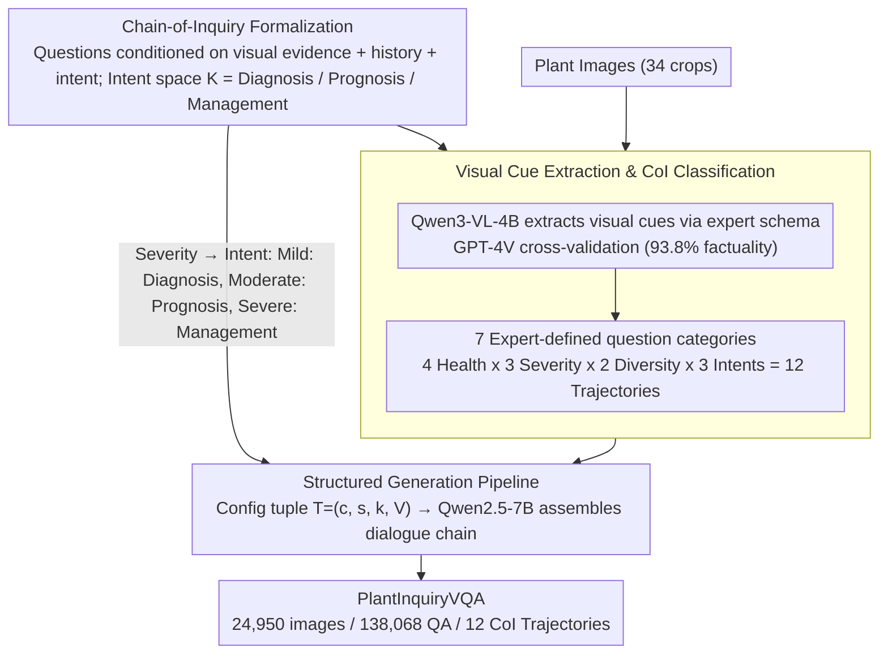

# Thinking Like a Botanist: Challenging Multimodal Language Models with Intent-Driven Chain-of-Inquiry

**Conference**: ACL 2026 Findings  
**arXiv**: [2604.20983](https://arxiv.org/abs/2604.20983)  
**Code**: [github.com/syed-nazmus-sakib/PlantInquiryVQA](https://github.com/syed-nazmus-sakib/PlantInquiryVQA)  
**Area**: Medical Imaging / Plant Pathology Diagnosis  
**Keywords**: Plant Pathology VQA, Chain-of-Inquiry, Multi-step Visual Reasoning, Diagnostic Reasoning, Multimodal Evaluation

## TL;DR
This paper introduces the PlantInquiryVQA benchmark and the Chain-of-Inquiry (CoI) framework, comprising 24,950 plant images and 138,068 QA pairs. It simulates the adaptive diagnostic questioning strategies of botanists to evaluate the multi-step visual reasoning capabilities of 18 MLLMs in plant pathology diagnosis. The study reveals that structured questioning significantly enhances diagnostic accuracy and reduces hallucinations, although even the strongest model achieved a clinical utility score of only 0.188.

## Background & Motivation

**Background**: VQA datasets represent a core paradigm for evaluating multimodal reasoning, expanding into domains such as medical imaging and scientific image analysis. Advanced VQA benchmarks now focus on multi-panel, multiple-choice, and vision-language grounded QA pairs. Existing datasets in agricultural vision (e.g., PlantVillage, PlantDoc) primarily target classification and segmentation tasks, lacking support for interactive QA reasoning.

**Limitations of Prior Work**: Current VQA benchmarks are fundamentally "question-centric," treating each image as an input for an independent query rather than the starting point for goal-oriented, adaptive exploration. However, in specialized fields like plant pathology, effective visual reasoning emerges from a series of interdependent inquiries based on prior observations following a serialized narrative trajectory, rather than answering isolated questions. Expert botanists perform holistic assessments through hierarchical, evidence-driven questioning strategies ranging from species identification to disease diagnosis and prognosis prediction.

**Key Challenge**: While LLMs have made significant progress in achieving Chain-of-Thought (CoT) reasoning, similar multi-step exploration has not been fully explored in VQA dataset design. CoT is typically viewed as a prompting strategy or an implicit capability of model architectures, rather than an explicit structural requirement of the dataset itself.

**Goal**: Construct a dataset-level Chain-of-Inquiry framework so that the question sequences themselves reflect the adaptive, decision-driven workflows of domain experts.

**Key Insight**: In plant pathology, each sample receives unique diagnostic considerations based on its visual appearance. When symptoms are ambiguous, experts prioritize differential diagnosis and comparative visual analysis; when symptoms are severe, they shift toward disease management and prevention strategies. The sequence and intent of questioning are as critical as the answers themselves.

**Core Idea**: Formalize a Chain-of-Inquiry framework that models diagnostic trajectories as ordered QA sequences conditioned on visual cues and cognitive intent, automatically adjusting questioning strategies from diagnosis to prognosis and management based on disease severity.

## Method

### Overall Architecture

The paper addresses the limitation where existing VQA benchmarks treat images as inputs for isolated queries, failing to test the "step-by-step" adaptive reasoning used in expert diagnosis. PlantInquiryVQA structures the dataset itself as a diagnostic chain, enabling question sequences to reproduce the authentic workflow of botanists—from species identification and disease determination to prognosis management. The construction pipeline consists of three stages: extracting fine-grained visual cues from plant images using a VLM based on an expert-defined schema; structuring plant pathology knowledge and mapping disease severity to different diagnostic intents; and dynamically assembling dialogue trajectories using an LLM based on intent and visual evidence. The final dataset covers 34 crop types, 7 question categories, and 12 unique CoI trajectories.

### Key Designs

**1. Chain-of-Inquiry Formalization: Diagnostic reasoning as intent-conditioned dialogue chains**

The fundamental flaw in legacy benchmarks is their "question-centric" nature, where each question lacks context of prior observations. CoI formalizes the diagnostic trajectory as an ordered $T$-turn dialogue $C(x, v_x) = \langle (q_1, a_1), \ldots, (q_T, a_T) \rangle$, where each question $q_t$ is conditioned on visual evidence $v_x$, prior context $H_{t-1}$, and a latent diagnostic intent $k \in \mathcal{K}$. The intent space is divided into three tiers: Diagnosis ($k_D$, health state identification and differential diagnosis), Prognosis ($k_P$, predicting disease trajectory and causal etiology), and Management ($k_M$, prescription strategies and counterfactual preventive reasoning).

Critically, intent is not fixed but switches based on disease severity—mild symptoms trigger diagnostic intent, moderate symptoms trigger prognosis, and severe symptoms trigger management. This reflects the fact that for mild symptoms, differential diagnosis (distinguishing between similar-looking diseases) is the primary challenge, while for severe damage, the priority shifts to remediation. Embedding intent explicitly into the dataset tests whether models can adaptively switch reasoning paths based on evidence.

**2. Visual Cue Extraction & CoI Classification: Transforming "vision" into structured diagnostic features via expert schemas**

To ensure valid question generation, the first step requires reliable, structured visual evidence rather than model hallucination. The authors engaged 6 botanists (2 PhDs + 4 graduate students) to define a "Visual Parsing Schema" across three dimensions: symptomatology, distribution patterns, and disease severity quantification. Qwen3-VL-4B was used for automated visual cue extraction (73.6% accuracy), followed by GPT-4V cross-validation and expert clinical facticity checks on 5,000 random samples (93.8% factuality score).

The classification layer addresses the lack of standard taxonomy for visual diagnostic dialogues in classical plant pathology. Experts performed clinical evaluations on 600 random samples, recording authentic questioning strategies to derive 7 standard inquiry types (Visual Perception & Grounding, Diagnostic Reasoning, Causal Reasoning, Risk Assessment, Prognostic Prediction, Prescriptive Reasoning, Counterfactual Reasoning). These were crossed with 4 health states, 3 severity levels, 2 instance diversities, and 3 cognitive intents to yield 12 unique CoI trajectories, ensuring each chain mirrors a real-world diagnostic scenario.

**3. Structured Generation Pipeline: Decoupling via configuration tuples for multi-difficulty reasoning**

Trajectories are assembled using a configuration tuple $T = (c, s, k_s, V_{cues})$, representing biological condition, severity, intent, and visual cues. The cognitive goal $k$ regulates information density based on severity $s$. Qwen2.5-7B-Instruct dynamically assembles trajectories from question templates, injecting specific reasoning modules (e.g., temporal_evolution, remediation_strategy) to increase complexity.

This decoupling enables "multi-chaining per image": a single leaf image can generate a chain focused on differential diagnosis if configured as mild, or a chain focused on management advice if configured as severe. This mechanism allows the dataset to span the entire difficulty spectrum from routine identification to complex multi-step clinical reasoning.

### Evaluation Metrics & Benchmark Setup

PlantInquiryVQA is a pure evaluation benchmark. It utilizes standard lexical metrics (F1, BLEU-4, ROUGE-L) alongside seven domain-specific scores: Disease Recognition ($S_{dis}$), Safety ($S_{safe}$), Clinical Utility ($S_{clin}$), Visual Grounding ($S_{vg}$), Visual Feature Extraction Efficiency (E), Popularity Bias (B), and Cross-class Fairness (F). Safety and clinical utility are key dimensions that specifically penalize high-risk errors, such as misidentifying a diseased sample as healthy.

## Key Experimental Results

### Main Results (Performance of 18 MLLMs)

| Model | F1 | Disease Recognition | Clinical Utility | Safety | Visual Grounding |
| :--- | :--- | :--- | :--- | :--- | :--- |
| Gemini-3-Flash | **0.255** | **0.444** | **0.188** | **0.147** | 0.259 |
| Seed-1.6-Flash | 0.226 | 0.344 | 0.120 | 0.075 | 0.394 |
| Grok-4.1-Fast | 0.203 | 0.224 | 0.067 | 0.009 | **0.498** |
| Ministral-3B | 0.166 | 0.189 | 0.059 | 0.020 | 0.372 |

### Ablation Study (Impact of Structured Questioning on Diagnostic Efficiency)

| Model | Scaffolded Efficiency | Guided Efficiency | Gain |
| :--- | :--- | :--- | :--- |
| Gemini-2.5-Flash | 2.60 | 3.67 | +41.15% |
| Qwen2.5-VL-32B | 1.60 | 2.94 | +83.75% |
| Gemma-3-27B | 1.88 | 2.38 | +26.60% |

### Key Findings
- **Significant Domain Gap**: Even the strongest model, Gemini-3-Flash, achieved a clinical utility of only 0.188 and safety of 0.147, falling far short of requirements for autonomous deployment.
- **"Seeing" Does Not Equal "Diagnosing"**: Grok-4.1-Fast achieved the highest visual grounding (0.498) but the lowest disease recognition (0.224), indicating that accurately describing visual symptoms does not equate to making correct diagnoses.
- **Structured Questioning Reduces Hallucination**: Question-guided diagnosis was significantly more accurate than direct diagnosis across all severity levels. Specific questions force the model to focus on fine-grained features (e.g., lesion margins, presence of halos), constraining the search space.
- **CoI Structure is the Primary Driver**: The Cascading mode (using the model's own prior answers) retained 96.3% of the efficiency and 81.7% of the diagnostic accuracy of the Guided mode, suggesting that the structured questioning itself, rather than perfect memory, drives the improvements.

## Highlights & Insights
- **Chain-of-Inquiry as a Dataset-Level Structural Constraint**: Elevating CoT from a prompting strategy to an explicit structural requirement of the dataset is a novel contribution that can be generalized to any domain requiring multi-step reasoning evaluation (e.g., medical imaging, engineering troubleshooting).
- **Intent-Driven Adaptive Questioning**: Automatically adjusting questioning strategies (Diagnosis → Prognosis → Management) based on disease severity provides a design philosophy that could inspire dialogue strategies for Agent systems.
- **Decoupling Visual Grounding and Diagnostic Reasoning**: Revealing that "describing symptoms" and "making diagnoses" are separable capabilities points to specific directions for model improvement.

## Limitations & Future Work
- Plant pathology often involves multi-sensory information (tactile, environmental), which a single image cannot fully replicate for expert diagnostic workflows.
- Top-tier models still exhibit "false safety" errors (misclassifying diseased samples as healthy), making them suitable only as decision-support tools.
- The benchmark is English-only, limiting accessibility for small-scale farmers in non-English speaking regions.
- Visual cue extraction relied primarily on Qwen3-VL-4B automation; some cues may lack precision.

## Related Work & Insights
- **vs. PlantVillage/PlantDoc**: These only support classification/segmentation. PlantInquiryVQA provides multi-step structured QA.
- **vs. Medical VQA (PMC-VQA, VQA-RAD)**: These focus on human medicine and single-turn QA, whereas PlantInquiryVQA targets plant pathology with multi-step chain reasoning.
- **vs. BloomVQA**: While BloomVQA organizes questions based on Bloom’s taxonomy, it relies on static classification; PlantInquiryVQA makes question sequences conditional on visual evidence and diagnostic intent.

## Rating
- Novelty: ⭐⭐⭐⭐ The shift of CoI from a prompting strategy to a dataset structure is a significant contribution.
- Experimental Thoroughness: ⭐⭐⭐⭐ Tested 18 models with complete ablations and diverse metrics, though dataset construction was partially automated.
- Writing Quality: ⭐⭐⭐⭐ The framework design is clear and experimental analysis is in-depth.
- Value: ⭐⭐⭐⭐ Provides a vital benchmark for diagnostic reasoning in agricultural AI; CoI concepts have cross-domain transfer value.
- Overall: ⭐⭐⭐⭐ Addresses a practical problem with a novel perspective, revealing the true gap for MLLMs in professional diagnostic reasoning.

<!-- RELATED:START -->

## Related Papers

- [\[CVPR 2026\] SeD-UD: An Influence-Driven and Hierarchically-Decoupled Information Bottleneck for Multimodal Intent Recognition](../../CVPR2026/multimodal_vlm/sed-ud_an_influence-driven_and_hierarchically-decoupled_information_bottleneck_f.md)
- [\[AAAI 2026\] Plug-and-Play Clarifier: A Zero-Shot Multimodal Framework for Egocentric Intent Disambiguation](../../AAAI2026/multimodal_vlm/plug-and-play_clarifier_a_zero-shot_multimodal_framework_for_egocentric_intent_d.md)
- [\[ACL 2026\] Enhancing Multimodal Large Language Models for Ancient Chinese Character Evolution Analysis via Glyph-Driven Fine-Tuning](enhancing_multimodal_large_language_models_for_ancient_chinese_character_evoluti.md)
- [\[ICCV 2025\] GRAB: A Challenging GRaph Analysis Benchmark for Large Multimodal Models](../../ICCV2025/multimodal_vlm/grab_a_challenging_graph_analysis_benchmark_for_large_multimodal_models.md)
- [\[CVPR 2026\] Circuit Tracing in Vision-Language Models: Understanding the Internal Mechanisms of Multimodal Thinking](../../CVPR2026/multimodal_vlm/circuit_tracing_in_vision-language_models_understanding_the_internal_mechanisms_.md)

<!-- RELATED:END -->
