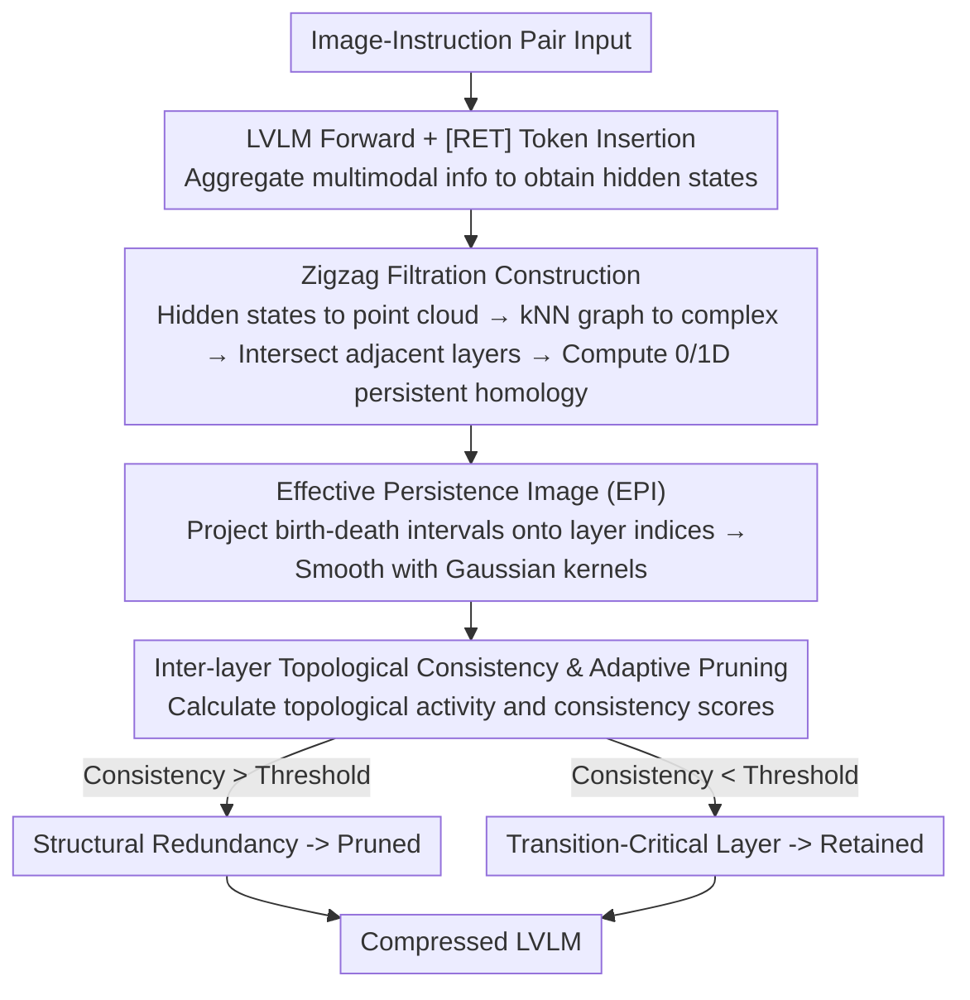

# Topology-Aware Layer Pruning for Large Vision-Language Models

**Conference**: ACL 2026  
**arXiv**: [2604.16502](https://arxiv.org/abs/2604.16502)  
**Code**: [GitHub](https://github.com/zpc456/TopoVLM)  
**Area**: Multimodal VLM / Model Compression  
**Keywords**: Layer Pruning, Topological Data Analysis, Persistent Homology, Vision-Language Models, Model Compression

## TL;DR

This paper proposes TopoVLM, a layer pruning framework based on Topological Data Analysis (TDA). It models hidden states as point clouds and quantifies inter-layer topological consistency via zigzag persistent homology to adaptively retain transition-critical layers while pruning structural redundancies. It significantly outperforms existing pruning methods at 50-60% sparsity.

## Background & Motivation

**Background**: Large Vision-Language Models (LVLMs) such as LLaVA-NeXT and VideoLLaMA2 demonstrate superior performance in multimodal understanding tasks. however, the computational and memory overhead stemming from deep Transformer decoder architectures limits practical deployment. Layer pruning has gained attention as an effective structural compression strategy.

**Limitations of Prior Work**: Existing layer pruning methods fall into two categories: (1) Similarity-based methods (e.g., LLM-Pruner, LLM-Streamline) rely on local metrics like cosine similarity between adjacent layers; (2) Signal-driven methods (e.g., SparseGPT, Wanda) rely on static proxy signals like weight magnitudes or activation statistics. Both categories provide only a local snapshot perspective and fail to capture the global dynamic evolution of representations across model depth.

**Key Challenge**: Representations in LVLMs undergo non-monotonic structural changes along the depth—shifting from fine-grained visual encoding to vision-language alignment, and then to instruction-conditioned reasoning. Layers that appear redundant locally may actually serve as critical bridges between different semantic stages. Pruning these "transition-critical layers" leads to non-linear performance degradation.

**Goal**: Design a pruning criterion capable of capturing the global evolution of representations to distinguish between true structural redundancies and transition-critical layers.

**Key Insight**: Topological Data Analysis (TDA) focuses on the global geometry and structural organization of data. Persistent homology can track the birth and death of topological features (connected components, loops, voids) across different scales, making it suitable for analyzing the dynamic evolution of representations along depth.

**Core Idea**: Treat hidden states of each layer as point clouds to construct simplicial complexes via k-nearest neighbor graphs. Track birth-death patterns of topological features across layers using zigzag persistent homology. Define inter-layer topological consistency to quantify structural redundancy—high consistency implies a layer introduces no new topological structure and can be safely pruned.

## Method

### Overall Architecture

TopoVLM addresses an overlooked pitfall in layer pruning: LVLM representations do not evolve smoothly but alternate between different stages. Some layers might seem locally redundant yet are critical bridges between semantic phases; pruning them causes non-linear performance collapses. Existing methods (similarity or static signals) are local snapshots ignoring this global evolution. TopoVLM introduces TDA: treating each layer's hidden states as a point cloud, using zigzag persistent homology to track the birth and death of topological features across layers, and defining "inter-layer topological consistency" to quantify redundancy. High consistency indicates no new topological structure is introduced. The workflow involves: passing image-instruction pairs through LVLM, inserting [RET] tokens to aggregate multimodal information for hidden states → converting to point clouds, constructing complexes, and calculating persistent homology via zigzag filtration → generating Effective Persistence Images (EPI) → extracting consistency scores to mark layers above a threshold for pruning.

### Key Designs

**1. Zigzag Filtration Construction: Capturing Non-monotonic Evolution with Bidirectional Filtration**

Classical persistent homology (PH) requires monotonic filtration, but LVLM representations vary non-monotonically, making standard PH inapplicable. TopoVLM constructs a k-nearest neighbor graph for each hidden state $\mathbf{H}_{L_\ell} \in \mathbb{R}^{N \times d}$ at layer $L_\ell$ and expands it into a simplicial complex $\mathcal{K}_{L_\ell}$. By taking the intersection complex $\mathcal{K}_{L_\ell, L_{\ell+1}} = \mathcal{K}_{L_\ell} \cap \mathcal{K}_{L_{\ell+1}}$, a zigzag filtration sequence is formed. Computing 0D and 1D persistent homology on this sequence yields birth-death intervals of topological features. Crucially, zigzag allows forward and backward inclusion mappings, enabling the tracking of where a feature appears, how long it persists, and where it disappears—which monotonic filtration cannot achieve.

**2. Effective Persistence Image (EPI): Projecting Discrete Persistence Diagrams onto Differentiable Planes**

Original persistence diagrams are discrete multisets, unsuitable for layer-wise analysis or cross-layer comparison. EPI projects each birth-death interval $[b_j, d_j]$ onto the nearest model layer indices to obtain an effective interval $[\tilde{b}_j, \tilde{d}_j]$. A continuous image is generated via a weighted sum of Gaussian kernels:

$$\text{EPI}_p(u,v) = \sum_j \omega(\tau_j) \exp\!\Big(-\frac{(u-\tilde{b}_j)^2 + (v-\tau_j)^2}{2\sigma^2}\Big)$$

where $\tau_j$ is the persistence length. This representation is differentiable and stable. The weight function $\omega(\tau_j)$ emphasizes long-lived features while suppressing noise, highlighting stable topological structures.

**3. Inter-layer Topological Consistency & Adaptive Pruning: Global Coverage over Local Similarity**

TopoVLM calculates layer-level topological activity $A(\ell)$ (aggregating EPI along the persistence dimension) and the inter-layer consistency score $\bar{S_p}(\ell)$. The latter measures the weighted probability that topological features generated at layer $\ell$ persist in other layers, using a distance weight $\omega(\ell, \ell') = |\ell - \ell'|^\alpha$. Layers with consistency higher than a threshold $\epsilon \cdot \bar{S_p}^{max}$ are pruned. This criterion determines if a layer's contribution is already covered by others globally, ensuring topological continuity, unlike local similarity metrics.

### Loss & Training

Ours is a training-free, inference-time pruning method. It requires a single calibration forward pass (512 samples). Zigzag filtration is performed offline and introduces no inference overhead. Primary hyperparameters include the k-value for k-NN and the distance weight exponent $\alpha$.

## Key Experimental Results

### Main Results

LLaVA-NeXT (8B) at 50% Sparsity:

| Method | MME-cognition | MMMU | MathVista | MMBench | Relative Score |
|------|-------------|------|-----------|---------|---------|
| Full Model | 376.8 | 40.1 | 36.2 | 72.2 | 100% |
| TAMP | 341.0 | 35.7 | 31.9 | 66.3 | 90.9% |
| **Ours** | **353.1** | **38.2** | **34.6** | **69.8** | **94.6%** |

VideoLLaMA2 (7B) at 60% Sparsity:

| Method | Clotho-AQA | MuchoMusic | VideoMME | NextQA-MC | Relative Score |
|------|-----------|-----------|---------|----------|---------|
| Full Model | 85.6 | 58.9 | 48.7 | 73.3 | 100% |
| TAMP | 84.2 | 55.9 | 42.5 | 70.9 | 95.0% |
| **Ours** | **84.9** | **58.1** | **48.0** | **72.5** | **96.7%** |

### Ablation Study

| Configuration | Description | Relative Score Change |
|------|------|------------|
| Remove Zigzag (Standard PH) | Cannot handle non-monotonic evolution | -2.1% |
| Remove EPI (Original PD) | Unstable layer-wise analysis | -1.5% |
| k=5 vs k=15 vs k=25 | k=15 is optimal | k=15 Best |
| α=0.5 vs α=1.0 vs α=2.0 | α=1.0 is optimal | α=1.0 Best |

### Key Findings

- Topological activity is high in shallow layers (forming low-level multimodal structures) and consistency is high in mid-to-deep layers (structural redundancy), aligning with intuition.
- Superiority is more pronounced at high sparsity rates (>60%), indicating that topology-aware pruning accurately identifies critical layers.
- The search phase takes only 5.7 minutes (single calibration), much faster than SparseGPT/Wanda which require multiple forward passes.
- VRAM reduced by 43% and inference latency dropped from 105.4ms to 60.3ms (1.75x speedup) at 50% sparsity.

## Highlights & Insights

- **Innovative TDA-Compression Connection**: Elegantly transforms persistent homology from a mathematical tool into a practical pruning criterion, providing a new perspective on representation structures in deep networks.
- **"Transition-Critical Layer" Concept**: Identifies layers that are locally redundant but globally indispensable, which traditional methods often fail to detect.
- **Generalization**: Does not depend on specific architectures and works across both image and video LVLMs, with potential transferability to pure LLMs.

## Limitations & Future Work

- Only 0D and 1D persistent homology are considered; higher dimensions might contain valuable information but increase computational cost.
- Calibration data selection may influence topological analysis; robustness to out-of-distribution (OOD) data needs verification.
- Currently a one-shot pruning method; progressive pruning or recovery via fine-tuning has not been explored.
- Computational complexity of zigzag filtration is linear with the number of layers but remains sensitive to point cloud scale.

## Related Work & Insights

- **vs LLM-Pruner / LLM-Streamline**: These use local metrics like cosine similarity and miss global evolution; Ours provides a global view via zigzag PH.
- **vs TAMP**: TAMP is a strong baseline but relies on local signals; Ours shows greater advantages at high sparsity.
- **vs Other TDA in LLM**: Prior TDA work mostly focused on hallucination detection; this paper is the first to apply it to structural pruning.

## Rating

- Novelty: ⭐⭐⭐⭐⭐ First application of zigzag persistent homology to LVLM layer pruning.
- Experimental Thoroughness: ⭐⭐⭐⭐ Covered multiple architectures and benchmarks, but lacks validation on larger-scale models.
- Writing Quality: ⭐⭐⭐⭐ Clear mathematical formalization, though the entry barrier for non-TDA readers is high.
- Value: ⭐⭐⭐⭐ Provides new theoretical tools for model compression.

<!-- RELATED:START -->

## Related Papers

- [\[CVPR 2026\] Mostly Text, Smart Visuals: Asymmetric Text-Visual Pruning for Large Vision-Language Models](../../CVPR2026/multimodal_vlm/mostly_text_smart_visuals_asymmetric_text-visual_pruning_for_large_vision-langua.md)
- [\[CVPR 2026\] Beyond Layer-Wise Merging: Chain-of-Merging for Vision-Language Models](../../CVPR2026/multimodal_vlm/beyond_layer-wise_merging_chain-of-merging_for_vision-language_models.md)
- [\[ICML 2026\] TUR-DPO: Topology- and Uncertainty-Aware Direct Preference Optimization](../../ICML2026/multimodal_vlm/tur-dpo_topology-_and_uncertainty-aware_direct_preference_optimization.md)
- [\[ACL 2026\] Cross-Modal Taxonomic Generalization in (Vision-) Language Models](cross-modal_taxonomic_generalization_in_vision-_language_models.md)
- [\[AAAI 2026\] Branch, or Layer? Zeroth-Order Optimization for Continual Learning of Vision-Language Models](../../AAAI2026/multimodal_vlm/branch_or_layer_zeroth-order_optimization_for_continual_lear.md)

<!-- RELATED:END -->
