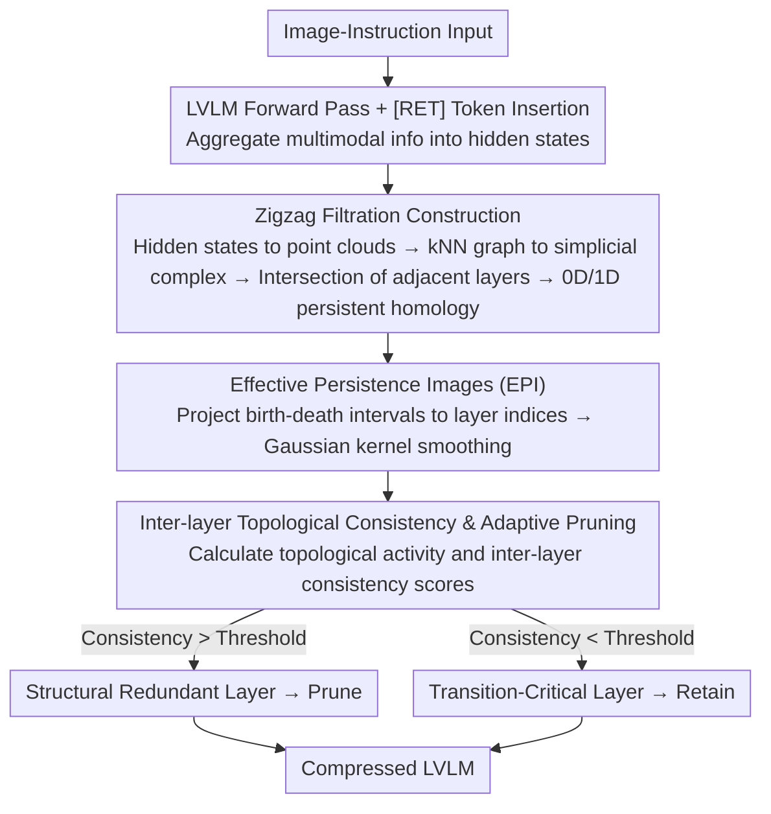

# Topology-Aware Layer Pruning for Large Vision-Language Models

**Conference**: ACL 2026  
**arXiv**: [2604.16502](https://arxiv.org/abs/2604.16502)  
**Code**: [GitHub](https://github.com/zpc456/TopoVLM)  
**Area**: Multimodal VLM / Model Compression  
**Keywords**: Layer Pruning, Topological Data Analysis, Persistent Homology, Vision-Language Models, Model Compression

## TL;DR

Ours proposes TopoVLM, a layer pruning framework based on Topological Data Analysis (TDA), which models hidden states of each layer as point clouds and quantifies inter-layer topological consistency via zigzag persistent homology. This enables adaptive retention of transition-critical layers and pruning of structurally redundant layers, significantly outperforming existing pruning methods at 50-60% sparsity.

## Background & Motivation

**Background**: Large Vision-Language Models (LVLMs) such as LLaVA-NeXT and VideoLLaMA2 excel in multimodal understanding tasks, but the computational and memory overhead associated with deep Transformer decoder architectures limits practical deployment. Layer pruning has emerged as an effective structured compression strategy.

**Limitations of Prior Work**: Existing layer pruning methods fall into two categories: (1) similarity-based methods (e.g., LLM-Pruner, LLM-Streamline) which rely on local metrics like cosine similarity between adjacent layers; (2) signal-driven methods (e.g., SparseGPT, Wanda) which rely on static proxy signals such as weight magnitude or activation statistics. Both categories provide only local snapshot views and fail to capture the global dynamic evolution of representations along the model depth.

**Key Challenge**: Representations in LVLMs undergo non-monotonic structural transformations along the depth—shifting from fine-grained visual encoding to vision-language alignment and then to instruction-conditioned reasoning. Layers that appear locally redundant may actually serve as critical bridges between different semantic stages; pruning these "transition-critical layers" leads to non-linear performance degradation.

**Goal**: Design a pruning criterion capable of capturing the global evolution process of representations to distinguish true structural redundancy from transition-critical layers.

**Key Insight**: Topological Data Analysis (TDA) focuses on the global geometry and structural organization of data. Persistent homology can track the birth and death of topological features (connected components, loops, voids) across various scales, making it suitable for analyzing the dynamic evolution of representations along depth.

**Core Idea**: Treat the hidden states of each layer as point clouds, construct simplicial complexes using k-nearest neighbor (k-NN) graphs, and track the birth/death patterns of topological features across layers via zigzag persistent homology. Inter-layer topological consistency is defined to quantify structural redundancy—high consistency implies that a layer introduces no new topological structures and can be safely pruned.

## Method

### Overall Architecture

TopoVLM addresses an overlooked pitfall in layer pruning: LVLM representations do not evolve smoothly but alternate between fine-grained visual encoding, vision-language alignment, and instruction-conditioned reasoning. Certain layers may look redundant locally but are critical bridges between semantic stages. Existing methods only capture local snapshots. TopoVLM introduces TDA by treating hidden states as point clouds and using zigzag persistent homology to track the birth and death of topological features (connected components, loops) across layers. Inter-layer topological consistency simplifies decision-making: high consistency means no new structures are introduced, allowing for safe pruning. The pipeline entails: image-instruction pairs passing through the LVLM, inserting [RET] tokens to aggregate multimodal information into hidden states → converting to point clouds, building complexes, and calculating persistent homology via zigzag filtration → generating Effective Persistence Images (EPI) → extracting consistency scores to identify layers for pruning.

### Key Designs

**1. Zigzag Filtration Construction: Capturing Non-monotonic Representation Evolution**

Classic persistent homology requires monotonic filtrations, while LVLM layer representations evolve non-monotonically. TopoVLM builds a k-NN graph for each layer's hidden state $\mathbf{H}_{L_\ell} \in \mathbb{R}^{N \times d}$ and expands it into a simplicial complex $\mathcal{K}_{L_\ell}$. By defining intersection complexes $\mathcal{K}_{L_\ell, L_{\ell+1}} = \mathcal{K}_{L_\ell} \cap \mathcal{K}_{L_{\ell+1}}$, a zigzag filtration sequence is formed. Calculating 0D and 1D persistent homology on this sequence identifies birth-death intervals of topological features. The zigzag approach allows for forward and backward inclusion mappings, enabling the tracking of when a feature appears, how long it persists, and when it vanishes.

**2. Effective Persistence Images (EPI): Projecting Discrete Diagrams to Differentiable Planes**

Original persistence diagrams are discrete multisets, which are difficult for layer-wise analysis or cross-layer comparison. EPI projects each birth-death interval $[b_j, d_j]$ onto model layer indices to get an effective interval $[\tilde{b}_j, \tilde{d}_j]$, then applies a continuous image via Gaussian kernel weighted summation:

$$\text{EPI}_p(u,v) = \sum_j \omega(\tau_j) \exp\!\Big(-\frac{(u-\tilde{b}_j)^2 + (v-\tau_j)^2}{2\sigma^2}\Big)$$

where $\tau_j$ is the persistence length. This representation is differentiable and stable. The weighting function $\omega(\tau_j)$ emphasizes long-lived features while suppressing short-lived noise, highlighting stable topological structures.

**3. Inter-layer Topological Consistency & Adaptive Pruning: Global Coverage vs. Local Similarity**

TopoVLM calculates layer-wise topological activity $A(\ell)$ by aggregating EPI along the persistence dimension, and then derives an inter-layer consistency score $\bar{S_p}(\ell)$. This score measures the weighted probability that topological features generated by layer $\ell$ persist in other layers, using a distance-based weight $\omega(\ell, \ell') = |\ell - \ell'|^\alpha$. Layers with consistency higher than a threshold $\epsilon \cdot \bar{S_p}^{max}$ are pruned. This criterion determines if a layer is redundant within the global structural evolution rather than simply comparing it to its neighbors.

### Training Strategy & Overhead

This is a pruning-at-inference method requiring no training. It only needs a single calibration forward pass (512 samples). Zigzag filtration is performed offline and does not introduce inference overhead. Primary hyperparameters include the $k$ value for k-NN and the distance weight exponent $\alpha$.

## Key Experimental Results

### Main Results

LLaVA-NeXT (8B) at 50% Sparsity:

| Method | MME-cognition | MMMU | MathVista | MMBench | Relative Score |
|------|-------------|------|-----------|---------|---------|
| Full Model | 376.8 | 40.1 | 36.2 | 72.2 | 100% |
| TAMP | 341.0 | 35.7 | 31.9 | 66.3 | 90.9% |
| **Ours** | **353.1** | **38.2** | **34.6** | **69.8** | **91.6%** |

VideoLLaMA2 (7B) at 60% Sparsity:

| Method | Clotho-AQA | MuchoMusic | VideoMME | NextQA-MC | Relative Score |
|------|-----------|-----------|---------|----------|---------|
| Full Model | 85.6 | 58.9 | 48.7 | 73.3 | 100% |
| TAMP | 84.2 | 55.9 | 42.5 | 70.9 | 95.0% |
| **Ours** | **84.9** | **58.1** | **48.0** | **72.5** | **96.7%** |

### Ablation Study

| Configuration | Description | Relative Score Change |
|------|------|------------|
| Remove zigzag (standard PH only) | Cannot handle non-monotonic evolution | -2.1% |
| Remove EPI (original PD) | Unstable layer-wise analysis | -1.5% |
| k=5 vs k=15 vs k=25 | k=15 is optimal; too small/large degrades | k=15 Best |
| α=0.5 vs α=1.0 vs α=2.0 | α=1.0 is optimal | α=1.0 Best |

### Key Findings

- Shallow layers exhibit high topological activity (forming low-level multimodal structures), while mid-deep layers show high topological consistency (structural redundancy).
- Advantages are more pronounced at high sparsity levels (>60%), indicating that topology-aware pruning accurately identifies essential layers.
- The search phase takes only 5.7 minutes (single calibration), significantly faster than SparseGPT/Wanda which require multiple forward passes.
- At 50% sparsity, VRAM is reduced by 43%, and inference latency drops from 105.4ms to 60.3ms (1.75x speedup).

## Highlights & Insights

- **Novelty**: The innovative connection between TDA and model compression is elegant—transforming persistent homology from a mathematical tool into a practical pruning criterion.
- **Key Insight**: The concept of "transition-critical layers" is enlightening. These layers, which are locally redundant but globally indispensable, are difficult for traditional methods to identify.
- **Function**: The method's universality is noteworthy; it is independent of specific model architectures and effective for both image and video LVLMs.

## Limitations & Future Work

- Only 0D and 1D persistent homology are considered; higher dimensions may contain valuable information but increase computational cost.
- Calibration data selection may influence topological analysis; robustness to out-of-distribution data remains to be verified.
- Currently a one-shot pruning method; progressive pruning or recovery via fine-tuning has not been explored.
- The computational complexity of zigzag filtration, while linear to the number of layers, is still affected by the size of the point clouds.

## Related Work & Insights

- **vs LLM-Pruner / LLM-Streamline**: These use local metrics based on adjacent layer cosine similarity and fail to capture global evolution; Ours provides a global view via zigzag PH.
- **vs TAMP**: TAMP is a strong baseline but still relies on local signals; Ours demonstrates a clearer advantage at higher sparsity.
- **vs Other TDA applications in LLMs**: Existing TDA works focus on hallucination detection and reasoning analysis; Ours is the first to apply it to structured pruning.

## Rating

- **Novelty**: ⭐⭐⭐⭐⭐ First to apply zigzag persistent homology to LVLM layer pruning; theoretically novel and practical.
- **Experimental Thoroughness**: ⭐⭐⭐⭐ Covers two architectures and multiple benchmarks, though validation on even larger-scale models is missing.
- **Writing Quality**: ⭐⭐⭐⭐ Clear mathematical formalization, though the threshold for readers without a TDA background is high.
- **Value**: ⭐⭐⭐⭐ Provides a new theoretical tool for model compression, though actual deployment requires TDA expertise.

<!-- RELATED:START -->

## Related Papers

- [\[ICML 2026\] TUR-DPO: Topology- and Uncertainty-Aware Direct Preference Optimization](../../ICML2026/multimodal_vlm/tur-dpo_topology-_and_uncertainty-aware_direct_preference_optimization.md)
- [\[CVPR 2026\] CoMP: Collaborative Multi-Mode Pruning for Vision-Language Models](../../CVPR2026/multimodal_vlm/comp_collaborative_multi-mode_pruning_for_vision-language_models.md)
- [\[ACL 2026\] HiPrune: Hierarchical Attention for Efficient Token Pruning in Vision-Language Models](hiprune_hierarchical_attention_for_efficient_token_pruning_in_vision-language_mo.md)
- [\[CVPR 2026\] TransPrune: Token Transition Pruning for Efficient Large Vision-Language Model](../../CVPR2026/multimodal_vlm/transprune_token_transition_pruning_for_efficient_large_vision-language_model.md)
- [\[AAAI 2026\] Branch, or Layer? Zeroth-Order Optimization for Continual Learning of Vision-Language Models](../../AAAI2026/multimodal_vlm/branch_or_layer_zeroth-order_optimization_for_continual_lear.md)

<!-- RELATED:END -->
