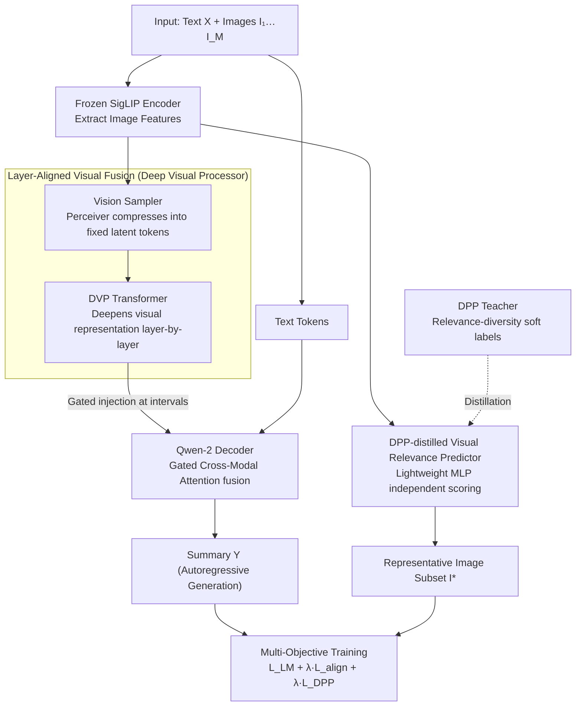

# Towards Visually Grounded Multimodal Summarization via Cross-Modal Transformer and Gated Attention

**Conference**: ACL2026 Findings  
**arXiv**: [2605.11753](https://arxiv.org/abs/2605.11753)  
**Code**: https://github.com/abidmeeraj/SPeCTrA-Sum  
**Area**: Multimodal VLM / Multimodal Summarization  
**Keywords**: Multimodal Summarization, Visual Grounding, Image Selection, DPP Distillation, Gated Cross-Attention

## TL;DR
This paper proposes SPeCTrA-Sum, which integrates a layer-aligned Deep Visual Processor, gated cross-modal attention, and a DPP-distilled image selector. This allows multimodal summarization to maintain near-SOTA ROUGE scores while selecting more relevant and diverse supporting images.

## Background & Motivation
**Background**: Multimodal summarization requires processing long text alongside accompanying images, such as news, blogs, or illustrated reports. Early methods often concatenated image features as prefixes to text models or used attention to assist generation. Recent VLM scaffolds like LLaVA-OneVision make it easier to jointly use image tokens and language models.

**Limitations of Prior Work**: Simple concatenation of visual tokens faces two issues. First, visual features typically originate from shallow visual encoders, while deep hidden states of language models have undergone multiple layers of semantic transformation, leading to an abstraction mismatch. Second, images in documents often contain redundancy or irrelevant content; inputting all of them wastes attention and introduces noise.

**Key Challenge**: Summarization models require visual grounding, but "more images" is not always better. The model must deeply fuse truly useful visual cues while selecting a relevant and complementary subset of images. Traditional text metrics like ROUGE struggle to directly reward this quality of visual grounding.

**Goal**: The authors aim to train summarization generation and representative image selection within a unified framework, optimizing the output summary and selected image subset for text quality, visual relevance, and image diversity simultaneously.

**Key Insight**: The paper addresses the problem from two directions: using a DVP to deepen visual representations alongside LLM layers to mitigate the mismatch between shallow visual features and deep language representations; and using a DPP teacher to generate relevance-diversity balanced soft labels, which are then distilled into a lightweight VRP to avoid expensive DPP selection during inference.

**Core Idea**: Instead of treating images as crude prefix tokens for the LLM, visual grounding is performed at both the level of deep semantic alignment and output-level image selection.

## Method

### Overall Architecture
The input to SPeCTrA-Sum is a text $X$ and a set of images $I_1, ..., I_M$, and the output is a summary $Y$ along with a representative image subset $I^*$. The framework uses LLaVA-OneVision as a multimodal scaffold, with a frozen SigLIP encoder on the visual side and a Qwen-2 causal LM on the language side. Building on the basic approach of projecting visual features into the token embedding space, this work adds a Vision Sampler, Deep Visual Processor (DVP), Layer-Aligned Gated Cross-Attention, and a Visual Relevance Predictor (VRP).

The training objective is multi-task: the primary task is autoregressive summarization, with auxiliary tasks including image-text alignment and DPP distillation. During inference, the model generates the summary while the VRP selects an image subset that supports the summary, avoiding the use of all images as equivalent context.

### Key Designs

**1. Deep Visual Processor and Layer-Aligned Fusion: Synchronizing Visual and Language Depth**

Pure concatenation forces visual tokens into prefix positions, where their influence weakens during deep decoding. Furthermore, as outputs of shallow encoders, their abstraction level is much lower than LLM hidden states. DVP uses a Perceiver-style Vision Sampler to compress each image's patch grid into fixed latent tokens, then passes these through transformer blocks to obtain layer-specific visual representations. Gated cross-attention is inserted every few decoder layers to inject visual tokens of corresponding depth into the language hidden states. The gated residual starts with near-zero intensity, meaning the model initially preserves the base LLM and gradually learns to introduce visual information, allowing visual representations to synchronize with the depth of the language side.

**2. DPP-Distilled Visual Relevance Predictor: Compressing Set Selection Biases into a Scorer**

The pain point of the output side is that selecting images based solely on relevance leads to redundant content, while selecting for diversity may include irrelevant images. Determinantal Point Processes (DPP) naturally model the relevance-diversity trade-off. During training, a DPP teacher calculates a soft inclusion probability for each image based on image-text relevance, RBF diversity between images, and target subset size. The VRP is a simple two-layer MLP that inputs normalized image embeddings and outputs selection logits, fitting these soft labels via calibrated cross-entropy and cardinality regularization. During inference, the model scores each image independently, bypassing $O(K^3)$ DPP matrix operations.

**3. Multi-Objective Training: Binding Summarization, Alignment, and Selection**

If only text n-gram overlap is optimized, a stronger visual module may not improve ROUGE and could even interfere with language modeling. This paper explicitly binds the tasks using a multi-task loss:

$$L_{MM}=L_{LM}+\lambda_{align}L_{align}+\lambda_{VRP}L_{DPP}$$

Where $L_{LM}$ is the teacher-forced autoregressive loss, $L_{align}$ performs SigLIP-style alignment between frozen visual embeddings and mean-pooled decoder representations, and $L_{DPP}$ supervises the VRP with teacher labels. By optimizing all three, the benefits of visual grounding are incorporated into the gradients.

### Loss & Training
Training uses batch size 1 and Adafactor, controlled by steps (approx. 295k steps per epoch, up to 360k steps), selecting the best model via validation loss. Experiments ran on a single NVIDIA A100 80GB using 4-bit QLoRA. VRP/DPP hyperparameters include a max of 3 images, RBF bandwidth 0.8, relevance scaling 2.0, target size 3.0, and subset-size regularization 0.3. Architecture search covered Vision Sampler latent counts, DVP layers, gate positions, and LoRA rank/alpha.

## Key Experimental Results

### Main Results

| Model | ROUGE-1 | ROUGE-2 | IP | MaxSim | MMAE | Description |
|--------|------|------|------|------|------|------|
| SITA | 43.64 | 20.53 | 76.41 | 33.47 | 3.37 | Strong baseline with highest image selection IP |
| ViL-Sum | 44.29 | 20.96 | 66.27 | 32.17 | 3.55 | Strongest text ROUGE baseline |
| DIUSum | 42.23 | 19.83 | - | - | - | Recent dynamic image usage method |
| DVP (Ours) | 44.20 | 20.77 | 74.03 | 31.68 | 3.55 | ROUGE close to ViL-Sum, IP significantly higher |

| System | R-1 | R-2 | BERTScore | IP | CLIPScore | MMAE | PCD |
|------|------|------|------|------|------|------|------|
| OneVision | 43.81 | 20.52 | 89.58 | 74.02 | 70.62 | 3.5447 | 32.66 |
| Vision Sampler | 44.06 | 20.78 | 89.53 | 74.01 | 70.54 | 3.5484 | 32.65 |
| DVP | 44.20 | 20.77 | 89.33 | 74.03 | 70.52 | 3.5521 | 32.81 |

### Ablation Study

| Training Setup | System | R-1 | R-2 | BERTScore | Description |
|------|------|------|------|------|------|
| MaskedLM | OneVision | 44.26 | 20.86 | 89.12 | Highest text metrics |
| MaskedLM | Vision Sampler | 43.89 | 20.61 | 89.54 | ROUGE drops after adding visual sampling |
| MaskedLM | DVP | 43.81 | 20.58 | 89.50 | Deep visual processing lacks automatic gain under pure text objective |

| Human Eval | Mean (SD) | Score >=4 | Exact agreement | Within-one agreement | Interpretation |
|------|------|------|------|------|------|
| Text quality | 3.90 (0.69) | 80.1% | 49.0% | 90.0% | Good text coherence |
| Image relevance | 4.04 (0.80) | 76.8% | 44.3% | 84.0% | Strongest image-text relevance |
| Image diversity | 3.89 (0.83) | 73.2% | 43.0% | 82.2% | Diversity slightly lower but still positive |
| Overall quality | 4.00 (0.71) | 79.2% | 45.8% | 85.5% | Stable comprehensive quality |

| Variant | Avg Latency | Latency Overhead | Peak VRAM | VRAM Overhead | Description |
|------|------|------|------|------|------|
| OV baseline | ~2110 ms | - | 15.80 GB | - | Simple concatenation |
| Vision Sampler | 2120 ms | +0.5% | 16.81 GB | +6.4% | Sampling adds negligible latency |
| DVP | 2322 ms | +10.0% | 22.56 GB | +42.8% | Significant VRAM cost for deep processing |
| MM-DVP | 2328 ms | +10.3% | 22.57 GB | +42.8% | Multi-objective training adds no inference cost |

### Key Findings
- DVP nearly matches ViL-Sum in text ROUGE: ROUGE-1 is only 0.09 lower, and ROUGE-2 is 0.19 lower, but image selection IP reaches 74.03, significantly higher than ViL-Sum's 66.27.
- Multi-objective loss is critical. Under the MaskedLM objective, DVP's ROUGE is lower than OneVision, indicating deeper visual modules do not naturally improve text metrics; only with alignment and DPP distillation does DVP show comprehensive advantages.
- Human evaluation shows the highest average score for image relevance (4.04), suggesting users perceive better alignment beyond automated metrics.
- Diversity metrics require careful interpretation. The paper notes that without relevance filtering, irrelevant images can inflate pairwise cosine distance; DVP maintains the highest mean/max diversity after filtering.
- Cost-wise, DVP increases latency by about 10% but increases VRAM by 42.8%, which may limit deployment in low-memory scenarios.

## Highlights & Insights
- The paper identifies a neglected problem in multimodal summarization: it is not just about generating text, but selecting supporting images. This task definition is closer to real-world news consumption than simple text-conditioned-on-images.
- The layer-aligned DVP design is intuitive. Visual tokens are no longer just prefixes but continuously participate in semantic fusion at different depths, suitable for technical reports and multi-image reasoning.
- The DPP teacher + VRP student approach is a practical compromise: it leverages set selection theory for relevance-diversity during training and uses a lightweight network for approximation during inference.
- Refinement of evaluation metrics is notable. ROUGE is insensitive to visual grounding, and diversity can be inflated by noise, suggesting a need for finer metrics for consistency and complementarity.

## Limitations & Future Work
- Results are primarily based on MSMO, which focuses on news content. Other domains like technical reports or social media require further validation.
- Automated metrics remain insufficient. ROUGE only looks at text overlap, and IP/CLIPScore/PCD are proxies for visual quality that do not fully capture whether images actually help reader comprehension.
- VRP scoring is text-free during inference for efficiency, potentially missing "complementary relations with currently generated text." Conditional VRP or intent-aware selection could be explored.
- DVP has high VRAM overhead (15.80GB to 22.56GB). Low-resource deployment would require distillation or sparse injection.
- Similarity thresholds may filter out images with background value that are not directly related. Future work should model relevance, diversity, and complementarity simultaneously.

## Related Work & Insights
- **vs. Early Multimodal Summarization**: Methods like ATG/ATL/HAN included images but used shallow fusion; this work emphasizes hierarchical visual processing and output-level image selection.
- **vs. ViL-Sum / SITA**: ViL-Sum has higher ROUGE while SITA has higher IP; SPeCTrA-Sum approaches both strong baselines while focusing on grounding and diversity.
- **vs. Flamingo-style Gated Fusion**: This work adopts gated cross-attention but aligns visual representations to deep LLM layers via DVP before injection.
- **vs. DPP Image Selection**: Traditional DPP is expensive for inference; this work distills set inductive biases into a VRP for end-to-end efficiency.
- **Insight**: Multimodal generation tasks with "visual evidence" should not only optimize text. Treating evidence selection as a joint output makes systems more interpretable and product-ready.

## Rating
- Novelty: ⭐⭐⭐⭐☆ The combination of DVP + DPP distillation + multi-objective summarization is solid and provides a complete task definition.
- Experimental Thoroughness: ⭐⭐⭐⭐☆ Includes main results, ablations, human evaluation, and efficiency analysis; more datasets would be beneficial.
- Writing Quality: ⭐⭐⭐⭐☆ Clear modules and rich tables, though some metrics require familiarity with the MSMO framework.
- Value: ⭐⭐⭐⭐☆ Highly relevant for multi-image document summarization and visual evidence selection.

<!-- RELATED:START -->

## Related Papers

- [\[ACL 2026\] Cross-Modal Taxonomic Generalization in (Vision-) Language Models](cross-modal_taxonomic_generalization_in_vision-_language_models.md)
- [\[ICCV 2025\] TAB: Transformer Attention Bottlenecks enable User Intervention and Debugging in Vision-Language Models](../../ICCV2025/multimodal_vlm/tab_transformer_attention_bottlenecks_enable_user_intervention_and_debugging_in_.md)
- [\[NeurIPS 2025\] On the Value of Cross-Modal Misalignment in Multimodal Representation Learning](../../NeurIPS2025/multimodal_vlm/on_the_value_of_cross-modal_misalignment_in_multimodal_representation_learning.md)
- [\[CVPR 2026\] Decoupled and Reusable Adaptation for Efficient Cross-Modal Transfer](../../CVPR2026/multimodal_vlm/decoupled_and_reusable_adaptation_for_efficient_cross-modal_transfer.md)
- [\[CVPR 2026\] Addressing Exacerbated Attention Sink for Source-Free Cross-Domain Few-Shot Learning](../../CVPR2026/multimodal_vlm/addressing_exacerbated_attention_sink_for_source-free_cross-domain_few-shot_lear.md)

<!-- RELATED:END -->
