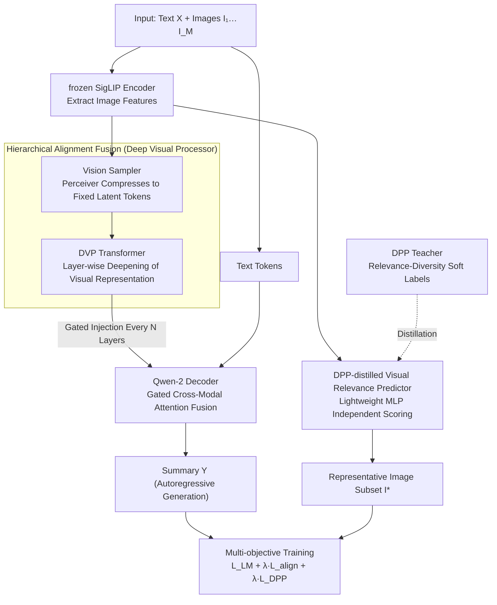

# Towards Visually Grounded Multimodal Summarization via Cross-Modal Transformer and Gated Attention

**Conference**: ACL2026 Findings  
**arXiv**: [2605.11753](https://arxiv.org/abs/2605.11753)  
**Code**: https://github.com/abidmeeraj/SPeCTrA-Sum  
**Area**: Multimodal VLM / Multimodal Summarization  
**Keywords**: Multimodal Summarization, Visual Grounding, Image Selection, DPP Distillation, Gated Cross-Attention

## TL;DR
This paper proposes SPeCTrA-Sum, which integrates a hierarchically aligned Deep Visual Processor, gated cross-modal attention, and a DPP-distilled image selector. This allows multimodal summarization to maintain near-SOTA ROUGE scores while selecting more relevant and diverse supporting images.

## Background & Motivation
**Background**: Multimodal summarization requires processing long text alongside accompanying images, such as in news, blogs, or illustrated reports. Early methods often concatenated image features before text models or used attention to assist generation. Recent VLM scaffolds like LLaVA-OneVision facilitate joint utilization of image tokens and language models.

**Limitations of Prior Work**: Simple concatenation of visual tokens poses two problems. First, visual features typically originate from shallow visual encoders, while the deep hidden states of language models have undergone multiple semantic transformations, resulting in a mismatch of abstraction levels. Second, images in documents often contain redundancy or irrelevant content; inputting all of them wastes attention resources and may introduce noise.

**Key Challenge**: A summarization model requires visual grounding, but "more images are not necessarily better." It must deeply fuse truly useful visual cues and select a relevant yet complementary subset of images. Traditional text metrics like ROUGE struggle to directly reward the quality of such visual support.

**Goal**: The authors aim to train summary generation and representative image selection within a unified framework, optimizing the output summary and selected image subset for text quality, visual relevance, and image diversity simultaneously.

**Key Insight**: The paper addresses these problems from two directions: using a Deep Visual Processor (DVP) to deepen visual representations alongside LLM layers, mitigating the mismatch between shallow visual features and deep language representations; and using a DPP teacher to generate relevance-diversity balanced soft labels, which are distilled into a lightweight Visual Relevance Predictor (VRP) to avoid expensive DPP selection during inference.

**Core Idea**: Instead of treating images as prefix tokens crudely fed into the LLM, the model performs visual grounding at two levels: deep semantic alignment and output-level image selection.

## Method

### Overall Architecture
The input of SPeCTrA-Sum is a text $X$ and a set of images $I_1,...,I_M$, and the output is a summary $Y$ and a representative image subset $I^*$. The framework uses LLaVA-OneVision as the multimodal scaffold, with a frozen SigLIP encoder on the visual side and a Qwen-2 causal LM on the language side. While the baseline projects visual features into the token embedding space for concatenation, this work adds a Vision Sampler, Deep Visual Processor, Layer-Aligned Gated Cross-Attention, and a Visual Relevance Predictor.

The training objective is multi-task: the main task is autoregressive summarization, and auxiliary tasks include image-text alignment and DPP distillation. During inference, the model generates the summary while using the VRP to select an image subset that supports the summary, avoiding the use of all images as equivalent context.

### Key Designs

**1. Deep Visual Processor and Hierarchical Alignment Fusion: Synchronizing Visual and Language Depth**

The flaw of pure concatenation is that visual tokens are fixed at the prefix position, making their influence weaken as decoding moves deeper. Moreover, they are outputs of shallow visual encoders, with abstraction levels far lower than LLM hidden states that have undergone multiple semantic transformations. DVP first uses a Perceiver-style Vision Sampler to compress each image's patch grid into a fixed number of latent tokens, then passes these visual latents through a set of transformer blocks to obtain layer-deepened visual representations. Subsequently, a gated cross-attention is inserted every few decoder layers to inject visual tokens of the corresponding depth into the language hidden states. Gated residuals start with near-zero injection strength, meaning the model initially barely modifies the base LLM and gradually learns to introduce visual information at appropriate layers. Consequently, visual representations synchronize with the depth of the language side rather than being diluted at the front.

**2. DPP-distilled Visual Relevance Predictor: Compressing Set Selection Priors into a Lightweight Scorer**

The pain point at the output side is that selecting images based solely on relevance leads to redundant content, while selecting based solely on diversity may include irrelevant images. Determinantal Point Processes (DPP) naturally model the relevance-diversity trade-off. Therefore, during the training phase, a DPP teacher calculates a soft inclusion probability for each image based on image-text relevance, RBF diversity between images, and target set size. The VRP itself is a simple two-layer MLP that takes normalized image embeddings and outputs selection logits, fitting these soft labels using calibrated cross-entropy and cardinality regularization. During inference, it only needs to score each image independently without running $O(K^3)$ DPP matrix operations—the expensive set inductive bias is distilled into a near-zero-cost selector during training.

**3. Multi-objective Training Binding Summary, Alignment, and Selection: Integrating Visual Grounding into Optimization**

If only the text n-gram overlap is optimized, a stronger visual module might not improve ROUGE and could even interfere with language modeling, preventing the "deepening of visual processing" from receiving positive feedback. This paper explicitly binds three tasks using a multi-task total loss:

$$L_{MM}=L_{LM}+\lambda_{align}L_{align}+\lambda_{VRP}L_{DPP}$$

Where $L_{LM}$ is the teacher-forced autoregressive summarization loss, $L_{align}$ performs SigLIP-style alignment between frozen visual embeddings and the decoder's mean-pooled representation, and $L_{DPP}$ encourages the VRP to fit the DPP teacher's soft labels. By optimizing all three terms, the benefits of visual grounding (image-text consistency, image set quality) are incorporated into the gradients rather than being drowned out by pure text objectives.

### Loss & Training
Training uses a batch size of 1 with Adafactor, controlled by steps. Approximately 295k steps correspond to one epoch, and systems are trained up to 360k steps, with the best model selected via validation loss. The appendix notes that experiments ran on a single NVIDIA A100 80GB using 4-bit QLoRA-style quantization. VRP/DPP hyperparameters include a maximum selection of 3 images, RBF bandwidth 0.8, relevance scaling 2.0, target set size 3.0, and subset-size regularization 0.3. Architecture search covered Vision Sampler latent counts, depth, DVP layers, gated layer positions, and LoRA rank/alpha.

## Key Experimental Results

### Main Results

| Model | ROUGE-1 | ROUGE-2 | IP | MaxSim | MMAE | Description |
|--------|------|------|------|------|------|------|
| SITA | 43.64 | 20.53 | 76.41 | 33.47 | 3.37 | Strong baseline with highest image selection IP |
| ViL-Sum | 44.29 | 20.96 | 66.27 | 32.17 | 3.55 | Strongest baseline for text ROUGE |
| DIUSum | 42.23 | 19.83 | - | - | - | Recent dynamic image usage method |
| DVP (Ours) | 44.20 | 20.77 | 74.03 | 31.68 | 3.55 | ROUGE close to ViL-Sum, IP significantly higher than ViL-Sum |

| System | R-1 | R-2 | BERTScore | IP | CLIPScore | MMAE | PCD |
|------|------|------|------|------|------|------|------|
| OneVision | 43.81 | 20.52 | 89.58 | 74.02 | 70.62 | 3.5447 | 32.66 |
| Vision Sampler | 44.06 | 20.78 | 89.53 | 74.01 | 70.54 | 3.5484 | 32.65 |
| DVP | 44.20 | 20.77 | 89.33 | 74.03 | 70.52 | 3.5521 | 32.81 |

### Ablation Study

| Training Setting | System | R-1 | R-2 | BERTScore | Description |
|------|------|------|------|------|------|
| MaskedLM | OneVision | 44.26 | 20.86 | 89.12 | Highest text metrics |
| MaskedLM | Vision Sampler | 43.89 | 20.61 | 89.54 | ROUGE drops after adding visual sampling |
| MaskedLM | DVP | 43.81 | 20.58 | 89.50 | Deep visual processing does not automatically gain under pure text objective |

| Human Eval Dimension | Mean (SD) | Score >=4 | Exact agreement | Within-one agreement | Interpretation |
|------|------|------|------|------|------|
| Text quality | 3.90 (0.69) | 80.1% | 49.0% | 90.0% | Good text coherence |
| Image relevance | 4.04 (0.80) | 76.8% | 44.3% | 84.0% | Strongest image-text relevance |
| Image diversity | 3.89 (0.83) | 73.2% | 43.0% | 82.2% | Diversity slightly lower but still positive |
| Overall quality | 4.00 (0.71) | 79.2% | 45.8% | 85.5% | Stable overall quality |

| Variant | Avg Latency | Latency Overhead | Peak VRAM | VRAM Overhead | Description |
|------|------|------|------|------|------|
| OV baseline | approx 2110 ms | - | 15.80 GB | - | Simple concatenation |
| Vision Sampler | 2120 ms | +0.5% | 16.81 GB | +6.4% | Sampling adds almost no latency |
| DVP | 2322 ms | +10.0% | 22.56 GB | +42.8% | Clear VRAM cost for deep visual processing |
| MM-DVP | 2328 ms | +10.3% | 22.57 GB | +42.8% | Multi-objective training adds no extra inference cost |

### Key Findings
- DVP's text ROUGE nearly matches ViL-Sum: ROUGE-1 is only 0.09 lower, and ROUGE-2 is 0.19 lower, while image selection IP reaches 74.03, significantly higher than ViL-Sum's 66.27.
- Multi-objective loss is critical. Under the MaskedLM objective, DVP's ROUGE is lower than OneVision's, indicating that deeper visual modules do not naturally improve text metrics; only after adding alignment and DPP distillation does DVP demonstrate comprehensive advantages.
- Human evaluation shows the highest average score for image relevance at 4.04, indicating that besides automatic metrics, users can perceive that the summary and images are better aligned.
- Diversity metrics require careful interpretation. The paper notes that without relevance filtering, irrelevant images might artificially inflate pairwise cosine distance; DVP maintains the highest mean/max diversity after filtering.
- Regarding costs, DVP's latency only increases by about 10%, but VRAM increases by 42.8%, which may limit deployment in low-VRAM scenarios.

## Highlights & Insights
- The paper addresses an output-side issue often ignored in multimodal summarization: it is not just about generating text, but also about selecting images that support the summary for the reader. This task definition is closer to the real experience of reading news than simple text-conditioned-on-images.
- The hierarchical alignment design of DVP is intuitive. Visual tokens are no longer just prefixes but continuously participate in semantic fusion at different decoding depths, making it suitable for illustrated reports, document QA, and multi-image reasoning.
- The DPP teacher + VRP student is a practical compromise: borrowing set selection theory during training to express relevance-diversity, and using a lightweight network to approximate it during inference to avoid expensive DPP inference.
- Reflections on evaluation metrics are also important. ROUGE is insensitive to visual grounding, and diversity can be inflated by irrelevant images, suggesting that multimodal summarization needs more granular evaluations of image-text consistency and complementarity.

## Limitations & Future Work
- Results are primarily based on MSMO. While it is a classic multimodal summarization dataset, its task form is biased toward news. Validation in technical reports, long social media posts, and scientific documents is still needed.
- Automatic metrics remain insufficient. ROUGE focuses on text overlap, while IP/CLIPScore/PCD only approximate visual quality, failing to fully measure whether images truly help readers understand the summary.
- VRP performs text-free image scoring during inference, which is efficient but might miss the "complementary relationship between images and the currently generated summary." Future work could explore conditional VRP or user-intent-aware selection.
- DVP has high VRAM overhead, with peak VRAM increasing from 15.80GB to 22.56GB. To deploy in low-resource environments, distillation, sparse injection, or lighter visual processors are required.
- The paper notes that similarity thresholds might filter out images with background value that are not directly related. Future work should model relevance, diversity, and complementarity simultaneously.

## Related Work & Insights
- **vs. Early Multimodal Summarization**: Methods like ATG/ATL/HAN incorporate images but with shallow fusion; this work emphasizes hierarchical visual processing and output-level image selection.
- **vs. ViL-Sum / SITA**: ViL-Sum has higher ROUGE, and SITA has higher IP; SPeCTrA-Sum's advantage lies in approaching both strong baselines while additionally focusing on grounding and diversity.
- **vs. Flamingo-style Gated Fusion**: This work borrows gated cross-attention but aligns visual representations to LLM deep layers via DVP before hierarchical injection, targeting the summarization task more specifically.
- **vs. DPP Image Selection**: Traditional DPP is suitable for set selection but computationally expensive during inference; this work distills the set inductive bias of DPP into the VRP, making it suitable for end-to-end systems.
- **Insight**: If a multimodal generation task has "visual evidence that can be displayed," one should not just optimize the generated text. Treating evidence selection as a joint output makes the system more interpretable and closer to a product-ready form.

## Rating
- Novelty: ⭐⭐⭐⭐☆ The combination of DVP + DPP distillation + multi-objective summarization is not a single point of absolute novelty, but the integration is solid and the task definition is complete.
- Experimental Thoroughness: ⭐⭐⭐⭐☆ Includes main results, ablation, human eval, and efficiency analysis; would be stronger with more datasets.
- Writing Quality: ⭐⭐⭐⭐☆ Method blocks are clear and tables are rich; interpretation of some metrics requires familiarity with MSMO evaluation.
- Value: ⭐⭐⭐⭐☆ Highly valuable reference for multi-image document summarization, news aggregation, and visual evidence selection.

<!-- RELATED:START -->

## Related Papers

- [\[ICML 2026\] iVGR: Internalizing Visually Grounded Reasoning for MLLMs with Reinforcement Learning](../../ICML2026/multimodal_vlm/ivgr_internalizing_visually_grounded_reasoning_for_mllms_with_reinforcement_lear.md)
- [\[ACL 2026\] Cross-Modal Taxonomic Generalization in (Vision-) Language Models](cross-modal_taxonomic_generalization_in_vision-_language_models.md)
- [\[ACL 2026\] OMHBench: Benchmarking Balanced and Grounded Omni-Modal Multi-Hop Reasoning](omhbench_benchmarking_balanced_and_grounded_omni-modal_multi-hop_reasoning.md)
- [\[CVPR 2026\] Agentic Video Summarization via Self-Reflecting Multimodal Understanding](../../CVPR2026/multimodal_vlm/agentic_video_summarization_via_self-reflecting_multimodal_understanding.md)
- [\[AAAI 2026\] Rethinking Visual Token Reduction in LVLMs under Cross-Modal Misalignment](../../AAAI2026/multimodal_vlm/rethinking_visual_token_reduction_in_lvlms_under_cross-modal_misalignment.md)

<!-- RELATED:END -->
