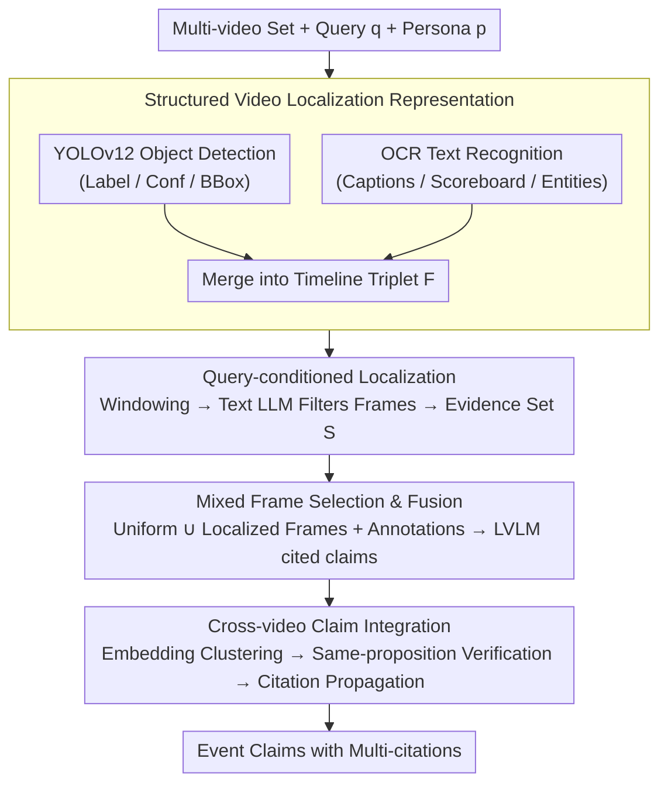

# TRACE: Evidence Localization-based Multi-video Event Understanding and Claim Generation

**Conference**: ACL 2026  
**arXiv**: [2605.16740](https://arxiv.org/abs/2605.16740)  
**Code**: https://github.com/pengyu965/TRACE  
**Area**: Video Understanding  
**Keywords**: Multi-video event understanding, evidence localization, claim generation, video citation, large vision-language models

## TL;DR

TRACE achieves SOTA on multi-video event understanding tasks, improving F1 from 0.705 to 0.811, by employing a "localize-then-reason" pipeline that builds text-searchable video timelines via OCR and object detection, performs query-conditioned evidence localization with a text LLM, and generates cited claims using an LVLM.

## Background & Motivation

**Background**: Multi-video event understanding requires models to not only recognize visual content but also locate and attribute discrete evidence fragments distributed across long video corpora. Recent Large Vision-Language Models (LVLMs) show strong performance in general video understanding but face key bottlenecks in this specific scenario.

**Limitations of Prior Work**: Directly processing raw videos with LVLMs faces three difficulties. First, models tend to focus on visually salient content (e.g., main characters, background landscapes) while ignoring query-specific evidence (casualty numbers on news tickers, vote totals in broadcast captions, scoreboard data). Second, even modern LVLMs are forced to use aggressive temporal sampling for long videos due to context window limits, causing brief segments containing critical information—such as a flash of a news scroll—to be missed. Third, these models struggle to precisely locate "event-related" moments.

**Key Challenge**: The core issue is that event videos are saturated with structured semantic signals (broadcast captions, detected object classes, OCR text) that can be extracted cheaply, yet existing LVLM pipelines largely fail to utilize them. Increasing the LVLM context window alone does not solve the problem, as the challenge is not just "seeing more frames," but "identifying which frames are important."

**Goal**: To design a system capable of precisely locating evidence within long, heterogeneous video collections and generating claims with citation attributes. Key requirements include: (1) efficient evidence localization in text space to avoid frame-by-frame LVLM calls; (2) using OCR and detection signals to guide the LVLM to focus on evidence segments; (3) aggregating evidence and citations across multiple videos to avoid double counting.

**Key Insight**: OCR text in event videos (lower-thirds, scoreboards, graphic overlays) is often semantically more precise than raw visual appearance. These signals can be cheaply extracted via YOLOv12 object detection and OCR to provide an interpretable text serialization for downstream reasoning.

**Core Idea**: Adopting a "localize-then-reason" paradigm. Instead of having the LVLM perform evidence discovery and generation simultaneously, the system first constructs a text-searchable video timeline (via OCR + detection), uses a text LLM for query-conditioned evidence localization, and then performs LVLM generation and citation integration under this guidance.

## Method

### Overall Architecture

The TRACE pipeline consists of four sequential stages. **Stage 1** constructs a structured localization representation for each input video: running YOLOv12 detection and OCR on sampled frames to generate a timestamp-detection-OCR triplet timeline. **Stage 2** segments this timeline into fixed-size windows, serializes them into text, and feeds them into a text LLM along with the user query and persona; the LLM determines which frames within each window are relevant. **Stage 3** provides the LVLM with a mixed set of frames (uniform samples + localized evidence frames) and structured localization annotations to generate cited claims. **Stage 4** performs de-duplication and citation propagation for claims across multiple videos through semantic embedding clustering and LLM verification, merging evidence for the same fact into a single conclusion with multiple citations.

### Key Designs

**1. Structured Video Localization: Translating Long Video into Searchable Timelines**

Directly feeding raw frames into an LVLM forces aggressive sampling, causing critical short segments like news scrolls to be missed. TRACE "textualizes" the video using lightweight signals: YOLOv12 and OCR run on uniformly sampled frames. Detection outputs are triplets $(l_i, c_i, \mathbf{b}_i)$ (COCO-80 label, confidence, bounding box); object co-occurrence (e.g., person, microphone, podium) allows inferring scenes like "press conference" without a separate classifier. OCR captures broadcast subtitles and numbers. These are merged into timeline $\mathcal{F}=\{(t, \mathcal{D}_t, \mathcal{T}_t)\}_{t=0}^T$.

The value of this step is that OCR text in event videos is often more semantically precise than visual appearance, and both detection and OCR are cheap to extract. Once serialized, localization can be handled by fast text LLMs without expensive visual encoding for every frame.

**2. Query-conditioned Evidence Localization: Low-cost Pre-filtering in Text Space**

LVLMs are easily distracted by visually salient main characters while ignoring casualty counts or vote totals needed for queries. TRACE splits the timeline into non-overlapping windows $\{\mathcal{F}_j\}$ of $C$ frames, serializes each into compact text, and feeds it to a text LLM with query $q$ and persona $p$. The LLM outputs a subset of relevant frames $\mathcal{S}_j$ and supporting evidence. The union $\mathcal{S}=\bigcup_j \mathcal{S}_j$ represents the keyframes for that video.

This localization occurs entirely in text space, making it orders of magnitude faster than dense LVLM inference. It allows the text LLM to learn the semantic bridge between queries and signals (e.g., correlating "vote count" with "%" in OCR), filtering out irrelevant frames and reserving LVLM context for actual evidence moments.

**3. Mixed Frame Selection & Evidence Fusion: Balancing Coverage and Focus for Cited Generation**

Using only localized frames risks losing context if localization fails; using only uniform sampling dilutes evidence. TRACE combines both as visual input $\mathcal{I}_v = \mathcal{I}_{\text{unif}} \cup \{\hat{i}_s : t_s \in \mathcal{S}\}$, where $\mathcal{I}_{\text{unif}}$ consists of $N_{\text{unif}}=100$ linear frames as a "global insurance." Crucially, frame indices are passed as explicit positional metadata to preserve correct temporal intervals in the LVLM's rotary positional embeddings, avoiding drift between text annotations and visual tokens. Finally, five evidence streams (mixed frames, query, persona, localization annotations, ASR transcripts) are concatenated into a single prompt for the LVLM.

Uniform frames provide a baseline, localized frames provide focus, and explicit metadata ensures cross-modal alignment. This combination enables the LVLM to miss nothing globally while concentrating capacity on evidence fragments to produce accurately cited claims.

**4. Cross-video Claim Integration: Merging Dispersed Evidence into Multi-cited Conclusions**

The same fact is often repeated across different videos. Simple text de-duplication would suppress these repetitions and lose supporting sources. TRACE treats integration as a cross-video evidence merging problem: generated claims are encoded into semantic embeddings for conservative similarity clustering. Candidate clusters are then verified by an LLM under a strict "same-proposition" criterion to distinguish true paraphrasing from surface-level similarity. Each cluster retains the most informative claim as the representative and propagates a union of all supporting video citations.

The value here is "merging evidence rather than suppressing claims." Explicitly pooling multiple sources for one fact significantly improves citation recall while avoiding accuracy loss from aggressive generative merging.

### Mechanism: How a News Query is Processed

Given a query "Count total votes for the election" and multiple news videos, TRACE first runs YOLOv12 + OCR on each video. It generates a timeline like "$t=42$s: detected person/microphone, OCR='YES 312 / NO 188'". The timeline is windowed and sent to a text LLM, which identifies the frames containing vote counts as relevant. The LVLM then receives these localized frames along with 100 uniform frames (each with timestamps), OCR annotations, and ASR. It generates the claim "The total vote count is 500" cited to specific timestamps. Finally, claims from across all videos are clustered and verified, merging multiple sources into one multi-cited conclusion.

## Key Experimental Results

### Main Results

Quantitative comparison on the MAGMaR 2026 Oracle Track validation set:

| Method | Avg. F1 | Info Prec | Info Rec | Info F1 | Cite Prec | Cite Rec | Cite F1 |
| :--- | :--- | :--- | :--- | :--- | :--- | :--- | :--- |
| Qwen3.5-9B | 0.472 | 0.437 | 0.756 | 0.554 | 0.875 | 0.251 | 0.390 |
| Qwen3-VL-8B | 0.723 | 0.870 | 0.802 | 0.835 | 0.930 | 0.452 | 0.608 |
| Qwen3-VL-30B (Baseline) | 0.705 | 0.883 | 0.731 | 0.800 | 0.990 | 0.440 | 0.609 |
| **TRACE (Full)** | **0.811** | **0.863** | **0.876** | **0.869** | **0.939** | **0.628** | **0.753** |

TRACE improves Avg. F1 by +0.106 (+15%) over the strongest baseline. Notably, citation recall increases from 0.440 to 0.628 (+42.7%), showing that localization guidance helps discover and attribute evidence across multiple videos.

### Ablation Study

| Configuration | Keyframe Augment | Clustering Strategy | Avg. F1 | Info F1 | Cite F1 |
| :--- | :--- | :--- | :--- | :--- | :--- |
| No Loc. Guidance + LLM Clust. | ✗ | LLM | 0.802 | 0.859 | 0.745 |
| No Loc. Guidance + Embed-Sim | ✗ | Embed-Sim | 0.808 | 0.868 | 0.748 |
| With Loc. Guidance + LLM Clust. | ✓ | LLM | 0.804 | 0.867 | 0.741 |
| **Full Model** | ✓ | **Embed-Sim** | **0.811** | **0.869** | **0.753** |

### Key Findings

- **Localization guidance is the primary contributor**: All four variants significantly outperform the baseline (Avg. F1 $\geq 0.802$ vs $0.705$), indicating structured localization is the main driver of improvement.
- **Embed-Sim clustering is more precise**: Embedding-similarity clustering outperforms pure LLM clustering in both frame selection settings, particularly in citation F1.
- **Localized frames provide complementary gains**: Adding localized frames improves info recall from 0.858 to 0.885 under LLM clustering, though gains are more modest under Embed-Sim, suggesting text localization already captures most evidence context via prompts.
- **Generalization**: On WikiVideo (52 queries), TRACE achieves an Avg. F1 of 0.879 (vs 0.854 for Qwen3-VL-30B) with a significant lead in citation recall (0.838 vs 0.792).

## Highlights & Insights

- **"Localize-then-reason" Paradigm**: Formulating multi-video event understanding as an evidence localization problem rather than direct generation allows lightweight text LLMs to handle low-cost filtering, significantly reducing LVLM inference costs and context waste.
- **OCR as a High-Precision Signal**: While traditional LVLMs often overlook broadcast text, TRACE proves these signals are often more informative for event understanding than raw visual pixels.
- **Efficiency of Text-space Localization**: By performing complex query alignment in text space, the system avoids visual encoding for every potential keyframe, making the localization stage up to $50\times$ faster than dense LVLM inference.

## Limitations & Future Work

**Limitations**: (1) The YOLO detector is limited to the COCO-80 vocabulary, missing domain-specific entities in news queries. (2) The pipeline is non-differentiable and cascaded; localization errors propagate without recovery. (3) Cross-video clustering based on embedding similarity may misclassify claims that are semantically similar but factually distinct.

**Future Work**: (1) Integrate open-vocabulary detectors (e.g., GroundingDINO) for broader entity coverage. (2) Design backpropagation or reinforcement learning schemes for end-to-end optimization of localization and generation. (3) Introduce adaptive sampling in the localization stage to dynamically adjust window sizes based on event density.

## Related Work & Insights

- **vs. Long-context LVLMs (Video-LLaVA, Qwen3-VL)**: These improve capacity via memory compression or adaptive selection, assuming that more memory allows LVLMs to auto-locate evidence. TRACE argues the issue is attention bias toward salient visual content, not just capacity.
- **vs. Retrieval-Augmented Generation (RAG)**: TRACE adopts a similar decomposition but in the multimodal domain: using lightweight structural signals for retrieval instead of dense embeddings.
- **vs. Modular Multimodal Reasoning (ViperGPT)**: TRACE generalizes the idea of decomposing perception and reasoning by treating evidence discovery as a specialized localization module.

## Rating

- Novelty: ⭐⭐⭐⭐ Applying the "localize-then-reason" paradigm specifically to multi-video events is innovative, though the underlying components draw from established modular reasoning.
- Experimental Thoroughness: ⭐⭐⭐⭐⭐ Detailed evaluations across two benchmarks with clear ablation of each component's contribution.
- Writing Quality: ⭐⭐⭐⭐ Clear organization and informative diagrams.
- Value: ⭐⭐⭐⭐⭐ Achieves SOTA on the MAGMaR 2026 leaderboard with substantial practical improvements in citation recall (+42.7%).

<!-- RELATED:START -->

## Related Papers

- [\[ACL 2026\] Utility-Oriented Visual Evidence Selection for Multimodal Retrieval-Augmented Generation](utility-oriented_visual_evidence_selection_for_multimodal_retrieval-augmented_ge.md)
- [\[ACL 2026\] GameplayQA: A Benchmarking Framework for Decision-Dense POV-Synced Multi-Video Understanding of 3D Virtual Agents](gameplayqa_a_benchmarking_framework_for_decision-dense_pov-synced_multi-video_un.md)
- [\[ACL 2026\] Aligned Multi-View Scripts for Universal Chart-to-Code Generation](aligned_multi-view_scripts_for_universal_chart-to-code_generation.md)
- [\[CVPR 2026\] RE-VLM: Event-Augmented Vision-Language Model for Scene Understanding](../../CVPR2026/multimodal_vlm/re-vlm_event-augmented_vision-language_model_for_scene_understanding.md)
- [\[AAAI 2026\] Few-Shot Precise Event Spotting via Unified Multi-Entity Graph and Distillation](../../AAAI2026/multimodal_vlm/few-shot_precise_event_spotting_via_unified_multi-entity_graph_and_distillation.md)

<!-- RELATED:END -->
