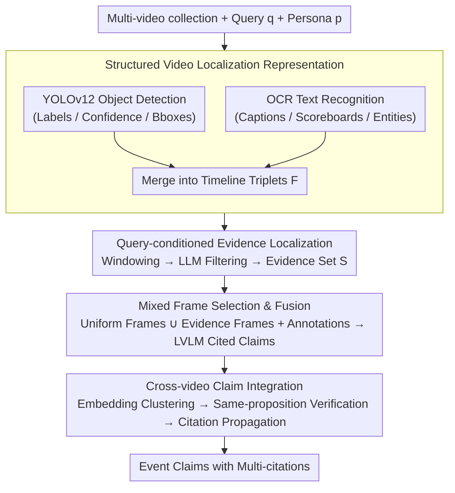

# TRACE: Evidence-Based Localization for Multi-Video Event Understanding and Claim Generation

**Conference**: ACL 2026  
**arXiv**: [2605.16740](https://arxiv.org/abs/2605.16740)  
**Code**: https://github.com/pengyu965/TRACE  
**Area**: Video Understanding  
**Keywords**: Multi-video event understanding, evidence localization, claim generation, video citation, Vision-Language Model

## TL;DR

TRACE achieves SOTA on multi-video event understanding (improving F1 from 0.705 to 0.811) through a "localization-then-reasoning" pipeline. It first builds text-searchable video timelines using OCR and object detection, performs query-conditioned evidence localization using a text LLM, and finally generates cited claims via an LVLM.

## Background & Motivation

**Background**: Multi-video event understanding requires models to not only recognize visual content but also locate and attribute discrete evidence fragments distributed across long video corpora. Recent Large Vision-Language Models (LVLMs) perform strongly in general video understanding but face core bottlenecks in this scenario.

**Limitations of Prior Work**: Directly processing raw videos with LVLMs faces three difficulties. First, models tend to focus on visually salient content (e.g., main characters, background landscapes) while ignoring query-specific evidence (casualty numbers on news tickers, vote totals in captions, scoreboard data). Second, even the latest LVLMs are forced into aggressive temporal sampling due to context window constraints, causing brief segments containing critical information—such as a flashing news scroll with vital statistics—to be missed. Third, these models struggle with precise temporal localization of "event-related" moments.

**Key Challenge**: The key is that event videos are filled with structured semantic signals (tickers, detected object categories, OCR text) that can be extracted cheaply, yet most existing LVLM pipelines fail to fully utilize them. Increasing the LVLM context window alone cannot solve the problem because the challenge is not "seeing more frames," but "identifying which frames matter."

**Goal**: To design a system capable of precisely localizing evidence and generating cited claims within long, heterogeneous video collections. Key requirements include: (1) efficient evidence localization in the text space to avoid frame-by-frame LVLM calls; (2) using OCR and detection signals to guide the LVLM toward evidence segments; (3) consolidating evidence and citations across multiple videos to avoid double counting.

**Key Insight**: OCR text in event videos (lower-third graphics, scoreboards, overlays) is often more semantically precise than raw visual appearance. These signals can be extracted cheaply via YOLOv12 and OCR, providing an interpretable textual serialized representation for subsequent reasoning.

**Core Idea**: Adopting a "localization-then-reasoning" paradigm. Instead of having the LVLM perform evidence discovery and generation simultaneously, the system first constructs a text-searchable video timeline (via OCR + detection), uses a text LLM for query-conditioned evidence localization, and then performs LVLM generation and citation integration under this guidance.

## Method

### Overall Architecture

The TRACE pipeline consists of four serial stages. **Stage 1** constructs a structured localization representation for each input video: running YOLOv12 object detection and OCR text recognition on sampled frames to generate a timestamp-detection-OCR triplet timeline. **Stage 2** segments this timeline into fixed-size windows, serializes them into text, and feeds them into a text LLM alongside the user query and persona to identify relevant frames. **Stage 3** provides the LVLM with a mixed set of frames (uniform samples + localized evidence frames) and structured localization annotations to generate query-conditioned claims with citations. **Stage 4** performs deduplication and citation propagation for claims across multiple videos via semantic embedding clustering and LLM verification, merging evidence for the same fact into a single multi-cited conclusion.

### Key Designs

**1. Structured Video Localization Representation: Translating long videos into text-searchable timelines**

Directly feeding raw frames to an LVLM forces aggressive sampling, missing critical brief segments like a flashing news ticker. TRACE uses lightweight signals to "textualize" the video: running YOLOv12 and OCR on uniformly sampled frames. Detection outputs $(l_i, c_i, \mathbf{b}_i)$ triplets ($l_i$ is a COCO-80 label, $c_i$ is confidence, $\mathbf{b}_i$ is the bounding box). Object co-occurrence (e.g., person, microphone, podium) allows inferring scenes like "press conference" without a separate classifier. OCR captures captions, scoreboard digits, and entity names. These merge into a timeline $\mathcal{F}=\{(t, \mathcal{D}_t, \mathcal{T}_t)\}_{t=0}^T$.

The value of this step is that OCR text is often more precise than visual appearance, and both signals are cheap to extract. Subsequent localization can then be handled by a fast text LLM without expensive visual encoding of every frame.

**2. Query-conditioned Evidence Localization: Low-cost initial screening in text space**

Event videos are saturated with signals, but LVLMs are easily distracted by salient backgrounds. TRACE splits the timeline into non-overlapping windows $\{\mathcal{F}_j\}$ of $C$ frames. Each window is serialized into a compact text including timestamps, detected objects, and OCR strings, then sent to a text LLM with query $q$ and persona $p$. The LLM outputs a subset $\mathcal{S}_j$ of relevant frames per window. The union $\mathcal{S}=\bigcup_j \mathcal{S}_j$ forms the keyframes for that video.

This localization occurs entirely in the text space, making it orders of magnitude faster than dense LVLM inference. It enables the text LLM to learn the semantic bridge between queries and signals (e.g., linking "vote count" to percentage signs in OCR), filtering irrelevant frames to save LVLM context for actual evidence moments.

**3. Mixed Frame Selection & Evidence Fusion: Balancing global coverage and evidence focus**

Using only localized frames is risky if localization fails; using only uniform sampling dilutes evidence. TRACE combines both for the LVLM visual input: $\mathcal{I}_v = \mathcal{I}_{\text{unif}} \cup \{\hat{i}_s : t_s \in \mathcal{S}\}$, where $\mathcal{I}_{\text{unif}}$ consists of $N_{\text{unif}}=100$ linearly spaced frames as a "global temporal insurance." Frames are passed with explicit positional metadata (rather than dense indices $0, 1, \dots, N-1$) to preserve correct temporal intervals in the LVLM's rotary positional embeddings, preventing drift between text annotations and visual tokens.

By combining uniform frames for baseline, localized frames for focus, and explicit metadata for alignment, the LVLM maintains global context while concentrating visual capacity on evidence to produce accurate citations.

**4. Cross-video Claim Integration: Merging distributed evidence into multi-cited conclusions**

The same fact often appears across multiple videos. Simple text deduplication might discard supporting sources. TRACE treats integration as a cross-video evidence merging problem: first, claims are encoded into a semantic embedding space for conservative clustering; candidate clusters are then verified by an LLM under a strict "same-proposition" criterion to distinguish between paraphrases and superficially similar but factually different claims. The most complete claim per cluster is retained, and all supporting citations within the cluster are propagated to it.

This "merging instead of suppressing" approach significantly improves citation recall while avoiding the precision loss associated with aggressive generative merging.

## Key Experimental Results

### Main Results

Quantitative comparison on the MAGMaR 2026 Oracle Track validation set:

| Method | Avg. F1 | Info Prec. | Info Rec. | Info F1 | Cit Prec. | Cit Rec. | Cit F1 |
|------|---------|---------|---------|---------|---------|---------|---------|
| Qwen3.5-9B | 0.472 | 0.437 | 0.756 | 0.554 | 0.875 | 0.251 | 0.390 |
| Qwen3-VL-8B | 0.723 | 0.870 | 0.802 | 0.835 | 0.930 | 0.452 | 0.608 |
| Qwen3-VL-30B (Baseline) | 0.705 | 0.883 | 0.731 | 0.800 | 0.990 | 0.440 | 0.609 |
| **TRACE (Full)** | **0.811** | **0.863** | **0.876** | **0.869** | **0.939** | **0.628** | **0.753** |

TRACE improves Avg. F1 by +0.106 (+15%) over the strongest baseline. Notably, citation recall rose from 0.440 to 0.628 (+42.7%), indicating that localization guidance allows the model to find and attribute evidence across more videos.

### Ablation Study

| Configuration | Keyframe Aug. | Clustering | Avg. F1 | Info F1 | Cit F1 |
|------|-----------|---------|---------|---------|---------|
| W/O Localization + LLM Cluster | ✗ | LLM | 0.802 | 0.859 | 0.745 |
| W/O Localization + Embed-Sim | ✗ | Embed-Sim | 0.808 | 0.868 | 0.748 |
| With Localization + LLM Cluster | ✓ | LLM | 0.804 | 0.867 | 0.741 |
| Full Model | ✓ | Embed-Sim | **0.811** | **0.869** | **0.753** |

### Key Findings

- **Localization guidance is the primary contributor**: All four variants significantly outperform the baseline, indicating that structured localization is the main driver of improvement.
- **Embedding similarity clustering is more precise**: Embed-Sim clustering outperformed pure LLM clustering in both frame selection settings, specifically in Citation F1.
- **Localized frames provide complementary gains**: Adding localized frames improved info recall from 0.858 to 0.885 under LLM clustering, though the gain was smaller under Embed-Sim, suggesting text localization already captured most evidence context at the prompt level.

## Highlights & Insights

- **Innovation in "Localization-then-Reasoning"**: Reframing multi-video understanding as an evidence localization problem rather than direct generation. This allows lightweight text LLMs to handle low-cost primary filtering, significantly reducing LVLM inference costs and context waste.
- **Value of OCR as high-precision signals**: Traditional LVLMs often ignore structured text in videos; TRACE demonstrates that these signals are frequently more informative for event understanding than visual appearance.
- **Efficiency of text-space localization**: By performing complex query alignment in the text space, the system avoids visual encoding for every potential keyframe. In practice, localization is over 50x faster than dense LVLM inference.

## Limitations & Future Work

**Limitations**: (1) The YOLO detector is limited to the COCO-80 vocabulary, missing domain-specific entities in news queries. (2) The pipeline is non-differentiable and serial; localization errors propagate without recovery. (3) Cross-video clustering may misclassify claims that are semantically similar but factually distinct.

**Future Work**: (1) Integrating open-vocabulary detectors (e.g., GroundingDINO) to expand entity coverage. (2) Designing backpropagation or reinforcement learning schemes to optimize localization and generation end-to-end. (3) Introducing adaptive sampling strategies in the localization stage.

## Related Work & Insights

- **vs. Long-context LVLMs (Video-LLaVA / Qwen3-VL)**: These focus on memory compression or adaptive selection but assume that with enough memory, LVLMs will automatically locate evidence. TRACE argues that the issue is an attention bias toward raw visual content.
- **vs. Retrieval-Augmented Generation (RAG)**: TRACE adopts a similar decomposition but in the multimodal domain: retrieving using lightweight structured signals instead of dense embeddings.
- **vs. Modular Multimodal Reasoning (Visual Programming)**: TRACE generalizes the idea of decomposing perception and reasoning by making evidence discovery a specialized localization module.

## Rating

- Novelty: ⭐⭐⭐⭐ 
- Experimental Thoroughness: ⭐⭐⭐⭐⭐ 
- Writing Quality: ⭐⭐⭐⭐ 
- Value: ⭐⭐⭐⭐⭐ 

<!-- RELATED:START -->

## Related Papers

- [\[ACL 2026\] HERMES: KV Cache as Hierarchical Memory for Efficient Streaming Video Understanding](hermes_kv_cache_as_hierarchical_memory_for_efficient_streaming_video_understandi.md)
- [\[ACL 2026\] Probing for Reading Times](probing_for_reading_times.md)
- [\[ACL 2026\] VISTA: Verification In Sequential Turn-based Assessment](vista_verification_in_sequential_turn-based_assessment.md)
- [\[ACL 2026\] ArrowGEV: Grounding Events in Video via Learning the Arrow of Time](arrowgev_grounding_events_in_video_via_learning_the_arrow_of_time.md)
- [\[ACL 2026\] ViLL-E: Video LLM Embeddings for Retrieval](vill-e_video_llm_embeddings_for_retrieval.md)

<!-- RELATED:END -->
