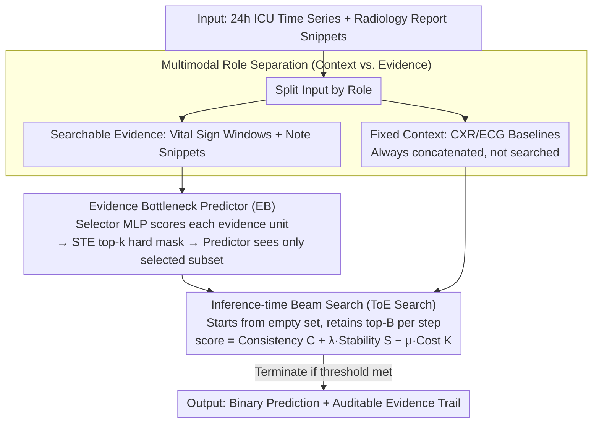

# Tree-of-Evidence: Efficient "System 2" Search for Faithful Multimodal Grounding

**Conference**: ACL 2026 Findings  
**arXiv**: [2604.07692](https://arxiv.org/abs/2604.07692)  
**Code**: None  
**Area**: Multimodal VLM  
**Keywords**: Multimodal interpretability, evidence search, clinical prediction, beam search, concept bottleneck

## TL;DR

This paper proposes Tree-of-Evidence (ToE), an inference-time discrete beam search algorithm that formalizes multimodal model interpretability as a discrete optimization problem over coarse-grained evidence units (vital sign time windows, radiology report snippets). Using only 5 evidence units, it retains over 98% of the AUROC of the full-input model while generating auditable evidence tracking paths.

## Background & Motivation

**Background**: Large Multimodal Models (LMMs) have achieved SOTA performance in high-risk domains such as healthcare, but their reasoning processes remain opaque. Existing interpretability methods include post-hoc attribution methods like attention visualization, gradient saliency, LIME/SHAP, and Concept Bottleneck Models (CBM).

**Limitations of Prior Work**: (1) Attention weights are often unfaithful to the model's actual decision logic; (2) LIME/SHAP provide approximations rather than guarantees and cannot provide discrete evidence selection; (3) CBMs require pre-defined concept annotations and are static during inference, lacking adaptive search capabilities; (4) Existing rationale extraction methods are typically limited to a single modality (primarily text) and fail to capture cross-modal synergistic dependencies.

**Key Challenge**: Clinical deployment requires model predictions to be explicitly traceable to specific verifiable evidence, but existing methods are either unfaithful, do not support multimodality, or fail to provide an audit trail.

**Goal**: Design an inference-time search algorithm capable of finding a compact set of multimodal evidence that can both reproduce full-input predictions and provide an auditable search process.

**Key Insight**: Drawing inspiration from the deliberate branching search idea of Tree-of-Thoughts, interpretability is treated as a discrete search problem—a "System 2" style multi-step deliberate search rather than a "System 1" style single-pass greedy ranking.

**Core Idea**: The multimodal input space is structured into "global context" (fixed priors, such as CXR/ECG baselines) and "searchable evidence" (dynamic vital signs and notes). By training a lightweight Evidence Bottleneck scorer and executing beam search during inference, the most compact and faithful evidence set is identified.

## Method

### Overall Architecture

The ToE framework consists of three phases: Phase I independently trains modality-specific classifiers (BiGRU for time series, frozen BioClinicalBERT for text); Phase II trains a lightweight MLP selector after freezing the encoders to learn evidence scores via STE top-k masking; Phase III executes beam search during inference to construct a compact evidence set by balancing three objectives: decision consistency, probability stability, and sparsity. Inputs consist of 24-hour ICU time-series windows and radiology report text snippets, while outputs include binary classification predictions and their corresponding evidence trails. Before entering this pipeline, inputs are categorized by "role": baselines like CXR/ECG serve as fixed context and are always retained, while vital sign windows and note snippets are the searchable evidence actually selected by the beam search.

### Key Designs

**1. Multimodal Role Separation (Context vs. Evidence): Spending the search budget on dynamic signals**

A significant portion of clinical input consists of nearly static baseline information (e.g., CXR/ECG). Including these in the search space would cause the beam search to waste its budget repeatedly confirming static signals. The authors split inputs into two categories: CXR/ECG serve as fixed context priors, which are always concatenated into the representation and retained; vital sign time windows and clinical notes serve as searchable evidence, the only parts modified by the beam search. This reflects clinical reasoning logic—"given the patient's baseline risk, which dynamic changes explain the outcome"—focusing the limited evidence budget on dynamic information that truly differentiates cases.

**2. Evidence Bottleneck Predictor (EB): Forcing interpretable scores through "Selector-Predictor" separation**

To ensure evidence scores are trustworthy, the model must be prevented from "peeking" at unselected information. EB implements independent "Selector-Predictor" sets for each modality: a Selector MLP assigns a score $s_i = f_\theta(u_i)$ to each evidence unit $u_i$, followed by a differentiable top-k hard mask via STE (straight-through estimator) to select units with the highest scores. The Predictor only sees the selected subset for prediction. The two streams are trained separately, and their logits are summed for fusion during inference. This separation structurally prevents "cheating"—the predictor cannot access unselected evidence, so the selector's scores must be discriminative. The overhead is minimal: Phase II only updates the Selector MLP with approximately 98K parameters, and STE gradient mismatch only affects the magnitude of selected evidence, not their relative ranking.

**3. Inference-time Beam Search (ToE Search): Treats interpretability as a "System 2" multi-step deliberate search**

Greedy top-k selection is a one-time ranking that fails to capture cross-modal synergies—cases where individual units are weak but their combination is faithful. ToE utilizes beam search, starting from an empty set and adding evidence step-by-step while retaining the top-B states. The scoring function balances three components:

$$\text{score}(\mathbf{m}) = C(\mathbf{m}) + \lambda S(\mathbf{m}) - \mu K(\mathbf{m})$$

where $C$ is decision consistency (the selected evidence must reproduce the full-input prediction class), $S = 1 - |p_{\text{full}} - p(\mathbf{m})|$ is probability stability (not just the correct class, but the calibrated probability must be close to the full model), and $K$ is the evidence cost (encouraging sparsity). The probability stability term is crucial: it requires the selected evidence to be not just "sufficient" but faithful to the confidence level of the full decision. The search terminates when a threshold is met, making the search path itself an auditable evidence trail.

### A Complete Example: How evidence is found for an ICU mortality prediction case

Consider a 24-hour window for an ICU patient. Fixed context (CXR/ECG baseline) is concatenated first and does not participate in the search; searchable evidence consists of several vital sign time windows and clinical note snippets. Beam search starts from an empty set: in the first step, it calculates $\text{score}$ for each candidate evidence unit. If the patient's signals are clear (e.g., blood pressure/heart rate windows are already enough for $p(\mathbf{m})$ to approach $p_{\text{full}}$), the stability term $S$ saturates rapidly while the cost term $K$ discourages further selection, leading to termination with just one vital sign window—aligning with the observation that "simple cases only use vital signs." If signals are ambiguous, a single window cannot bring the probability to the full model's level; the search continues, adding clinical note snippets until both consistency $C$ and stability $S$ reach the threshold. The complete search path (which window was chosen first, followed by which text) serves as the evidence trail for clinical auditing.

### Loss & Training

Phase I uses class-balanced binary cross-entropy to independently train the two modality streams. Phase II freezes the encoders and trains only the Selector MLPs. No training is required during inference, which only involves executing the beam search.

## Key Experimental Results

### Main Results

**MIMIC-IV E1: In-hospital mortality prediction, comparison under different evidence budgets**

| Method | k=1 AUROC | k=1 Fidelity MAE↓ | k=5 AUROC | k=5 Fidelity MAE↓ |
|--------|-----------|-------------------|-----------|-------------------|
| LIME | 0.564 | 0.229 | 0.695 | 0.171 |
| SHAP | 0.764 | 0.123 | 0.801 | 0.039 |
| ToE | **0.783** | **0.096** | **0.800** | **0.040** |
| Full Model | 0.800 | — | 0.800 | — |

### Ablation Study

**Comparison with LLM and CBM**

| Method | Parameters | AUROC | AUPRC |
|--------|------------|-------|-------|
| Hard CBM (24 concepts) | — | 0.775 | 0.349 |
| Med42-v2-70B | 70B | 0.745 | 0.293 |
| ToE (k=5) | 109M | **0.800** | — |

### Key Findings

- ToE retains 98%+ AUROC of the full model using only 5 evidence units, consistent across 6 tasks.
- At k=1, ToE reduces Fidelity MAE by 56% compared to LIME, with AUROC 22 percentage points higher.
- Qualitative analysis shows ToE performs adaptive search: simple cases use only vital signs, while text is introduced when signals are ambiguous.
- Results are stable across cross-center validation (208 hospitals in eICU) and non-medical domains (LEMMA-RCA).

## Highlights & Insights

- The "System 2 search" analogy is apt—shifting-interpretability from passive attribution to active search, where the search process itself is auditable.
- The probability space stability term is elegantly designed—in ICU scenarios, most patients have $p$ near 0 or 1, so logit space deviations have minimal impact on the probability space.
- ToE with 109M parameters outperforms 70B Med42, demonstrating that structured approaches are far superior to general LLMs for structured prediction.

## Limitations & Future Work

- The granularity of evidence units (1-hour window, 3-sentence text snippet) is pre-set; different tasks may require different granularities.
- Beam search is a heuristic optimum rather than a global optimum, though the gap with exhaustive search is <0.001 AUROC for small $k$.
- Requires pre-training modality-specific encoders and selectors; it is not "plug-and-play."
- Not validated on finer-grained units such as image pixels or waveform segments.

## Related Work & Insights

- **vs LIME/SHAP**: The latter are post-hoc approximations with no hard selection mechanism; ToE achieves significantly higher faithfulness under sparse budgets.
- **vs Concept Bottleneck Models**: CBMs require pre-defined concept labels and static inference, whereas ToE dynamically discovers evidence from learned representations.
- **vs Tree-of-Thoughts**: ToT searches in the token generation space, while ToE searches in the evidence selection space.

## Rating

- Novelty: ⭐⭐⭐⭐⭐ First application of inference-time beam search to multimodal interpretability, with a complete and original framework.
- Experimental Thoroughness: ⭐⭐⭐⭐⭐ 6 tasks across 3 datasets + cross-center validation + comparison with LLM/CBM.
- Writing Quality: ⭐⭐⭐⭐ Clear System 1/2 analogy and detailed methodology.
- Value: ⭐⭐⭐⭐ Provides a practical and auditable mechanism for deploying multimodal models in high-risk domains.

<!-- RELATED:START -->

## Related Papers

- [\[ACL 2025\] Evaluating Multimodal Large Language Models on Video Captioning via Monte Carlo Tree Search](../../ACL2025/multimodal_vlm/mcts_video_captioning_eval.md)
- [\[CVPR 2025\] Global-Local Tree Search in VLMs for 3D Indoor Scene Generation](../../CVPR2025/multimodal_vlm/global-local_tree_search_in_vlms_for_3d_indoor_scene_generation.md)
- [\[ACL 2026\] Utility-Oriented Visual Evidence Selection for Multimodal Retrieval-Augmented Generation](utility-oriented_visual_evidence_selection_for_multimodal_retrieval-augmented_ge.md)
- [\[CVPR 2026\] DRS-GUI: Dynamic Region Search for Training-Free GUI Grounding](../../CVPR2026/multimodal_vlm/drs-gui_dynamic_region_search_for_training-free_gui_grounding.md)
- [\[CVPR 2026\] Similarity-as-Evidence: Calibrating Overconfident VLMs for Interpretable and Label-Efficient Medical Active Learning](../../CVPR2026/multimodal_vlm/similarity-as-evidence_calibrating_overconfident_vlms_for_interpretable_and_labe.md)

<!-- RELATED:END -->
