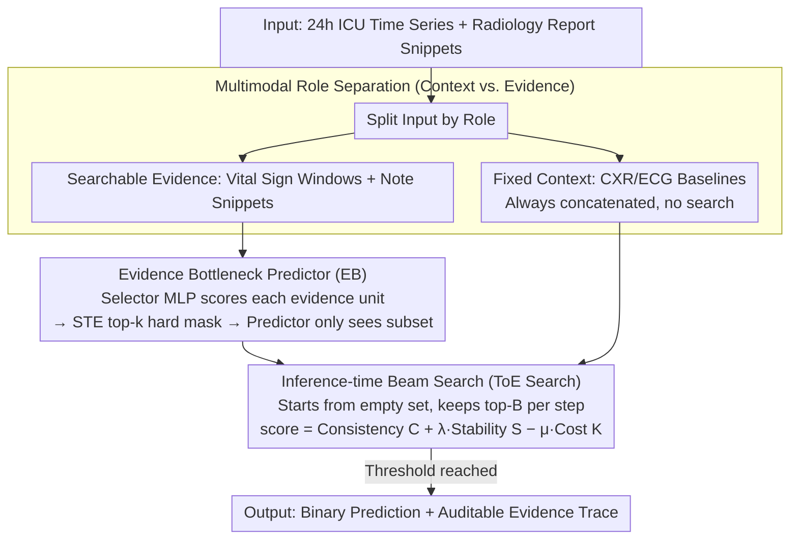

# Tree-of-Evidence: Efficient "System 2" Search for Faithful Multimodal Grounding

**Conference**: ACL 2026 Findings  
**arXiv**: [2604.07692](https://arxiv.org/abs/2604.07692)  
**Code**: None  
**Area**: Multimodal LMM  
**Keywords**: Multimodal Interpretability, Evidence Search, Clinical Prediction, Beam Search, Concept Bottleneck

## TL;DR

Ours proposes Tree-of-Evidence (ToE), an inference-time discrete beam search algorithm that formalizes multimodal model interpretability as a discrete optimization problem over coarse-grained evidence units (vital sign time windows, radiology report snippets). It retains over 98% of the full-input model's AUROC using only 5 evidence units while generating auditable evidence traces.

## Background & Motivation

**Background**: Large Multimodal Models (LMMs) have achieved SOTA performance in high-stakes fields such as healthcare, but their reasoning processes remain opaque. Existing interpretability methods include attention visualization, gradient saliency, post-hoc attribution methods like LIME/SHAP, and Concept Bottleneck Models (CBM).

**Limitations of Prior Work**: (1) Attention weights are often unfaithful to the model's actual decision logic; (2) LIME/SHAP provides approximations rather than guarantees and cannot provide discrete evidence selection; (3) CBM requires pre-defined concept annotations and remains static during inference, lacking adaptive search capabilities; (4) Existing rationale extraction methods are typically limited to a single modality (mostly text) and fail to capture cross-modal synergistic dependencies.

**Key Challenge**: Clinical deployment requires that model predictions be explicitly traceable to specific, verifiable evidence. However, existing methods are either unfaithful, lack multimodal support, or fail to provide an audit trail.

**Goal**: Design an inference-time search algorithm capable of finding a compact set of multimodal evidence that can both replicate full-input predictions and provide an auditable search process.

**Key Insight**: Borrowing the deliberate branching search idea from Tree-of-Thoughts, interpretability is treated as a discrete search problem—a "System 2" style multi-step deliberate search, rather than a "System 1" style single greedy ranking.

**Core Idea**: Structure the multimodal input space into "Global Context" (fixed priors, e.g., CXR/ECG baselines) and "Searchable Evidence" (dynamically changing vital signs and notes). Find the most compact faithful evidence set by training a lightweight Evidence Bottleneck scorer and executing beam search at inference time.

## Method

### Overall Architecture

The ToE framework consists of three phases: Phase I independently trains modality-specific classifiers (BiGRU for time series, frozen BioClinicalBERT for text); Phase II trains a lightweight MLP selector after freezing the encoders to learn evidence scores via STE top-k masking; Phase III executes beam search at inference time to construct a compact evidence set by balancing three objectives: decision consistency, probability stability, and sparsity. The input consists of 24-hour ICU time-series windows and radiology report fragments, and the output is a binary prediction with its corresponding evidence trace. Before entering this pipeline, inputs are categorized by "roles": baselines like CXR/ECG are fixed contexts that are always retained, while vital sign windows and note fragments are the searchable evidence actually selected by the beam search.

### Key Designs

**1. Multimodal Role Separation (Context vs. Evidence): Allocating Search Budgets to Dynamic Signals**

A significant portion of clinical input consists of baseline information that rarely changes (e.g., CXR/ECG). Including these in the search space would cause the beam search to waste its budget repeatedly confirming static signals. Ours splits the input into two categories: CXR/ECG serves as the fixed context prior, which is always concatenated into the representation and retained; vital sign windows and clinical notes serve as searchable evidence, the only parts modified by the beam search. This aligns with clinical reasoning—identifying which dynamic changes explain the outcome given a known baseline risk—allowing the limited evidence budget to focus on dynamic information that distinguishes cases.

**2. Evidence Bottleneck Predictor (EB): Forcing Interpretable Scores via Selector-Predictor Separation**

To ensure evidence scores are credible, the model must not be allowed to "peek" at unselected information during scoring. EB implements an independent "Selector-Predictor" pair for each modality: the Selector MLP assigns a score $s_i = f_\theta(u_i)$ to each evidence unit $u_i$, followed by a differentiable top-k hard mask via STE (straight-through estimator) to select top-ranked evidence. The Predictor can only access this selected subset to make predictions. The two streams are trained separately, and their logits are summed for fusion during inference. This architectural separation prevents "cheating"—the Predictor cannot access unselected evidence, ensuring the Selector's scores must be genuinely discriminative. The computational cost is minimal: Phase II only updates the ~98K parameter Selector MLP, and the STE gradient mismatch only affects the magnitude of selected evidence, not their relative ranking.

**3. Inference-time Beam Search (ToE Search): Interpretability as a "System 2" Multi-step Search**

Greedy top-k ranking is a one-time operation that fails to capture cross-modal synergies where individual units are weak but their combination is faithful. ToE employs a beam search that starts from an empty set and gradually adds evidence, maintaining the top-B states at each step. The scoring function balances three factors:

$$\text{score}(\mathbf{m}) = C(\mathbf{m}) + \lambda S(\mathbf{m}) - \mu K(\mathbf{m})$$

where $C$ is decision consistency (selected evidence must replicate the full-input prediction class), $S = 1 - |p_{\text{full}} - p(\mathbf{m})|$ is probability stability (ensuring the calibrated probability, not just the class, stays close to the full model), and $K$ is the evidence cost (encouraging sparsity). The probability stability term is particularly critical, as it requires the selected evidence to be "faithful" to the confidence of the full model's decision. The search terminates upon reaching a threshold, making the search path itself an auditable evidence trace.

### Example Case: Evidence Search for ICU Mortality Prediction

Consider a 24-hour window for an ICU patient. Fixed context (CXR/ECG baseline) is concatenated first and not searched. Searchable evidence includes multiple vital sign windows and clinical note snippets. Beam search starts from an empty set: in the first step, individual scores are calculated for each candidate. If the patient has clear signals (e.g., blood pressure/heart rate windows allow $p(\mathbf{m})$ to approach $p_{\text{full}}$), the stability term $S$ saturates quickly, and the cost term $K$ prevents further selection. The search terminates with just one vital sign window—matching the paper's finding that "simple cases only use vital signs." If signals are ambiguous, a single window cannot reach the full model's probability level, and the search expands to include clinical note snippets until both $C$ and $S$ meet the threshold. The complete search path (which window was selected first, followed by which text) serves as the evidence trace for clinical audit.

### Loss & Training

Phase I uses class-balanced binary cross-entropy to independently train the two modality streams. Phase II freezes the encoders and trains only the Selector MLPs. No training is required during inference; only the beam search is executed.

## Key Experimental Results

### Main Results

**MIMIC-IV E1: In-hospital Mortality Prediction, comparison under different evidence budgets**

| Method | k=1 AUROC | k=1 Fidelity MAE↓ | k=5 AUROC | k=5 Fidelity MAE↓ |
|------|-----------|-------------------|-----------|-------------------|
| LIME | 0.564 | 0.229 | 0.695 | 0.171 |
| SHAP | 0.764 | 0.123 | 0.801 | 0.039 |
| ToE | **0.783** | **0.096** | **0.800** | **0.040** |
| Full Model | 0.800 | — | 0.800 | — |

### Ablation Study

**Comparison with LLM and CBM**

| Method | Parameters | AUROC | AUPRC |
|------|--------|-------|-------|
| Hard CBM (24 concepts) | — | 0.775 | 0.349 |
| Med42-v2-70B | 70B | 0.745 | 0.293 |
| ToE (k=5) | 109M | **0.800** | — |

### Key Findings

- ToE retains 98%+ AUROC of the full model using only 5 evidence units, consistent across 6 tasks.
- At k=1, ToE reduces Fidelity MAE by 56% compared to LIME, with 22 percentage points higher AUROC.
- Qualitative analysis shows ToE's adaptive search: simple cases use only vital signs, while text is introduced when signals are ambiguous.
- Results are stable across cross-center validation (eICU, 208 hospitals) and non-medical domains (LEMMA-RCA).

## Highlights & Insights

- The "System 2 Search" analogy is apt—upgrading interpretability from passive attribution to active search, where the search process itself is auditable.
- The probability stability term is elegantly designed—in ICU scenarios, most patient probabilities $p$ are near 0 or 1, so logit-space deviations have minimal impact in probability space.
- ToE with 109M parameters outperforms the 70B Med42, suggesting that structured methods on structured prediction tasks far exceed general-purpose LLMs.

## Limitations & Future Work

- The granularity of evidence units (1-hour windows, 3-sentence segments) is predefined; different tasks may require different granularities.
- Beam search provides heuristic optimality rather than global optimality, though the gap with exhaustive search at small $k$ is <0.001 AUROC.
- Requires pre-training modality-specific encoders and selectors; it is not a plug-and-play method.
- Not yet validated on finer-grained units like image pixels or waveform segments.

## Related Work & Insights

- **vs LIME/SHAP**: These are post-hoc approximations without a hard selection mechanism; ToE shows significantly higher faithfulness under sparse budgets.
- **vs Concept Bottleneck Models**: CBM requires predefined concept labels and static inference, whereas ToE dynamically discovers evidence from learned representations.
- **vs Tree-of-Thoughts**: ToT searches in the token generation space, while ToE searches in the evidence selection space.

## Rating

- Novelty: ⭐⭐⭐⭐⭐ First to apply inference-time beam search to multimodal interpretability with a comprehensive framework.
- Experimental Thoroughness: ⭐⭐⭐⭐⭐ 6 tasks across 3 datasets + cross-center validation + LLM/CBM comparisons.
- Writing Quality: ⭐⭐⭐⭐ Clear System 1/2 analogy and detailed methodology.
- Value: ⭐⭐⭐⭐ Provides a practical, auditable mechanism for deploying multimodal models in high-stakes domains.

<!-- RELATED:START -->

## Related Papers

- [\[ACL 2026\] Faithful-First Reasoning, Planning, and Acting for Multimodal LLMs](faithful-first_reasoning_planning_and_acting_for_multimodal_llms.md)
- [\[ACL 2025\] VisuoThink: Empowering LVLM Reasoning with Multimodal Tree Search](../../ACL2025/multimodal_vlm/visuothink_empowering_lvlm_reasoning_with_multimodal_tree_search.md)
- [\[ACL 2025\] Evaluating Multimodal Large Language Models on Video Captioning via Monte Carlo Tree Search](../../ACL2025/multimodal_vlm/mcts_video_captioning_eval.md)
- [\[CVPR 2026\] DocSeeker: Structured Visual Reasoning with Evidence Grounding for Long Document Understanding](../../CVPR2026/multimodal_vlm/docseeker_long_document_understanding.md)
- [\[CVPR 2025\] Global-Local Tree Search in VLMs for 3D Indoor Scene Generation](../../CVPR2025/multimodal_vlm/global-local_tree_search_in_vlms_for_3d_indoor_scene_generation.md)

<!-- RELATED:END -->
