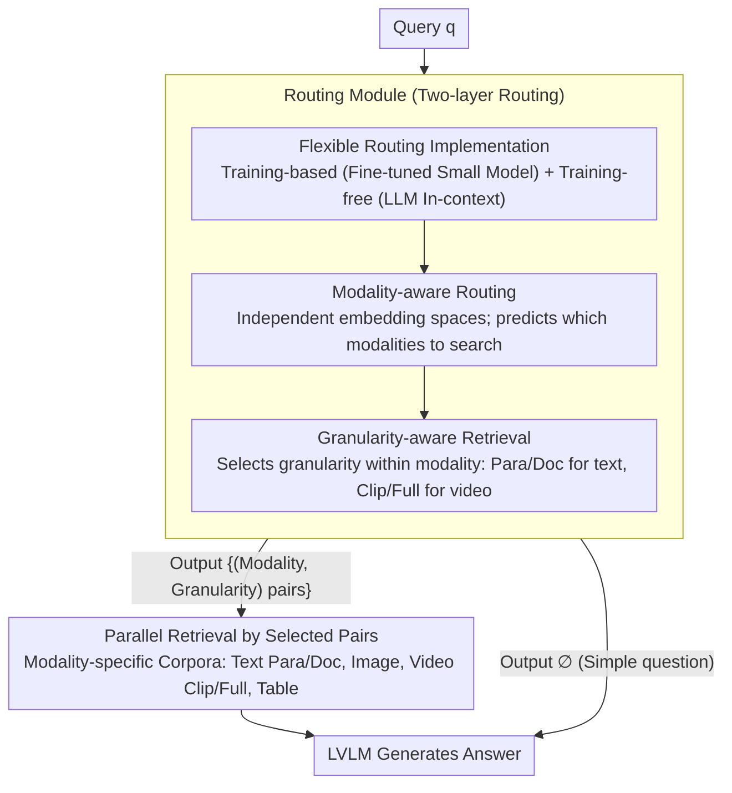

# UniversalRAG: Retrieval-Augmented Generation for Multimodal Corpora

**Conference**: ACL 2026  
**arXiv**: [2504.20734](https://arxiv.org/abs/2504.20734)  
**Code**: https://github.com/universalrag  
**Area**: Multimodal VLM / Retrieval-Augmented Generation  
**Keywords**: Retrieval-Augmented Generation, Multimodal, Routing Mechanism, Modality Gap, Granularity-Aware Retrieval

## TL;DR

UniversalRAG proposes a general any-to-any RAG framework that utilizes modality-aware routing and granularity-aware retrieval to dynamically select the most appropriate knowledge sources from heterogeneous multimodal corpora (text, images, videos at different granularities). This approach avoids the modality gap problem inherent in unified embedding spaces and significantly outperforms single-modality and unified methods across 10 benchmarks.

## Background & Motivation

**Background**: Existing RAG methods are typically limited to text corpora or extended to other modalities like images/videos in a modality-specific manner. When multimodal knowledge is required, the most straightforward approach is to aggregate all modality corpora into a unified embedding space.

**Limitations of Prior Work**: While multimodal encoders attempt to align semantics across different modalities, a "modality gap" persists in practice—queries tend to cluster more closely with knowledge items of the same modality. This leads to retrieval bias favoring the same modality and omitting relevant content from others. Furthermore, different queries require different granularities of knowledge (simple factual questions need paragraphs, while complex analytical ones need full documents or videos), and fixed-granularity retrieval is often suboptimal.

**Key Challenge**: How to handle multimodal knowledge within a unified framework that simultaneously avoids retrieval bias caused by the modality gap and dynamically adjusts retrieval granularity based on query complexity?

**Goal**: Design a "one-stop" RAG framework capable of flexibly adapting to different modality and granularity requirements while maintaining retrieval efficiency.

**Key Insight**: Instead of forcing all modalities into a unified space, it is better to maintain modality-specific embedding spaces and dynamically select the most suitable modality-granularity pairs through intelligent routing.

**Core Idea**: A two-layer routing mechanism—(1) Modality-aware routing: predicts the modalities required by the query and routes to the corresponding corpora; (2) Granularity-aware routing: further selects the most appropriate granularity within each modality (paragraph/document/table/clip/full video, etc.).

## Method

### Overall Architecture

The end-to-end pipeline of UniversalRAG is divided into three key stages:

1.  **Corpus Organization**: Multiple independent corpora are constructed based on modality and granularity. For text, paragraph-level and document-level are stored separately; for video, short clips (under 3 minutes) and full videos are stored; images are kept as-is. Each corpus uses independent modality-specific encoders to generate embeddings.
2.  **Routing Decision**: Given a query $\mathbf{q}$, the routing module $\mathcal{R}$ predicts the most suitable set of modality-granularity pairs $\{(m_1, g_1), (m_2, g_2), ...\}$, supporting single or cross-modal retrieval. The router also outputs a "no retrieval" option for simple questions.
3.  **Generation**: Relevant content is retrieved from the corpora selected by the router and passed to the LVLM to generate the final answer.

### Key Designs

**1. Modality-aware routing: Instead of compressing all modalities into a unified space, maintain separate spaces and use routing**

The root of the modality gap is that unified encoders are forced to align heterogeneous data (text, images, videos) into the same space, resulting in queries clustering closer to "same-modality" knowledge. This biases retrieval and misses relevant content in other modalities. This paper uses a theoretical result (Proposition 1) to demonstrate that when the modality bias $\alpha$ is sufficiently large relative to the variance of semantic relevance, modality-specific retrieval is strictly superior to unified space retrieval. Therefore, numerical alignment is abandoned in favor of maintaining independent embedding spaces, with the decision of "which modality to search" handled by a router. Routing is modeled as multi-label classification $\mathcal{R}(\mathbf{q}) = M_{\mathbf{q}} \subseteq \{\text{Text, Image, Video, Table}\}$. During inference, a threshold (typically 0.8) is applied to the sigmoid probabilities of each modality-granularity pair, and combinations exceeding the threshold are retrieved in parallel. This bypasses the challenges of cross-modal alignment and allows seamless integration of new modalities by simply adding routing logic.

**2. Granularity-aware retrieval: Selecting granularity within the same modality to avoid "over-fragmentation" or "excessive noise"**

Fixed granularity is suboptimal—granularities that are too fine fragment context and dilute information, while those that are too coarse introduce irrelevant noise. This paper expands the routing output space from "selecting modality" to "selecting modality-granularity pairs":

$$\mathcal{R}: Q \to \{\varnothing\} \cup \mathcal{P}\Big(\bigcup_{m \in M} \{m\} \times G_m\Big)$$

Where $G_m$ is the set of granularities for modality $m$. Training labels are automatically annotated based on dataset characteristics (e.g., multi-hop questions like HybridQA are labeled as document-level, while factual questions like NQ are labeled as paragraph-level), and the routing classifier is trained using multi-hot encoding. Proposition 2 in the paper proves that different queries indeed benefit from different granularities. The output space always includes the $\varnothing$ (no retrieval) option, allowing simple questions to be answered directly by the LVLM without wasting a retrieval step.

**3. Flexible Routing Implementation: A dual approach using training-based and training-free routing**

Internal accuracy and out-of-distribution (OOD) generalization are often difficult to balance, so this paper provides two routing methods. Training-based routers use small models like Qwen3-VL-2B or InternVL3.5-1B, fine-tuned with multi-label multi-hot encoding and cross-entropy loss. They offer fast inference and in-domain accuracy above 95%, but performance drops on unseen distributions. Training-free routers use GPT-5 or Qwen3-VL-8B for in-context learning, utilizing a prompt template with target descriptions and few-shot examples without updating parameters. This approach offers more stable generalization. The two methods complement each other, forming a robust plug-and-play solution.

### Mechanism: How a Query is Routed to Modality and Granularity

Take a multi-hop question from HybridQA as an example. The query $\mathbf{q}$ enters the router $\mathcal{R}$, and sigmoid scores are generated for all modality-granularity pairs. Since such questions require both tabular facts and document-level context, the pairs exceeding the 0.8 threshold might be `{(Table), (Text, Document)}`. The system then performs parallel retrieval from the table corpus and the document-level text corpus, avoiding unnecessary paragraph-level or video searches. Retrieved table rows and document fragments are passed to the LVLM to generate the answer. For a simple factual question from NQ, the router would only activate `{(Text, Paragraph)}`. For a common-sense question, the router might output $\varnothing$, letting the LVLM answer directly without retrieval. The entire pipeline (Routing → Parallel Retrieval by pairs → Generation) directs the query to the most appropriate knowledge source via a single routing decision.

## Key Experimental Results

### Main Results

Comprehensive comparison across 10 benchmarks (using Qwen3-VL-8B-Instruct as the backbone generator):

| Dataset | UniversalRAG (Trained) | UniRAG (Unified) | GME (Unified) | Gain |
| :--- | :--- | :--- | :--- | :--- |
| MMLU | 74.39 | 70.06 | 70.41 | +4.3% |
| NQ | 38.65 EM | 19.30 EM | 20.05 EM | +99.2% |
| HotpotQA | 50.61 F1 | 29.71 F1 | 29.91 F1 | +70.4% |
| HybridQA | 11.05 EM | 2.85 EM | 3.00 EM | +288% |
| MRAG | 23.20 Acc | 19.05 Acc | 19.20 Acc | +21.3% |
| Average | 42.40 | 32.93 | 33.88 | **28.7% Relative Gain** |

### Ablation Study

| Config | Modality Accuracy | Average Metric | Description |
| :--- | :--- | :--- | :--- |
| Random Routing | 14.29% | 31.75 | Baseline by chance |
| UniRAG (Unified Space) | 25.00% | 33.86 | Modality bias causes severe retrieval skewedness |
| UniversalRAG-Qwen3-2B | 95.28% | 42.40 | Near-perfect routing accuracy |
| UniversalRAG-GPT-5 (Free) | 68.22% | 41.68 | Stronger generalization |
| Oracle (Perfect Routing) | 100% | 42.45 | Upper bound |

### Key Findings

-   **Modality Routing Effect**: VLM2Vec-V2 relies entirely on text retrieval regardless of the query, causing video tasks to fail; UniversalRAG adaptively balances retrieval across modalities.
-   **Marginal Contribution of Granularity**: Performance continues to improve as granularity levels increase from 1→2→3→4, though not strictly monotonically.
-   **Efficiency Improvement**: On large-scale corpora (>1M items), UniversalRAG's end-to-end latency is lower than unified methods because modality-specific retrieval avoids searching across a massive unified index.
-   **OOD Generalization**: On 6 OOD datasets, training-based routing performance drops, but training-free GPT-5 remains stable.

## Highlights & Insights

-   **Theoretical Characterization of Modality Gap**: Through formal analysis in Proposition 1, it is strictly proven that modality-specific retrieval outperforms unified space retrieval under sufficiently large modality bias. This provides a solid theoretical foundation for "why routing works."
-   **Minimalist Architecture Philosophy**: Instead of modifying underlying encoders or introducing complex alignment mechanisms, the "divide and conquer" routing strategy elegantly circumvents the modality gap. This simplicity naturally supports expansion to new modalities.
-   **Ingenuity of Two-layer Routing**: Joint prediction of modality-granularity pairs is more powerful than step-by-step prediction as it supports cross-modal granularity combinations (e.g., HybridQA needing both tables and paragraphs).
-   **Value of Training-free Routing**: Through carefully designed few-shot prompts, LLMs can act as routers without any parameter updates, and their generalization exceeds that of fine-tuned small models.

## Limitations & Future Work

**Author-acknowledged Limitations**:

-   Routing accuracy depends on high-quality training data, but existing benchmarks lack explicit labels for "what modality/granularity should be retrieved for this query."
-   The number of granularity levels is limited by label availability. The paper only uses two levels for text/video; finer multi-level granularity would require manual annotation.

**Self-identified Limitations**:

-   While routing latency is constant, it may be relatively significant for very small-scale queries.
-   Information supplementation during multimodal fusion might be restricted by routing.
-   On small language models (e.g., a 2B parameter router), routing accuracy falls from 95% to around 90%.

## Related Work & Insights

-   **vs UniRAG / GME / VLM2Vec-V2** (Unified Multimodal Encoding): These methods force all modalities into a single space; this paper strictly proves the inherent modality bias of this approach through experiments and theory.
-   **vs MultiRAG** (Multi-corpus Fusion): MultiRAG simply retrieves from all corpora and mixes them, which easily introduces noise. UniversalRAG uses explicit routing for selection.
-   **vs Adaptive RAG Series** (Query Complexity Adaptation): Adaptive-RAG, ROWEN, etc., adjust retrieval strategies within a single modality. UniversalRAG crosses modality boundaries.
-   **Insights**: In multimodal system design, "decoupling + routing" often triumphs over "forced unification + complex alignment"; theory-driven design provides confidence in heuristic decisions; training-free schemes are efficient for rapid adaptation.

## Rating

-   Novelty: ⭐⭐⭐⭐⭐ First to systematically analyze the modality gap and fundamentally solve it via a two-layer routing + granularity design; strong original theoretical analysis.
-   Experimental Thoroughness: ⭐⭐⭐⭐⭐ 10 benchmarks covering 7 modalities, 6 OOD datasets for generalization, 3 LVLM backbone models, and comparison of training-based/free routing.
-   Writing Quality: ⭐⭐⭐⭐ Clear logic, intuitive visualization; rigorous theoretical sections.
-   Value: ⭐⭐⭐⭐⭐ Addresses a core bottleneck in the RAG field (multimodal knowledge integration) with a highly generalizable, plug-and-play framework.

<!-- RELATED:START -->

## Related Papers

- [\[ACL 2026\] Dynamic Emotion and Personality Profiling for Multimodal Deception Detection](dynamic_emotion_and_personality_profiling_for_multimodal_deception_detection.md)
- [\[ACL 2026\] HierVA: Hierarchical Visual Agent — Managing Contexts in Joint Image-Text Space for Advanced Chart Reasoning](hierarchical_visual_agent_managing_contexts_in_joint_image-text_space_for_advanc.md)
- [\[ACL 2026\] Forest Before Trees: Latent Superposition for Efficient Visual Reasoning](forest_before_trees_latent_superposition_for_efficient_visual_reasoning.md)
- [\[ACL 2026\] Cross-Cultural Expert-Level Art Critique Evaluation with Vision-Language Models](cross-cultural_expert-level_art_critique_evaluation_with_vision-language_models.md)
- [\[ACL 2026\] Do MLLMs Understand Pointing? Benchmarking and Enhancing Referential Reasoning in Egocentric Vision](do_mllms_understand_pointing_benchmarking_and_enhancing_referential_reasoning_in.md)

<!-- RELATED:END -->
