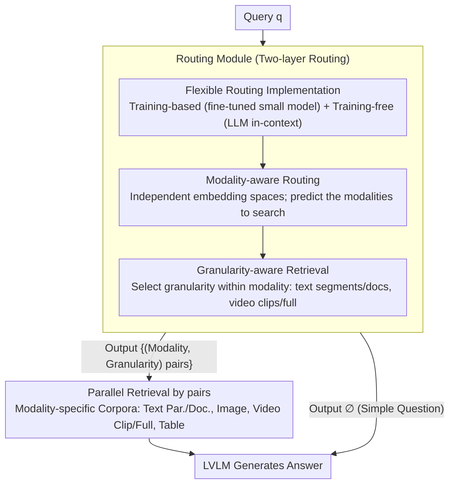

# UniversalRAG: Retrieval-Augmented Generation for Multimodal Corpora

**Conference**: ACL 2026  
**arXiv**: [2504.20734](https://arxiv.org/abs/2504.20734)  
**Code**: https://github.com/universalrag  
**Area**: Multimodal VLM / Retrieval-Augmented Generation  
**Keywords**: Retrieval-Augmented Generation, Multimodal, Routing Mechanism, Modality Gap, Granularity-Aware Retrieval

## TL;DR

UniversalRAG proposes a general any-to-any RAG framework that utilizes modality-aware routing and granularity-aware retrieval to dynamically select the most appropriate knowledge sources from heterogeneous multimodal corpora (text, image, video at varying granularities). This approach avoids the modality gap problem inherent in unified embedding spaces and significantly outperforms single-modality and unified methods across 10 benchmarks.

## Background & Motivation

**Background**: Existing RAG methods are either limited to text corpora or extended to other modalities like images/videos, but they are typically single-modality specific. When multimodal knowledge is required, the most straightforward approach is to aggregate all modality corpora into a unified embedding space.

**Limitations of Prior Work**: Although multimodal encoders attempt to align the semantics of different modalities, a "modality gap" exists in practice—queries tend to cluster more closely with knowledge items of the same modality, leading to a retrieval bias toward intra-modal knowledge and missing relevant content from other modalities. Furthermore, different queries require different granularities of knowledge (simple factual questions need paragraphs, while complex analytical questions need full documents or videos), and fixed-granularity retrieval is often suboptimal.

**Key Challenge**: How to process multimodal knowledge in a unified framework that avoids retrieval bias caused by the modality gap while dynamically adjusting retrieval granularity based on query complexity?

**Goal**: Design a "one-stop" RAG framework that flexibly adapts to knowledge requirements of different modalities and granularities while maintaining retrieval efficiency.

**Key Insight**: Instead of forcing all modalities into a unified space, it is better to maintain modality-specific embedding spaces and use intelligent routing to dynamically select the most suitable modality-granularity pairs.

**Core Idea**: A two-layer routing mechanism—(1) Modality-aware routing: predicts the modalities required by the query and routes to the corresponding corpora; (2) Granularity-aware routing: further selects the most appropriate granularity within each modality (paragraphs/documents/tables/clips/full videos, etc.).

## Method

### Overall Architecture

The end-to-end pipeline of UniversalRAG consists of three key stages:

1.  **Corpus Organization**: Multiple independent corpora are constructed based on modality and granularity. For text, paragraph-level and document-level are stored separately; for video, short clips (under 3 minutes) and full videos are stored; images are kept as is. Each corpus uses independent modality-specific encoders to generate embeddings.
2.  **Routing Decision**: Given a query $\mathbf{q}$, the routing module $\mathcal{R}$ predicts the most suitable set of modality-granularity pairs $\{(m_1, g_1), (m_2, g_2), ...\}$, supporting single-modal or cross-modal retrieval. The router also outputs a "no retrieval needed" option for simple questions.
3.  **Generation**: Relevant content retrieved from the selected corpora is fed to the LVLM to generate the final answer.

### Key Designs

**1. Modality-aware Routing: Maintain independent embedding spaces and use routing instead of forcing all modalities into a unified space**

The root cause of the modality gap is that unified encoders are forced to align heterogeneous data like text, images, and videos into the same space. Consequently, queries cluster closer to "same-modality" knowledge, resulting in biased retrieval. This paper uses a theoretical result (Proposition 1) to show that when the modality bias $\alpha$ is sufficiently large relative to the variance of semantic relevance, modality-specific retrieval is strictly superior to unified space retrieval. Therefore, the framework avoids numerical alignment, preserves independent embedding spaces for each modality, and delegates the choice of modality to a router. Routing is modeled as multi-label classification $\mathcal{R}(\mathbf{q}) = M_{\mathbf{q}} \subseteq \{\text{Text, Image, Video, Table}\}$. During inference, a threshold (usually 0.8) is applied to the sigmoid probabilities of each modality-granularity pair, and combinations exceeding the threshold are retrieved in parallel. This bypasses the difficulty of cross-modal alignment and allows for seamless integration of new modalities.

**2. Granularity-aware Retrieval: Select granularity within the same modality based on query complexity to avoid "dilution by over-refinement or noise by over-coarseness"**

Fixed granularity is suboptimal—too fine a granularity fragments context and dilutes information, while too coarse a granularity introduces irrelevant noise. This paper expands the routing output space from "selecting modality" to "selecting modality-granularity pairs":

$$\mathcal{R}: Q \to \{\varnothing\} \cup \mathcal{P}\Big(\bigcup_{m \in M} \{m\} \times G_m\Big)$$

where $G_m$ is the set of granularities for modality $m$ (e.g., paragraphs/documents for text, clips/full videos for video). Training labels are automatically annotated based on dataset characteristics (e.g., multi-hop questions like HybridQA are labeled as document-level, while factual questions like NQ are labeled as paragraph-level). These are used to train the routing classifier with multi-hot encoding. Proposition 2 in the paper further proves that different queries indeed benefit from different granularities. The output space always includes the $\varnothing$ (no retrieval) option, allowing simple questions to be answered directly by the LVLM without wasting retrieval resources.

**3. Flexible Routing Implementation: Dual approach with Training-based and Training-free routing**

In-domain accuracy and out-of-distribution (OOD) generalization are often hard to balance, so this paper provides two routing methods. The training-based routing uses small models like Qwen3-VL-2B or InternVL3.5-1B, fine-tuned with multi-label multi-hot encoding and cross-entropy loss. It is fast and achieves 95%+ in-domain accuracy but may drop in performance on unseen distributions. The training-free routing utilizes GPT-5 or Qwen3-VL-8B via in-context learning, employing a prompt template with target descriptions and few-shot examples without updating any parameters, resulting in more stable generalization. The strengths of both approaches complement each other, providing a robust plug-and-play solution.

### A Complete Example: How a Query is Routed to Modality and Granularity

Take a multi-hop question from HybridQA as an example. The query $\mathbf{q}$ enters the router $\mathcal{R}$, which concurrently scores all modality-granularity pairs via sigmoid. Since such questions require both tabular facts and document-level context, combinations exceeding the 0.8 threshold might be `{(Table), (Text, Document)}`. The system then performs parallel retrieval from the table corpus and the document-level text corpus, avoiding incorrect routing to paragraph-level or video. The retrieved table rows and document segments are passed to the LVLM to generate the answer. For a simple factual question from NQ, the router only activates `{(Text, Paragraph)}`, leading to a single retrieval path. For a common-sense question, the router may output $\varnothing$, allowing the LVLM to answer directly and skip retrieval. The entire pipeline (Routing → Parallel Retrieval by selected Modality-Granularity → Generation) directs the query to the most appropriate knowledge source based on a single routing decision.

## Key Experimental Results

### Main Results

Comprehensive comparison across 10 benchmarks (using Qwen3-VL-8B-Instruct as the backbone generator):

| Dataset | UniversalRAG (Train) | UniRAG (Unified) | GME (Unified) | Gain |
| :--- | :--- | :--- | :--- | :--- |
| MMLU | 74.39 | 70.06 | 70.41 | +4.3% |
| NQ | 38.65 EM | 19.30 EM | 20.05 EM | +99.2% |
| HotpotQA | 50.61 F1 | 29.71 F1 | 29.91 F1 | +70.4% |
| HybridQA | 11.05 EM | 2.85 EM | 3.00 EM | +288% |
| MRAG | 23.20 Acc | 19.05 Acc | 19.20 Acc | +21.3% |
| Average | 42.40 | 32.93 | 33.88 | **28.7% Relative Gain** |

### Ablation Study

| Configuration | Modality Accuracy | Average Metric | Description |
| :--- | :--- | :--- | :--- |
| Random Routing | 14.29% | 31.75 | Baseline achieved by chance |
| UniRAG (Unified Space) | 25.00% | 33.86 | Modality bias leads to heavily skewed retrieval |
| UniversalRAG-Qwen3-2B | 95.28% | 42.40 | Routing accuracy is near-perfect |
| UniversalRAG-GPT-5 (Free) | 68.22% | 41.68 | Stronger generalization |
| Oracle (Perfect Routing) | 100% | 42.45 | Upper bound |

### Key Findings

-   **Modality Routing Effect**: VLM2Vec-V2 relies entirely on text retrieval regardless of the query, causing video tasks to fail; UniversalRAG adaptively retrieves balanced information across modalities.
-   **Marginal Contribution of Granularity**: Increasing granularity levels from 1→2→3→4 shows continuous performance improvement, though not strictly monotonic.
-   **Efficiency Gains**: On large-scale corpora (>1M entries), the end-to-end latency of UniversalRAG is lower than unified methods because modality-specific retrieval avoids searching across a massive unified index.
-   **OOD Generalization**: On 6 OOD datasets, training-based routing performance decreases, but training-free GPT-5 remains stable.

## Highlights & Insights

-   **Theoretical Characterization of the Modality Gap**: Through formal analysis in Proposition 1, the paper strictly proves that modality-specific retrieval outperforms unified spaces when modality bias is sufficiently high. This provides a solid theoretical foundation for why routing works.
-   **Minimalist Architectural Philosophy**: Instead of modifying underlying encoders or introducing complex alignment mechanisms, the framework elegantly circumvents the modality gap through a "divide and conquer" routing strategy. This minimalism makes the framework naturally supportive of new modality extensions.
-   **Elegance of Two-layer Routing**: Joint prediction of modality-granularity pairs is more powerful than step-by-step prediction because it supports granularity combinations across different modalities (e.g., HybridQA requiring both tables and paragraphs).
-   **Value of Training-free Routing**: Through carefully designed few-shot prompts, the LLM can act as a router without any parameter updates, and its generalization capability surpasses fine-tuned small models.

## Limitations & Future Work

**Limitations acknowledged by the authors**:

-   Routing accuracy depends on high-quality training data, but existing benchmarks lack explicit labels for "which modality/granularity should be retrieved for this query."
-   The number of granularity tiers is limited by annotation availability. The paper only segments text/video into two tiers; finer multi-tier granularity would require manual labeling.

**Self-identified limitations**:

-   While the routing latency is constant, it may be relatively significant for very small-scale queries.
-   Information complementarity during multimodal fusion might be restricted by the router.
-   On small language models (e.g., 2B parameter routers), routing accuracy drops from 95% to around 90%.

## Related Work & Insights

-   **vs. UniRAG / GME / VLM2Vec-V2** (Unified Multimodal Encoding): They force all modalities into a single space; this paper strictly proves the inherent modality bias of such methods through experiments and theory.
-   **vs. MultiRAG** (Multi-corpus Fusion): MultiRAG simply retrieves from all corpora and mixes them, which easily introduces noise. UniversalRAG uses explicit routing for precision.
-   **vs. Adaptive RAG Series** (Query Complexity Adaptation): Adaptive-RAG, ROWEN, etc., adjust retrieval strategies within a single modality. UniversalRAG crosses modality boundaries.
-   **Insights**: In multimodal system design, "decoupling + routing" often outperforms "forced unification + complex alignment." Theory-driven design provides confidence for heuristic decisions. Training-free schemes are an efficient path for rapid adaptation.

## Rating

-   Novelty: ⭐⭐⭐⭐⭐ First to systematically analyze the modality gap and solve it fundamentally through a dual-layer routing and granularity design; strong original theoretical analysis.
-   Experimental Thoroughness: ⭐⭐⭐⭐⭐ 10 benchmarks covering 7 modalities, 6 OOD datasets for generalization verification, 3 LVLM backbone models, and comparison of training/training-free dual routing.
-   Writing Quality: ⭐⭐⭐⭐ Logical clarity and intuitive visualization; rigorous theoretical sections.
-   Value: ⭐⭐⭐⭐⭐ Addresses a core pain point in the RAG field (integration of multimodal knowledge) with a highly generalizable and plug-and-play framework.

<!-- RELATED:START -->

## Related Papers

- [\[ACL 2026\] Dynamic Emotion and Personality Profiling for Multimodal Deception Detection](dynamic_emotion_and_personality_profiling_for_multimodal_deception_detection.md)
- [\[ACL 2026\] Cross-Cultural Expert-Level Art Critique Evaluation with Vision-Language Models](cross-cultural_expert-level_art_critique_evaluation_with_vision-language_models.md)
- [\[ACL 2026\] MONETA: Multimodal Industry Classification through Geographic Information with Multi Agent Systems](moneta_multimodal_industry_classification_through_geographic_information_with_mu.md)
- [\[ACL 2026\] CArtBench: Evaluating Vision-Language Models on Chinese Art Understanding, Interpretation, and Authenticity](cartbench_evaluating_vision-language_models_on_chinese_art_understanding_interpr.md)
- [\[ACL 2026\] Topology-Aware Layer Pruning for Large Vision-Language Models](topology-aware_layer_pruning_for_large_vision-language_models.md)

<!-- RELATED:END -->
