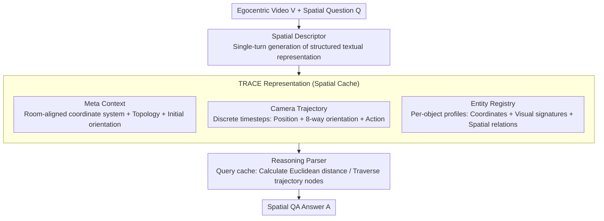

# TRACE: Unleashing Spatial Reasoning in Multimodal Large Language Models via Textual Representation Guided Reasoning

**Conference**: ACL 2026  
**arXiv**: [2603.23404](https://arxiv.org/abs/2603.23404)  
**Code**: [https://trace-reasoning.github.io](https://trace-reasoning.github.io)  
**Area**: Multimodal VLM / Spatial Reasoning  
**Keywords**: Spatial Reasoning, Multimodal Large Language Models, Textual Representation, Egocentric Video, Prompt Engineering

## TL;DR

This paper proposes TRACE (Textual Representation of Allocentric Context from Egocentric Video), a prompting method that guides Multimodal Large Language Models (MLLMs) to generate structured textual allocentric 3D environmental representations—including meta-context, camera trajectories, and entity registries—from egocentric videos. These serve as intermediate reasoning steps to enhance spatial question-answering capabilities, consistently outperforming existing prompting strategies on VSI-Bench and OST-Bench.

## Background & Motivation

**Background**: Existing MLLMs have achieved significant progress in tasks like video understanding and image captioning but perform poorly in 3D spatial reasoning. Cognitive science research indicates that humans perform 3D reasoning by constructing allocentric (environment-centered) spatial representations rather than operating directly at the pixel level.

**Limitations of Prior Work**: Current MLLMs rely excessively on 2D visual signals and learn spurious shortcut correlations from implicit spatial cues, failing to establish hierarchical abstractions of 3D scenes. Existing works either require fine-tuning with large amounts of spatial reasoning data (poor scalability) or introduce additional geometric/stereo modalities (high system complexity), making them unsuitable for off-the-shelf MLLMs.

**Key Challenge**: Standard reasoning methods like Chain-of-Thought (CoT) are effective for arithmetic and symbolic tasks but are often ineffective or even harmful for complex spatial reasoning tasks. This is because the reasoning traces generated by these methods fail to capture spatial geometric structures. Models need to reason explicitly based on global 3D representations.

**Goal**: Design a purely textual spatial representation method to serve as an intermediate reasoning step for MLLMs, enhancing spatial reasoning capabilities without modifying model architecture or adding extra modalities.

**Key Insight**: Inspired by allocentric spatial reasoning in human cognition—where humans mentally place themselves in an environment to build a global scene layout—the authors observe that such allocentric representations can be fully described via text.

**Core Idea**: Direct the MLLM to first generate a structured textual 3D representation (comprising meta-context, camera trajectory, and entity registry) to be loaded into the context window as a "spatial cache," then perform reasoning based on this cache—transforming spatial reasoning into queries over structured text.

## Method

### Overall Architecture

TRACE employs a single-turn generation approach: given an egocentric video $V$ and a natural language question $Q$, the model first acts as a "Spatial Descriptor" to generate the TRACE representation $G$, and then acts as a "Reasoning Parser" to generate the final answer $A$ based on $G$ and $V$. The reasoning process is formalized as $\hat{A}, \hat{G} = \arg\max P(A|G,V,Q) \cdot P(G|V,Q)$. This entire process is completed in a single forward pass, where TRACE functions as a structured CoT.

### Key Designs

**1. Meta Context: Anchoring the global coordinate system and room layout to prevent reference frame drift.**

The most common failure in spatial reasoning occurs when the model loses track of its initial position and orientation during movement, causing relative positions to lose their baseline. Meta Context addresses this by proposing a "room-aligned coordinate system." It sets the observer's starting position as the origin $[0,0]$, but the $y$-axis is determined by the most significant straight lines (e.g., walls, long tables) rather than the camera's initial orientation (which is unstable). It also records room topology (e.g., "rectangular bedroom") and grid directions, providing a unified framework for all subsequent spatial calculations. Using static structures instead of volatile camera orientations makes it more robust than naive CoT.

**2. Camera Trajectory: Reconstructing the observer's path as a series of traversable nodes rather than relying on instantaneous video memory.**

A static map cannot explain "how a person got there," which is essential for navigation and path planning. Trajectory design slices the video into discrete timesteps, recording timestamps, estimated positions $[x, y]$, and camera orientations at each step using large static objects from the Meta Context as landmarks. Orientation is restricted to 8 discrete directions (cardinal/ordinal) because estimating precise angles is difficult and introduces noise. Each step also includes an action attribute to encode the camera's motion context. By reconstructing these nodes, the model can "walk" through the trajectory to answer navigation questions instead of relying on blurry visual recalls.

**3. Entity Registry: Creating structured profiles with geometric attributes for each object to force the model to resolve spatial relations into calculable constraints.**

Models often fail to count or locate objects accurately because they only have a vague impression of them. The registry records for each entity: a timestamp (first appearance), a visual signature (appearance description for disambiguation), metric estimates (2D coordinates $[x,y]$ relative to the origin in meters), and spatial relations (natural language relative relations with neighbors). A key constraint is that entities must be listed individually (e.g., chair_01, chair_02) rather than grouped, ensuring precise counting and localization. Unlike Cognitive Maps that predict loose grid cells, these detailed profiles translate spatial relationships into geometric constraints. The combination of timestamps and visual signatures provides deduplication and temporal disambiguation capabilities—this module showed the largest performance drop in ablation studies, highlighting its importance.

### Loss & Training

TRACE is a pure prompting method and does not involve any training or fine-tuning. Reasoning is performed in a single forward pass: the model generates a schema-compliant TRACE representation, loads it as a "spatial cache" into the context window, and then derives the final answer by calculating Euclidean distances between entity coordinates or traversing trajectory nodes.

## Key Experimental Results

### Main Results

**Average performance of different prompting methods on VSI-Bench**

| Method | Gemini 3 Pro | Qwen2.5-VL-72B | MiMo-VL-7B |
|------|-------------|----------------|------------|
| Direct | 52.61 | 36.28 | 39.79 |
| CoT | 53.65 | 29.78 | 37.49 |
| ToT | 58.88 | 38.06 | 39.14 |
| LtM | 59.52 | 38.01 | 38.34 |
| CM (Cognitive Map) | 59.72 | 35.47 | 36.85 |
| **TRACE (Ours)** | **60.15** | **39.38** | **40.50** |

**Overall accuracy of different prompting methods on OST-Bench**

| Method | Gemini 3 Pro | Qwen2.5-VL-72B |
|------|-------------|----------------|
| Direct | 69.73 | 61.53 |
| CoT | 69.76 | 60.33 |
| CM | 68.47 | 57.45 |
| **TRACE (Ours)** | **70.36** | **62.68** |

### Ablation Study

| Configuration | VSI-Bench Avg | Description |
|------|--------------|------|
| Full TRACE | 60.15 | Complete model |
| w/o Meta Context | 58.27 | Removes Meta Context; Gain -1.88 |
| w/o Trajectory | 58.92 | Removes Trajectory; Gain -1.23 |
| w/o Entity Registry | 57.43 | Removes Entity Registry; Gain -2.72 |
| Grid only (No structured attributes) | 56.81 | Only uses grid coordinates; Significant decrease |

### Key Findings

- CoT actually performs 6.5 points worse than Direct on Qwen2.5-VL-72B, confirming that standard reasoning prompts can be detrimental to spatial tasks.
- TRACE achieves the best or near-best performance across all three base models, demonstrating consistency across different architectures.
- The Entity Registry contributes the most—its removal leads to the largest performance drop, indicating that fine-grained object attributes and coordinate estimation are key to spatial reasoning.
- TRACE remains effective in the multi-turn dialogue setup of OST-Bench, showing it is not limited to single-turn QA.
- Object counting and absolute distance estimation are the most difficult task types, where TRACE's improvements are particularly significant.

## Highlights & Insights

- The introduction of allocentric spatial cognition theory from cognitive science into MLLM prompt design—using text to simulate human mental spatial representations—is an elegant interdisciplinary approach.
- As a pure prompting method, TRACE requires no training data or model modifications and can be directly applied to any off-the-shelf MLLM, making it highly practical.
- The "spatial cache" concept is ingenious—it transforms 3D spatial reasoning into queries over structured text, leveraging the LLM's strongest capability (textual reasoning) to compensate for its weakest (3D perception).

## Limitations & Future Work

- The quality of the single-pass TRACE generation depends entirely on the MLLM's visual understanding; if the model fails to perceive object locations accurately, subsequent reasoning will be flawed.
- Coordinate estimation is inherently approximate and may not be accurate enough for tasks requiring precision (e.g., absolute distance measurement).
- The method was only validated in indoor scenes (VSI-Bench and OST-Bench); its applicability to open outdoor scenes remains unknown.
- Future work could consider iterative refinement mechanisms, allowing the model to self-verify and correct the TRACE representation after generation.

## Related Work & Insights

- **vs. Cognitive Map (CM)**: CM uses loose grid cell prediction, whereas TRACE uses an Entity Registry with detailed attributes, providing more granular spatial information.
- **vs. Thinking in Space**: The latter shows the benefits of externalizing spatial representations but requires specific training; TRACE achieves similar effects via pure prompting.
- **vs. VideoTree/VideoAgent**: These methods optimize evidence retrieval for long videos, while TRACE focuses on enabling the model to reason explicitly with 3D geometric cues.

## Rating

- Novelty: ⭐⭐⭐⭐ Translating allocentric cognitive theory into structured prompts is novel, though the core remains a sophisticated CoT variant.
- Experimental Thoroughness: ⭐⭐⭐⭐ Good coverage across two benchmarks, three models, and comprehensive ablations.
- Writing Quality: ⭐⭐⭐⭐⭐ Clear motivation, intuitive methods, and high-quality illustrations.
- Value: ⭐⭐⭐⭐ Provides a practical and universal prompting strategy for spatial reasoning that is ready for deployment.

<!-- RELATED:START -->

## Related Papers

- [\[CVPR 2026\] Unleashing the Intrinsic Visual Representation Capability of Multimodal Large Language Models](../../CVPR2026/multimodal_vlm/unleashing_the_intrinsic_visual_representation_capability_of_multimodal_large_la.md)
- [\[NeurIPS 2025\] Struct2D: A Perception-Guided Framework for Spatial Reasoning in MLLMs](../../NeurIPS2025/multimodal_vlm/struct2d_a_perception-guided_framework_for_spatial_reasoning_in_mllms.md)
- [\[ACL 2026\] Addressing Overthinking in Large Vision-Language Models via Gated Perception-Reasoning Optimization](addressing_overthinking_in_large_vision-language_models_via_gated_perception-rea.md)
- [\[ACL 2026\] GeoArena: Evaluating Open-World Geographic Reasoning in Large Vision-Language Models](geoarena_evaluating_open-world_geographic_reasoning_in_large_vision-language_mod.md)
- [\[ICLR 2026\] OmniSpatial: Towards Comprehensive Spatial Reasoning Benchmark for Vision Language Models](../../ICLR2026/multimodal_vlm/omnispatial_towards_comprehensive_spatial_reasoning_benchmark_for_vision_languag.md)

<!-- RELATED:END -->
