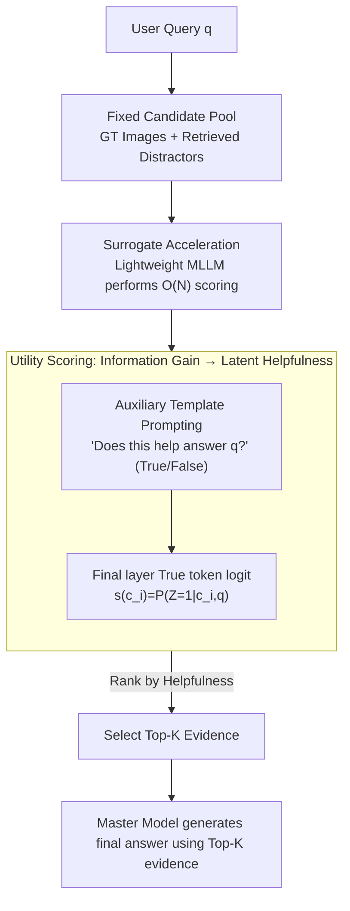

# Utility-Oriented Visual Evidence Selection for Multimodal Retrieval-Augmented Generation

**Conference**: ACL2026  
**arXiv**: [2605.13277](https://arxiv.org/abs/2605.13277)  
**Code**: https://github.com/Hcnaeg/utility-mrag  
**Area**: Information Retrieval  
**Keywords**: Multimodal RAG, Visual Evidence Selection, Information Gain, Lightweight Surrogate Models, Retrieval Reranking  

## TL;DR
This paper shifts multimodal RAG image selection from "semantic similarity ranking" to "utility estimation of helpfulness for final answers." By utilizing lightweight multimodal surrogate models to efficiently predict evidence helpfulness, it simultaneously improves response quality and inference efficiency on MRAG-Bench and Visual-RAG.

## Background & Motivation
**Background**: Multimodal RAG typically retrieves a set of candidate images and passes the Top-K images to a Multimodal Large Language Model (MLLM) to generate answers. Existing visual evidence selection methods mostly follow text RAG approaches, using CLIP, SigLIP, BGE-VL, or MLLM rerankers to estimate the semantic relevance of the query-image pair.

**Limitations of Prior Work**: Relevant images are not necessarily useful. The paper uses a dog breed identification example to show that an image may score highly because of salient attributes like "tongue sticking out" (consistent with the query), yet belong to an incorrect breed, thus failing to provide the discriminative information needed for a correct answer. Similarity retrieval emphasizes "resemblance," whereas RAG generation requires "the ability to shift the model's judgment toward the correct answer."

**Key Challenge**: Visual evidence selection faces two levels of misalignment. First, semantic relevance is inconsistent with downstream utility; relevant images might be redundant, misleading, or lack discriminative features. Second, estimating utility directly in the answer space is difficult because MLLM output distributions are implicit, open-ended answers contain linguistic noise, and the cost of repeated generation or sampling is prohibitive.

**Goal**: The authors aim to establish a more principled visual evidence selection criterion that directly measures the helpfulness of candidate images for model responses. Crucially, this criterion must not rely on the expensive master model to generate answers for every candidate, ensuring scalability to real-world candidate pools.

**Key Insight**: Drawing from information theory, the paper defines evidence utility as "to what extent the candidate evidence changes the model's uncertainty or belief regarding the answer distribution." The authors identify that directly calculating Information Gain in the answer space is infeasible and introduce a binary latent variable: whether this evidence is "helpful."

**Core Idea**: Approximate answer-space utility using the latent helpfulness probability $P(Z=1|C=c,q)$, and employ a lightweight multimodal surrogate model to perform candidate ranking, ensuring the master model only receives the final selected evidence.

## Method
The key contribution of this paper is the redefinition of "evidence selection." Traditional retrievers answer "Is this image relevant to the query?", while this work asks "Will this image make the target model more likely to answer correctly?". These two questions are not equivalent in many multimodal scenarios, particularly in fine-grained recognition, visual common sense, and open-ended QA.

The authors first present an ideal objective: if a candidate evidence $c$ is truly useful, the distribution of the output $Y$ should undergo a meaningful change after the model observes it. This change is measured by Information Gain: $IG(Y;C=c|q)=D_{KL}(P_{Y|C=c,q}||P_{Y|q})$. However, this is only suitable for theoretical analysis, as real MLLMs lack explicit output distributions, open-ended answer spaces are vast, and varying phrasing introduces noise into KL or uncertainty estimation.

To address this, the paper projects answer-space utility into a smaller latent space. The latent variable $Z$ is a Bernoulli variable indicating whether candidate evidence is helpful. The authors prove that under mild assumptions—such as "candidate evidence is at least not significantly harmful" and "answer distribution changes monotonically with helpfulness"—ranking by $IG(Z;C=c)$ preserves the optimal solution of ranking by $IG(Y;C=c)$. Furthermore, within a feasible candidate set, ranking by $IG(Z;C=c)$ is equivalent to ranking by $P(Z=1|C=c,q)$. Thus, the complex comparison of answer distributions collapses into a binary helpfulness scoring problem.

### Overall Architecture
The complete pipeline follows a retrieve-select-generate flow. First, the system constructs a fixed candidate pool using existing retrievers, containing ground-truth images and retrieved distractors. Second, a lightweight surrogate MLLM performs helpfulness judgments for each query-image pair, calculating and ranking candidate scores. Finally, the high-cost master model generates the final answer using only the Top-K evidence.

Implementation-wise, the authors construct an auxiliary prompt, such as "Does this evidence help answer the user's question?", and restrict the output space to "True / False." For a candidate image $c_i$, the input template is $I=Template(q,c_i,q_{aux})$. The helpfulness score is derived directly from the logit of the "True" token in the final layer: $s(c_i)=\ell(v^+|I)$. This design avoids long-form generation and requires no additional training.

### Key Designs

**1. From Relevance to Information Gain Utility: Shifting focus from "Similarity" to "Answer Displacement"**

Multimodal RAG failures often stem from images that "look relevant but are useless for answering"—for instance, a dog with its tongue out that resembles the query dog but belongs to the wrong breed. Similarity-based ranking in traditional text RAG fails to capture this misalignment. The paper defines high-utility evidence as that which "significantly changes the model's posterior belief regarding the answer," characterized by Information Gain $IG(Y;C=c|q)=D_{KL}(P_{Y|C=c,q}\|P_{Y|q})$. This measures whether the evidence provides discriminative information, explaining why certain low-similarity images with critical clues are prioritized for the context.

**2. Latent Helpfulness Variable: Dimensionality reduction of answer-space utility**

$IG(Y;C=c|q)$ is theoretically sound but practically difficult to compute due to the lack of explicit distributions and the high noise in open-ended answers. The paper projects this utility onto a Bernoulli latent variable $Z$, where $Z=1$ signifies helpfulness. The authors demonstrate that under mild assumptions, ranking by $IG(Z;C=c)$ is equivalent to ranking by $P(Z=1|C=c,q)$. In practice, the system uses the logit of the "True" token $s(c_i)=\ell(v^+|I)$ from an auxiliary "True/False" prompt. This eliminates the need for long-form generation or additional training.

**3. Surrogate-accelerated Execution: Transferring O(N) scoring from Master to Surrogate**

In real RAG scenarios, candidate pools can be large. Applying an 8B–12B master model for per-image scoring is computationally prohibitive. The paper proposes the "utility transferability hypothesis": if an image is clearly unhelpful or contradictory for a small model, it is likely unhelpful for a large model as well. Consequently, lightweight models (e.g., Qwen3-VL-2B, Ovis2.5-2B) handle candidate ranking, while the master model performs only one final generation on Top-K evidence. Since judging "helpfulness" is simpler than "answering the question," this allows for a principled yet deployable system.

### Loss & Training
This work is a training-free method, requiring no supervised training or gradient updates. The "training strategy" is effectively an inference-time scoring protocol: fix the candidate pool, use the auxiliary helpfulness prompt, compare True/False logits, and pass Top-K images to the master model. Experiments cover various master models including Qwen3-VL, MiniCPM-V4.5, Gemma3, Ovis2.5, and InternVL3.5, with comparisons against CLIP-style retrievers, MLLM retrievers, and uncertainty-based methods.

## Key Experimental Results

### Main Results
The main experiments evaluate Top-K evidence selection on MRAG-Bench (Exact-Match Accuracy) and Visual-RAG (LLM-as-Judge). The table below shows representative results for K=1; the proposed method outperforms strong retrieval and reranking baselines across most models.

| Method | Params | MRAG Qwen3-VL-8B | MRAG MiniCPM-V4.5 | Visual-RAG Qwen3-VL-8B | Visual-RAG Ovis2.5-9B |
|------|--------|------------------|-------------------|-------------------------|------------------------|
| Zero-shot | No image | 59.35 | 57.95 | 52.41 | 52.67 |
| GME | 2.2B | 64.38 | 65.19 | 55.88 | 67.51 |
| LamRA-Rank | 8B | 63.34 | 62.97 | 58.42 | 58.16 |
| Ours, Qwen3-VL-2B surrogate | 2.1B | 65.56 | 65.41 | 59.89 | 68.85 |
| Ours, Ovis2.5-2B surrogate | 2.6B | 64.97 | 64.08 | 61.36 | 69.12 |

In the full results, Ours yields an absolute gain of up to +16.18 on Visual-RAG. Interestingly, it often approaches GT Oracle performance and sometimes exceeds it, suggesting that human-annotated "relevant images" are not always the most "useful" evidence for a specific MLLM.

### Ablation Study
The paper emphasizes the comparison between the latent helpfulness objective and the answer-level uncertainty objective. The following table shows that the answer-level method underperforms relative to the proposed method.

| Dataset / Master Model | Top-K | Ours | Answer-level Estimation | Gain/Loss |
|-----------------|-------|------|-------------------------|------|
| MRAG-Bench / Qwen3-VL-8B | Top-1 | 65.71 | 63.27 | -2.44 |
| Visual-RAG / Ovis2.5-9B | Top-1 | 70.05 | 54.81 | -15.24 |

Efficiency results are also critical. For the Qwen3-VL family, discriminative estimation on a 2.1B surrogate has a decode latency of ~3 ms, compared to ~101 ms for answer-level UQ. On the 8.1B master model, the latencies are ~15 ms and ~443 ms respectively. The $Z$ objective is over $20 \times$ more efficient in terms of decode FLOPs.

| Model Family | Method | Surrogate Decode Latency | Master Decode Latency | Implication |
|----------|------|----------------------|----------------------|----------|
| Qwen3-VL | Discriminative Estimation | 3 ms | 15 ms | Short output; helpfulness only |
| Qwen3-VL | Answer-level UQ | 101 ms | 443 ms | High generation overhead |

### Key Findings
- Semantic relevance is an unstable RAG target. Zero-shot sometimes outperforms retrieval-augmented baselines, indicating that incorrect evidence can provide negative gain.
- Latent helpfulness is better suited for ranking than answer-level uncertainty, especially in open-ended Visual-RAG tasks where generation noise and phrasing differences interfere with uncertainty estimation.
- Lightweight surrogates show high alignment with master models. The average gap between surrogate and master model performance is minimal ($\approx 0.38$ on MRAG-Bench), with severe false positives occurring in only 2%–3.5% of cases.
- Surrogate ranking scales. Qwen2.5-VL 3B/7B as surrogates for the 72B version maintain consistent GT hit rate trends.
- The method is training-free, utilizing the existing discriminative capabilities of MLLMs for helpfulness, lowering deployment barriers.

## Highlights & Insights
- The paper accurately identifies the core problem in multimodal RAG: retrieval should find images that "change the answer," not just images that "look like" the query. This perspective explains why high retrieval scores sometimes lead to worse answers.
- Latent helpfulness is an elegant reduction that preserves the theoretical grounding of Information Gain while simplifying practical computation to a cheap True/False logit check.
- Surrogate acceleration is not just an engineering trick; it aligns with the nature of the task. Judging helpfulness is often easier than answering the question, making small models suitable for the bulk of filtering.
- The framework is highly transferable to other modalities, such as text snippets, video segments, or tool outputs.
- Surpassing GT oracle performance in some settings is profound, suggesting that model-centric utility selection can be better optimized for the generator's specific "reasoning habits" than human labels.

## Limitations & Future Work
- Theoretical assumptions are somewhat idealized. The assumption that evidence is "not harmful" and that helpfulness correlates monotonically with answer distribution might fail with adversarial or highly noisy candidates.
- Surrogate selection currently remains empirical. While 2B models perform well, different tasks may require different surrogate calibrations.
- Experimental scope is limited to QA-style MRAG. Future work could validate this on long-form generation, dialogue, or interleaved text-image retrieval.
- Helpfulness prompts may still be sensitive to phrasing. While the authors conducted robustness tests, varied user intent in production might blur the binary judgment.
- The method selects evidence but does not fix the generator itself. If the master model hallucinates or ignores evidence, the system still fails, suggesting a need for integration with citation checking or posterior verification.

## Related Work & Insights
- **vs. CLIP / SigLIP Retrieval**: These focus on shared embedding space similarity—fast but blind to generation goals. Ours evaluates if evidence actually helps.
- **vs. MLLM Reranker**: Methods like LamRA-Rank or GME use stronger models for relevance/matching. Ours specifically targets "helpfulness" utility.
- **vs. Answer-level Uncertainty**: Uncertainty methods average token probabilities or use MC sampling, which are prone to generation noise. Ours decouples evidence utility from specific answer phrasing.
- **Inspiration**: This system could be used as the second stage in a two-stage retrieval pipeline (similarity recall followed by utility reranking) or used to provide weak supervision for distilling dedicated utility-aware retrievers.

## Rating
- Novelty: ⭐⭐⭐⭐☆ The transition from IG to latent helpfulness is elegant; the problem definition is highly valuable.
- Experimental Thoroughness: ⭐⭐⭐⭐⭐ Comprehensive coverage of benchmarks, master models, retrieval baselines, and efficiency/error analysis.
- Writing Quality: ⭐⭐⭐⭐☆ Theory and motivation are clear, though the complex tables require effort to digest.
- Value: ⭐⭐⭐⭐⭐ Highly practical for production systems needing a balance between cost and quality in multimodal RAG.

<!-- RELATED:START -->

## Related Papers

- [\[ACL 2026\] UniversalRAG: Retrieval-Augmented Generation for Multimodal Corpora](universalrag_retrieval-augmented_generation_over_corpora_of_diverse_modalities_a.md)
- [\[ACL 2026\] MM-BizRAG: Rethinking Multimodal Retrieval-Augmented Generation for General Purpose Enterprise Q&A](mm-bizrag_rethinking_multimodal_retrieval-augmented_generation_for_general_purpo.md)
- [\[NeurIPS 2025\] Windsock is Dancing: Adaptive Multimodal Retrieval-Augmented Generation](../../NeurIPS2025/multimodal_vlm/windsock_is_dancing_adaptive_multimodal_retrieval-augmented_generation.md)
- [\[CVPR 2026\] RobustVisRAG: Causality-Aware Vision-Based Retrieval-Augmented Generation under Visual Degradations](../../CVPR2026/multimodal_vlm/robustvisrag_causality-aware_vision-based_retrieval-augmented_generation_under_v.md)
- [\[ICLR 2026\] RAVENEA: A Benchmark for Multimodal Retrieval-Augmented Visual Culture Understanding](../../ICLR2026/multimodal_vlm/ravenea_a_benchmark_for_multimodal_retrieval-augmented_visual_culture_understand.md)

<!-- RELATED:END -->
