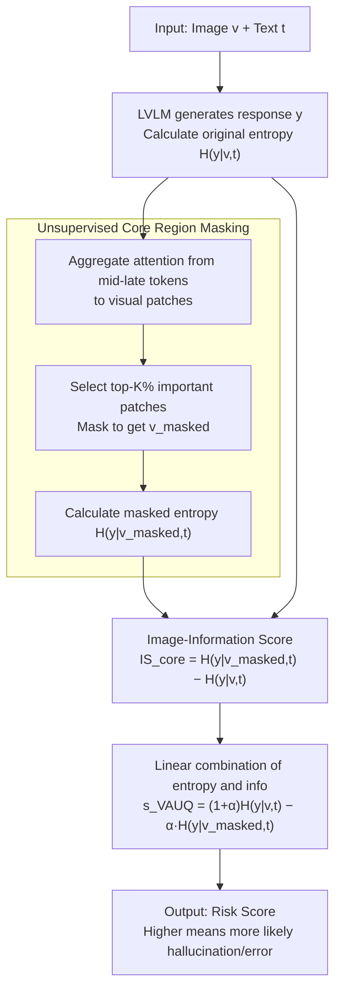

# VAUQ: Vision-Aware Uncertainty Quantification for LVLM Self-Evaluation

**Conference**: ACL2026 Findings  
**arXiv**: [2602.21054](https://arxiv.org/abs/2602.21054)  
**Code**: https://github.com/deeplearning-wisc/vauq  
**Area**: Multimodal VLM  
**Keywords**: LVLM Self-Evaluation, Uncertainty Quantification, Hallucination Detection, Visual Evidence, Attention Masking  

## TL;DR
This paper proposes VAUQ, which measures whether LVLM responses truly rely on visual evidence using image information scores and attention-driven core region masking. This enables more reliable multimodal self-evaluation and hallucination detection without requiring training or external evaluators.

## Background & Motivation
**Background**: Large Vision-Language Models (LVLMs) can perform open-ended VQA, visual reasoning, and image-text dialogues but still frequently produce hallucinations. To detect unreliable responses during deployment, one class of methods allows models to perform self-evaluation using internal signals such as perplexity, predictive entropy, semantic entropy, verbalized confidence, or hidden state variations.

**Limitations of Prior Work**: Most of these methods are derived from pure Large Language Models (LLMs). They measure the model's confidence in its textual output but do not necessarily verify if the response is supported by the image. LVLMs may be highly confident in incorrect answers due to strong language priors, such as answering based on common sense even when seeing counterfactual images. In such cases, low entropy or high verbalized confidence only indicates "linguistic fluency" rather than "visual correctness."

**Key Challenge**: Multimodal self-evaluation must handle two types of uncertainty: the uncertainty of language generation itself and the uncertainty of whether visual evidence is correctly utilized. Looking only at output distributions ignores visual grounding; looking only at visual attention fails to judge whether the final answer is correct. A reliable score needs to combine "is the prediction uncertain" with "does the image actually reduce that uncertainty."

**Goal**: The authors aim to design a training-free, label-free, response-level LVLM self-evaluation score. It should not depend on external judges, multiple samplings, or the detection of individual object hallucinations, but rather judge whether the entire response is likely to be incorrect or hallucinated.

**Key Insight**: The core observation is that if a model's response truly relies on visual evidence, the predictive uncertainty for that same response should increase after removing crucial visual regions. Conversely, if the model remains confident after masking core image regions, the response likely stems from language priors and carries higher risk.

**Core Idea**: Use the entropy drop brought by visual input as an Image-Information Score. Identify core image regions via mid-to-late layer visual attention and mask them, then combine predictive entropy with the core-masked Image-Information Score to form the VAUQ risk score.

## Method
The goal of VAUQ is to output a score $s(x,y)$ given image-text input $x=(v,t)$ and model response $y$, identifying if the response is likely hallucinated or incorrect. Unlike detectors requiring external supervision, VAUQ uses only internal probabilities and attention information from the same LVLM.

The paper notes that pure linguistic uncertainty methods fail on counterfactual data like ViLP. ViLP contains factual and counterfactual images where the same question requires different answers. Methods like Entropy, Verbalized Confidence, Semantic Entropy, and EigenScore significantly degrade on counterfactual images (e.g., Entropy drops by 40.9%, EigenScore by 26.0%), indicating they are dominated by language priors and fail to identify errors caused by image-common sense conflicts.

VAUQ does not just ask "is the model confident"; it asks "is the confidence derived from the image." It defines visual contribution as the difference in predictive entropy with and without the image: if the image makes the model more certain, it provides information; if entropy remains unchanged after image removal, the response relies on language priors.

### Overall Architecture
The process consists of four steps. First, the LVLM generates response $y$ for the original input and calculates the length-normalized predictive entropy $H(y|v,t)$. Second, it aggregates attention from generated tokens to image patches to estimate core evidence regions. Third, it masks the top-K% core visual tokens to get $v_{masked}$ and calculates $H(y|v_{masked},t)$. Fourth, it combines the original entropy and the core-masked Image-Information Score into the final score.

The basic Image-Information Score is $IS_{blank}=H(y|empty,t)-H(y|v,t)$, where $empty$ denotes removal of visual input. The core version uses $IS_{core}=H(y|v_{masked},t)-H(y|v,t)$. The final score is $s_{VAUQ}=H(y|v,t)-\alpha\cdot IS_{core}$, which can be rewritten as $(1+\alpha)H(y|v,t)-\alpha H(y|v_{masked},t)$. A higher score indicates an unreliable response; if entropy rises significantly after masking core evidence, $IS_{core}$ is large, lowering the risk score and indicating higher credibility.

### Key Designs

**1. Image-Information Score: Quantifying visual dependence via the increase in uncertainty when the image is removed**

Pure textual uncertainty cannot determine if confidence is derived from the image—LVLMs can be confident in wrong answers due to strong language priors. IS defines visual contribution as the difference in conditional entropy with and without the image. The original form is $IS_{blank}=H(y|empty,t)-H(y|v,t)$. If $H(y|empty,t)$ is significantly higher than $H(y|v,t)$, it indicates the image helped lower uncertainty and the response is supported by visual content; if the gap is small, confidence likely comes from language priors, implying higher risk.

**2. Unsupervised Core Region Masking: Targeting task-related evidence rather than blanking the whole image**

Blanking the entire image removes background and irrelevant regions along with key evidence, while random masking adds noise. Core region masking aggregates attention from generated tokens to visual tokens in mid-to-late transformer layers to score patch importance. Selecting the top-K% patches as the core region yields $v_{masked}$, resulting in $IS_{core}=H(y|v_{masked},t)-H(y|v,t)$. Mid-to-late layers are used because they capture semantic regions better than early layers. Removing only the evidence the model relies on acts as a causal intervention, better judging if a response is grounded.

**3. Linear Combination: Merging "how uncertain the prediction is" and "how much the image helped" to cover blind spots**

Entropy alone can be deceived by language priors, while visual information alone might miss generative uncertainty. VAUQ combines them into a final risk score:

$$s_{VAUQ}=H(y|v,t)-\alpha\cdot IS_{core}=(1+\alpha)H(y|v,t)-\alpha H(y|v_{masked},t)$$

High predictive entropy increases the risk score (internal uncertainty), while high core visual information lowers it (confidence from evidence). The hyperparameter $\alpha$ controls the weights. This complementary design is particularly effective for real-world distributions containing both factual and counterfactual samples.

### Loss & Training
VAUQ requires no training and is a posterior self-evaluation scoring method. Implementation uses greedy decoding with a maximum length of 128. For efficiency, the authors do not modify image pixels but apply a knockout to the attention weights of top-K tokens when calculating $IS_{core}$. $\alpha$, masking ratio $K$, and layer range $(l_s,l_e)$ are selected on a validation set. Experiments use Python 3.11.11 and PyTorch 2.6.0 on a single 80GB A100.

## Key Experimental Results

### Main Results
Experiments cover ViLP, MMVet, VisualCoT, and CVBench across LLaVA-1.5, Qwen2.5-VL, and InternVL3.5. The metric is AUROC (higher is better). Representative results for LLaVA-1.5-7B and Qwen2.5-VL-7B are shown below.

| Model | Method | ViLP | MMVet | VisualCoT | CVBench |
|------|------|------|-------|-----------|---------|
| LLaVA-1.5-7B | Perplexity | 54.6 | 79.3 | 56.2 | 60.3 |
| LLaVA-1.5-7B | Semantic Entropy | 63.7 | 81.3 | 75.1 | 70.2 |
| LLaVA-1.5-7B | VL-Uncertainty | 55.6 | 82.3 | 65.2 | 71.1 |
| LLaVA-1.5-7B | VAUQ | 77.0 | 81.5 | 77.8 | 73.2 |
| Qwen2.5-VL-7B | Perplexity | 55.0 | 76.6 | 56.0 | 64.8 |
| Qwen2.5-VL-7B | Semantic Entropy | 52.0 | 60.1 | 53.3 | 50.9 |
| Qwen2.5-VL-7B | VL-Uncertainty | 57.9 | 69.7 | 62.3 | 69.7 |
| Qwen2.5-VL-7B | VAUQ | 64.1 | 78.3 | 68.0 | 69.8 |

VAUQ outperforms Semantic Entropy by 13.4 points on ViLP and VL-Uncertainty by 21.4 points for LLaVA-1.5. It also shows a 12.6-point gain over VL-Uncertainty on VisualCoT. This demonstrates that visual grounding signals effectively supplement counterfactual and evidence localization tasks.

### Ablation Study
Efficiency experiments show VAUQ is much faster than multi-sampling or external module methods while achieving higher AUROC. Average time per sample and AUC on ViLP are shown below.

| Method | LLaVA-1.5-7B Time(s) | LLaVA AUC | Qwen2.5-VL-7B Time(s) | Qwen AUC |
|------|----------------------|-----------|------------------------|----------|
| SVAR | 0.39 | 50.6 | 1.59 | 49.6 |
| Verbalized | 0.58 | 56.3 | 1.82 | 55.3 |
| EigenScore | 5.86 | 63.2 | 8.77 | 53.0 |
| Semantic Entropy | 7.05 | 63.7 | 12.40 | 52.0 |
| VL-Uncertainty | 13.60 | 55.6 | 20.20 | 57.9 |
| VAUQ | 0.73 | 77.0 | 2.16 | 64.1 |

Masking strategy comparisons on VisualCoT show random masking degrades performance, while VAUQ's attention masking approaches the ground-truth box oracle.

| Evaluation | Baseline/Comparison | Result | Note |
|--------|----------|------|------|
| ViLP AUPRC | Semantic Entropy | 60.2 | Lower than VAUQ under class imbalance |
| ViLP AUPRC | VAUQ | 68.2 | Gain of 8.0 over Semantic Entropy |
| ImageNet-S Localization | Attention masking | 69.3 / 46.4 / 77.1 | Closer to GT object regions than embedding baselines |
| ViLP / VisualCoT Masking | Grad-CAM | 76.0 / 76.6 | Requires gradients |
| ViLP / VisualCoT Masking | Attention masking | 77.0 / 77.8 | Training-free and slightly superior |

### Key Findings
- Language priors are the primary trap for LVLM self-evaluation. Entropy or verbalized confidence underestimates risk on counterfactual images.
- Core region masking is more principled than whole-image blanking as it directly tests task-related evidence.
- VAUQ offers significant efficiency advantages, requiring only a few extra forward passes without generating multiple responses ($O(M)$ vs $O(A \cdot M)$).
- Entropy and IS are complementary; entropy performs better on factual splits, while IS is stronger in visually dependent scenarios.
- Hyperparameters are relatively stable, with $\alpha \approx 0.5-1.5$ and $K \approx 30-40$ being generally effective.

## Highlights & Insights
- VAUQ provides a precise problem definition by asking if confidence is actually derived from the image.
- The Image-Information Score is a simple yet interpretable signal that maps "visual reduction of uncertainty" to grounding.
- Core region masking simulates a causal test by intervening in the model's focus areas.
- The training-free nature makes it a lightweight reliability layer suitable for deployment without specific task annotations.
- The work emphasizes that multimodal self-evaluation cannot simply inherit LLM methods; visual grounding is a unique reliability dimension.

## Limitations & Future Work
- Dependence on global hyperparameters ($\alpha, K$) suggests a need for sample-adaptive tuning in the future.
- Evaluation is primarily on instruction-tuned image LVLMs; performance on long-chain visual reasoning or video understanding remains to be verified.
- Attention is not always synonymous with evidence; core masking might be incomplete if multiple salient objects exist.
- VAUQ is a reliability signal, not a safety guarantee; it should be part of a larger human-in-the-loop or safety mechanism.
- It requires access to internal probabilities and attention, making it difficult to use with black-box APIs without approximations.

## Related Work & Insights
- **vs Perplexity / Entropy**: VAUQ avoids the trap of language priors by inspecting the impact of image removal.
- **vs Semantic Entropy / EigenScore**: VAUQ is more cost-effective and specifically targets visual contribution.
- **vs SVAR / Contextual Lens**: VAUQ uses attention for intervention rather than just for object-level similarity mapping.
- **vs VL-Uncertainty**: VAUQ is a white-box, training-free, low-cost alternative to multi-response consistency methods.
- **Insights**: VAUQ scores can be used for selective prediction, triggering retrieval, or human review for high-risk responses.

## Rating
- Novelty: ⭐⭐⭐⭐☆ Combines entropy with visual info gain; simple and targets specific LVLM pain points.
- Experimental Thoroughness: ⭐⭐⭐⭐⭐ Covers multiple models, datasets, efficiency, and localization quality.
- Writing Quality: ⭐⭐⭐⭐☆ Clear motivation and intuitive formulas.
- Value: ⭐⭐⭐⭐⭐ Training-free, interpretable, and efficient for real-world reliability checks.

<!-- RELATED:START -->

## Related Papers

- [\[ICLR 2026\] Detecting Misbehaviors of Large Vision-Language Models by Evidential Uncertainty Quantification](../../ICLR2026/multimodal_vlm/detecting_misbehaviors_of_large_vision-language_models_by_evidential_uncertainty.md)
- [\[CVPR 2026\] Uncertainty-Aware Knowledge Distillation for Multimodal Large Language Models](../../CVPR2026/multimodal_vlm/uncertainty-aware_knowledge_distillation_for_multimodal_large_language_models.md)
- [\[ICML 2026\] TUR-DPO: Topology- and Uncertainty-Aware Direct Preference Optimization](../../ICML2026/multimodal_vlm/tur-dpo_topology-_and_uncertainty-aware_direct_preference_optimization.md)
- [\[ACL 2026\] Almieyar-Oryx-BloomBench: A Bilingual Multimodal Benchmark for Cognitively Informed Evaluation of Vision-Language Models](almieyar-oryx-bloombench_a_bilingual_multimodal_benchmark_for_cognitively_inform.md)
- [\[CVPR 2025\] Taxonomy-Aware Evaluation of Vision-Language Models](../../CVPR2025/multimodal_vlm/taxonomy-aware_evaluation_of_vision-language_models.md)

<!-- RELATED:END -->
