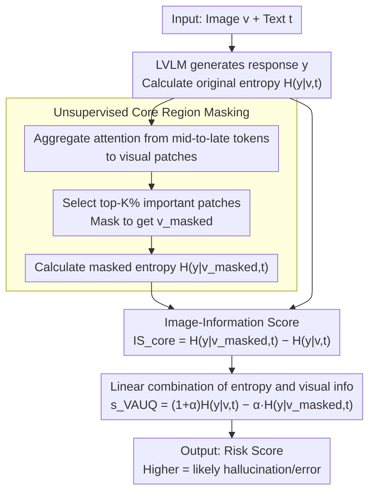

# VAUQ: Vision-Aware Uncertainty Quantification for LVLM Self-Evaluation

**Conference**: ACL2026 Findings  
**arXiv**: [2602.21054](https://arxiv.org/abs/2602.21054)  
**Code**: https://github.com/deeplearning-wisc/vauq  
**Area**: Multimodal VLM  
**Keywords**: LVLM Self-Evaluation, Uncertainty Quantification, Hallucination Detection, Visual Evidence, Attention Masking  

## TL;DR
This paper proposes VAUQ, which utilizes image information scores and attention-driven core region masking to measure whether LVLM responses truly rely on visual evidence. This enables more reliable multimodal self-evaluation and hallucination detection without requiring training or external evaluators.

## Background & Motivation
**Background**: Large Vision-Language Models (LVLMs) can perform open-ended VQA, visual reasoning, and image-text dialogues, but they still frequently generate hallucinations. To identify unreliable responses during deployment, one class of methods allows models to perform self-evaluation using internal signals such as perplexity, predictive entropy, semantic entropy, verbalized confidence, or hidden state variations.

**Limitations of Prior Work**: Most of these methods are derived from pure Large Language Models (LLMs). They measure whether the model is confident in its textual output but do not necessarily measure whether the response is supported by the image. LVLMs may be highly confident in incorrect answers due to strong language priors—for example, providing a common-sense answer even when seeing an anomalous image. In such cases, low entropy or high verbalized confidence only indicates "linguistic fluency" rather than "visual correctness."

**Key Challenge**: Multimodal self-evaluation must simultaneously handle two types of uncertainty: the uncertainty of language generation itself and the uncertainty of whether visual evidence is correctly utilized. Looking only at the output distribution ignores visual grounding; looking only at visual attention fails to judge whether the final answer is correct. A reliable score needs to combine "whether the prediction is uncertain" with "whether the image actually reduces that uncertainty."

**Goal**: The authors aim to design a training-free, label-free, response-level self-evaluation score for LVLMs. It should not rely on external judges, does not require multiple samplings, and does not just detect single-object hallucinations, but rather judges whether the entire response is likely to be incorrect or hallucinated.

**Key Insight**: The core observation of the paper is that if a model's response truly depends on visual evidence, the predictive uncertainty for the same response should increase when key visual regions are removed. Conversely, if the model remains confident after the core regions of the image are masked, the response likely stems from language priors and carries a higher risk.

**Core Idea**: Utilize the entropy reduction brought by visual input as an Image-Information Score. Then, identify core image regions through middle-to-late layer visual attention and mask them. Finally, combine the predictive entropy with the core-masked Image-Information Score to form the VAUQ risk score.

## Method
The goal of VAUQ is to output a score $s(x,y)$ given image-text input $x=(v,t)$ and model response $y$, used to judge if the response is likely hallucinated or incorrect. Unlike detectors requiring external supervision, VAUQ utilizes internal probabilities and attention information from the same LVLM.

The paper first notes that pure language uncertainty methods fail on counterfactual data such as ViLP. ViLP contains factual and counterfactual images where the same question requires different answers depending on the image. Methods like Entropy, Verbalized Confidence, Semantic Entropy, and EigenScore degrade significantly on counterfactual images (e.g., Entropy drops by 40.9%, EigenScore by 26.0%), indicating they are dominated by language priors and cannot identify errors caused by "conflicts between images and common sense."

VAUQ therefore does not just ask "is the model confident in the response," but "does the model's confidence come from the image." It defines visual contribution as the difference in predictive entropy with and without the image: if the image makes the model more certain, it indicates the image provided information; if entropy remains nearly unchanged after image removal, the response relies mainly on language priors.

### Overall Architecture
The workflow consists of four steps. First, the LVLM generates response $y$ given the original image-text input and calculates the length-normalized predictive entropy $H(y|v,t)$ of the response tokens. Second, it aggregates the attention of generated tokens toward image patches to estimate which visual tokens serve as core evidence. Third, it masks the top-K% core visual tokens to obtain $v_{masked}$ and calculates $H(y|v_{masked},t)$. Fourth, it combines the original predictive entropy and the core-masked Image-Information Score into the final self-evaluation score.

The original Image-Information Score can be written as $IS_{blank}=H(y|empty,t)-H(y|v,t)$, where $empty$ denotes the removal of visual input. The core-region version uses $IS_{core}=H(y|v_{masked},t)-H(y|v,t)$. The final score is $s_{VAUQ}=H(y|v,t)-\alpha\cdot IS_{core}$, which can also be understood as $(1+\alpha)H(y|v,t)-\alpha H(y|v_{masked},t)$. A higher score indicates the response is more likely to be unreliable; if entropy increases significantly after masking core visual evidence, $IS_{core}$ is large, lowering the score and indicating the response is more trustworthy.

### Key Designs

**1. Image-Information Score: Quantifying visual dependency by "how much predictive uncertainty rises when removing the image"**

Pure text uncertainty only indicates confidence but cannot answer "whether this confidence comes from the image"—LVLMs might be confident in wrong answers due to strong language priors. IS defines visual contribution as the difference in conditional entropy of the same response with and without the image. The original form is $IS_{blank}=H(y|empty,t)-H(y|v,t)$. If $H(y|empty,t)$ is significantly higher than $H(y|v,t)$, it indicates the image helped lower uncertainty and the response is supported by observed content. If the gap is small, confidence likely stems from language priors, indicating higher risk. This step converts the intuitive notion of "visual evidence utilization" into a directly computable metric.

**2. Unsupervised Core Region Masking: Instead of removing the entire image, only the patches the model relies on most are knocked out to ensure IS measures task-relevant evidence**

Blanking the entire image removes background, irrelevant regions, and key evidence indiscriminately, while random masking introduces unnecessary noise; both cases pollute the IS. Core region masking aggregates the attention of generated tokens to visual tokens from the middle-to-late transformer layers to obtain importance scores for each image patch. The top-K% are selected as the core region to obtain $v_{masked}$, resulting in the core version score $IS_{core}=H(y|v_{masked},t)-H(y|v,t)$. Middle-to-late layers are chosen because the authors found that early layers struggle to locate evidence, while middle-to-late layers capture semantic regions. Removing only the "evidence the model actually relies on" is closer to a causal intervention, making it better at judging if a response is grounded than raw image attention—its localization quality in experiments also approaches a ground-truth box oracle.

**3. Linear Combination: Merging "predictive uncertainty" and "visual contribution" into one score to cover each other's blind spots**

Looking only at entropy can be deceived by language priors, while looking only at visual information can miss the model's inherent generation uncertainty. VAUQ linearly combines them into the final risk score:

$$s_{VAUQ}=H(y|v,t)-\alpha\cdot IS_{core}=(1+\alpha)H(y|v,t)-\alpha H(y|v_{masked},t)$$

High predictive entropy increases the risk score (the model is uncertain), while a high core visual information score lowers the risk score (confidence is derived from visual evidence). The hyperparameter $\alpha$ controls the weight. This complementary design is especially suited for real-world distributions where factual and counterfactual samples are mixed—entropy works well on factual splits, while IS is strong when visual evidence is required; combined, they provide stability.

### Loss & Training
VAUQ involves no training loss; it is a posterior self-evaluation scoring method. Implementation uses greedy decoding with a maximum generation length of 128. For efficiency, the authors do not actually modify image pixels but apply a knockout to the attention weights of the top-K visual tokens during $IS_{core}$ calculation. $\alpha$, the masking ratio $K$, and the layer range $(l_s,l_e)$ are selected on a validation set. Experiments use Python 3.11.11 and PyTorch 2.6.0, running on a single 80GB A100, reporting average results over 3 random seeds.

## Key Experimental Results

### Main Results
Experiments cover four datasets—ViLP, MMVet, VisualCoT, and CVBench—using LLaVA-1.5, Qwen2.5-VL, and InternVL3.5. The metric is AUROC, where higher values indicate better discrimination between correct and hallucinated responses. The table below selects representative results for LLaVA-1.5-7B and Qwen2.5-VL-7B.

| Model | Method | ViLP | MMVet | VisualCoT | CVBench |
|------|------|------|-------|-----------|---------|
| LLaVA-1.5-7B | Perplexity | 54.6 | 79.3 | 56.2 | 60.3 |
| LLaVA-1.5-7B | Semantic Entropy | 63.7 | 81.3 | 75.1 | 70.2 |
| LLaVA-1.5-7B | VL-Uncertainty | 55.6 | 82.3 | 65.2 | 71.1 |
| LLaVA-1.5-7B | VAUQ | 77.0 | 81.5 | 77.8 | 73.2 |
| Qwen2.5-VL-7B | Perplexity | 55.0 | 76.6 | 56.0 | 64.8 |
| Qwen2.5-VL-7B | Semantic Entropy | 52.0 | 60.1 | 53.3 | 50.9 |
| Qwen2.5-VL-7B | VL-Uncertainty | 57.9 | 69.7 | 62.3 | 69.7 |
| Qwen2.5-VL-7B | VAUQ | 64.1 | 78.3 | 68.0 | 69.8 |

VAUQ outperforms Semantic Entropy by 13.4 percentage points on the ViLP dataset with LLaVA-1.5-7B, and outperforms VL-Uncertainty by 21.4 percentage points on the same model. It also exceeds VL-Uncertainty by 12.6 percentage points on VisualCoT. This indicates that visual grounding signals especially complement counterfactual and evidence localization tasks.

### Ablation Study
Efficiency experiments show that VAUQ is significantly faster than multi-sampling and external module methods while achieving higher AUROC. The table below shows the average per-sample time and AUC on ViLP.

| Method | LLaVA-1.5-7B Time(s) | LLaVA AUC | Qwen2.5-VL-7B Time(s) | Qwen AUC |
|------|----------------------|-----------|------------------------|----------|
| SVAR | 0.39 | 50.6 | 1.59 | 49.6 |
| Verbalized | 0.58 | 56.3 | 1.82 | 55.3 |
| EigenScore | 5.86 | 63.2 | 8.77 | 53.0 |
| Semantic Entropy | 7.05 | 63.7 | 12.40 | 52.0 |
| VL-Uncertainty | 13.60 | 55.6 | 20.20 | 57.9 |
| VAUQ | 0.73 | 77.0 | 2.16 | 64.1 |

The authors also compared masking strategies on VisualCoT. Random masking decreases performance, while the ground-truth box oracle is the strongest. VAUQ’s attention-based core region masking approaches the oracle, suggesting that middle-to-late layer attention can approximate key evidence localization without annotations. The appendix also reports HallusionBench, where VAUQ achieves 67.0 AUROC on LLaVA-1.5-7B (surpassing VL-Uncertainty’s 65.1) and 74.3 on Qwen2.5-VL-7B (slightly higher than Semantic Entropy’s 74.0).

| Evaluation Item | Baseline Method | Result | Description |
|--------|----------|------|------|
| ViLP AUPRC | Semantic Entropy | 60.2 | Semantic entropy remains weaker than VAUQ under class imbalance |
| ViLP AUPRC | VAUQ | 68.2 | 8.0 higher than Semantic Entropy |
| ImageNet-S Localization | Embedding baseline | 50.4 / 36.1 / 53.9 | Weak overlap with true object regions |
| ImageNet-S Localization | Attention masking | 69.3 / 46.4 / 77.1 | Core attention regions are closer to true object regions |
| ViLP / VisualCoT Masking | Grad-CAM | 76.0 / 76.6 | Usable but requires gradient-based saliency maps |
| ViLP / VisualCoT Masking | Attention masking | 77.0 / 77.8 | Training-free and slightly superior |

### Key Findings
- Language priors are the main trap for LVLM self-evaluation. Traditional entropy or verbalized confidence underestimates risk on counterfactual images because the model’s textual prior makes incorrect answers appear fluent.
- Core region masking is more logical than blanking the whole image. Whole-image removal strips away background and irrelevant regions along with key evidence; attention masking more directly tests if the response depends on task-relevant regions.
- VAUQ has a clear efficiency advantage. It only requires a constant number of additional forward passes and does not need to generate multiple responses, maintaining $O(M)$ complexity compared to $O(A \cdot M)$ for multi-sampling methods.
- Entropy and IS are complementary signals. Entropy performs better on factual splits but degrades on counterfactual splits; IS is stronger when visual evidence is required. Combining them improves stability.
- Hyperparameters have stable ranges. The authors found that $\alpha$ is usually effective near 0.5 to 1.5; moderate masking ratios $K$ are more stable, such as $K \approx 30$ for CVBench and $K \approx 40$ for MMVet.

## Highlights & Insights
- VAUQ's problem definition is precise. It does not simply create another external hallucination detector but asks if the LVLM's own confidence actually originates from the image.
- The Image-Information Score is a simple yet interpretably powerful signal. It transforms "whether visual input reduces predictive uncertainty" into a computable quantity directly corresponding to grounding.
- Core region masking makes the score resemble a causal test. Masking the regions the model attends to most and observing the impact on response probability is closer to intervention than simply reading attention weights.
- The method remains training-free, making it highly suitable as a lightweight reliability layer during deployment. It does not require annotated hallucination data for each task or specialized probes.
- This paper serves as a reminder that multimodal self-evaluation cannot be directly inherited from LLM self-evaluation. Whether visual evidence is utilized is a reliability dimension unique to LVLMs.

## Limitations & Future Work
- Dependency on global hyperparameters. The authors admit that optimal values for $\alpha$, masking ratio $K$, and layer range may vary across datasets, models, or even samples, requiring sample-adaptive tuning in the future.
- Evaluation currently focuses on instruction-tuned image LVLMs. Performance on long-chain visual reasoning, video understanding, and agentic multimodal systems has not been verified, particularly where visual contributions may span multiple stages.
- Attention does not always equal evidence. Case studies in the appendix show that when multiple salient objects exist in an image, attention might miss some relevant info, leading to incomplete core region masking.
- The score is not a safety guarantee. The ethical statement emphasizes that VAUQ should only serve as a supplementary reliability signal and cannot replace human review or comprehensive safety mechanisms.
- Requires access to internal model probabilities and attention. For closed-source LVLMs or systems providing only text APIs, VAUQ cannot be used directly, necessitating research into black-box approximation versions.

## Related Work & Insights
- **vs Perplexity / Entropy**: These only look at language output probabilities and are easily misled by language priors; VAUQ additionally investigates the impact of image removal or core masking on predictive entropy.
- **vs Semantic Entropy / EigenScore**: Multi-sampling and hidden-state methods capture response diversity but are costly and do not necessarily identify if visual evidence is utilized; VAUQ uses fewer forward passes to directly measure visual contribution.
- **vs SVAR / Contextual Lens**: Visual attention or representation similarity can detect object-level grounding but is less direct for response-level hallucinations; VAUQ uses attention for intervention combined with output entropy.
- **vs VL-Uncertainty**: VL-Uncertainty estimates uncertainty through multi-response consistency after visual and textual perturbations, which is good for black boxes but expensive; VAUQ is a white-box, training-free, low-sampling alternative.
- **Insights**: The VAUQ score can be used for selective prediction: high-risk responses can trigger re-retrieval, re-observation, rejection, or human review. It can also be combined with generation-time methods like VCD or contrastive decoding to detect and then correct hallucinations.

## Rating
- Novelty: ⭐⭐⭐⭐☆ Combines predictive entropy with visual information gain; simple approach targeting LVLM self-evaluation pain points.
- Experimental Thoroughness: ⭐⭐⭐⭐⭐ Covers multiple models, datasets, main results, masking strategies, efficiency, AUPRC, HallusionBench, and localization quality.
- Writing Quality: ⭐⭐⭐⭐☆ Clear motivation, intuitive formulas; HTML table conversions slightly affect readability but logic is complete.
- Value: ⭐⭐⭐⭐⭐ Training-free, interpretable, and efficient; highly suitable as a reliability check signal for multimodal deployments.

<!-- RELATED:START -->

## Related Papers

- [\[ICLR 2026\] Detecting Misbehaviors of Large Vision-Language Models by Evidential Uncertainty Quantification](../../ICLR2026/multimodal_vlm/detecting_misbehaviors_of_large_vision-language_models_by_evidential_uncertainty.md)
- [\[CVPR 2026\] Let VLMs Grade Their Own Thoughts: A Self-Quantification Approach to Reasoning-Aware Reward Modeling](../../CVPR2026/multimodal_vlm/let_vlms_grade_their_own_thoughts_a_self-quantification_approach_to_reasoning-aw.md)
- [\[ACL 2026\] iReasoner: Trajectory-Aware Intrinsic Reasoning Supervision for Self-Evolving Large Multimodal Models](ireasoner_trajectory-aware_intrinsic_reasoning_supervision_for_self-evolving_lar.md)
- [\[CVPR 2026\] Uncertainty-Aware Knowledge Distillation for Multimodal Large Language Models](../../CVPR2026/multimodal_vlm/uncertainty-aware_knowledge_distillation_for_multimodal_large_language_models.md)
- [\[ICML 2026\] TUR-DPO: Topology- and Uncertainty-Aware Direct Preference Optimization](../../ICML2026/multimodal_vlm/tur-dpo_topology-_and_uncertainty-aware_direct_preference_optimization.md)

<!-- RELATED:END -->
