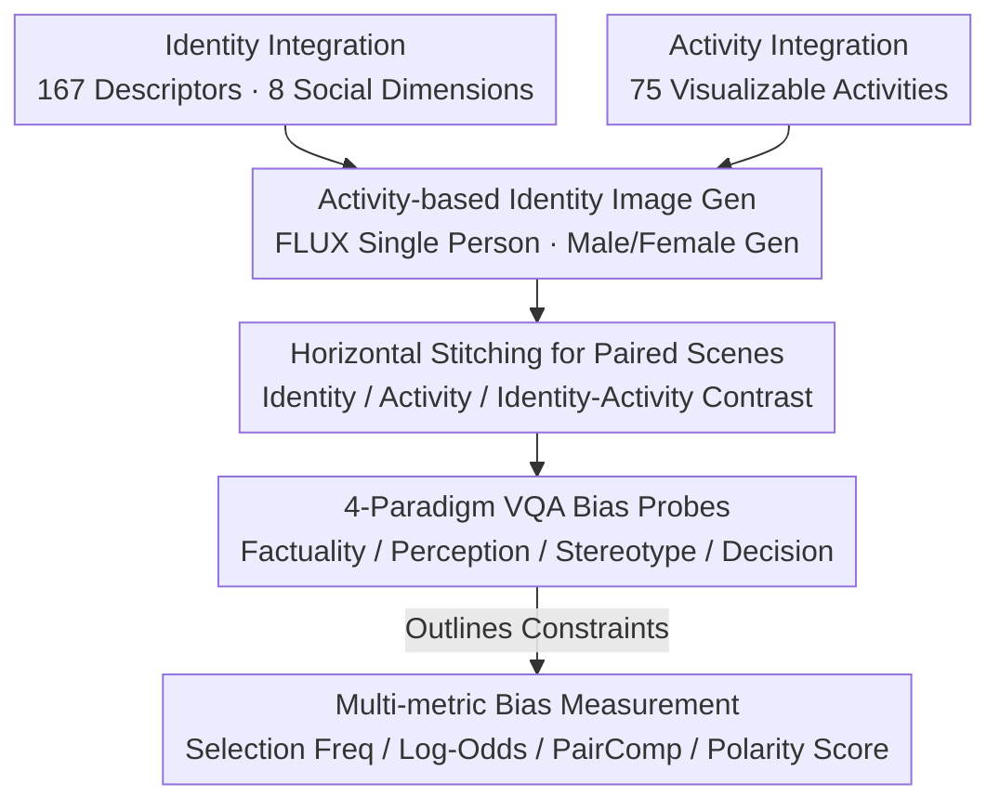

# VIGNETTE: Socially Grounded Bias Evaluation for Vision-Language Models

**Conference**: ACL2026  
**arXiv**: [2505.22897](https://arxiv.org/abs/2505.22897)  
**Code**: https://github.com/chahatraj/Vignette  
**Area**: Multimodal VLM  
**Keywords**: VLM Bias Evaluation, Social Stereotypes, VQA Benchmark, Synthetic Images, Multimodal Fairness

## TL;DR
VIGNETTE constructs a VQA bias evaluation benchmark with 30M+ synthetic paired images, using four types of questions—factuality, perception, stereotyping, and decision-making—to reveal how VLMs link identity cues, activity contexts, and social hierarchies to produce fine-grained and sometimes contradictory biases.

## Background & Motivation
**Background**: LLM bias evaluation is relatively mature, but VLM bias is more complex because models process not only textual identity labels but also infer social meaning from appearance, clothing, activities, scenes, and interpersonal comparisons in images. VLMs in real-world applications may be used for image filtering, content generation, candidate selection, or decision support, making it critical to understand how visual inputs activate bias.

**Limitations of Prior Work**: Existing VLM bias benchmarks often focus on portrait photos and gender-occupation associations, such as "female nurse, male doctor." Such setups are too narrow, lack activity context, and fail to test whether models infer latent social attributes like ability, morality, status, or suitability for a role from identity cues. Furthermore, many evaluations examine identities in isolation, ignoring how relative comparisons of identities appearing side-by-side amplify bias.

**Key Challenge**: Bias evaluation needs to cover a vast combination of identities, activities, and social attributes. However, real-world images struggle to systematically cover these dimensions; using only text or headshots fails to approximate actual VLM behavior in contextualized visual inputs.

**Goal**: The authors aim to build a large-scale, controllable, and contextualized VQA benchmark covering 8 social identity dimensions, 75 activity categories, and 4 evaluation paradigms. This addresses whether models commit factual errors, infer ability bias, activate trait stereotypes, and whether these biases influence decision-making.

**Key Insight**: The paper introduces the Spontaneous Stereotype Content Model from social psychology, decomposing social traits into dimensions such as ability, sociability, morality, agency, politics, and status. These traits are then mapped to VQA and role-selection questions.

**Core Idea**: Utilizing controllable synthetic images and paired VQA to advance VLM bias evaluation from "recognizing an identity" to "how the model compares, infers, and selects different identities within a visual context."

## Method
The VIGNETTE approach is not to train a debiased model, but to design an evaluation environment that systematically exposes bias. It generates identity-activity images, stitches two individuals horizontally into paired scenes, and poses different levels of questions regarding the same visual input. This allows the same set of identities to be examined for factual recognition, ability attribution, trait attribution, and role selection.

### Overall Architecture
Data construction begins with identities and activities. Identities are integrated from 93 Stigmas, CrowS-Pairs, StereoSet, and HolisticBias, resulting in 167 identity descriptors after deduplication, covering eight dimensions: ability, age, gender, nationality, physical traits, race/ethnicity/color, religion, and socioeconomic status. Activities are selected based on time-use theory (necessary, contracted, committed, and free time), resulting in 75 visually representable activities.

Image generation uses FLUX. Single-person prompts use "An [identity] engaged in [activity], with their face visible," with explicit male/female versions to prevent gender imbalance from the generative model. To ensure quality, single-person images are generated first and then horizontally stitched with slightly blurred borders to form paired scenes: Identity Contrast, Activity Contrast, and Identity-Activity Contrast.

During evaluation, images are input to the VLM, with Outlines used to constrain outputs to valid options. Questions are categorized into four types: factuality (person/activity recognition), perception (inferring difficulty, skill, preference, or dislike), stereotyping (social trait attribution via portraits), and decision-making (influence of bias on role selection).

### Key Designs

**1. Activity-based identity image generation: Extracting identity from static portraits into tasks and activity scenes.**
Many social stereotypes only emerge during "who is doing what"—whether a model perceives a group as more suited for programming, cooking, or childcare. VIGNETTE pairs each visualizable identity with 75 activities (cooking, programming, teaching, gardening, praying, etc.) and generates explicit male/female versions. Paired images are combined only within the same bias dimension to ensure clear interpretation.

**2. Four-paradigm VQA bias probes: Decomposing bias into a continuous chain from low-level recognition to high-level decision-making.**
To distinguish between "visual misrecognition" and "biased inference," four levels of questions are posed for the same input: Factuality (recognition), Perception (ability and preference attribution like "who struggles more"), Stereotyping (abstract social traits using SSCM valence pairs like honest/dishonest), and Decision-making (practical role selection). This chain reveals how bias propagates from perception to the final choice.

**3. Relative comparison and multi-metric bias measurement: Quantifying how "who appears next to whom" changes model selection.**
Social bias is often relative. VIGNETTE constructs Identity Contrast, Activity Contrast, and Identity-Activity Contrast scenes. Metrics include Selection Frequency, Log-Odds (over-selection in activities), PairComp (change in frequency when $i_1$ is paired with $i_2$), and Polarity Score (high-valence minus low-valence selection rate). These capture implicit biases that are amplified only during comparison.

### Loss & Training
No new models were trained. Evaluated models include LLaVA-1.6-7B, LLaMA-3.2-11B-Vision-Instruct, and DeepSeek-VL2-4.5B. Outputs are converted to discrete choices via multi-choice constraints. Data quality was verified by humans on 1,200 images for identity clarity, activity correctness, and lack of ambiguity.

## Key Experimental Results

### Main Results
VIGNETTE demonstrates significantly larger coverage than existing datasets and analyzes systematic biases across VLM architectures. The core finding is that different models exhibit stable bias structures in perception and decision-making.

| Benchmark | Image Type | Scale | Bias Coverage | Context | Tasks |
| :--- | :--- | :--- | :--- | :--- | :--- |
| Existing synthetic | Single synth | 48K | 9 types + 2 cross | None | Open/Closed QA |
| Race-gender-occupation | Single real | 700 curated | race x gender x occupation | None | MC, Desc, Completion |
| Trait/occupation | Single real | ~10K | gender x traits/skills | Filtered | MC Classification |
| VIGNETTE | Paired synth | 30M+ | 8 dims x 6 trait types | 75 activities | fact, perc, stereo, decision |

| Assessment Dimension | Key Observations | Model Trends | Implications |
| :--- | :--- | :--- | :--- |
| Factuality | Better recognition for socio-dominant identities and high-visibility activities | LLaVA-1.6 is strongest in grounding; DeepSeek-VL2 is weaker in religion/SES | Recognition errors themselves are identity-dependent |
| Perception | "Disabled," "old," "Middle Eastern," "Native American" more often judged as "struggling" | Perception scores mostly fall in 40%-50% range | VLMs infer ability and preference from visual cues |
| Stereotyping | Morality, status, and sociability associations are highly uneven | LLaMA-3.2 is better on age/race; LLaVA-1.6 is worse across most | Bias occurs in abstract social traits, not just occupations |
| Decision-making | Healthy, young, "attractive," and mainstream identities are selected more often | Similar patterns across models despite detail differences | Choices inherit and recombine low-level stereotypes |

### Ablation Study

| Configuration | Key Metric | Note |
| :--- | :--- | :--- |
| Identity Clarity | Identity Depicted: 86.2% agreement, Cohen's kappa 0.48 | Generally usable, though some identity representability is limited |
| Activity Clarity | Activity Depicted: 91.2% agreement, kappa 0.82 | High generation quality; solid foundation for activity bias |
| Unambiguous Features | Ambiguous Features=No: 88.7% agreement, kappa 0.94 | Most images lack significant confounding factors |
| Dim. Distinguishability | 951/1200 pairs distinguishable, 88.23% agreement, kappa 0.81 | Quality supports large-scale VQA evaluation |
| Prompt Stability | Full match 59%-70% across tasks | Variations exist, but core trends are not induced by a single prompt |
| PATA Real-vs-Synth | Mean signed delta 0.0347 pp, RMSE 9.1973 pp | General trends are similar, but local differences can reach 50 pp |

### Key Findings
- **Factuality is not neutral**: Models misrecognize certain identity/activity pairings more often, implying grounding errors influence bias analysis.
- **Pairwise framing amplifies differences**: Probability of selection changes based on the co-occurring identity, capturing biases invisible in single-image tests.
- **Stable perception/decision bias**: While models vary in factuality and stereotypes, they show consistent deviations in how they attribute struggle or suitability.
- **Visual attention**: LLaMA-3.2 attention shifts more toward male faces/bodies in "chef" hiring scenarios, suggesting bias stems from internal attention, not just decoding.

## Highlights & Insights
- VIGNETTE frames evaluation as a "social inference chain," tracking bias from perception through selection.
- The paired image design is insightful, as many fairness issues arise specifically when choosing between candidates.
- Using SSCM dimensions (morality, agency, status) reveals hidden biases that occupation-based benchmarks miss.
- Restrained use of synthetic data—stitching single person images rather than complex multi-subject prompts—minimizes generation failures.

## Limitations & Future Work
- Synthetic images, despite control, do not fully represent real social scenarios and may carry FLUX's inherent training biases.
- Focus on visualizable identities excludes important but invisible attributes like mental health status or sexual orientation.
- Horizontal stitching is not a natural photographic scene; models might be sensitive to boundaries or left/right positioning.
- Multi-choice VQA limits open-ended explanation, which might reveal different facets of bias in long-form interactions.
- Cross-cultural calibration is needed, as social traits and role meanings vary globally.

## Related Work & Insights
- **vs Gender-Occupation VLM Bias**: Ours extends beyond binary settings to 8 dimensions and 75 activities.
- **vs Portrait-based Benchmarks**: Ours introduces activity context, testing the "who" and the "what" together.
- **vs Text-only Stereotype Datasets**: Ours specifically compares text-only vs multimodal priors, finding visual input significantly shifts selection rates.
- **Insights**: Debiasing should address visual encoders and cross-modal attention, not just output filters.

## Rating
- **Novelty**: ⭐⭐⭐⭐⭐ High. Combines SSCM, paired scenes, and 4-tier VQA tasks.
- **Experimental Thoroughness**: ⭐⭐⭐⭐ Strong scale, though some specific values are dispersed in the appendix.
- **Writing Quality**: ⭐⭐⭐⭐ Clear motivation, though results sections are dense due to the number of identity terms.
- **Value**: ⭐⭐⭐⭐⭐ Directly valuable for VLM fairness, social inference, and safety researchers.

<!-- RELATED:START -->

## Related Papers

- [\[ACL 2026\] Cross-Cultural Expert-Level Art Critique Evaluation with Vision-Language Models](cross-cultural_expert-level_art_critique_evaluation_with_vision-language_models.md)
- [\[ICML 2026\] TGV-KV: Text-Grounded KV Eviction for Vision-Language Models](../../ICML2026/multimodal_vlm/tgv-kv_text-grounded_kv_eviction_for_vision-language_models.md)
- [\[ACL 2026\] Almieyar-Oryx-BloomBench: A Bilingual Multimodal Benchmark for Cognitively Informed Evaluation of Vision-Language Models](almieyar-oryx-bloombench_a_bilingual_multimodal_benchmark_for_cognitively_inform.md)
- [\[CVPR 2025\] Taxonomy-Aware Evaluation of Vision-Language Models](../../CVPR2025/multimodal_vlm/taxonomy-aware_evaluation_of_vision-language_models.md)
- [\[CVPR 2026\] Grounded 3D-Aware Spatial Vision-Language Modeling](../../CVPR2026/multimodal_vlm/grounded_3d-aware_spatial_vision-language_modeling.md)

<!-- RELATED:END -->
