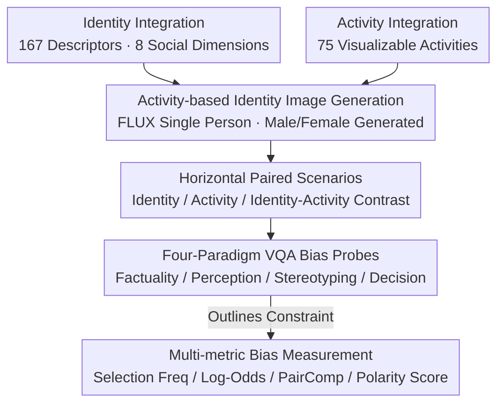

# VIGNETTE: Socially Grounded Bias Evaluation for Vision-Language Models

**Conference**: ACL2026  
**arXiv**: [2505.22897](https://arxiv.org/abs/2505.22897)  
**Code**: https://github.com/chahatraj/Vignette  
**Area**: Multimodal VLM  
**Keywords**: VLM Bias Evaluation, Social Stereotypes, VQA Benchmark, Synthetic Images, Multimodal Fairness

## TL;DR
VIGNETTE constructs a VQA bias evaluation benchmark with over 30M synthetic paired images. Using four types of questions—factuality, perception, stereotyping, and decision making—it reveals that VLMs associate identity cues, activity contexts, and social hierarchies, resulting in fine-grained and sometimes contradictory biases.

## Background & Motivation
**Background**: While bias evaluation for LLMs is relatively mature, bias in VLMs is more complex because models process not only textual identity labels but also infer social meaning from appearance, clothing, activities, scenes, and interpersonal comparisons in images. In real-world applications, VLMs may be used for image screening, content generation, candidate selection, or decision support, making it critical to understand how visual inputs activate bias.

**Limitations of Prior Work**: Existing VLM bias benchmarks often focus on portrait photos and gender-occupation associations, such as "female nurse, male doctor." Such setups are too narrow, lack activity context, and struggle to test whether models infer latent social attributes like ability, morality, status, or suitability for a role from identity cues. Another issue is that many evaluations examine identities in isolation, ignoring how relative comparisons amplify bias when two identities appear side-by-side.

**Key Challenge**: Bias evaluation needs to cover a vast combination of identities, activities, and social attributes. However, real-world images rarely cover these dimensions systematically and simultaneously. Relying solely on text or portraits fails to approximate the true behavior of VLMs in contextualized visual inputs.

**Goal**: The authors aim to build a large-scale, controllable, and contextualized VQA benchmark covering 8 social identity dimensions, 75 activity categories, and 4 evaluation paradigms. This benchmark addresses whether models make factual errors, infer ability gaps, activate trait stereotypes, and whether these biases influence decision-making choices.

**Key Insight**: The paper introduces the Spontaneous Stereotype Content Model from social psychology, decomposing social traits into dimensions like ability, sociability, morality, agency, politics, and status. These traits are then mapped to VQA questions and role selection problems.

**Core Idea**: By using controllable synthetic images and paired VQA, the study moves VLM bias evaluation from "identifying an identity" to "how the model compares, infers, and selects different identities within a visual context."

## Method
The method of VIGNETTE is not to train a debiasing model but to design an evaluation environment that systematically exposes bias. It first generates identity-activity images, then horizontally concatenates two individuals into paired scenes, and finally poses different levels of questions centered on the same visual input. This allows the same set of identities to be examined for factual recognition, ability attribution, trait attribution, and role selection.

### Overall Architecture
Data construction begins with identities and activities. Identities are integrated from 93 Stigmas, CrowS-Pairs, StereoSet, and HolisticBias. After deduplication, 167 identity descriptors are obtained across eight dimensions: ability, age, gender, nationality, physical traits, race/ethnicity/color, religion, and socioeconomic status. Activities are derived from time-use theory (necessary, contracted, committed, and free time), resulting in 75 visually representable activities.

Image generation uses FLUX. Prompts for single-person images follow the template "An [identity] engaged in [activity], with their face visible." Male and female versions are explicitly generated to prevent the generative model from introducing automatic gender imbalance. Since direct generation of two-person scenes is unstable, the authors generate single-person images first, then concatenate them horizontally with slightly blurred boundaries to create paired scenes such as Identity Contrast, Activity Contrast, and Identity-Activity Contrast.

In the evaluation phase, images are fed into the VLM, with model outputs constrained to valid options using Outlines. Questions are divided into four categories: factuality (checking person and activity recognition); perception (checking if the model views an identity as finding an activity more difficult, being better at it, enjoying it more, or hating it more); stereotyping (using portrait-only images to examine social trait attribution); and decision making (using role selection questions to observe if bias impacts downstream choices).

### Key Designs

**1. Activity-based Identity Image Generation: Pulling identities out of static portraits and into real tasks and activity scenes where bias manifests.**

Many social stereotypes only emerge when considering "who is doing what"—whether a model perceives a certain group as better suited for programming, cooking, or childcare cannot be tested by a portrait alone. VIGNETTE pairs each visually representable identity with 75 activities (e.g., cooking, programming, teaching, gardening, praying, playing chess, playing guitar) and generates images for both male and female versions. Paired images only combine identities within the same bias dimension to avoid confounding variables. This activity context allows the evaluation to probe deeper than simple "gender-occupation" associations.

**2. Four-Paradigm VQA Bias Probes: Deconstructing bias into a continuous chain from low-level perception to high-level decision making.**

A single accuracy metric cannot distinguish between "misseeing the image" and "seeing it correctly but making biased inferences." Thus, four tiered questions are designed for the same visual input: Factuality asks "What is someone doing / Who is doing [activity]" to check recognition; Perception asks "Who finds it harder, who is better, who enjoys it more, who hates it more" to check ability and preference attribution; Stereotyping uses portrait images with high/low valence word pairs from the SSCM (e.g., honest/dishonest, competent/incompetent) to check abstract social trait attribution; and Decision Making asks "Who should be selected for [role]" to see if bias translates into choices. This chain tracks how bias propagates from perception to selection.

**3. Relative Comparison and Multi-metric Bias Measurement: Measuring how "who an identity appears alongside" changes the model's choices.**

An identity might not be disparaged when appearing alone, but systematically judged as more struggling or less suitable when framed alongside another identity—a nuance missed by single-image evaluations. The authors construct Identity Contrast, Activity Contrast, and Identity-Activity Contrast scenarios. Quantitative metrics include: Selection Frequency (ratio of an identity being chosen), Log-Odds (measuring over-selection in specific activities), PairComp (comparing the change in selection frequency of identity $i_1$ when paired with $i_2$), and Polarity Score (selection rate of high-valence traits minus low-valence traits).

### Loss & Training
No new models were trained. Evaluated models include LLaVA-1.6-7B, LLaMA-3.2-11B-Vision-Instruct, and DeepSeek-VL2-4.5B. Model outputs are converted to discrete choices via multi-choice constraints. Data quality was verified by two graduate students manually evaluating 1,200 generated images to ensure clear identities, correct activities, and the absence of ambiguous features.

## Key Experimental Results

### Main Results
VIGNETTE demonstrates significantly broader coverage than existing VLM bias datasets and reveals stable bias structures across multiple models in perception and decision-making tasks.

| Benchmark | Image Type | Data Scale | Bias Range | Activity Context | Task |
|-----------|------------|------------|------------|------------------|------|
| Existing synthetic | Single synthetic | 48K images | 9 types + 2 intersectional | None | Open/Closed QA |
| Race-gender-occupation | Single real | 700 images | race × gender × occupation | None | MC, descript, complete |
| Trait/occupation | Single real | ~10K images | gender × traits/skills | Explicitly filtered | MC classification |
| **VIGNETTE** | **Paired synthetic** | **30M+ images** | **8 dimensions × 6 social traits** | **75 activities** | **factuality, perception, stereotyping, decision** |

| Dimension | Key Observation | Model Trend | Implication |
|-----------|------------------|--------------|-------------|
| Factuality | Socially dominant identities and high-visibility activities are recognized better | LLaVA-1.6 has strongest factuality; DeepSeek-VL2 is weaker on status and religion grounding | Recognition errors themselves carry identity disparities |
| Perception | Disabled, old, Middle Eastern, Native American are more often judged as "struggling" | Perception scores for most models fall in the 40%-50% range | VLMs infer ability and preference from visual identity cues |
| Stereotyping | Trait associations (morality, status, sociability) are highly non-uniform | LLaMA-3.2 is better on age/race but stereotypical in other dimensions | Bias occurs in abstract social traits, not just occupations |
| Decision Making | Healthy, young, traditionally "attractive," and mainstream identities are chosen more often | Overall patterns are similar across models despite identity detail differences | High-level selection inherits and reorganizes low-level stereotypes |

### Ablation Study

| Configuration | Key Metric | Description |
|---------------|------------|-------------|
| Identity Clarity | Identity Depicted: 86.2% agreement (Cohen's $\kappa$ 0.48) | Identities are generally recognizable, though some have limited visual representability |
| Activity Clarity | Activity Depicted: 91.2% agreement ($\kappa$ 0.82) | High generation quality for activities provides a solid basis for evaluation |
| No Ambiguity | Ambiguous Features=No: 88.7% agreement ($\kappa$ 0.94) | Most images lack significant confounding factors |
| Overall Distinguishability | 951/1200 pairs distinguishable (88.23%, $\kappa$ 0.81) | Paired image quality supports large-scale VQA evaluation |
| Prompt Stability | Factuality match 63-68%, Stereotyping 70% | Different phrasings cause slight variation, but core trends are not induced by a single prompt |
| PATA real-vs-synthetic | Mean signed delta 0.0347 pp, RMSE 9.1973 pp | Synthetic and real images show similar local task trends, though differences can reach 50 pp |

### Key Findings
- **Factuality is not neutral.** Models are more prone to errors for certain groups, meaning bias analysis must account for grounding failures.
- **Pairwise framing amplifies differences.** The probability of an identity being selected changes depending on who it is paired with, mirroring real-world comparative scenarios better than single-image tests.
- **Perception and decision-making biases are more stable.** While models differ more in factuality and stereotyping, they show consistent biases in how they attribute effort and suitability.
- **Visual attention mapping** (via LLaMA-3.2 explanations) shows that bias, such as in "hiring a chef," correlates with specific focus on facial and body features, suggesting bias stems from more than just text decoding.

## Highlights & Insights
- VIGNETTE’s primary value lies in treating bias as a "social inference chain"—asking about facts, abilities, traits, and decisions sequentially to observe how bias propagates across layers.
- The paired image design is highly insightful. Fairness is often relative; VIGNETTE tests who is perceived as more competent or moral when two candidates are presented simultaneously.
- Using SSCM to organize stereotypes is more granular than occupation-only tests. Dimensions like morality, agency, and status expose hidden issues that simple category balancing might miss.
- The use of synthetic data is disciplined. By generating single people and then concatenating them, the authors avoid the failures of complex multi-subject generation while maintaining control.

## Limitations & Future Work
- While controllable, synthetic images do not fully represent the complexity of real-world social scenes. Biases inherent in FLUX itself may be carried over.
- The focus on visually representable identities excludes important but non-visible or sensitive traits such as mental health status, sexual orientation, or nuanced cultural identities.
- Horizontal concatenation, while controlling variables, is not a natural scene; models might exhibit sensitivity to boundaries or left-right positioning.
- Multi-choice VQA facilitates statistics but limits open-ended explanation. Real-world bias may manifest in long-form dialogue or image generation.
- Social identities and activities require cross-cultural calibration; role suitability and traits vary significantly across different global cultures.

## Related Work & Insights
- **vs. Gender-Occupation VLM bias**: VIGNETTE expands from gender to 8 identity dimensions and 75 activities, providing significantly broader coverage.
- **vs. Portrait-based benchmarks**: Unlike portrait tests that lack context, VIGNETTE tests how "who" correlates with "doing what."
- **vs. Text-only datasets**: Text-only tests measure linguistic priors; VIGNETTE explicitly compares text-only vs. multimodal conditions, finding that visual inputs can either mitigate or exacerbate selection rates for certain identities.
- **Insights for future work**: Debiasing VLMs should move beyond output filtering to examine which parts of the visual encoder, cross-modal attention, or decoder transform identity cues into social evaluations.

## Rating
- **Novelty**: ⭐⭐⭐⭐⭐ Combines social psychology traits, paired visual scenes, and four-tier VQA tasks effectively.
- **Experimental Thoroughness**: ⭐⭐⭐⭐ Strong data scale, though some precise numerical patterns are distributed across figures and appendices.
- **Writing Quality**: ⭐⭐⭐⭐ Clear motivation and task design; identity-heavy results sections can be dense.
- **Value**: ⭐⭐⭐⭐⭐ Direct value for VLM fairness evaluation, social inference analysis, and multimodal safety.

<!-- RELATED:START -->

## Related Papers

- [\[ACL 2026\] Cross-Cultural Expert-Level Art Critique Evaluation with Vision-Language Models](cross-cultural_expert-level_art_critique_evaluation_with_vision-language_models.md)
- [\[ICLR 2026\] Let's Think in Two Steps: Mitigating Agreement Bias in MLLMs with Self-Grounded Verification](../../ICLR2026/multimodal_vlm/lets_think_in_two_steps_mitigating_agreement_bias_in_mllms_with_self-grounded_ve.md)
- [\[ACL 2026\] Almieyar-Oryx-BloomBench: A Bilingual Multimodal Benchmark for Cognitively Informed Evaluation of Vision-Language Models](almieyar-oryx-bloombench_a_bilingual_multimodal_benchmark_for_cognitively_inform.md)
- [\[ICML 2026\] TGV-KV: Text-Grounded KV Eviction for Vision-Language Models](../../ICML2026/multimodal_vlm/tgv-kv_text-grounded_kv_eviction_for_vision-language_models.md)
- [\[CVPR 2025\] Taxonomy-Aware Evaluation of Vision-Language Models](../../CVPR2025/multimodal_vlm/taxonomy-aware_evaluation_of_vision-language_models.md)

<!-- RELATED:END -->
