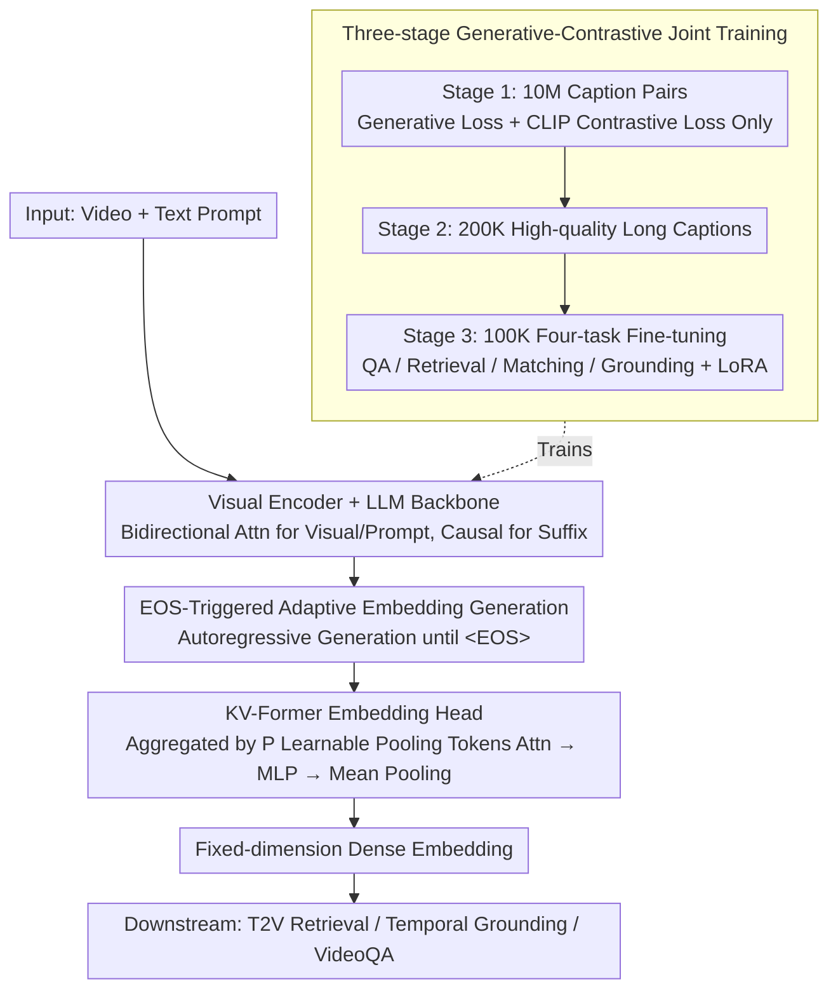

# ViLL-E: Video LLM Embeddings for Retrieval

**Conference**: ACL 2026  
**arXiv**: [2604.12148](https://arxiv.org/abs/2604.12148)  
**Code**: None  
**Area**: Video Understanding  
**Keywords**: Video Retrieval, Video LLM, Embedding Generation, Contrastive Learning, Temporal Grounding

## TL;DR
The paper proposes ViLL-E, the first unified Video LLM architecture that supports both text and embedding generation. Through a three-stage generative-contrastive joint training and an adaptive KV-Former embedding head, it achieves performance close to expert models in video retrieval and temporal grounding while maintaining competitive VideoQA capabilities.

## Background & Motivation

**Background** Video LLMs (e.g., VideoLLaVA, VideoChat2) perform excellently in generative tasks like video question answering and captioning. However, they significantly lag behind specialized models (e.g., QD-DETR, SigLIP, VidLA) in tasks requiring embedding matching, such as Text-to-Video (T2V) retrieval and temporal grounding (Moment Retrieval).

**Limitations of Prior Work** Current video understanding requires maintaining two independent model stacks: Video LLMs for generative tasks and specialized dual-encoders for retrieval tasks. This increases deployment complexity and prevents shared representation learning between task types. While research in NLP has shown that LLMs can be transformed into strong retrieval models through contrastive fine-tuning (e.g., GRIT, E5), no such work exists in the video domain.

**Key Challenge** The autoregressive architecture of Video LLMs is naturally unsuited for producing dense embeddings, while specialized embedding models lack the reasoning and generative capabilities of LLMs. Unifying these two capabilities within a single model is a critical challenge.

**Goal** To design a unified Video LLM architecture capable of generating both textual responses and high-quality video/text embeddings, achieving competitive performance across retrieval, grounding, and QA tasks.

**Key Insight** Based on the PaliGemma multimodal LLM, a learnable embedding head is added. A three-stage joint training strategy (large-scale pre-training → high-quality pre-training → multi-task fine-tuning) is employed to simultaneously optimize generative and discriminative capabilities.

**Core Idea** The key innovation is an EOS-triggered adaptive embedding generation mechanism—the model first autoregressively generates a variable number of tokens, which are then fed into the embedding head to be aggregated into a dense embedding. This allows the model to "think longer" for complex videos and return results quickly for simple ones.

## Method

### Overall Architecture
ViLL-E is based on the PaliGemma-3B multimodal LLM, comprising a visual encoder, an LLM backbone, and a new embedding head. Bidirectional attention is used for visual tokens and input prompts, while causal attention is applied to autoregressively generated suffixes. Upon encountering the `<EOS>` token, all generated tokens are collected and sent to the embedding head to produce a dense embedding. Training is divided into three stages: large-scale contrastive-generative joint pre-training, high-quality data continued pre-training, and multi-task fine-tuning.

### Key Designs

**1. KV-Former Embedding Head: Aggregating Variable-length Sequences into Fixed-dimension Embeddings**

The autoregressive output of a Video LLM has variable length, while retrieval requires a fixed-dimension dense vector. ViLL-E introduces KV-Former as an aggregator: using LLM output tokens as queries and $P$ learnable keys/values (pooling tokens) as a dictionary, it performs adaptive weighted aggregation via attention, followed by MLP projection and mean pooling. Unlike Q-Former, which has a fixed output length and requires truncation/padding, KV-Former naturally handles arbitrary sequence lengths. Compared to simple mean pooling, these $P$ pooling tokens provide a bottleneck capacity independent of the generative task, preventing the embedding representation from being biased by generative objectives while maintaining low parameter overhead.

**2. EOS-triggered Adaptive Embedding Generation: Allowing the Model to Decide "How Long to Think"**

Fixed-step embedding extraction treats all videos equally, potentially failing to analyze complex videos while wasting computation on simple ones. ViLL-E generates tokens autoregressively until `<EOS>` is produced before extracting the embedding. The number of generated tokens fluctuates based on video complexity—complex videos generate more "thinking" tokens for aggregation, while simple videos converge quickly. This delegates the decision of "how long to think" to the model itself, achieving a better balance between efficiency and representation quality than fixed-step methods.

**3. Three-stage Generative-Contrastive Joint Training: From Alignment to Refinement to Multi-task Unlocking**

To develop both generative and discriminative abilities, single-stage training risks neglecting one or the other, and short raw captions are insufficient for fine-grained representations. ViLL-E uses three progressive stages: Stage 1 jointly optimizes next-token prediction (generative) and CLIP-style contrastive loss (embedding) on 10M Shutterstock video-caption pairs to establish basic alignment; Stage 2 continues training on 200K high-quality long captions generated by Claude-3-Sonnet to compensate for short raw descriptions; Stage 3 performs four-task fine-tuning (QA, retrieval, matching, grounding) on 100K samples to unlock downstream capabilities. Removing pre-training caused retrieval scores to drop from 62.8 to 49.3, confirming the necessity of each stage.

### Loss & Training
Four tasks correspond to four losses: (1) CLIP-style in-batch contrastive loss for retrieval; (2) Next-token prediction loss for captions/QA; (3) Binary cross-entropy for matching; (4) Contrastive loss with sliding window hard negative mining (segments with $IoU < 0.2$ as negatives) for temporal grounding. LoRA is used during fine-tuning for parameter efficiency, while the visual projection module and embedding head are fully trained.

## Key Experimental Results

### Main Results

| Task/Dataset | Metric | ViLL-E | Prev. VideoLLM | Expert Model |
|------------|------|--------|------------------|---------|
| ActivityNet (Grounding) | R@1,IoU=0.5 | **39.4** | 31.2 (LLaVA-ST) | 33.2 (QD-DETR) |
| Charades-STA (Grounding) | R@1,IoU=0.5 | **51.5** | 44.8 (LLaVA-ST) | 57.3 (QD-DETR) |
| MSR-VTT (Retrieval) | R@1 | **62.5** | N/A | 58.0 (VidLA) |
| DiDeMo (Retrieval) | R@1 | **61.4** | N/A | 61.1 (VidLA) |
| MSR-VTT QA | Acc | **65.2** | 63.2 (ST-LLM) | - |
| Composed Retrieval (Zero-shot) | R@1 | **53.1** | - | 47.5 (SOTA) |

### Ablation Study

| Configuration | MSR QA | MSR Retr. | ANet Loc. | Description |
|------|--------|-----------|-----------|------|
| G+C+M (Full) | 65.1 | 62.8 | 39.4 | Three joint supervision signals |
| G+C (No Matching) | 63.9 | 60.3 | 39.1 | Matching loss helps retrieval |
| G only | 61.3 | 25.1 | 28.7 | Retrieval collapses without contrastive learning |
| C only | 45.5 | 54.7 | 29.3 | QA drops significantly without generative loss |
| No Pre-training | 55.9 | 49.3 | 32.3 | Pre-training is critical for retrieval |

### Key Findings
- ViLL-E improves over specialized VideoLLMs by an average of 77% (8+ percentage points) in temporal grounding and surpasses fine-tuned expert models by 4% in video retrieval.
- Generative and contrastive training are complementary: joint training outperforms individual training in both task types.
- Zero-shot capabilities for new tasks: Composed video retrieval exceeds SOTA by 5%, and long-text retrieval exceeds SOTA by 2%.
- The KV-Former design performs best among all embedding head variants.
- Two-stage retrieval (embedding retrieval + LLM re-ranking) provides an additional 2% Gain in R@1 over single-stage retrieval.

## Highlights & Insights
- Demonstrates for the first time that a single Video LLM can excel at both generative and embedding tasks, breaking the "two model stacks" paradigm.
- The adaptive embedding generation mechanism elegantly addresses differences in video complexity.
- The three-stage training strategy is rationally designed, with clear objectives for each stage and strong support from ablation studies.
- Unlocks new tasks previously impossible for Video LLMs, such as composed retrieval and long-text retrieval.

## Limitations & Future Work
- Based on PaliGemma-3B, the parameter count is relatively small, and it lacks multi-turn dialogue capabilities.
- Training data is primarily English, which may result in a loss of multilingual ability.
- Not compared with the latest large-scale general Video LLMs (e.g., Qwen2.5-VL-72B), presenting a significant gap in model scale.
- Future work could extend to larger backbones and incorporate audio modalities.

## Related Work & Insights
- GRIT and E5 in the NLP field proved that LLMs can be adapted into strong retrieval models; this work successfully extends this idea to the video domain.
- Concurrent works like VLM2Vec and GME are limited to images; ViLL-E is the first unified solution in the video domain.
- Provides solid experimental evidence for the ongoing discussion on whether a single large model can replace multiple specialized models.

## Rating
- Novelty: ⭐⭐⭐⭐ First unified generative + embedding VideoLLM with an ingenious KV-Former design.
- Experimental Thoroughness: ⭐⭐⭐⭐⭐ 8 benchmarks, detailed ablations, and validation on multiple zero-shot tasks.
- Writing Quality: ⭐⭐⭐⭐ Clear structure with informative diagrams and tables.
- Value: ⭐⭐⭐⭐ Provides a viable path for model unification in the video understanding field.

<!-- RELATED:START -->

## Related Papers

- [\[CVPR 2025\] Seq2Time: Sequential Knowledge Transfer for Video LLM Temporal Grounding](../../CVPR2025/video_understanding/seq2time_sequential_knowledge_transfer_for_video_llm_temporal_grounding.md)
- [\[CVPR 2025\] M-LLM Based Video Frame Selection for Efficient Video Understanding](../../CVPR2025/video_understanding/m-llm_based_video_frame_selection_for_efficient_video_understanding.md)
- [\[CVPR 2026\] Compositional Transformation Reasoning for Composed Video Retrieval](../../CVPR2026/video_understanding/compositional_transformation_reasoning_for_composed_video_retrieval.md)
- [\[CVPR 2026\] Beyond Caption-Based Queries in Video Moment Retrieval](../../CVPR2026/video_understanding/beyond_caption-based_queries_in_video_moment_retrieval.md)
- [\[CVPR 2025\] VideoRefer Suite: Advancing Spatial-Temporal Object Understanding with Video LLM](../../CVPR2025/video_understanding/videorefer_suite_advancing_spatial-temporal_object_understanding_with_video_llm.md)

<!-- RELATED:END -->
