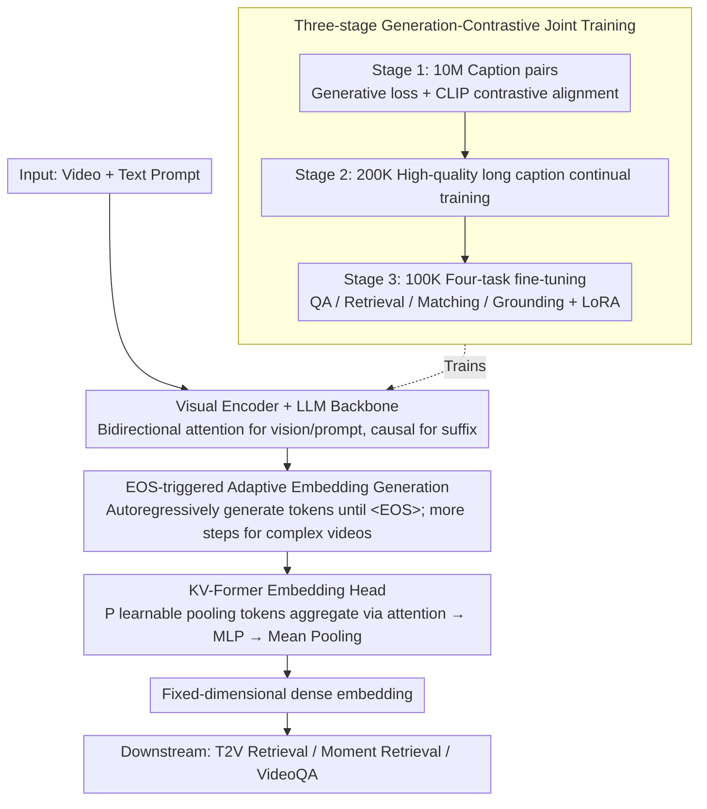

# ViLL-E: Video LLM Embeddings for Retrieval

**Conference**: ACL 2026  
**arXiv**: [2604.12148](https://arxiv.org/abs/2604.12148)  
**Code**: None  
**Area**: Video Understanding  
**Keywords**: Video Retrieval, Video LLM, Embedding Generation, Contrastive Learning, Temporal Grounding

## TL;DR
Proposes ViLL-E, the first unified Video LLM architecture supporting both text generation and embedding generation. Through a three-stage generation-contrastive joint training and an adaptive KV-Former embedding head, it approaches expert models in video retrieval and temporal grounding while maintaining competitiveness in VideoQA.

## Background & Motivation

**Background** Video LLMs (e.g., VideoLLaVA, VideoChat2) excel in text generation tasks like VideoQA and captioning but lag significantly behind specialized models (e.g., QD-DETR, SigLIP, VidLA) in tasks requiring embedding matching (e.g., T2V retrieval, Moment Retrieval).

**Limitations of Prior Work** Current video understanding requires maintaining two independent model stacks: Video LLMs for generative tasks and specialized dual-encoders for retrieval. This increases deployment complexity and prevents shared representation learning. While NLP research shows LLMs can be converted into strong retrieval models via contrastive fine-tuning (e.g., GRIT, E5), no such work exists in the video domain.

**Key Challenge** The autoregressive architecture of Video LLMs is naturally unsuitable for producing dense embeddings, yet specialized embedding models lack the reasoning and generative capabilities of LLMs. Unifying these two capabilities within a single model is the key challenge.

**Goal** To design a unified Video LLM architecture capable of both generating text responses and producing high-quality video/text embeddings, achieving competitive performance in retrieval, grounding, and QA tasks.

**Key Insight** Adding a learnable embedding head to the PaliGemma multimodal LLM and optimizing both generative and discriminative abilities through a three-stage joint training strategy (large-scale pre-training $\rightarrow$ high-quality pre-training $\rightarrow$ multi-task fine-tuning).

**Core Idea** The key innovation is an EOS-triggered adaptive embedding generation mechanism—the model autoregressively generates a variable number of tokens, which are then fed into the embedding head to be aggregated into a dense embedding. This allows the model to "think longer" for complex videos and return quickly for simple ones.

## Method

### Overall Architecture
ViLL-E is based on the PaliGemma-3B multimodal LLM, consisting of a visual encoder, an LLM backbone, and a newly added embedding head. Bidirectional attention is used for visual tokens and input prompts, while causal attention is used for autoregressively generated suffixes. Upon encountering the `<EOS>` token, all generated tokens are collected and sent to the embedding head to produce a dense embedding. Training is divided into three stages: large-scale contrastive-generative joint pre-training, high-quality data continual training, and multi-task fine-tuning.

### Key Designs

**1. KV-Former Embedding Head: Aggregating variable-length token sequences into fixed-dimension embeddings**

The autoregressive output length of a Video LLM is inconsistent, whereas retrieval requires a fixed-dimensional dense vector, necessitating an aggregator. Instead of direct mean pooling on output tokens, ViLL-E designs the KV-Former: using the LLM's output tokens as queries and introducing $P$ learnable key/value pairs (referred to as "pooling tokens") as a dictionary. These are aggregated via adaptive attention weighting, followed by MLP projection and mean pooling. Compared to Q-Former, where output length is fixed and input must be truncated or padded, KV-Former naturally accommodates arbitrary token sequence lengths. Compared to simple mean pooling or self-attention, the $P$ pooling tokens provide a bottleneck capacity independent of the generative task, preventing the embedding representation from being biased by generative objectives while maintaining low parameter overhead.

**2. EOS-triggered Adaptive Embedding Generation: Letting the model decide "how long to think" based on video complexity**

Fixed-step embedding extraction treats all videos equally; complex videos may lack sufficient analysis, while simple videos waste computation. ViLL-E instead generates tokens autoregressively before extraction until an `<EOS>` is produced. The number of generated tokens naturally fluctuates with video complexity—complex videos generate more "thought" tokens before aggregation. This effectively delegates the decision of "how long to think" back to the model, achieving a better balance between efficiency and representation quality than fixed-step methods.

**3. Three-stage Generation-Contrastive Joint Training: From alignment to refinement to multi-task unlocking**

Sustaining both generative and discriminative abilities in a single model is difficult, as single-stage training often neglects one aspect and raw captions are frequently too short for fine-grained representations. ViLL-E employs three progressive stages: Stage 1 involves joint optimization of next-token prediction (generation) and CLIP-style contrastive loss (embedding) on 10M Shutterstock video-caption pairs to establish basic alignment; Stage 2 continues training on 200K high-quality long captions generated by Claude-3-Sonnet to compensate for short original captions; Stage 3 performs four-task fine-tuning (QA, Retrieval, Matching, Grounding) on 100K samples to unlock downstream capabilities. Ablation studies show retrieval scores drop from 62.8 to 49.3 without pre-training, confirming the necessity of each stage.

### Loss & Training
Four tasks correspond to four losses: (1) CLIP-style in-batch contrastive loss for retrieval; (2) next-token prediction loss for captions/QA; (3) binary cross-entropy for matching tasks; (4) contrastive loss + sliding window hard negative mining (segments with $\text{IoU} < 0.2$ as negatives) for temporal grounding. LoRA is used during fine-tuning for parameter efficiency, while the visual projection module and embedding head are fully trained.

## Key Experimental Results

### Main Results

| Task/Dataset | Metric | ViLL-E | Prev. Best VideoLLM | Expert Model |
|------------|------|--------|------------------|---------|
| ActivityNet (Grounding) | R@1,IoU=0.5 | **39.4** | 31.2 (LLaVA-ST) | 33.2 (QD-DETR) |
| Charades-STA (Grounding) | R@1,IoU=0.5 | **51.5** | 44.8 (LLaVA-ST) | 57.3 (QD-DETR) |
| MSR-VTT (Retrieval) | R@1 | **62.5** | N/A | 58.0 (VidLA) |
| DiDeMo (Retrieval) | R@1 | **61.4** | N/A | 61.1 (VidLA) |
| MSR-VTT QA | Acc | **65.2** | 63.2 (ST-LLM) | - |
| Composed Retrieval (Zero-shot) | R@1 | **53.1** | - | 47.5 (SOTA) |

### Ablation Study

| Configuration | MSR QA | MSR Retr. | ANet Loc. | Description |
|------|--------|-----------|-----------|------|
| G+C+M (Full) | 65.1 | 62.8 | 39.4 | Combined supervision signals |
| G+C (No Match) | 63.9 | 60.3 | 39.1 | Matching loss helps retrieval |
| G only | 61.3 | 25.1 | 28.7 | Retrieval collapses without contrastive learning |
| C only | 45.5 | 54.7 | 29.3 | QA drops significantly without generative loss |
| No Pre-training | 55.9 | 49.3 | 32.3 | Pre-training is critical for retrieval |

### Key Findings
- ViLL-E improves temporal grounding by 77% (8+ percentage points) on average compared to specialized VideoLLMs and outperforms fine-tuned expert models in video retrieval by 4%.
- Generative and contrastive training are complementary: joint training outperforms individual training in both task categories.
- Zero-shot capability for new tasks: exceeds SOTA by 5% in composed video retrieval and 2% in long-text retrieval.
- The KV-Former design performs best among all embedding head variants.
- Two-stage retrieval (embedding retrieval + LLM reranking) provides an additional 2% R@1 gain over single-stage.

## Highlights & Insights
- Successfully demonstrates that a single Video LLM can excel at both generative and embedding tasks, breaking the "two-stack" model paradigm.
- The adaptive embedding generation mechanism elegantly addresses variances in video complexity.
- The three-stage training strategy is logically designed, with each stage having clear objectives supported by ablation studies.
- Unlocks new tasks previously unattainable for Video LLMs (e.g., composed retrieval, long-text retrieval).

## Limitations & Future Work
- Based on PaliGemma-3B; the small parameter count results in a lack of multi-turn dialogue capabilities.
- Training data is primarily English, potentially sacrificing multilingual capabilities.
- Lacks comparison with recent massive Video LLMs (e.g., Qwen2.5-VL-72B) due to the significant scale gap.
- Future work could extend to larger backbones and incorporate audio modalities.

## Related Work & Insights
- Resonates with GRIT and E5 in the NLP domain, which proved LLMs could be transformed into strong retrieval models; this work successfully extends the concept to video.
- Concurrent works like VLM2Vec and GME are limited to images; ViLL-E is the first unified solution for the video domain.
- Provides empirical evidence supporting the replacement of multiple specialized models with a single large model.

## Rating
- Novelty: ⭐⭐⭐⭐ First unified generation+embedding VideoLLM; clever KV-Former design.
- Experimental Thoroughness: ⭐⭐⭐⭐⭐ 8 benchmarks, detailed ablations, and multiple zero-shot tasks.
- Writing Quality: ⭐⭐⭐⭐ Clear structure and informative visualizations.
- Value: ⭐⭐⭐⭐ Provides a feasible path for model unification in video understanding.

<!-- RELATED:START -->

## Related Papers

- [\[ICLR 2026\] WAVE: Learning Unified & Versatile Audio-Visual Embeddings with Multimodal LLM](../../ICLR2026/multimodal_vlm/wave_learning_unified_versatile_audio-visual_embeddings_with_multimodal_llm.md)
- [\[CVPR 2026\] Breaking Multimodal LLM Safety via Video-Driven Prompting](../../CVPR2026/multimodal_vlm/breaking_multimodal_llm_safety_via_video-driven_prompting.md)
- [\[CVPR 2026\] Illuminating Visual Identity in Universal Multimodal Embeddings](../../CVPR2026/multimodal_vlm/illuminating_visual_identity_in_universal_multimodal_embeddings.md)
- [\[CVPR 2026\] Gravitation-Driven Semantic Alignment for Text Video Retrieval](../../CVPR2026/multimodal_vlm/gravitation-driven_semantic_alignment_for_text_video_retrieval.md)
- [\[ACL 2025\] TheoremExplainAgent: Towards Video-based Multimodal Explanations for LLM Theorem Understanding](../../ACL2025/multimodal_vlm/theorem_explain_agent.md)

<!-- RELATED:END -->
