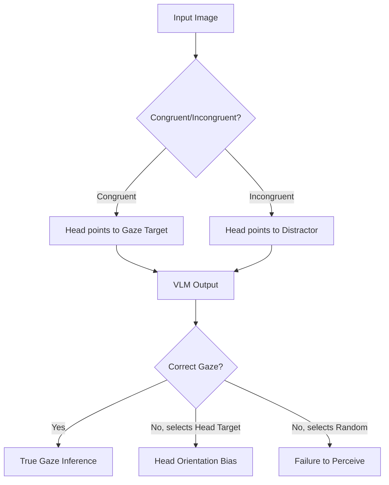

# Vision-Language Models Mistake Head Orientation for Gaze Direction: Nonverbal Conversation Cues

**Conference**: ACL2026  
**arXiv**: [2506.05412](https://arxiv.org/abs/2506.05412)  
**Code**: https://zoryzhang.github.io/gaze  
**Area**: multimodal_vlm  
**Keywords**: Gaze Target Inference, Head Orientation Bias, Nonverbal Cues, VLM Behavioral Evaluation, Controlled Experiments

## TL;DR
This paper uses 1,360 controlled real-world photographs and pre-registered statistical tests to find that current VLMs are significantly weaker than humans at determining which object a person is looking at, primarily mistaking head orientation for gaze direction; fine-tuning specialized gaze models can alleviate but not completely eliminate this bias.

## Background & Motivation
**Background**: Gaze is a crucial nonverbal cue in human communication. Conversational robots, embodied AI, and multimodal assistants can better resolve references, understand intentions, and coordinate actions if they can determine which object a user is looking at. Specialized gaze estimation models approach human performance on some internet image benchmarks, while VLMs possess cross-task generality, making them seemingly ideal candidates for integrating gaze skills with linguistic reasoning.

**Limitations of Prior Work**: Existing VLM gaze evaluations mostly remain at the "can it answer correctly" level and fail to explain why models make mistakes. Gaze images on the internet often contain shortcuts where head direction and eye direction are aligned; thus, even if a model answers correctly, it might just be using head orientation or body direction without truly reading the eye appearance.

**Key Challenge**: Applications require models to understand "where the eyes are actually looking," but training data and standard benchmarks may encourage models to learn the "look where the head points" heuristic. Reporting accuracy alone cannot distinguish true gaze inference from a head-orientation heuristic.

**Goal**: The authors aim to construct a controlled experiment to isolate the core capability of gaze target inference, compare the gap between VLMs and humans, determine if models exhibit head orientation bias, and judge whether this bias likely stems from training data or model architecture through fine-tuning experiments.

**Key Insight**: The paper adopts a cognitive science experimental design: a pre-registered experimental protocol that controls the number of objects, object distance, camera perspective, gaze target, and head orientation, using a set of statistical tests to classify model behavior as head-only, head-dominant, eye-head ambivalent, or more reliable gaze inference.

**Core Idea**: Instead of only testing VLMs on natural image benchmarks, use systematic misalignment between eye direction and head direction to stress-test whether the model genuinely looks at the eyes.

## Method
The core contribution of this paper is the experimental design rather than model algorithms. The authors first captured real-world scenes: a person sitting at a table with 2 to 4 objects, looking at one of them. Crucially, the authors controlled head orientation to be sometimes consistent with the gaze direction, sometimes pointing at a distractor object, and sometimes natural/unconstrained. Consequently, if a model relies solely on head orientation, it will systematically fail in the incongruent condition.

### Overall Architecture
The evaluation input consists of a real photograph and a multiple-choice question asking, "Which object is the person looking at?", with options being the names of objects on the table. The main experiment includes 1,360 photos, with each VLM viewing one of 16 prompt templates per photo, totaling 21,760 trials per VLM. Tested models include GPT-5.2, GPT-4o-2024-08-06, Qwen3-VL-30B-A3B-Instruct, InternLM-XComposer2-vl-7B, and GLM-4.6V, with Moondream2's specialized gaze function and the GazeLLE specialized vision model as controls.

Experimental variables include the number of objects, object combinations, viewing angles, inter-object distances, prompt templates, stimulus IDs, true GazeTarget, and HeadTarget. Dependent variables include the model's Choice and a more fine-grained Wrongness metric. Wrongness represents the relative distance between the chosen object and the true gaze target, ranging from 0 to 1, reflecting how far off the mistake is more accurately than simple accuracy.

### Key Designs
1. **Controlled Gaze/Head Dissociation in Real Photos**:
	- Function: Controls whether eye direction and head direction align while preserving realistic lighting, shadows, and facial details.
	- Mechanism: The "Natural" condition allows naturally turned heads toward the target; the "Congruent" condition requires both head and eyes to point at the same object; the "Incongruent" condition fixes the head orientation and moves only the eyes to look at other objects. Thus, when switching from congruent to incongruent, the only real change in the scene is the eye appearance.
	- Design Motivation: Synthetic images may lack the statistical regularities of real photos, while internet images are hard to control. Controlled real-world photography satisfies both realism and causal interpretability.

2. **Test Chain from Global Gap to Mechanism Classification**:
	- Function: Further explains "low model accuracy" as specific types of bias.
	- Mechanism: Test 1 compares the overall gap between VLMs and humans. Head-Bias Test 2 includes four sub-tests checking if models more frequently select the HeadTarget, maintain the same choice when only eyes change, perform better when head/gaze align, and if error distance increases with HeadTarget-GazeTarget distance. Test 3 checks for response to eye target changes. Test 4 distinguishes whether a model vacillates between gaze/head or merely selects the middle region.
	- Design Motivation: Single statistical results can be explained by other factors. Multiple tests pointing toward head orientation bias make the conclusion more credible and guide subsequent improvements.

3. **Rigorous Response Parsing and GLMM Analysis**:
	- Function: Ensures results are not due to option matching, prompt templates, or random stimuli.
	- Mechanism: Models can output option letters or free-form answers; the system uses rule-matching followed by Llama-3.1-70B semantic matching, with manual review for unresolved cases. Statistically, Generalized Linear Mixed-Effects Models (GLMM) are used, treating StimulusID, PromptID, and Objects as random effects, and View, Proximity, object count, and Condition as fixed effects or interactions.
	- Design Motivation: Behavioral assessments are easily influenced by prompts, option order, and specific images. Mixed models incorporate these factors into the analysis to avoid drawing conclusions based solely on average accuracy.

### Loss & Training
VLMs in the main experiment are not trained and perform only zero-shot multiple-choice evaluation. The paper conducts a proof-of-concept fine-tuning experiment: 2,260 stimuli from the pilot and main study are split 7:1:2 into training, validation, and test sets. GazeLLE is fine-tuned for 50 epochs using the Euclidean distance between the predicted gaze point and the target object position as the target, with the learning rate decaying from $1e-3$ to $1e-6$ via a cosine schedule.

## Key Experimental Results

### Main Results
Main results show that humans significantly outperform all VLMs and specialized models on the same task. As the number of objects increases from 2 to 4, the accuracy of all models drops, with most VLMs performing near the random baseline.

| Method | 2-Object Acc | 3-Object Acc | 4-Object Acc | Note |
|--------|------|------|----------|------|
| Humans (n=59) | 94% | 88% | 76% | Humans viewing low-res stimuli still far exceed models |
| GazeLLE-DinoV2-ViTL14 | 78% | 67% | 47% | Specialized model better than VLMs, but still a gap |
| Moondream2 (Hybrid) | 78% | 58% | 41% | Calls specialized gaze function |
| GPT-5.2 | 64% | 46% | 31% | Significantly lower than humans, near random at 4 objects |
| GPT-4o-20240806 | 65% | 41% | 30% | Similar to GPT-5.2 |
| Qwen3-VL-30B | 59% | 39% | 28% | Strongly affected by object count |
| GLM-4.6V-Flash | 62% | 43% | 30% | Still lower than specialized models |
| InternLM-XComposer2-VL-7B| 64% | 43% | 29% | Near random at 4 objects |
| Guessing baseline | 50% | 33% | 25% | Multiple-choice random baseline |

Head bias tests further indicate that models do not simply "fail to understand objects" or "fail at multiple-choice," but systematically use head orientation as a gaze cue. The paper rules out several alternative explanations: increasing resolution to 896 or 1024 did not improve GPT-5.2; providing object names from left-to-right gave only 2% and 1.5% boosts to GPT-5.2 and GPT-4o; GPT-5.2 outputted letters perfectly, showing results weren't caused by the parsing pipeline.

### Ablation Study

| Method | Test 2.1 | Test 3 | Test 4 | Behavioral Type | Note |
|------|---------|------|------|------|------|
| GazeLLE | - | + | - | Head-only | Specialized model also relies heavily on head |
| Moondream2 | - | + | + | Head-dominant | Shows gaze response, but head dominates |
| GPT-5.2 | + | + | - | Head-only | Strongest head bias, virtually ignores eye changes |
| GPT-4o | - | - | + | Head-dominant | Vacillates between head and eyes, head leads |
| Qwen3-VL-30B | - | + | - | Head-only | Insufficient response to eye changes |
| GLM-4.6V-Flash | - | - | + | Unclear | Bias exists but classification unstable |
| InternLM | - | - | + | Head-dominant | Head cues dominate |

| GazeLLE Setting | Pilot Acc | Congruent Acc | Incongruent Acc | Natural Acc | Note |
|------|---------|------|------|------|------|
| Original GazeLLE (ViT-B/14) | 63.80 | 62.82 | 15.65 | 65.22 | Incongruent below chance, shows strong head shortcut |
| Fine-tuned | 85.77 ± 1.40 | 70.00 ± 5.01 | 34.15 ± 1.76 | 76.81 ± 2.90 | Marked improvement on anti-shortcut samples |

### Key Findings
- 94 out of 111 pre-pilot VLMs did not significantly exceed random choice, suggesting gaze target inference is not a stable emergent ability in current VLMs.
- All tested VLMs exhibit a Proximity effect: the closer the objects, the higher the Wrongness, proving models use visual information rather than just random guessing or linguistic priors.
- Except for GPT-5.2, most tested VLMs lacked a stable View effect like humans, suggesting they are insensitive to eye appearance changes in profile views.
- Fine-tuning GazeLLE improved Incongruent accuracy from 15.65% to 34.15%, supporting the idea that a lack of head-gaze inconsistent examples in training data is a primary cause.

## Highlights & Insights
- The most valuable part of this paper is the shift from benchmarking to mechanism diagnosis. It doesn't settle for saying VLM gaze is poor; it uses a battery of experiments to pin the error to head orientation bias.
- The choice of controlled real-world photos is clever. Synthetic images might introduce artifacts; internet images cannot control for head-eye misalignment. Real photos keep the conclusion close to the actual visual system problem.
- Wrongness is a better metric than accuracy for this task. Picking an adjacent object versus the farthest object are different types of errors; Wrongness reflects the spatial precision of gaze inference.
- Fine-tuning experiments provide a practical direction: constructing training samples with inconsistent head, body, and eye directions may be more effective than simply increasing model scale.

## Limitations & Future Work
- The Incongruent condition is a necessary causal probe, but extreme head-eye misalignment is rare in reality; slight misalignment is more natural, while extreme cases serve as stress tests.
- Human diversity in the main experiment is limited (two females in the pilot, one male in the main study). While good for controlling variables, it doesn't cover different face shapes, makeup, skin tones, or glasses.
- The task is isolated multiple-choice gaze target inference, excluding context, dialogue history, and joint attention cues present in real interactions.
- The data scale for fine-tuning specialized models was small, showing data can alleviate bias but not proving all architectures can solve it entirely with such data.
- Future work should test more open environments, more diverse characters, multi-turn interactions, and downstream reference resolution to see if gaze capabilities transfer to real human-robot collaboration.

## Related Work & Insights
- **vs GazeFollow / in-the-wild gaze benchmarks**: In internet images, head direction is often sufficient for prediction, allowing models to score high using shortcuts; this work exposes true eye-reading ability using controlled incongruent cases.
- **vs Specialized gaze estimation models**: Models like GazeLLE have supervised targets but still show head bias, indicating the problem is related to training distributions rather than just VLM architecture.
- **vs Conventional VLM behavioral evaluation**: Conventional evaluations focus on average accuracy; this work demonstrates how hypothesis-driven behavioral probing aids in understanding model mechanisms.
- **Inspiration for future work**: Multimodal evaluation can borrow from cognitive science experiments, systematically decoupling key visual cues rather than just piling up larger natural image datasets.

## Rating
- Novelty: ⭐⭐⭐⭐⭐ Uses pre-registered controlled experiments to localize VLM gaze error mechanisms, very distinctive.
- Experimental Thoroughness: ⭐⭐⭐⭐⭐ Includes pre-pilot, human controls, main experiment, multiple models, multiple statistical tests, and fine-tuning validation.
- Writing Quality: ⭐⭐⭐⭐ Clear experimental logic, though the statistical test chain requires careful following.
- Value: ⭐⭐⭐⭐⭐ Highly valuable for VLM visual understanding evaluation, robot reference resolution, and nonverbal social cue modeling.

<!-- RELATED:START -->

## Related Papers

- [\[CVPR 2026\] StructXLIP: Enhancing Vision-Language Models with Multimodal Structural Cues](../../CVPR2026/multimodal_vlm/structxlip_enhancing_vision-language_models_with_multimodal_structural_cues.md)
- [\[ICCV 2025\] MultiVerse: A Multi-Turn Conversation Benchmark for Evaluating Large Vision and Language Models](../../ICCV2025/multimodal_vlm/multiverse_a_multi-turn_conversation_benchmark_for_evaluating_large_vision_and_l.md)
- [\[ICLR 2026\] Procedural Mistake Detection via Action Effect Modeling](../../ICLR2026/multimodal_vlm/procedural_mistake_detection_via_action_effect_modeling.md)
- [\[ACL 2026\] PROGRESSLM: Towards Progress Reasoning in Vision-Language Models](progresslm_towards_progress_reasoning_in_vision-language_models.md)
- [\[CVPR 2026\] HAWK: Head Importance-Aware Visual Token Pruning in Multimodal Models](../../CVPR2026/multimodal_vlm/hawk_head_importance-aware_visual_token_pruning_in_multimodal_models.md)

<!-- RELATED:END -->

## Related Papers

- [\[CVPR 2026\] StructXLIP: Enhancing Vision-Language Models with Multimodal Structural Cues](../../CVPR2026/multimodal_vlm/structxlip_enhancing_vision-language_models_with_multimodal_structural_cues.md)
- [\[ACL 2025\] Speaking Beyond Language: A Large-Scale Multimodal Dataset for Learning Nonverbal Cues from Video-Grounded Dialogues](../../ACL2025/multimodal_vlm/speaking_beyond_language.md)
- [\[ICCV 2025\] MultiVerse: A Multi-Turn Conversation Benchmark for Evaluating Large Vision and Language Models](../../ICCV2025/multimodal_vlm/multiverse_a_multi-turn_conversation_benchmark_for_evaluating_large_vision_and_l.md)
- [\[ICLR 2026\] Procedural Mistake Detection via Action Effect Modeling](../../ICLR2026/multimodal_vlm/procedural_mistake_detection_via_action_effect_modeling.md)
- [\[ACL 2026\] PROGRESSLM: Towards Progress Reasoning in Vision-Language Models](progresslm_towards_progress_reasoning_in_vision-language_models.md)

<!-- RELATED:END -->
