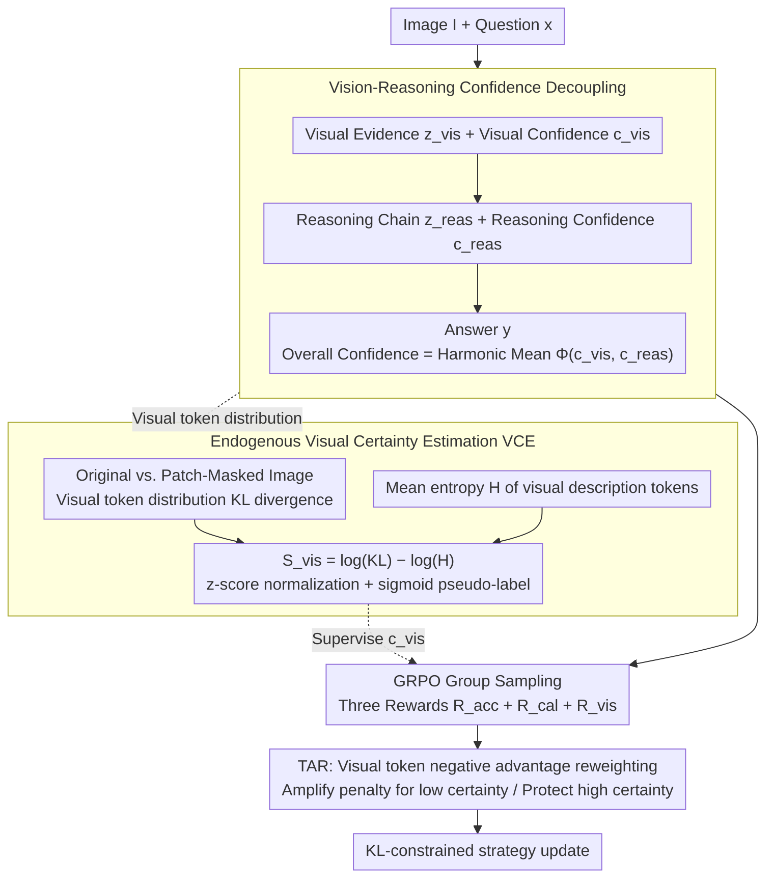

# VL-Calibration: Decoupled Confidence Calibration for Large Vision-Language Models Reasoning

**Conference**: ACL2026  
**arXiv**: [2604.09529](https://arxiv.org/abs/2604.09529)  
**Code**: https://github.com/Mr-Loevan/VL-Calibration  
**Area**: Multimodal VLM  
**Keywords**: Multimodal Calibration, Confidence Decoupling, Visual Uncertainty, Reinforcement Learning, Hallucination Suppression

## TL;DR
VL-Calibration decomposes the verbalized confidence of LVLMs into visual confidence and reasoning confidence. By utilizing image perturbation KL divergence, token entropy, and token-level advantage reweighting for training, the model simultaneously reduces ECE and improves accuracy across 13 visual reasoning benchmarks.

## Background & Motivation
**Background**: Large Vision-Language Models (LVLMs) can handle mathematical charts, geometric problems, commonsense QA, and multidisciplinary reasoning. However, they lack reliable uncertainty expression when providing answers. In text LLMs, verbalized confidence calibration methods exist to align the model's self-reported "confidence" with its accuracy via SFT, PPO, DPO, or GRPO.

**Limitations of Prior Work**: Directly applying these methods to LVLMs reveals structural mismatches. LVLM errors stem from either "misperception" or "incorrect reasoning despite correct perception." Training a single aggregate confidence score fails to distinguish whether uncertainty arises from vision or logic. Furthermore, multimodal models are often dominated by language priors, giving high-confidence answers based on text patterns even when visual evidence is insufficient.

**Key Challenge**: Calibration requires judging answer correctness, which results from the interplay of visual perception and subsequent reasoning. A single Brier-style confidence score conflates these sources, leading to coarse optimization signals. Moreover, supervising visual confidence is difficult due to the lack of human-annotated labels for visual rationale correctness.

**Goal**: The authors aim to solve three sub-problems: enabling markers to explicitly distinguish confidence levels in visual and reasoning stages; constructing trainable visual certainty signals without ground-truth labels; and providing fine-grained penalties for hallucinations caused by visual uncertainty during RL.

**Key Insight**: If a model's visual description truly depends on the image, the output distribution should change significantly when the image is occluded. If the model is certain about its internal visual description, the token distribution should be sharper. Combining "image sensitivity" and "internal low entropy" provides an endogenous proxy for visual certainty without human labels.

**Core Idea**: Replace single confidence with decoupled visual and reasoning confidence, aligning visual confidence to actual perceptual reliability using an endogenous visual certainty reward.

## Method

### Overall Architecture
The input consists of image $I$ and text question $x$. The output is a structured trajectory $\tau$: first generating visual rationale $z_{vis}$ and visual confidence $c_{vis}$, then reasoning chain $z_{reas}$ and reasoning confidence $c_{reas}$, and finally the answer. Overall confidence is synthesized from $c_{vis}$ and $c_{reas}$.

The training process is based on GRPO. Multiple outputs are sampled for the same problem. Advantage is calculated within the group based on three reward terms: answer accuracy, overall calibration, and visual calibration. Unlike standard RLCR, this method treats the visual stage as an independent supervisory target.

The method comprises three layers: the first modifies output formats to expose uncertainty sources; the second constructs visual certainty pseudo-labels for $c_{vis}$; the third adjusts negative advantages at the token level to penalize incorrect visual tokens under low certainty.

### Key Designs

**1. Vision-Reasoning Confidence Decoupling: Splitting monolithic verbalized confidence into "perceptual accuracy" and "logical correctness"**

LVLM errors can arise from misperceiving the image or failing the reasoning despite correct perception. A single confidence score only allows the model to say "I am uncertain" without localizing the error. This work explicitly defines the trajectory as $\tau=(z_{vis}, c_{vis}, z_{reas}, c_{reas}, y)$. The overall confidence for answer $y$ is calculated as the harmonic mean:

$$\Phi(c_{vis},c_{reas})=\frac{2c_{vis}c_{reas}}{c_{vis}+c_{reas}}$$

The harmonic mean is chosen over the arithmetic mean because it is more conservative—if either the visual or reasoning component is low, the overall confidence is pulled down. This matches the risk structure of multimodal reasoning: neither "unseen but logically sound" nor "clear but logically weak" cases should yield high total confidence.

**2. Endogenous Visual Certainty Estimation (VCE): Creating trainable pseudo-supervision for $c_{vis}$ without ground-truth**

VCE extracts two complementary signals from the model as pseudo-labels. First, visual grounding: the KL divergence $D_{KL}$ between visual rationale token distributions generated from the original image and a randomly patch-masked image. Larger $D_{KL}$ indicates the output relies on visual input rather than hallucinations. Second, internal certainty: the mean entropy $H$ of visual tokens. The final visual certainty is:

$$S_{vis}=\log(D_{KL}+\epsilon)-\log(H+\epsilon)$$

This value is z-score normalized and sigmoid-mapped to $[0,1]$ within the batch. Log-scaling compresses the range to stabilize RL.

**3. Visual Certainty-Aware Token-level Advantage Reweighting (TAR): Precision penalties on ungrounded visual tokens**

Standard GRPO applies the same advantage to all tokens in a sample. However, multimodal errors are not homogeneous. In an incorrect sample, generating specific visual content under low visual certainty is likely a guess. TAR multiplies negative advantages for visual rationale tokens by a weight related to their visual certainty: negative advantages for low-certainty tokens are amplified (stronger penalty), while those for high-certainty tokens are attenuated (protected). This suppresses hallucinations while preserving visual perception capabilities.

### Loss & Training
The objective consists of three rewards: accuracy reward $R_{acc}$, calibration reward $R_{cal}$, and visual reward $R_{vis}$. $R_{cal}$ aligns $\Phi(c_{vis},c_{reas})$ with answer correctness using a Brier-style penalty, while $R_{vis}$ penalizes the squared error between $c_{vis}$ and stop-gradient $\tilde{S}_{vis}$. Training uses VL-Calibration-12K (sampled from ViRL-39K) on Qwen3-VL-4B/8B, with generalization validated on Qwen3-VL-30B and InternVL3.5-4B-MPO.

## Key Experimental Results

### Main Results
The paper evaluates Accuracy, AUROC, and Expected Calibration Error (ECE) across 13 benchmarks. The primary conclusion is that VL-Calibration improves both confidence reporting and reasoning accuracy.

| Model / Scenario | Metric | Baseline / Strong Baseline | VL-Calibration | Gain |
| :--- | :--- | :--- | :--- | :--- |
| Qwen3-VL-4B Avg | ECE ↓ | 0.421 | 0.098 | ~4.3x reduction |
| Qwen3-VL-8B Avg | ECE ↓ | 0.204 | 0.071 | -65.2% |
| Qwen3-VL-4B Avg | Accuracy ↑ | Strongest Baseline | Ours | +2.3% |
| Qwen3-VL-8B Avg | Accuracy ↑ | Strongest Baseline | Ours | +3.0% |
| MMMU-Pro | Accuracy ↑ | Strongest Baseline | Ours | +2.2% |
| A-OKVQA | ECE ↓ | 0.112 | 0.017 | Significant drop |
| Qwen3-VL-30B | Accuracy / AUROC / ECE | 0.652 / - / High | 0.803 / 0.767 / 0.082 | Effective on large scale |
| InternVL3.5-4B-MPO | Accuracy / ECE | RLCR Baseline | 0.689 / 0.103 | Cross-architecture |

### Ablation Study
Ablations on Qwen3-VL-4B verify the contributions of decoupling, VCE, and TAR.

| Configuration | ACC ↑ | AUROC ↑ | ECE ↓ | Description |
| :--- | :--- | :--- | :--- | :--- |
| Qwen3-VL-4B Base | 0.516 | 0.763 | 0.421 | Overconfident with low accuracy |
| RLCR | 0.704 | 0.694 | 0.167 | RL calibration is effective but AUROC drops |
| RLCR + Decoupled | 0.701 | 0.682 | 0.164 | Minimal gain from formatting only |
| + VCE Entropy only | 0.688 | 0.723 | 0.119 | Entropy improves calibration but hurts accuracy |
| + VCE KL only | 0.709 | 0.721 | 0.124 | Perturbation signal is effective but unstable |
| + VCE Entropy + KL | 0.715 | 0.751 | 0.121 | Dual signals are more balanced |
| Ours + TAR | 0.727 | 0.763 | 0.098 | Best configuration; TAR boosts accuracy |

### Key Findings
- Decoupled confidence is only effective when paired with visual supervision. Outputting $c_{vis}$ and $c_{reas}$ without decoupled rewards results in performance similar to standard RLCR.
- VCE components are complementary; entropy alone may cause "entropy collapse," while KL alone may cause "entropy explosion."
- Reliability plots show the Base model is severely overconfident (ECE 0.421); VL-Calibration brings confidence bins closer to the ideal diagonal.
- In DynaMath unanswerable (image-removed) settings, the method reduces confidence to 0.218 for unanswerable cases while maintaining 0.834 for answerable ones (Gap = 0.616).
- VCE correlates well with Gemini-3-pro-preview visual judgments (AUROC=0.746, SRCC=0.496).

## Highlights & Insights
- The biggest highlight is advancing calibration from "answer confidence" to "error source confidence," making VLM uncertainty diagnosable for safety scenarios (rejection, human-in-the-loop).
- VCE is practical as it bypasses the need for manual visual rationale labeling by leveraging model-internal signals.
- TAR moves calibration from the sample level to the token level, precisely suppressing hallucinations at their source.
- The use of the harmonic mean is a simple but effective inductive bias that treats vision and reasoning as a serial system.

## Limitations & Future Work
- Computational overhead: VCE requires additional forward passes for perturbed images and token distribution statistics.
- Scale: While tested up to 30B, behavior on 70B+ models or different visual encoders remains to be systematically verified.
- The "perturbation-distribution shift" assumption for grounding might not hold for extremely robust encoders or tasks requiring very fine-grained local evidence.
- The method currently requires RL training; future work could explore lightweight LoRA or test-time calibration heads.

## Related Work & Insights
- **vs RLCR**: While RLCR uses GRPO for joint accuracy/calibration rewards, this work decomposes confidence into interpretable dimensions with visual pseudo-supervision.
- **vs SaySelf / PPO-C / Rewarding Doubt**: These focus on text LLM calibration. VL-Calibration explicitly models multimodal perceptual errors to avoid conflating them with linguistic uncertainty.
- **vs VL-Uncertainty / Self-Consistency**: Sampling-based methods are expensive. This work uses endogenous signals during training to align verbalized confidence.
- **vs Traditional ECE Calibration**: Unlike post-processing, this method trains the model to generate human-readable confidence usable for downstream policy decisions.

## Rating
- Novelty: ⭐⭐⭐⭐☆ Effective decomposition of visual and reasoning uncertainty.
- Experimental Thoroughness: ⭐⭐⭐⭐☆ Solid benchmarks and ablations, though real-world deployment tests could be added.
- Writing Quality: ⭐⭐⭐⭐☆ Clear methodology and derivation.
- Value: ⭐⭐⭐⭐⭐ Vital for high-risk multimodal applications where knowing "why" the model is uncertain is crucial.

<!-- RELATED:START -->

## Related Papers

- [\[ACL 2025\] MMBoundary: Advancing MLLM Knowledge Boundary Awareness through Reasoning Step Confidence Calibration](../../ACL2025/multimodal_vlm/mmboundary_reasoning_step_confidence.md)
- [\[ECCV 2024\] Robust Calibration of Large Vision-Language Adapters](../../ECCV2024/multimodal_vlm/robust_calibration_of_large_vision-language_adapters.md)
- [\[ACL 2025\] Don't Miss the Forest for the Trees: Attentional Vision Calibration for Large Vision Language Models](../../ACL2025/multimodal_vlm/dont_miss_the_forest_for_the_trees_attentional_vision_calibration_for_large_visi.md)
- [\[ICLR 2026\] A-TPT: Angular Diversity Calibration Properties for Test-Time Prompt Tuning of Vision-Language Models](../../ICLR2026/multimodal_vlm/a-tpt_angular_diversity_calibration_properties_for_test-time_prompt_tuning_of_vi.md)
- [\[ACL 2026\] PROGRESSLM: Towards Progress Reasoning in Vision-Language Models](progresslm_towards_progress_reasoning_in_vision-language_models.md)

<!-- RELATED:END -->
