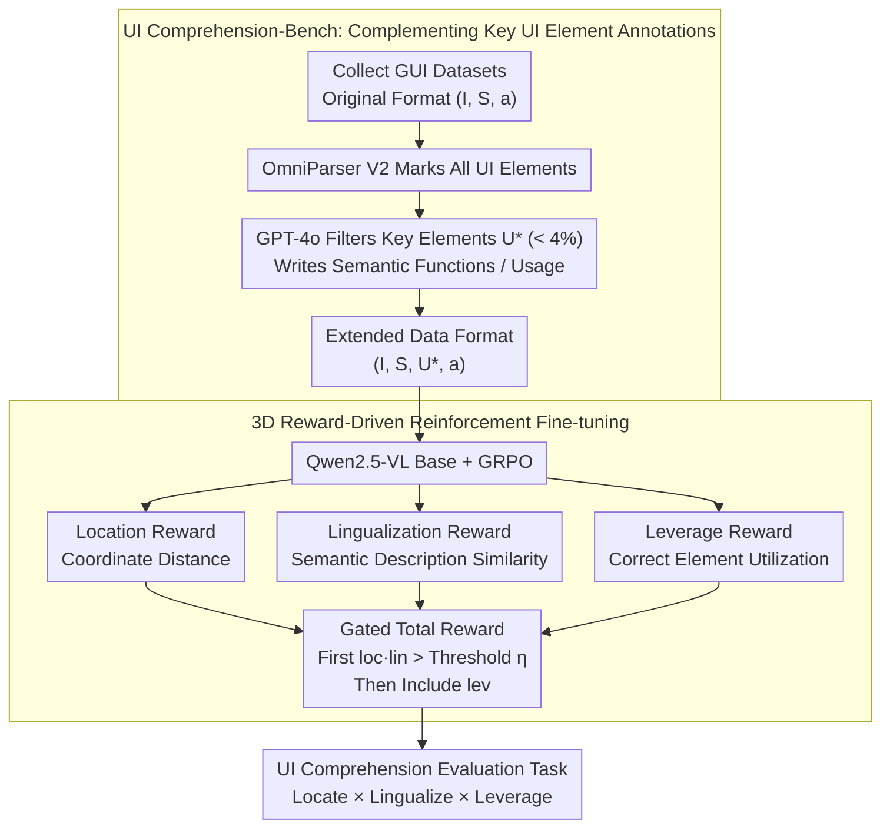

# What's Missing in Screen-to-Action? Towards a UI-in-the-Loop Paradigm for Multimodal GUI Reasoning

**Conference**: ACL 2026 Findings  
**arXiv**: [2604.06995](https://arxiv.org/abs/2604.06995)  
**Code**: None  
**Area**: Multimodal VLM / LLM Agent  
**Keywords**: GUI Reasoning, UI Understanding, Reinforcement Learning Fine-tuning, Multimodal Agent, UI Element Localization

## TL;DR

This paper proposes the UILoop (UI-in-the-Loop) paradigm, which restructures GUI reasoning from the traditional "Screen → Action" into a cyclic "Screen → UI Element → Action" process. Through UI-element-driven reinforcement fine-tuning, the model explicitly learns to locate, understand, and utilize key UI elements, achieving SOTA performance in GUI reasoning tasks.

## Background & Motivation

**Background**: GUI automation utilizes AI to simulate user interaction with device screens. Current methods leverage advanced MLLMs like GPT-4o and Qwen-VL to interpret user instructions and perform reasoning, but they generally follow the "Screen-to-Action" paradigm—generating actions (such as click coordinates, text input, scrolling) directly from screen input, which is a black-box decision process.

**Limitations of Prior Work**: Existing GUI Agents exhibit severe flaws in UI element understanding. Experiments show that advanced models score below 0.1 on average across three key dimensions: UI element localization, semantic function description, and actual usage. When provided with correct UI descriptions, reasoning performance improves significantly across all scenarios; conversely, failure rates increase sharply with incorrect descriptions. This indicates that UI element understanding is critical for GUI reasoning but is neglected by the current paradigm.

**Key Challenge**: The Screen-to-Action paradigm embeds UI understanding implicitly within action prediction, lacking explicit focus on UI elements. Models frequently fail to accurately locate key elements or understand their semantics and functions (e.g., misidentifying a scroll bar as a clickable button), leading to interaction errors and task failures.

**Goal**: To enable models to explicitly learn the localization, semantic functions, and actual usage of UI elements, establishing an interpretable bridge between screen understanding and action execution.

**Key Insight**: UI elements are the critical intermediate representation from screen to action. By requiring the model to first identify and understand key UI elements before making decisions based on them, both reasoning accuracy and interpretability can be improved simultaneously.

**Core Idea**: Restructure GUI reasoning into a cyclic "Screen–UI Element–Action" process, mastering the three capabilities of UI elements—Locate, Lingualize, and Leverage—through reinforcement learning.

## Method

### Overall Architecture

UILoop consists of two main stages: (1) Data construction stage—designing a synthesis pipeline to build UI Comprehension-Bench (26K samples) to augment existing GUI datasets with localization, semantic descriptions, and usage information of key UI elements; (2) Training stage—proposing UI-element-driven Reinforcement Fine-Tuning (RFT), training the model to master UI elements through three specialized reward functions. Based on this, the UI Comprehension evaluation task transforms intermediate reasoning steps into scorable diagnostic metrics.

### Key Designs

**1. UI Comprehension-Bench: Filling the Missing "Key UI Element" Annotations in GUI Reasoning**

Existing GUI datasets only provide screens and final actions; models learn a black-box mapping from pixels directly to coordinates without any UI element-level intermediate supervision. The authors fill this gap using a synthesis pipeline: first collecting datasets like Android Control, OmniAct, and GUI-Act, using a Set-of-Marks model (OmniParser V2) to label all recognizable UI elements on the screen, and then using GPT-4o to filter elements truly useful for completing the current instruction while adding semantic evaluations and usage descriptions. The data format is thus extended from $(I, S, a)$ to $(I, S, U^*, a)$, where $U^*$ represents the key UI elements and their descriptions. The difficulty is hidden in the numbers: the 26K benchmark labels 1,576,068 UI elements, of which only 57,332 (less than 4%) are key elements—picking a few useful items out of dozens or hundreds per screen is a high-difficulty localization task itself.

**2. 3D Reward-Driven Reinforcement Fine-tuning: Decoupling "Locate-Understand-Leverage" into Hierarchical Rewards**

Traditional action prediction losses only focus on the final action, failing to explicitly optimize UI understanding. UILoop designs three rewards for GRPO corresponding to the three capabilities: Location Reward uses normalized Euclidean distance between predicted and GT coordinates; Lingualization Reward calculates text similarity between predicted and GT semantic descriptions; Leverage Reward evaluates whether elements are used correctly based on action type (coordinate matching for clicks, text matching for input/scroll). These are combined into a gated total reward:

$$r = r^{format} + \alpha_1 \cdot r^{loc} \cdot r^{lin} + \alpha_2 \cdot \mathbb{1}_U(r^{loc} \cdot r^{lin}) \cdot r^{lev}$$

The key lies in the indicator function $\mathbb{1}_U$: the leverage reward $r^{lev}$ is only included when the product $r^{loc} \cdot r^{lin}$ exceeds the threshold $\eta$. This forces the model to solidify "finding" and "interpreting" elements before optimizing "using" them, replicating the human sequence of "see → understand → operate," preventing the model from farming leverage rewards by guessing actions before correctly identifying elements.

**3. UI Comprehension Evaluation Task: Scoring Intermediate GUI Reasoning Steps**

Existing evaluations only look at final action accuracy, which is a black box—if a model fails, it is unclear if it was due to a localization, understanding, or leverage error. The authors make the intermediate process measurable: Locate measures localization accuracy, Lingualize measures semantic understanding, and Leverage measures utilization accuracy. The Overall metric is calculated as Overall $=$ Locate $\times$ Lingualize $\times$ Leverage. Using multiplication rather than addition means that if any stage fails, the whole process fails, matching the intuition that "all three capabilities are indispensable" and allowing precise diagnosis of where the model failed.

### Training Strategy

Qwen2.5-VL-3B and 7B are used as base models. RFT via GRPO is performed on the UI Comprehension-Bench training set with 5 rollouts, training for 3-6 epochs until rewards converge. $\alpha_1 = 4$, $\alpha_2 = 5$, UI indicator threshold $\eta = 0.5$, trained on 8 A100 80G GPUs.

## Key Experimental Results

### Main Results

| Method | ScreenSpot-Pro GR | AndroidControl-High SR |
|------|------------------|----------------------|
| GPT-4o (zero-shot) | 0.8% | 21.2% |
| Qwen2.5-VL-7B (zero-shot) | 17.4% | 47.1% |
| SeeClick | 1.1% | 59.1% |
| OS-Atlas-7B | 18.9% | 29.8% |
| GUI-Owl-7B | 21.3% | 37.5% |
| Qwen2.5-VL-7B* (SFT) | 18.5% | - |
| **Ours (UILoop-3B)** | - | **63.3%** |
| **Ours (UILoop-7B)** | **23.6%** | **67.8%** |

| UI Comprehension Metrics | Locate | Lingualize | Leverage | Overall |
|---------------------|--------|-----------|---------|---------|
| GPT-4o | Low | Low | Low | <0.1 |
| Qwen2.5-VL-7B | Low | Low | Low | <0.1 |
| **Ours (UILoop-7B)** | **Significant Gain** | **Significant Gain** | **Significant Gain** | **SOTA** |

### Ablation Study

| Configuration | AndroidControl-High SR | Description |
|------|----------------------|------|
| **Ours (Full)** | 67.8% | Full model |
| w/o Location Reward | Decrease | Inaccurate localization leads to subsequent step errors |
| w/o Lingualization Reward | Decrease | Lack of semantic understanding leads to incorrect operations |
| w/o Leverage Reward | Decrease | Degradation of element utilization capability |
| Providing Correct UI Description | Large Gain | Validates importance of UI understanding |
| Providing Incorrect UI Description | Large Decrease | Validates criticality of UI understanding |

### Key Findings

- **UI element understanding is a critical bottleneck in GUI reasoning**: All models (including GPT-4o) score extremely low (<0.1) on the three dimensions of UI understanding, but reasoning performance improves significantly after providing correct UI information, proving the fundamental flaw of the "Screen-to-Action" paradigm.
- **UILoop outperforms larger zero-shot models and specialized GUI Agents at both 3B and 7B scales.**
- **Reinforcement Learning is more suitable for learning UI understanding than Supervised Fine-Tuning**: The relative advantage estimation in GRPO handles complex sequential decisions in GUI reasoning better.
- **Key UI elements account for less than 4% of all elements on screen**: This indicates that identifying key elements amidst a mass of irrelevant UI components is a highly challenging task.

## Highlights & Insights

- **Convincing Paradigm Shift**: "Screen → UI → Action" aligns better with human cognitive processes for using interfaces—humans identify key buttons/inputs and understand their functions before acting.
- **Clever Hierarchical Design of 3D Rewards**: $1_U(r^{loc} \cdot r^{lin}) \cdot r^{lev}$ ensures the model must master localization and understanding before optimizing utilization, simulating the "see → understand → operate" learning order.
- **Long-term Value of UI Comprehension-Bench as Infrastructure**: With 26K samples, complete GT UI elements, and interpretable reasoning chains, it supports systematic evaluation and improvement of future GUI Agents.
- The approach is transferable to other domains: Any task involving complex interface interactions (e.g., IDE automation, medical system operation) can benefit from explicit intermediate element understanding.

## Limitations & Future Work

- Dependency on GPT-4o and OmniParser V2 for building GT UI elements; data quality is capped by these tools.
- Verification is limited to 3B and 7B scale models; whether larger models still require explicit UI understanding remains to be seen.
- The current framework processes static screenshots and does not account for dynamic UI (animations, video streams).
- Evaluation is primarily on Android and desktop apps; the complexity of Web interactions (e.g., dynamic loading, iframe nesting) may pose new challenges.

## Related Work & Insights

- **vs. Screen-to-Action methods (SeeClick, OS-Atlas)**: These focus on improving localization but ignore semantic functions and actual usage; UILoop's 3D UI understanding is more comprehensive.
- **vs. RL methods like GUI-R1, UI-R1**: These apply RL to action prediction in the "Screen-to-Action" paradigm; UILoop applies RL to the intermediate UI understanding phase, addressing more fundamental issues.
- **vs. UI-Vision, ScreenSpot-Pro**: These are evaluation benchmarks focusing only on localization, while UILoop's UI Comprehension-Bench covers localization, semantics, and leverage.

## Rating

- Novelty: ⭐⭐⭐⭐ Paradigm restructuring from "Screen→Action" to "Screen→UI→Action" is insightful, though the underlying idea is intuitive.
- Experimental Thoroughness: ⭐⭐⭐⭐ Comprehensive across multiple benchmarks and ablations, though more scales and domains could be explored.
- Writing Quality: ⭐⭐⭐⭐ Clear motivation, rich visualizations, and standardized formal definitions.
- Value: ⭐⭐⭐⭐ The 26K benchmark and 3D evaluation system provide practical contributions to the GUI Agent community.

<!-- RELATED:START -->

## Related Papers

- [\[ACL 2025\] Aria-UI: Visual Grounding for GUI Instructions](../../ACL2025/multimodal_vlm/aria-ui_visual_grounding_for_gui_instructions.md)
- [\[AAAI 2026\] MCMoE: Completing Missing Modalities with Mixture of Experts for Incomplete Multimodal Action Quality Assessment](../../AAAI2026/multimodal_vlm/mcmoe_completing_missing_modalities_with_mixture_of_experts_for_incomplete_multi.md)
- [\[ACL 2026\] Beyond Screenshots: Evaluating VLMs' Understanding of UI Animations](beyond_screenshots_evaluating_vlms_understanding_of_ui_animations.md)
- [\[ACL 2026\] Measuring What Matters Beyond Text: Evaluating Multimodal Summaries by Quality, Alignment, and Diversity (MM-Eval)](measuring_what_matters_beyond_text_evaluating_multimodal_summaries_by_quality_al.md)
- [\[ICML 2026\] Calibrated Multimodal Representation Learning with Missing Modalities](../../ICML2026/multimodal_vlm/calibrated_multimodal_representation_learning_with_missing_modalities.md)

<!-- RELATED:END -->
