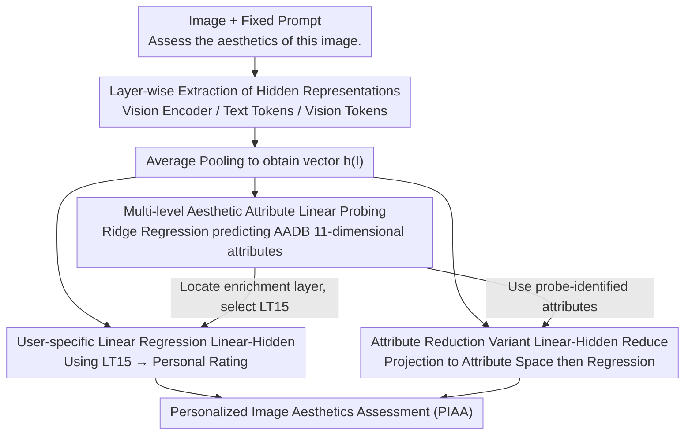

# What Do Vision-Language Models Encode for Personalized Image Aesthetics Assessment?

**Conference**: ACL 2026 Findings  
**arXiv**: [2604.11374](https://arxiv.org/abs/2604.11374)  
**Code**: [https://github.com/ynklab/vlm-latent-piaa](https://github.com/ynklab/vlm-latent-piaa)  
**Area**: Multimodal VLM  
**Keywords**: Personalized Image Aesthetics Assessment, Vision-Language Models, Linear Probing, Hidden Representations, Image Aesthetics

## TL;DR

This paper discovers through linear probing that the hidden representations of VLMs encode rich multi-level aesthetic attribute information (lighting, color, composition, etc.), which propagates to the language decoder layers. Based on this, it proposes achieved training-free Personalized Image Aesthetics Assessment (PIAA) using simple linear regression, which significantly outperforms few-shot and LoRA fine-tuning baselines.

## Background & Motivation

**Background**: Personalized Image Aesthetics Assessment (PIAA) aims to predict specific users' aesthetic ratings of images, reflecting individual aesthetic preferences. Existing methods typically require pre-training on large-scale general aesthetic assessment datasets and then adapting to each individual user, which is computationally expensive and has questionable cross-domain transferability.

**Limitations of Prior Work**: Existing PIAA methods require multi-stage training pipelines (general aesthetic pre-training + user adaptation) and heavily rely on domain-specific training data. The application of VLMs in aesthetic assessment has been limited to the demographic group level and has not yet achieved individual-level personalization. Furthermore, it remains unclear whether the internal representations of VLMs encode the multi-level, continuous aesthetic attributes required for personalized assessment.

**Key Challenge**: While VLMs have acquired rich visual semantic understanding through large-scale pre-training, whether the aesthetic information in their hidden representations is fine-grained enough to support personalized assessment remains unverified.

**Goal**: (1) Verify which aesthetic attributes are encoded in VLM hidden representations via linear probing; (2) Utilize these representations to achieve lightweight, fine-tuning-free individual-level PIAA.

**Key Insight**: Drawing on linear probing methodology from the field of representation analysis, this work analyzes the vision encoder and language decoder of VLMs layer by layer to reveal the encoding locations and propagation patterns of aesthetic information.

**Core Idea**: Hidden representations of VLMs naturally encode multi-dimensional aesthetic attribute information, and a simple linear regression can map these representations into personalized aesthetic scores without any model fine-tuning.

## Method

### Overall Architecture

The method consists of two stages: first, analyzing the aesthetic attribute encoding in the representations of each VLM layer through linear probing (probing stage), and then, based on these findings, training user-specific linear models to predict personalized aesthetic scores from VLM hidden representations (PIAA stage). The input consists of an image + a fixed prompt ("Assess the aesthetics of this image."). After extracting hidden representations from various layers, a single vector is obtained through average pooling to serve as a shared front-end for three downstream linear heads.

### Key Designs

**1. Multi-layer aesthetic attribute linear probing: Verifying if and where fine-grained aesthetic information exists in VLM hidden layers**

Prior work only demonstrated that CLIP can encode a global aesthetic score, but personalization requires multi-dimensional, fine-grained aesthetic attributes, which had not been systematically verified. The authors train ridge regressions on the hidden representation $\mathbf{h}(I)$ of each VLM layer to predict the 11-dimensional aesthetic attribute vectors of the AADB dataset (object, lighting, color harmony, depth of field, composition, etc.), using Spearman correlation to measure probing quality. To clearly locate the information, they separately probe three types of representations: vision encoder outputs $\mathbf{V}_i$, text tokens $\mathbf{LT}_i$ in the language decoder, and vision tokens $\mathbf{LV}_i$ in the language decoder. This confirms that aesthetic attributes are indeed encoded and reveals how they are distributed and propagated between the vision encoder and language decoder.

**2. User-specific linear regression (Linear-Hidden): Mapping hidden representations directly to individual scores using a lightweight linear head**

Probing reveals that intermediate layers of the language decoder consistently enrich aesthetic information, making fine-tuning the entire VLM unnecessary for personalization. For each user $u$, a user-specific ridge regression $M_u$ is trained such that $M_u \mathbf{h}(I) \approx s_{I,u}$. The input is the average-pooled vector of the 15th layer text tokens ($\mathbf{LT}_{15}$) from the language decoder. Each user can be modeled using only 100 labeled images. Compared to traditional PIAA, which requires a two-stage "general aesthetic pre-training + user adaptation" process and relies on domain data, this linear head is both lightweight and interpretable, reducing personalization costs to a minimum.

**3. Attribute reduction variant (Linear-Hidden Reduce): Using dimensionality reduction as a probe to verify if detected attributes are sufficient for personalization**

While the first design identifies which aesthetic attributes are encoded, whether these attributes are "sufficient" for personalization requires counter-evidence. The authors first train a general regressor $M$ to project VLM representations into the AADB aesthetic attribute space (deliberately excluding the overall score), and then train a user regressor $M'_u$ on this low-dimensional attribute space. The logic is clean: if personalization performance does not drop after reducing the information to only these attributes, it indicates that the aesthetic attributes identified by the probe are sufficient to support personalization; if it drops, it indicates that VLM representations contain additional useful information not captured by the probe. Subsequent experiments use this to distinguish between the photo domain (where reduction causes almost no drop) and the artwork domain (where reduction causes a significant drop).

### Loss & Training

Ridge regression (linear regression with L2 regularization) is used, requiring no gradient optimization and making training extremely lightweight. A regression model is trained independently for each user using a support set of 100 images and a test set of 50 images.

## Key Experimental Results

### Main Results

| Method | PARA (ρ) | PARA (R²) | LAPIS (ρ) | LAPIS (R²) |
|--------|------|------|----------|------|
| Raw Text (Qwen3-VL 4B) | 0.570 | -1.277 | 0.176 | -0.937 |
| Few-shot (10-shot) | 0.197 | -1.576 | - | - |
| LoRA (100-shot) | 0.578 | -1.751 | - | - |
| Linear-Hidden (Qwen3-VL 4B) | 0.611 | 0.362 | 0.401 | 0.138 |
| Linear-Hidden Reduce | 0.597 | 0.382 | 0.315 | 0.061 |
| PIAA-ICI (In-domain) | 0.590 | 0.303 | - | - |
| PIAA-ICI (Cross-domain) | - | - | 0.277 | -0.120 |

### Ablation Study

| Configuration | PARA (ρ) | Description |
|------|---------|------|
| Linear-Hidden (Full) | 0.611 | Uses full VLM hidden representations |
| Linear-Hidden (GIAA) | 0.603 | Replaces personalized labels with general aesthetic scores |
| Linear-Hidden (Reduce) | 0.597 | Uses only probe-identified aesthetic attributes |

### Key Findings

- **VLM encodes multi-dimensional aesthetic attributes**: Over half of the aesthetic attributes reach a moderate or higher positive correlation (Spearman > 0.4) in VLM hidden representations. Attributes like Object (0.722), VividColor (0.696), and Overall Score (0.727) are most strongly encoded.
- **Language decoder layers carry aesthetic information**: Text token representations in the language decoder achieve probing performance comparable to or better than the vision encoder for most attributes. The pure vision model DINOv3 performs worst across almost all attributes.
- **Architecture differences affect information propagation**: In Gemma 3, aesthetic information transfers from vision tokens to text tokens in the early-to-mid layers of the language decoder. In Qwen3-VL, due to the DeepStack architecture, both remain consistent across layers.
- **Photo domain vs. Artwork domain**: On the PARA photo dataset, the Reduce variant closely matches full model performance (0.597 vs. 0.611). However, on the LAPIS artwork dataset, the gap is larger (0.315 vs. 0.401), indicating that artwork assessment requires additional information not captured by photo-based probing.
- **Simple linear methods outperform fine-tuning**: Linear-Hidden significantly outperforms text-output-based methods like Few-shot, LoRA, and Raw Text, and even surpasses the domain-specific PIAA-ICI model which requires additional pre-training.

## Highlights & Insights

- **"Reading hidden layers" is more effective than "reading text output"**: Aesthetic ratings generated as text by the VLM (Raw Text) are far interior to linear regression performed directly on hidden representations. This suggests that hidden representations contain substantial aesthetic information that is not preserved during the text generation process. This finding is also instructive for other subjective assessment tasks.
- **Extremely lightweight personalization scheme**: Only one ridge regression model per user (100 images) needs to be trained without fine-tuning VLM parameters, achieving efficient individual-level personalization.
- **Insights into cross-domain transfer**: Aesthetic attributes probed on photos transfer well to photo-domain PIAA, but the artwork domain requires additional information. This provides a direction for future cross-domain aesthetic assessment.

## Limitations & Future Work

- Only two VLM families (Qwen3-VL, Gemma 3) were tested, excluding larger-scale models or other architectures.
- Linear probing only captures linearly separable information; aesthetic attributes in VLMs might be encoded non-linearly.
- Personalization is based solely on image representations without considering user attributes (e.g., age, gender, cultural background), which might limit the depth of personalization.
- The aesthetic attribute dimensions of AADB are limited (11 dimensions) and may miss aesthetic dimensions important to certain users.

## Related Work & Insights

- **vs. PIAA-ICI**: PIAA-ICI requires a two-stage pipeline of pre-training on large-scale PIAA data followed by user fine-tuning, which is computationally expensive and shows poor cross-domain transfer. Linear-Hidden matches or exceeds PIAA-ICI performance in-domain and is significantly superior across domains without needing pre-training.
- **vs. Hentschel et al. (2022)**: Prior work only probed global aesthetic scores on the CLIP vision encoder. This work extends this to a systematic analysis of multiple attributes across multiple layers of vision and language decoders, advancing it to personalized applications.

## Rating

- Novelty: ⭐⭐⭐⭐ First systematic analysis of aesthetic attribute encoding in VLM hidden layers for personalized aesthetics assessment.
- Experimental Thoroughness: ⭐⭐⭐⭐ Comparisons across multiple models and datasets, including rich variants and ablation analyses.
- Writing Quality: ⭐⭐⭐⭐⭐ The logical chain from probing analysis to application design is very clear.
- Value: ⭐⭐⭐⭐ Provides a new paradigm for using the hidden representations of pre-trained models for subjective assessment.

<!-- RELATED:START -->

## Related Papers

- [\[CVPR 2026\] Probabilistic Prompt Adaptation for Unified Image Aesthetics and Quality Assessment](../../CVPR2026/multimodal_vlm/probabilistic_prompt_adaptation_for_unified_image_aesthetics_and_quality_assessm.md)
- [\[ICLR 2026\] VisJudge-Bench: Aesthetics and Quality Assessment of Visualizations](../../ICLR2026/multimodal_vlm/visjudge-bench_aesthetics_and_quality_assessment_of_visualizations.md)
- [\[CVPR 2026\] ArtiMuse: Fine-Grained Image Aesthetics Assessment with Joint Scoring and Expert-Level Understanding](../../CVPR2026/multimodal_vlm/artimuse_fine-grained_image_aesthetics_assessment_with_joint_scoring_and_expert-.md)
- [\[ICLR 2026\] Self-Evolving Vision-Language Models for Image Quality Assessment via Voting and Ranking](../../ICLR2026/multimodal_vlm/self-evolving_vision-language_models_for_image_quality_assessment_via_voting_and.md)
- [\[CVPR 2026\] Do Vision-Language Models Leak What They Learn? Adaptive Token-Weighted Model Inversion Attacks](../../CVPR2026/multimodal_vlm/vlm_model_inversion_adaptive_token_weight.md)

<!-- RELATED:END -->
