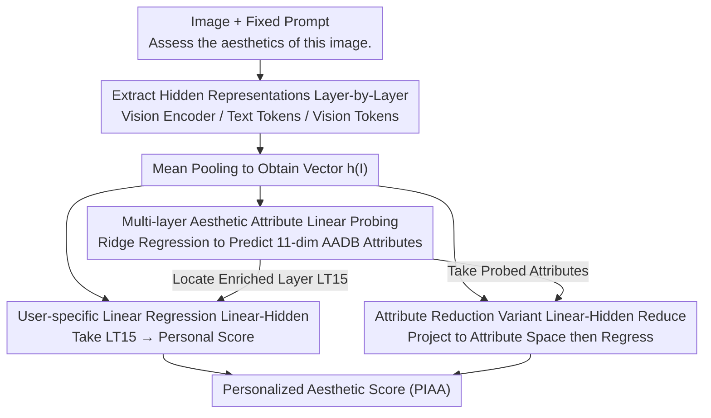

# What Do Vision-Language Models Encode for Personalized Image Aesthetics Assessment?

**Conference**: ACL 2026 Findings  
**arXiv**: [2604.11374](https://arxiv.org/abs/2604.11374)  
**Code**: [https://github.com/ynklab/vlm-latent-piaa](https://github.com/ynklab/vlm-latent-piaa)  
**Area**: Multimodal VLM  
**Keywords**: Personalized Image Aesthetics Assessment, Vision-Language Models, Linear Probing, Hidden Representations, Image Aesthetics

## TL;DR

This paper discovers through linear probing that the hidden representations of VLMs encode rich multi-level aesthetic attribute information (lighting, color, composition, etc.), which propagates to the language decoder layers. Based on this, it proposes using simple linear regression to achieve training-free Personalized Image Aesthetics Assessment (PIAA), significantly outperforming few-shot and LoRA fine-tuning baselines.

## Background & Motivation

**Background**: Personalized Image Aesthetics Assessment (PIAA) aims to predict a specific user's aesthetic rating for an image, reflecting individual aesthetic preferences. Existing methods typically require pre-training on large-scale generic aesthetic assessment datasets followed by adaptation for each user, which is computationally expensive and has questionable cross-domain transfer capabilities.

**Limitations of Prior Work**: Existing PIAA methods require a multi-stage training pipeline (generic aesthetic pre-training + user adaptation) and rely heavily on domain-specific training data. The application of VLMs in aesthetic assessment is limited to the demographic group level and has not yet achieved individual-level personalization. Furthermore, it remains unclear whether the internal representations of VLMs encode the multi-level, continuous aesthetic attributes required for personalization.

**Key Challenge**: While VLMs have acquired extensive visual-semantic understanding through large-scale pre-training, whether the aesthetic information in their hidden representations is granular enough to support personalized assessment remains unverified.

**Goal**: (1) Verify via linear probing which aesthetic attributes are encoded in VLM hidden representations; (2) Utilize these representations to achieve lightweight, training-free individual-level PIAA.

**Key Insight**: Drawing on the linear probing methodology from representation analysis, this study analyzes the VLM vision encoder and language decoder layer by layer to reveal the location and propagation patterns of aesthetic information.

**Core Idea**: VLM hidden representations naturally encode multi-dimensional aesthetic attribute information. Simple linear regression can map these representations to personalized aesthetic scores without any model fine-tuning.

## Method

### Overall Architecture

The method is divided into two stages: first, analyzing the aesthetic attribute encoding in each layer of the VLM representations through linear probing (probing stage); second, based on those findings, training user-specific linear models to predict personalized aesthetic scores from VLM hidden representations (PIAA stage). The input consists of an image + fixed prompt ("Assess the aesthetics of this image."). Layer-wise hidden representations are extracted and mean-pooled into a single vector, serving as a shared front-end for three downstream linear heads.

### Key Designs

**1. Multi-layer Aesthetic Attribute Linear Probing: Verifying existence and location of fine-grained aesthetic information in VLM hidden layers**

Prior work only demonstrated that CLIP could encode an overall aesthetic score, but personalization requires multi-dimensional, fine-grained aesthetic attributes, which has not been systematically verified. The authors train ridge regressions for each layer's hidden representation $\mathbf{h}(I)$ to predict an 11-dimensional aesthetic attribute vector from the AADB dataset (Object, Lighting, Color Harmony, Depth of Field, Composition, etc.), using Spearman correlation to measure probing quality. To locate the information, they separately probe three types of representations: vision encoder outputs $\mathbf{V}_i$, text tokens in the language decoder $\mathbf{LT}_i$, and vision tokens in the language decoder $\mathbf{LV}_i$. This confirms both the encoding of aesthetic attributes and their distribution/propagation between the vision encoder and language decoder.

**2. User-specific Linear Regression (Linear-Hidden): Mapping hidden representations directly to individual scores with a lightweight linear head**

Probing reveals that the middle layers of the language decoder consistently enrich aesthetic information, implying that personalization does not require fine-tuning the entire VLM. For each user $u$, a single user-specific ridge regression $M_u$ is trained such that $M_u \mathbf{h}(I) \approx s_{I,u}$. The input is the mean-pooled vector of the 15th layer text tokens ($\mathbf{LT}_{15}$) from the language decoder. Each user can be modeled using only 100 labeled images. Compared to traditional PIAA which requires two stages and domain data, this linear head is lightweight and interpretable, reducing personalization costs to a minimum.

**3. Attribute Reduction Variant (Linear-Hidden Reduce): Using dimensionality reduction to verify if probed attributes provide sufficient information for personalization**

While the first design identifies encoded attributes, it must be verified whether these attributes are "sufficient" for personalization. The authors first train a generic regressor $M$ to project VLM representations into the AADB aesthetic attribute space (deliberately excluding the overall score), and then train a user regressor $M'_u$ on this low-dimensional attribute space. The logic is clean: if personalization performance does not drop after reducing to these attributes, it indicates the probed aesthetic attributes are sufficient; if it drops, additional useful information exists in the VLM representations that the probe failed to capture. Experiments use this to distinguish between the photo domain (minimal drop) and the artwork domain (significant drop).

### Loss & Training

Ridge regression (L2-regularized linear regression) is used, which requires no gradient optimization and is extremely lightweight. A regression model is trained independently for each user with a support set of 100 images and a test set of 50 images.

## Key Experimental Results

### Main Results

| Method | PARA ($\rho$) | PARA ($R^2$) | LAPIS ($\rho$) | LAPIS ($R^2$) |
|--------|------|------|----------|------|
| Raw Text (Qwen3-VL 4B) | 0.570 | -1.277 | 0.176 | -0.937 |
| Few-shot (10-shot) | 0.197 | -1.576 | - | - |
| LoRA (100-shot) | 0.578 | -1.751 | - | - |
| Linear-Hidden (Qwen3-VL 4B) | 0.611 | 0.362 | 0.401 | 0.138 |
| Linear-Hidden Reduce | 0.597 | 0.382 | 0.315 | 0.061 |
| PIAA-ICI (In-domain) | 0.590 | 0.303 | - | - |
| PIAA-ICI (Cross-domain) | - | - | 0.277 | -0.120 |

### Ablation Study

| Config | PARA ($\rho$) | Description |
|------|---------|------|
| Linear-Hidden (Full Representation) | 0.611 | Uses complete VLM hidden representation |
| Linear-Hidden (GIAA) | 0.603 | Replaces personalized labels with generic aesthetic scores |
| Linear-Hidden (Reduce) | 0.597 | Uses only probed aesthetic attributes |

### Key Findings

- **VLMs Encode Multi-dimensional Aesthetic Attributes**: Over half of the aesthetic attributes achieve a moderate positive correlation (Spearman > 0.4) in VLM hidden representations. Attributes such as Object (0.722), VividColor (0.696), and Overall Score (0.727) are most strongly encoded.
- **Language Decoder Layers Carry Aesthetic Information**: Text token representations in the language decoder achieve probing performance comparable to or better than the vision encoder on most attributes. The vision-only model DINOv3 performs worst across nearly all attributes.
- **Architectural Differences Affect Information Propagation**: In Gemma 3, aesthetic information shifts from vision tokens to text tokens in the early-to-mid layers of the language decoder. In Qwen3-VL, due to the DeepStack architecture, both remain consistent across layers.
- **Photo Domain vs. Artwork Domain**: On the photo dataset PARA, the Reduce variant closely matches the full model performance (0.597 vs. 0.611). However, on the artwork dataset LAPIS, the gap is larger (0.315 vs. 0.401), indicating that artwork assessment requires additional information not captured by photo-based probes.
- **Simple Linear Outperforms Fine-tuning**: Linear-Hidden significantly outperforms text-output-based methods like Few-shot, LoRA, and Raw Text, and even surpasses domain-specific PIAA-ICI models that require additional pre-training.

## Highlights & Insights

- **"Reading Hidden Layers" is More Effective than "Reading Text Output"**: VLM-generated text scores (Raw Text) are significantly inferior to linear regression from hidden representations. This suggests that hidden representations contain substantial aesthetic information that is not preserved during the text generation process. This finding has implications for other subjective assessment tasks.
- **Extremely Lightweight Personalization**: Only one ridge regression model (100 images) needs to be trained per user without fine-tuning VLM parameters, enabling efficient individual-level personalization.
- **Insights into Cross-domain Transfer**: Aesthetic attributes probed on photos transfer well to the photo-domain PIAA but require additional information for the artwork domain, providing a direction for future cross-domain aesthetics research.

## Limitations & Future Work

- Only two VLM families (Qwen3-VL, Gemma 3) were tested; larger models or other architectures were not explored.
- Linear probing only captures linearly separable information; nonlinearly encoded aesthetic attributes may exist in VLMs.
- Personalization is based solely on image representations without considering user attributes (e.g., age, gender, cultural background), potentially limiting the depth of personalization.
- The aesthetic attribute dimensions of AADB are limited (11 dimensions) and may miss aesthetic factors important to certain users.

## Related Work & Insights

- **vs PIAA-ICI**: PIAA-ICI requires a two-stage process (pre-training on large PIAA data + user fine-tuning), which is computationally expensive and has poor cross-domain transfer. Linear-Hidden requires no pre-training, matches or exceeds PIAA-ICI in-domain, and is significantly better cross-domain.
- **vs Hentschel et al. (2022)**: Previous work only probed overall aesthetic scores on the CLIP vision encoder. This study extends this to systematic multi-attribute, multi-layer, vision+language decoder analysis and advances it to personalized applications.

## Rating

- Novelty: ⭐⭐⭐⭐ First systematic analysis of aesthetic attribute encoding in VLM hidden layers for PIAA.
- Experimental Thoroughness: ⭐⭐⭐⭐ Multi-model, multi-dataset comparison with rich variants and ablation analyses.
- Writing Quality: ⭐⭐⭐⭐⭐ Clear logical progression from probing analysis to application design.
- Value: ⭐⭐⭐⭐ Establishes a new paradigm for using pre-trained model hidden representations for subjective assessment.

<!-- RELATED:START -->

## Related Papers

- [\[CVPR 2026\] What Do Visual Tokens Really Encode? Uncovering Sparsity and Redundancy in Multimodal Large Language Models](../../CVPR2026/multimodal_vlm/what_do_visual_tokens_really_encode_uncovering_sparsity_and_redundancy_in_multim.md)
- [\[CVPR 2026\] Probabilistic Prompt Adaptation for Unified Image Aesthetics and Quality Assessment](../../CVPR2026/multimodal_vlm/probabilistic_prompt_adaptation_for_unified_image_aesthetics_and_quality_assessm.md)
- [\[ICLR 2026\] VisJudge-Bench: Aesthetics and Quality Assessment of Visualizations](../../ICLR2026/multimodal_vlm/visjudge-bench_aesthetics_and_quality_assessment_of_visualizations.md)
- [\[CVPR 2026\] Do Vision Language Models Need to Process Image Tokens?](../../CVPR2026/multimodal_vlm/do_vision_language_models_need_to_process_image_tokens.md)
- [\[CVPR 2026\] R4-CGQA: Retrieval-based Vision Language Models for Computer Graphics Image Quality Assessment](../../CVPR2026/multimodal_vlm/r4-cgqa_retrieval-based_vision_language_models_for_computer_graphics_image_quali.md)

<!-- RELATED:END -->
