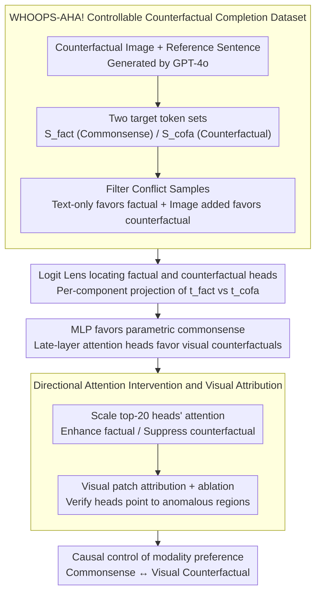

# When Seeing Overrides Knowing: Disentangling Knowledge Conflicts in Vision-Language Models

**Conference**: ACL2026  
**arXiv**: [2507.13868](https://arxiv.org/abs/2507.13868)  
**Code**: https://github.com/francescortu/Seeing-Knowing  
**Area**: Multimodal VLM  
**Keywords**: Vision-Language Models, Knowledge Conflict, Mechanistic Interpretability, Attention Heads, Visual Attribution

## TL;DR
The paper constructs WHOOPS-AHA! to trigger direct conflicts between the commonsense knowledge of VLMs and counterfactual visual evidence, finding that a small number of late-layer attention heads causally control whether the model relies on internal knowledge or visual input.

## Background & Motivation
**Background**: VLMs rely on both parametric knowledge from pre-training and current visual input. Normally, these complement each other: parametric knowledge provides world commonsense, while visual input provides scene-specific facts. However, conflicts arise when images contain anomalies or counterfactual elements, such as a wolf howling at the sun instead of the moon.

**Limitations of Prior Work**: Many studies on VLM hallucinations only observe final answer accuracy or use external attribution methods to explain the influence of image regions. They fail to explain the internal mechanisms by which a model chooses between "what it knows" (commonsense) and "what it sees" (image). Reliability is compromised if visual surface signals override knowledge or if the model over-relies on parametric knowledge in incorrect contexts.

**Key Challenge**: Models must dynamically calibrate between visual evidence and internal knowledge. Total reliance on images allows counterfactuals to override commonsense, while total reliance on parametric knowledge ignores actual visual input. The key question is whether this modality conflict is regulated by localizable and intervenable internal mechanisms.

**Goal**: The paper aims to construct a controllable dataset to induce knowledge conflicts, locate components in VLMs that support factual vs. counterfactual tokens, verify their causal roles, and check their utility for visual evidence localization.

**Key Insight**: The authors utilize a token-level completion task, designing each sample with a set of explicit factual continuations and counterfactual visual continuations. This allows direct comparison of internal component contributions to two candidate tokens using Logit Lens, rather than relying on ambiguous judgments in open-ended generation.

**Core Idea**: By creating conflicts between "seeing" and "knowing" using counterfactual images, the authors identify late-layer factual/counterfactual attention heads via logit attribution. Directional scaling of attention for these heads (relative to image/text tokens) is used to causally control the model's modality preference.

## Method

### Overall Architecture
The paper proceeds in four steps. First, it constructs the WHOOPS-AHA! dataset: based on 500 visually anomalous images from WHOOPS!, GPT-4o generates a sentence for each image that triggers commonsense completion. Two token sets are provided: $S_{fact}$ for commonsense completions and $S_{cofa}$ for counterfactual visual completions.

Second, conflict-inducing samples are filtered. For each model, a sample is retained only if the model favors the factual token $S_{fact}$ under text-only prompts but shifts to the counterfactual token $S_{cofa}$ under multimodal input.

Third, Logit Lens is used to analyze the contributions of MLPs, attention blocks, and individual attention heads in LLaVA-NeXT-7B and Gemma3-12B to $t_{fact}$ and $t_{cofa}$. It is observed that MLPs favor internal factual knowledge, while attention—specifically a few late-layer heads—favors visual counterfactual signals.

Fourth, causal intervention and visual attribution are performed. The top-20 factual/counterfactual heads are selected for multiplicative scaling of attention weights at the final token position: either enhancing factual heads' attention to text tokens or suppressing counterfactual heads' attention to image tokens. Finally, visual patches driving counterfactual output are identified and validated through patch ablation.

### Key Designs

**1. WHOOPS-AHA! Controllable Counterfactual Completion Dataset: Compressing open multimodal conflict into a token-level verifiable testbed**  
Mechanistic interpretability is difficult with open-ended Q&A. Each sample is designed as a counterfactual image, a sentence referencing it, and two explicit target token sets ($S_{fact}$ and $S_{cofa}$). For example, "The wolf is howling at the" normally completes to "moon," but with an image of a wolf howling at the sun, visual evidence pushes it toward "sun." This enables clean logit attribution by comparing $t_{fact}$ and $t_{cofa}$ directly.

**2. Logit Lens locating factual and counterfactual heads: Observing where conflicts are resolved during forward propagation**  
The authors project intermediate hidden states of the last token into the vocabulary. At the block level, factual prevalence is measured; at the head level, factual accuracy is measured. Heads that consistently increase factual token logits are "factual heads," while those favoring counterfactual tokens are "counterfactual heads." Conflict resolution is found to be concentrated in a few upper-layer heads, with MLPs favoring commonsense and specific late-layer attention heads favoring visual signals.

**3. Directional Attention Intervention and Visual Patch Attribution: Moving from correlation to causation and verifying focus on anomalous regions**  
To prove causal roles, the authors scale the final row of the attention matrix for top-20 heads: counterfactual heads have their image token attention scaled by $(1-\lambda)$, or factual heads have their text token attention scaled by $(1+\lambda)$. Successful intervention shifts the model's prediction between commonsense and visual counterfactuals. Furthermore, the patches attended to by counterfactual heads correlate with anomalous objects; ablating these patches successfully increases factual accuracy.

### Loss & Training
The paper does not train new models; it focuses on data construction, forward analysis, and inference-time intervention. Models used include LLaVA-NeXT-7B (32 layers, 32 heads/layer) and Gemma3-12B (48 layers, 16 heads/layer). Intervention strength $\lambda$ is limited to $[-3, 3]$ to avoid grammatical breakdown or repetition.

## Key Experimental Results

### Main Results
Data validation confirms high quality for text and image completions. In conflict induction experiments, adding an image significantly shifts model predictions from factual to counterfactual tokens. Mechanisms show counterfactual heads attend heavily to image tokens, and a few heads are sufficient to change model behavior.

| Experimental Item | LLaVA-NeXT | Gemma3 | Conclusion |
|--------|------|------|------|
| Conflict samples retained | 436 | 432 | Most WHOOPS-AHA! samples induce analyzable conflicts |
| Text factual token prob. | "moon" 78% | "moon" 100% | Models rely on commonsense without images |
| Multimodal counterfactual prob. | "sun" 26% (moon 17%) | "sun" 44% (moon 0.02%) | Visual input overrides internal knowledge |
| Multimodal factual accuracy | 27% | 24% | Counterfactual images systematically alter predictions |
| Counterfactual heads image attn | 61% | 52% | Much higher than model avg (22%), direct visual signal injection |
| Factual heads image attn | 29% | 25% | Lower visual focus, relies on text/parametric knowledge |
| Peak factual accuracy (Intervention)| 74% | 83% | Output can be pushed back to commonsense |

### Ablation Study
Ablations verify head selection, intervention strength, control tasks, and visual attribution quality. Intervening on random heads has no effect. POPE experiments prove these heads are not for general vision but are specifically invoked during conflicts.

| Configuration | Key Metric | Description |
|------|---------|------|
| top-20 heads intervention | Factual accuracy peaks | 20 heads provide the best balance of effect and stability |
| 100 random heads intervention | Factual accuracy unchanged | Output shift is head-specific, not due to general noise |
| POPE no image | Accuracy ~0.50 | POPE is a vision-dependent task |
| POPE suppress c-factual heads | Gemma3 0.84 stays 0.84 | Heads are not for general recognition, but conflict resolution |
| Visual CounterFact head overlap | ~50-70% overlap | Mechanism is not unique to WHOOPS-AHA! |
| Visual attribution Gemma3 | Ratio 4.41 (c-heads) | Attention heads focus more precisely than gradients (1.74) |

### Key Findings
- Modality conflict in VLMs is not managed globally; specific late-layer attention heads are the core regulators.
- Interventions are directional: enhancing factual heads or suppressing counterfactual heads restores commonsense; the reverse strengthens visual reliance.
- Counterfactual heads serve as "visual pointers," focusing specifically on the regions containing anomalous objects or attributes.

## Highlights & Insights
- The paper connects VLM hallucinations with mechanistic interpretability: rather than just stating a model is wrong, it identifies the specific heads driving visual overriding.
- The token-level design of WHOOPS-AHA! is highly suitable for mechanistic analysis, converting complex multimodal Q&A into controllable logit comparisons.
- Counterfactual heads act as both "control knobs" and "visual pointers," suggesting they could be used to monitor VLM reliability when model answers depend on conflict-prone heads.

## Limitations & Future Work
- Logit Lens is an approximate diagnostic tool; projecting non-final states can result in vocabulary distortion.
- The study focuses on late-fusion architectures (LLaVA-style). Early or mid-fusion VLMs may inject visual information differently.
- Experiments focus on representative tokens for control; extension to full captions and multi-step reasoning is required.

## Related Work & Insights
- **vs. Text-LLM Knowledge Conflict**: Extending work on text context vs. parametric knowledge to the multimodal domain.
- **vs. Gradient Attribution**: Mechanistic heads provide more precise localization of counterfactual objects than standard gradient-based attribution.
- **vs. VLM Hallucination Detection**: Provides an internal "circuit" perspective, showing hallucinations can be regulated by small-scale attention head interventions.

## Rating
- Novelty: ⭐⭐⭐⭐⭐ Locating modality conflict in specific heads using controllable counterfactual data is highly innovative.
- Experimental Thoroughness: ⭐⭐⭐⭐☆ Solid results across models and controls, though architecture coverage is limited.
- Writing Quality: ⭐⭐⭐⭐☆ Clear narrative flow from data to mechanism to intervention.
- Value: ⭐⭐⭐⭐⭐ Direct implications for VLM reliability, interpretability, and building conflict-aware monitoring tools.

<!-- RELATED:START -->

## Related Papers

- [\[ACL 2025\] Insight Over Sight: Exploring the Vision-Knowledge Conflicts in Multimodal LLMs](../../ACL2025/multimodal_vlm/conflictvis_vision_knowledge_conflict.md)
- [\[AAAI 2026\] Seeing Justice Clearly: Handwritten Legal Document Translation with OCR and Vision-Language Models](../../AAAI2026/multimodal_vlm/seeing_justice_clearly_handwritten_legal_document_translation_with_ocr_and_visio.md)
- [\[ACL 2026\] WikiSeeker: Rethinking the Role of Vision-Language Models in Knowledge-Based Visual Question Answering](wikiseeker_rethinking_the_role_of_vision-language_models_in_knowledge-based_visu.md)
- [\[CVPR 2026\] When to Think and When to Look: Uncertainty-Guided Lookback](../../CVPR2026/multimodal_vlm/when_to_think_and_when_to_look_uncertainty-guided_lookback.md)
- [\[ACL 2026\] VULCA-Bench: A Multicultural Vision-Language Benchmark for Evaluating Cultural Understanding](vulca-bench_a_multicultural_vision-language_benchmark_for_evaluating_cultural_un.md)

<!-- RELATED:END -->
