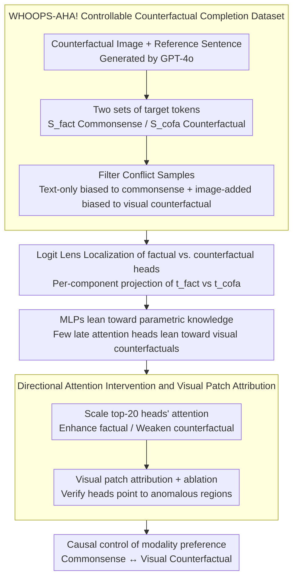

# When Seeing Overrides Knowing: Disentangling Knowledge Conflicts in Vision-Language Models

**Conference**: ACL2026  
**arXiv**: [2507.13868](https://arxiv.org/abs/2507.13868)  
**Code**: https://github.com/francescortu/Seeing-Knowing  
**Area**: Multimodal VLM  
**Keywords**: Vision-Language Models, Knowledge Conflict, Mechanistic Interpretability, Attention Heads, Visual Attribution

## TL;DR
This paper constructs WHOOPS-AHA! to put VLM commonsense knowledge into direct conflict with counterfactual visual evidence, discovering that a small number of late-layer attention heads causally control whether the model relies on internal knowledge or visual input.

## Background & Motivation
**Background**: VLMs rely simultaneously on parametric knowledge acquired during pre-training and current image inputs. Normally, these two types of information are complementary: parametric knowledge provides world commonsense, while visual inputs provide scene-specific facts. However, when an image contains abnormal or counterfactual elements, a conflict arises—for example, if commonsense suggests a wolf howls at the moon, but the image shows a wolf howling at the sun.

**Limitations of Prior Work**: Many VLM hallucination studies only observe whether the final answer is incorrect or use external attribution methods to explain the influence of image regions. They fail to provide a deep answer to how the model internally chooses between "what it knows" (commonsense) and "what it sees" (the image). Reliability is compromised if the model's knowledge is overwritten by superficial visual signals or if it over-relies on parametric knowledge in incorrect scenarios.

**Key Challenge**: Models need to dynamically calibrate between visual evidence and internal knowledge. Relying entirely on images allows counterfactual or misleading visuals to override commonsense, while relying entirely on parametric knowledge ignores legitimate visual input. The core problem is whether this modality conflict is regulated by localizable and intervenable internal mechanisms.

**Goal**: This work aims to construct a controllable dataset to induce knowledge conflicts, locate the components in VLMs that support factual and counterfactual tokens, verify whether these components play a causal role, and examine if they can serve as tools for visual evidence localization.

**Key Insight**: The authors utilize a token-level completion task, designing each sample with a set of explicit factual continuations and counterfactual visual continuations. This allows the use of Logit Lens to directly compare the logit contributions of internal components to two candidate tokens, rather than making ambiguous judgments in open-ended generation.

**Core Idea**: Induce the conflict between "seeing" and "knowing" using counterfactual images, identify late-layer factual/counterfactual attention heads via logit attribution, and perform directional scaling of attention to these heads (image vs. text) to causally control the VLM's modality preference.

## Method

### Overall Architecture
The paper unfolds in four stages. First, the WHOOPS-AHA! dataset is constructed: based on 500 visually anomalous, semantically rich images from WHOOPS!, GPT-4o generates a sentence that triggers a commonsense completion for each image, providing two sets of tokens: $S_{fact}$ representing the commonsense completion and $S_{cofa}$ representing the counterfactual visual completion.

Second, conflict samples are screened. For each model, the authors select the factual token with the highest probability under a text-only prompt, and the counterfactual token with the highest probability under multimodal input. Only samples that lean toward commonsense in text-mode but toward visual counterfactuals after adding the image are retained for mechanistic analysis.

Third, Logit Lens is used to analyze the contributions of MLPs, attention blocks, and individual attention heads in LLaVA-NeXT-7B and Gemma3-12B toward $t_{fact}$ and $t_{cofa}$. The authors find that MLPs lean more toward internal factual knowledge, while attention—particularly a few late-layer heads—leans toward visual counterfactual signals.

Fourth, causal intervention and visual attribution are performed. The authors select the top-20 most factual/counterfactual supportive heads and apply multiplicative scaling to the attention weights at the final token position: either enhancing factual heads' attention to text tokens or weakening counterfactual heads' attention to image tokens, and vice versa. Attention and gradient methods are then used to identify the image patches driving the counterfactual output, followed by patch ablation to verify if these regions truly cause the visual override.

### Key Designs

**1. WHOOPS-AHA! Controllable Counterfactual Completion Dataset: Compressing open-ended multimodal conflicts into token-level verifiable testbeds**

Mechanistic interpretability is hardest with open questions where it's unclear if the model favors commonsense or the image. Each sample consists of a counterfactual image, a sentence referencing it, and two target token sets: $S_{fact}$ and $S_{cofa}$. For example, for "The wolf is howling at the", the text-only model might complete with "moon," but with an image of a wolf howling at the sun, visual evidence pushes it toward "sun." This design compresses complex Q&A into a pair of controllable candidate tokens, allowing Logit Lens to perform clean attribution by comparing logits of $t_{fact}$ and $t_{cofa}$ across components.

**2. Logit Lens for Identifying factual and counterfactual heads: Observing where and how conflicts are resolved during the forward pass**

To investigate internal decision-making, the authors perform vocabulary projection on intermediate hidden states at the last token position, comparing logits for $t_{fact}$ and $t_{cofa}$. They calculate factual prevalence at the block level and factual accuracy at the head level. A head that consistently boosts the factual token's logit is a factual head; otherwise, it is a counterfactual head. The key conclusion is that conflict resolution is not averaged across the model but concentrated in specific upper-layer heads—MLPs remain biased toward commonsense, while specific late-layer attention heads prioritize visual signals.

**3. Directional Attention Intervention and Visual Patch Attribution: Upgrading from correlation to causation and verifying spatial focus**

Since high-ranking heads might merely correlate with the output, the authors intervene on the top-20 factual/counterfactual heads. At the final token position, they modify the last row of the attention matrix: for counterfactual heads, they scale down attention to image tokens by $(1-\lambda)$; for factual heads, they scale up attention to text tokens by $(1+\lambda)$. Directional intervention successfully shifts the model between trusting its knowledge and trusting the image.

The authors then ask: what are these counterfactual heads looking at? They ablate high-scoring patches identified by attention, gradients, and random selection. Results show these heads focus on the patches containing the abnormal object or attribute; removing them restores factual accuracy, proving these heads act as visual pointers to the source of conflict.

### Loss & Training
The study does not train new models, focusing on data construction, forward-pass analysis, and inference-time intervention. Models include LLaVA-NeXT-7B (32 layers, 32 heads/layer) and Gemma3-12B (48 layers, 16 heads/layer). Intervention strength $\lambda$ is limited to $[-3, 3]$, as $|\lambda| > 10$ leads to ungrammatical or repetitive outputs.

## Key Experimental Results

### Main Results
Data validation confirms high quality for text and image completions. In conflict induction experiments, adding the image significantly pushes the model from factual tokens to counterfactual ones. Mechanistic analysis reveals that counterfactual heads focus more strongly on image tokens, and a small number of heads are sufficient to shift the model's behavior.

| Experiment Item | LLaVA-NeXT | Gemma3 | Conclusion |
|-------|------|------|------|
| Conflict Samples Retained | 436 | 432 | Most WHOOPS-AHA! samples form analyzable conflicts |
| Text-only Factual Token | "moon" prob 78% | "moon" prob 100% | Relies on commonsense without image |
| Image-added Counterfactual Token | "sun" prob 26% | "sun" prob 44% | Visual input overrides internal knowledge |
| Post-image Factual Accuracy | 27% | 24% | Counterfactual images systematically alter prediction |
| Counterfactual Heads Image Attention | 61% | 52% | Much higher than model avg (22%) |
| Factual Heads Image Attention | 29% | 25% | Less attention to image, biased to text/parametric knowledge |
| Peak Factual Accuracy (Intervention) | 74% | 83% | Enhancing factual/suppressing counterfactual heads restores commonsense |

### Ablation Study
Ablations verify head selection, intervention strength, control tasks, and visual attribution quality. Intervening on random heads has no effect. The POPE control experiment proves counterfactual heads are not just general visual recognition heads, and Visual CounterFact shows cross-dataset stability.

| Configuration | Key Metrics | Explanation |
|------|---------|------|
| Top-20 Heads Intervention | Factual accuracy peaks | 20 heads provide the best balance of effect and stability |
| 100 Random Heads Intervention | Factual accuracy unchanged | Changes stem from specific heads, not arbitrary perturbation |
| POPE No Image | Accuracy ~0.50 (both) | POPE is a legitimate visual dependency task |
| POPE Suppress Counterfactual Heads | Gemma3 0.84→0.84, LLaVA 0.87→0.87 | These heads are task-specific for conflict resolution |
| Visual CounterFact Head Overlap | Counterfactual 13-14/20, Factual 10/20 | Conflict mechanism is not unique to WHOOPS-AHA! |
| Visual Attribution (Gemma3) | Counterfactual ratio 4.41 vs Gradient 1.74 | Attention heads focus more accurately on anomalous objects |
| Visual Attribution (LLaVA-NeXT) | Counterfactual ratio 2.05 vs Gradient 1.88 | Attention heads significantly outperform random and gradient baselines |

### Key Findings
- Modality conflicts in VLMs are not handled uniformly. A small set of late-layer attention heads act as core regulators; attention blocks favor visual counterfactuals, while MLP blocks favor parametric knowledge.
- Intervention is directional. Strengthening factual heads and weakening counterfactual heads pushes the model back to internal knowledge; the reverse nudges the model to trust the image more.
- Counterfactual heads possess interpretable visual localization abilities. They focus on patches containing anomalous objects, and ablating these patches increases factual accuracy.

## Highlights & Insights
- The paper elegantly links VLM hallucinations to mechanistic interpretability: rather than just identifying errors, it pinpoints the specific heads driving visual overrides.
- The token-level design of WHOOPS-AHA! is excellent for mechanistic interpretability, as it simplifies complex multimodal Q&A into discrete, verifiable candidate tokens.
- The finding that counterfactual heads act as both "control knobs" and "visual pointers" is inspiring. Such heads could be used in the future to monitor VLM reliability: triggering validation when a model's answer relies on high-conflict heads.

## Limitations & Future Work
- Logit Lens is an approximate diagnostic tool; projecting non-final residual states to the vocabulary may involve distortion. Head rankings should not be seen as absolute decoding.
- The experiments focus on late-fusion architectures like LLaVA-NeXT. Whether early-fusion or mid-fusion VLMs share these specific late-layer conflict heads requires verification.
- The study uses representative tokens for control; expansion to full captions, long-form Q&A, and multi-step visual reasoning is needed for real-world scenarios.

## Related Work & Insights
- **vs. Text-LLM Knowledge Conflict**: Following Ortu et al.'s work on text-context vs. parametric knowledge, this paper extends the problem to vision-parametric conflict, suggesting similar competition mechanisms exist in multimodal models.
- **vs. Gradient Visual Attribution**: While gradient methods identify influential patches, they are often less precise than counterfactual heads in locating anomalous objects. Mechanistically located heads offer a more "semantic" attribution channel.
- **vs. VLM Hallucination Detection**: Traditional work diagnoses hallucinations at the output or data level; this work provides an internal circuit perspective, showing how hallucinations can be regulated via small-scale attention head interventions.

## Rating
- Novelty: ⭐⭐⭐⭐⭐ Locating VLM knowledge conflicts to specific attention heads with causal proof is highly original.
- Experimental Thoroughness: ⭐⭐⭐⭐☆ Main experiments, controls, and cross-dataset transfers are robust, though architecture coverage is limited.
- Writing Quality: ⭐⭐⭐⭐☆ The narrative flow from data to mechanism to intervention is logical and well-supported.
- Value: ⭐⭐⭐⭐⭐ Direct implications for VLM reliability, mechanistic interpretability, and controllable generation.

<!-- RELATED:START -->

## Related Papers

- [\[ACL 2025\] Insight Over Sight: Exploring the Vision-Knowledge Conflicts in Multimodal LLMs](../../ACL2025/multimodal_vlm/conflictvis_vision_knowledge_conflict.md)
- [\[AAAI 2026\] Seeing Justice Clearly: Handwritten Legal Document Translation with OCR and Vision-Language Models](../../AAAI2026/multimodal_vlm/seeing_justice_clearly_handwritten_legal_document_translation_with_ocr_and_visio.md)
- [\[ACL 2026\] WikiSeeker: Rethinking the Role of Vision-Language Models in Knowledge-Based Visual Question Answering](wikiseeker_rethinking_the_role_of_vision-language_models_in_knowledge-based_visu.md)
- [\[CVPR 2025\] Seeing the Abstract: Translating the Abstract Language for Vision Language Models](../../CVPR2025/multimodal_vlm/seeing_the_abstract_translating_the_abstract_language_for_vision_language_models.md)
- [\[ACL 2026\] VULCA-Bench: A Multicultural Vision-Language Benchmark for Evaluating Cultural Understanding](vulca-bench_a_multicultural_vision-language_benchmark_for_evaluating_cultural_un.md)

<!-- RELATED:END -->
