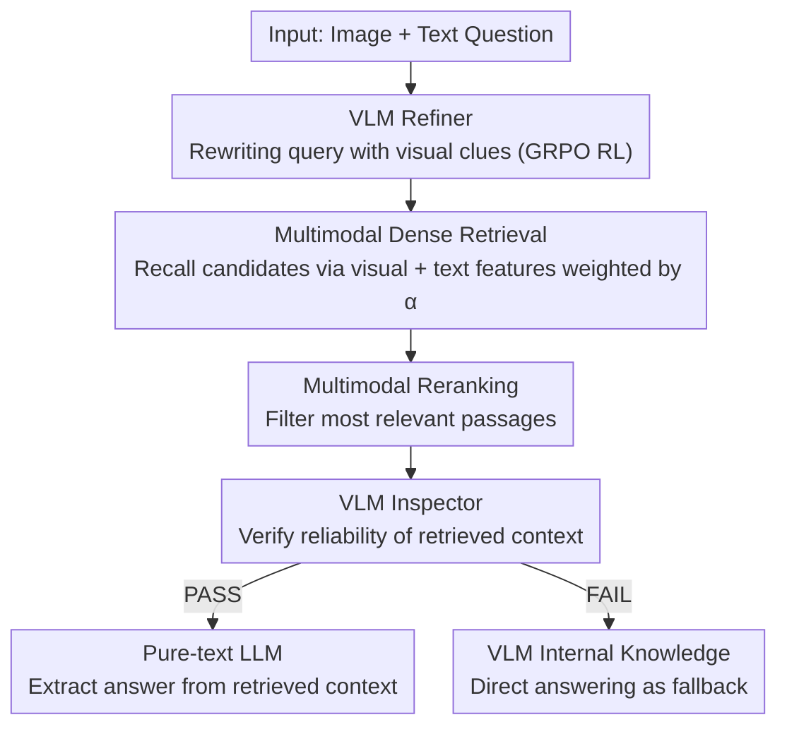

# WikiSeeker: Rethinking the Role of Vision-Language Models in Knowledge-Based Visual Question Answering

**Conference**: ACL 2026 Findings  
**arXiv**: [2604.05818](https://arxiv.org/abs/2604.05818)  
**Code**: [https://github.com/zhuyjan/WikiSeeker](https://github.com/zhuyjan/WikiSeeker)  
**Area**: Multimodal VLM  
**Keywords**: Knowledge-based VQA, Multimodal RAG, Query Rewriting, Reinforcement Learning, Retrieval-Augmented Generation

## TL;DR

WikiSeeker is proposed to redefine the role of VLMs in multimodal RAG—transitioning from simple answer generators to two specialized agents: a Refiner trained with RL to rewrite queries, and an Inspector to verify the reliability of retrieved context. This approach achieves SOTA results on EVQA, InfoSeek, and M2KR benchmarks.

## Background & Motivation

**Background**: Multimodal Retrieval-Augmented Generation (RAG) is the dominant paradigm for Knowledge-Based Visual Question Answering (KB-VQA). It involves retrieving relevant documents from an external knowledge base based on the query, concatenating them with the input, and feeding them into a generative model to produce an answer.

**Limitations of Prior Work**: (1) **Vision-only Retrieval**: Most methods rely solely on the query image as the retrieval key, ignoring semantic information in the text query, which leads to poor retrieval when visual content is ambiguous. (2) **VLM Role Misalignment**: VLMs are typically used only as final answer generators. However, experiments show that VLMs are less effective than pure-text LLMs at extracting answers from retrieved context—image tokens often act as noise rather than useful signals during the extraction phase.

**Key Challenge**: The visual understanding capability of VLMs is valuable during the retrieval and verification stages (identifying entities in images, judging match quality), but becomes a burden during the answer extraction stage (visual tokens interfere with text reading comprehension).

**Goal**: Redesign the role of VLMs in multimodal RAG to fully leverage their visual capabilities for improved retrieval and verification, while delegating answer extraction to pure-text LLMs which excel at this task.

**Key Insight**: Empirical results demonstrate that as the proportion of correct information in the retrieved context increases, the VQA performance of pure-text LLMs eventually exceeds that of VLMs with image inputs (e.g., at Ratio=1.0, Qwen achieves 93.45% vs. QwenVL(I+T) at 88.46%).

**Core Idea**: Reposition the VLM as a Refiner (rewriting queries with visual clues to improve retrieval) and an Inspector (verifying context reliability and routing decisions), while handing answer generation to a pure-text LLM.

## Method

### Overall Architecture

WikiSeeker consists of three stages: (1) **Retrieval**: The VLM Refiner expands the original question, and a multimodal retriever (concatenating visual and text embeddings) retrieves candidate documents. (2) **Reranking**: A multimodal reranker filters the most relevant passages. (3) **Generation**: The VLM Inspector evaluates whether the retrieved context is sufficient. If it passes, the query is routed to a pure-text LLM for answer generation; if it fails, the VLM answers directly using its internal knowledge.

### Key Designs

**1. VLM as Refiner: Rewriting brief queries using visual clues for better retrieval via RL self-learning**

In KB-VQA, user queries are often short and abstract, introducing noise during retrieval. However, images contain critical entity clues. The authors use Qwen2.5-VL-3B-Instruct as a Refiner to expand the original question into a more informative retrieval query by incorporating visual cues. The model generates CoT reasoning within `<think>` tags and the rewritten query within `<answer>` tags. Since "gold queries" are unavailable, the authors employ GRPO for reinforcement learning. The reward consists of two parts: a format reward checking XML structure, and a retrieval reward based on the ranking of the correct entity using the rewritten query (top-5 gets +4, with rewards decreasing per tier up to top-200, and -2.5 for misses). This allows the Refiner to discover optimal rewriting strategies based on "retrieval success" signals without expensive human annotation.

**2. Multimodal Dense Retrieval (Weighted Concatenation): Enabling joint retrieval via tunable visual and text features**

Vision-only retrieval ignores text semantics and fails when images are blurry. The authors organize the knowledge base as <image, passage> pairs, using EVA-CLIP-8B for vision and Qwen3-Embedding-0.6B for text, concatenated into a unified vector. During retrieval, weighted concatenation is applied to the query side:

$$\mathbf{v}_q = \text{Concat}[\alpha \cdot \Phi_{vis}(I_q),\ (1-\alpha) \cdot \Phi_{text}(T_q)]$$

The hyperparameter $\alpha$ controls the relative weight of visual and text features, acting as a tunable balance—relying more on images when they are clear and more on text when images are ambiguous.

**3. VLM as Inspector: Verifying context reliability to decide the final generator**

This step addresses the counter-intuitive finding that VLMs are good at judging the alignment between images and retrieved results but poor at extracting answers from text when image tokens are present. The Inspector (VLM) receives the image, question, and reranked passages to output a judgment $s \in \{\text{PASS}, \text{FAIL}\}$ and an internal knowledge answer $A_{internal}$. If PASS, the rewritten query and context are sent to a pure-text LLM (e.g., LLaMA/Qwen) to perform extraction. If FAIL, indicating unreliable retrieval, the VLM's internal knowledge answer is used as a fallback. This decoupling ensures each component performs its strongest function rather than blindly trusting retrieval or parametric knowledge.

### Loss & Training

The Refiner is trained using GRPO, with the total reward $r_i = r_{retrieval}(o_i) + r_{format}(o_i)$. The retrieval reward is a discrete mapping based on hit rank (top-5: +4, top-200: +0.1, miss: -2.5), and the format reward checks XML tag correctness (+1/-4). The training set includes 7,000 samples per benchmark, sampled stratifically by hit rank.

## Key Experimental Results

### Main Results

Retrieval results on EVQA and InfoSeek (R@1):

| Method | EVQA R@1 | EVQA R@20 | InfoSeek R@1 | InfoSeek R@20 |
|------|---------|----------|-------------|--------------|
| EchoSight | 36.5 | 48.8 | 53.2 | 77.9 |
| OMGM | 42.8 | 58.7 | 64.0 | 84.8 |
| WikiSeeker (w/o Refiner) | 28.0 | 43.4 | 53.5 | 78.5 |
| WikiSeeker (w. Refiner) | **44.1** | **62.3** | **67.0** | **87.7** |

The Refiner improves EVQA R@1 from 28.0 to 44.1 (+57.5%), outperforming all baselines.

### Ablation Study

| Configuration | Key Metric | Description |
|------|---------|------|
| w/o Refiner | R@1 28.0 (EVQA) | Basic multimodal retrieval |
| w. Refiner | R@1 44.1 (EVQA) | Query rewriting significantly boosts retrieval |
| VLM Gen vs LLM Gen | 88.46% vs 93.45% (Ratio=1.0) | LLM is superior with reliable context |
| w/o Inspector | Decrease | LLM is misled by unreliable context |

### Key Findings

- VLMs are indeed inferior to pure-text LLMs during the answer generation phase: as the ratio of correct information in the context increases (Ratio=0.3→1.0), the LLM's advantage becomes more pronounced.
- The RL-trained Refiner significantly outperforms SFT: RL allows the model to automatically learn how to rewrite queries to maximize retrieval hit rates.
- The Inspector's routing strategy is crucial in unreliable retrieval scenarios—the VLM's internal knowledge compensates for retrieval failure via the FAIL path.
- SOTA performance is also achieved on the M2KR multi-task benchmark, proving the generalizability of the method.

## Highlights & Insights

- The empirical finding that **"VLMs underperform LLMs in answer extraction"** is significant and counter-intuitive—caused by visual tokens becoming noise once the correct text context is retrieved. This suggests a principle of "using the right model for the right task" in RAG systems.
- **Training query rewriting with RL** is an elegant self-supervised solution—using retrieval rank as a reward signal eliminates the need for human-annotated rewrites. GRPO's group relative advantage estimation avoids the overhead of training a critic model.
- The Inspector's dual-path design achieves an elegant fusion of retrieval-augmentation and parametric knowledge—it doesn't simply "always use retrieval" or "always use internal knowledge," but chooses dynamically based on reliability.

## Limitations & Future Work

- The Inspector's PASS/FAIL judgment is a hard decision, which may lead to misclassifications in edge cases.
- The Refiner uses a smaller VLM (3B); larger models might produce even better query rewrites.
- Knowledge base construction depends on LLM summarization of long passages; summary quality affects retrieval performance.
- Validated only on encyclopedic KB-VQA; effectiveness on commonsense reasoning VQA is unknown.

## Related Work & Insights

- **vs EchoSight/OMGM**: These use VLMs for answer generation and vision-only retrieval. WikiSeeker repositions the VLM as Refiner+Inspector, hands generation to an LLM, and upgrades retrieval to multimodal. It outperforms OMGM by 1.3 points on EVQA R@1.
- **vs ReflectiVA**: ReflectiVA introduces a reflection mechanism to judge the need for external knowledge but still uses a VLM for generation. WikiSeeker’s decoupling strategy more fundamentally addresses the noise issue of VLMs during answer extraction.

## Rating

- Novelty: ⭐⭐⭐⭐ The insight on VLM role repositioning is valuable, and the RL Refiner is elegant, though the overall framework is a clever combination of existing techniques.
- Experimental Thoroughness: ⭐⭐⭐⭐⭐ Comprehensive evaluation across three benchmarks, multiple ablations, and a systematic VLM vs. LLM comparison.
- Writing Quality: ⭐⭐⭐⭐ Motivation and methods are clearly described; the design of experiments in Table 2 is persuasive.
- Value: ⭐⭐⭐⭐ Provides direct guidance for the role design of VLMs in multimodal RAG systems.

<!-- RELATED:START -->

## Related Papers

- [\[CVPR 2026\] StaR-KVQA: Structured Reasoning Traces for Implicit-Knowledge Visual Question Answering](../../CVPR2026/multimodal_vlm/star-kvqa_structured_reasoning_traces_for_implicit-knowledge_visual_question_ans.md)
- [\[ACL 2025\] MAGIC-VQA: Multimodal and Grounded Inference with Commonsense Knowledge for Visual Question Answering](../../ACL2025/multimodal_vlm/magic-vqa_multimodal_and_grounded_inference_with_commonsense_knowledge_for_visua.md)
- [\[ICCV 2025\] ReasonVQA: A Multi-hop Reasoning Benchmark with Structural Knowledge for Visual Question Answering](../../ICCV2025/multimodal_vlm/reasonvqa_a_multi-hop_reasoning_benchmark_with_structural_knowledge_for_visual_q.md)
- [\[CVPR 2026\] VQ-VA World: Towards High-Quality Visual Question-Visual Answering](../../CVPR2026/multimodal_vlm/vq-va_world_towards_high-quality_visual_question-visual_answering.md)
- [\[CVPR 2026\] Does Language Shift Break Medical Vision-Language Models? Indonesian Radiology Visual Question Answering Case Study](../../CVPR2026/multimodal_vlm/does_language_shift_break_medical_vision-language_models_indonesian_radiology_vi.md)

<!-- RELATED:END -->
