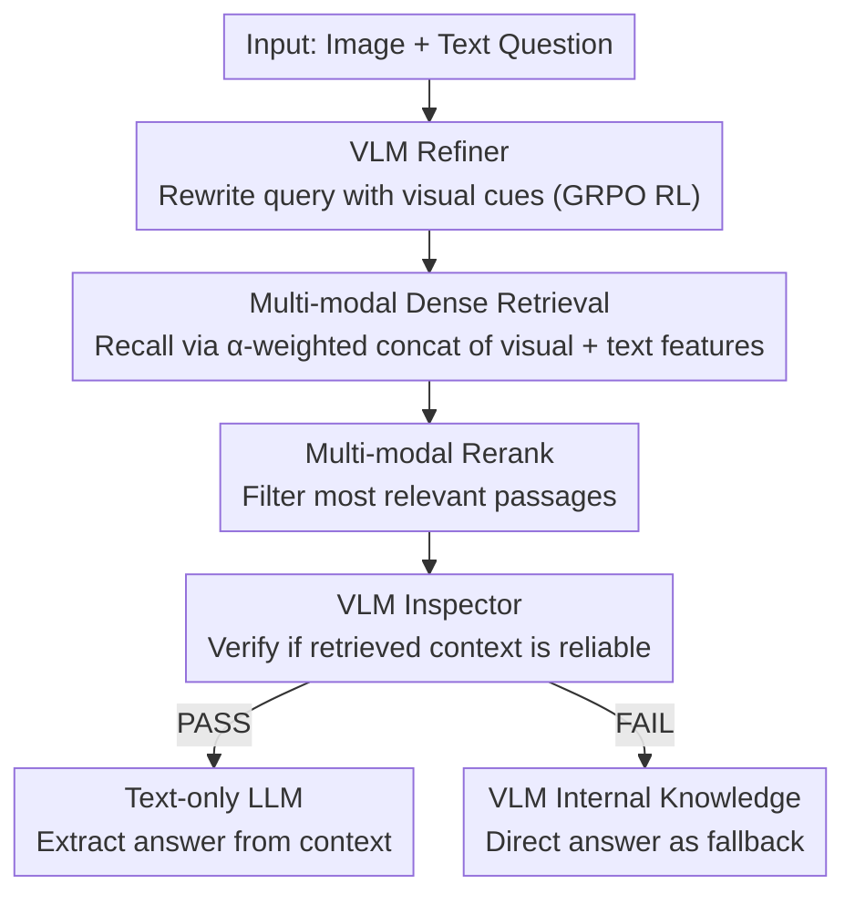

# WikiSeeker: Rethinking the Role of Vision-Language Models in Knowledge-Based Visual Question Answering

**Conference**: ACL 2026 Findings  
**arXiv**: [2604.05818](https://arxiv.org/abs/2604.05818)  
**Code**: [https://github.com/zhuyjan/WikiSeeker](https://github.com/zhuyjan/WikiSeeker)  
**Area**: Multi-modal VLM  
**Keywords**: KB-VQA, Multi-modal RAG, Query Rewriting, Reinforcement Learning, Retrieval-Augmented Generation

## TL;DR

WikiSeeker is proposed to redefine the role of VLMs in multi-modal RAG—transforming them from mere answer generators into two specialized agents: a Refiner trained via RL for query rewriting and an Inspector to verify the reliability of retrieved context. It achieves SOTA performance on EVQA, InfoSeek, and M2KR benchmarks.

## Background & Motivation

**Background**: Multi-modal Retrieval-Augmented Generation (RAG) is the mainstream paradigm for Knowledge-Based Visual Question Answering (KB-VQA). It retrieves relevant documents from external knowledge bases and concatenates them with the input query to produce answers using a generative model.

**Limitations of Prior Work**: (1) **Pure Visual Retrieval**: Most methods use only the query image as the retrieval key, ignoring semantic information in the text query, which leads to poor performance when visual content is ambiguous. (2) **VLM Role Mismatch**: VLMs are typically used only as final answer generators. However, experiments show that VLMs are actually less effective than text-only LLMs at extracting answers from retrieved context—image tokens often act as noise rather than useful signals during the extraction phase.

**Key Challenge**: The visual understanding capability of VLMs is valuable during retrieval and verification (identifying entities and matching results) but becomes a burden during answer extraction (visual tokens interfere with text comprehension).

**Goal**: Redesign the role of VLMs in multi-modal RAG to fully leverage visual understanding for improving retrieval and verification, while delegating answer extraction to text-only LLMs.

**Key Insight**: Experimental results demonstrate that as the proportion of correct information in the retrieved context increases, the VQA performance of text-only LLMs surpasses that of VLMs with image inputs (e.g., at Ratio=1.0, Qwen reaches 93.45% vs. QwenVL(I+T) at 88.46%).

**Core Idea**: Reposition the VLM as a Refiner (rewriting queries with visual cues to improve retrieval) and an Inspector (verifying context reliability and routing decisions), while leaving answer generation to a text-only LLM.

## Method

### Overall Architecture

WikiSeeker consists of three stages: (1) **Retrieval**: The VLM Refiner expands the original question, and a multi-modal retriever (concatenating visual and text embeddings) recalls candidate documents; (2) **Reranking**: A multi-modal reranker filters the most relevant passages; (3) **Generation**: The VLM Inspector evaluates if the retrieved context is sufficient—if it passes, the task is routed to a text-only LLM for answer extraction; otherwise, the VLM answers directly using its internal knowledge.

### Key Designs

**1. VLM as Refiner: Query rewriting with visual cues via RL self-learning**

In KB-VQA, user queries are often short and abstract, introducing noise during retrieval, whereas images contain critical entity cues. The authors use Qwen2.5-VL-3B-Instruct as the Refiner to expand the original question into an informative retrieval query. The model generates CoT reasoning within `<think>` tags and the rewritten result within `<answer>` tags. To overcome the lack of labeled "good queries," Group Relative Policy Optimization (GRPO) is used for reinforcement learning. The reward consists of a format reward (XML structure) and a retrieval reward based on the hit rank of the correct entity (e.g., +4 for top-5, decreasing tiers down to top-200, and -2.5 for a miss). This allows the Refiner to discover optimal rewriting strategies using "retrieval success" as a signal, bypassing the need for expensive human-annotated query pairs.

**2. Multi-modal Dense Retrieval (Weighted Concatenation Strategy)**

Pure visual retrieval loses text semantics, while pure text retrieval fails with ambiguous images. The knowledge base is organized as <image, passage> pairs, using EVA-CLIP-8B for visual encoding and Qwen3-Embedding-0.6B for text encoding. During retrieval, the query side uses a weighted concatenation:

$$\mathbf{v}_q = \text{Concat}[\alpha \cdot \Phi_{vis}(I_q),\ (1-\alpha) \cdot \Phi_{text}(T_q)]$$

The hyperparameter $\alpha$ balances modalities, allowing the system to rely more on text when the image is blurry and more on visual features when they are clear.

**3. VLM as Inspector: Verifying context reliability and routing generation**

This step addresses the counter-intuitive finding that VLMs are good at judging if retrieval results match an image but poor at extracting answers from text context due to visual token interference. The Inspector (VLM) receives the image, question, and reranked passages to output a judgment $s \in \{\text{PASS}, \text{FAIL}\}$ and an internal knowledge answer $A_{internal}$. If "PASS," the rewritten query and context are sent to a text-only LLM (e.g., Llama/Qwen) for extraction. If "FAIL," the VLM's internal knowledge serves as a fallback. This decoupling ensures each component performs its strongest function.

### Loss & Training

The Refiner is trained using GRPO with a total reward $r_i = r_{retrieval}(o_i) + r_{format}(o_i)$. Retrieval rewards are mapped from hit ranks (top-5: +4, top-200: +0.1, miss: -2.5). Format rewards check for correct XML tags (+1/-4). The training set includes 7,000 samples per benchmark, sampled via stratified hit ranks.

## Key Experimental Results

### Main Results

Retrieval results (R@1) on EVQA and InfoSeek:

| Method | EVQA R@1 | EVQA R@20 | InfoSeek R@1 | InfoSeek R@20 |
|------|---------|----------|-------------|--------------|
| EchoSight | 36.5 | 48.8 | 53.2 | 77.9 |
| OMGM | 42.8 | 58.7 | 64.0 | 84.8 |
| WikiSeeker (w/o Refiner) | 28.0 | 43.4 | 53.5 | 78.5 |
| WikiSeeker (w. Refiner) | **44.1** | **62.3** | **67.0** | **87.7** |

The Refiner improves EVQA R@1 from 28.0 to 44.1 (+57.5%), outperforming all baselines.

### Ablation Study

| Configuration | Key Metric | Description |
|------|---------|------|
| w/o Refiner | R@1 28.0 (EVQA) | Basic multi-modal retrieval |
| w. Refiner | R@1 44.1 (EVQA) | Query rewriting significantly boosts retrieval |
| VLM Gen vs LLM Gen | 88.46% vs 93.45% (Ratio=1.0) | LLM is superior with reliable context |
| w/o Inspector | Decrease | LLM is misled by unreliable context |

### Key Findings

- VLMs are indeed inferior to text-only LLMs in the answer generation phase: as the ratio of correct information in the context increases, the LLM advantage becomes more pronounced.
- RL-trained Refiner significantly outperforms SFT; RL allows the model to learn rewriting strategies that maximize retrieval hits.
- The Inspector's routing strategy is essential in unreliable retrieval scenarios, where VLM internal knowledge compensates for retrieval failures.
- SOTA results on the M2KR multi-task benchmark demonstrate the generalizability of the method.

## Highlights & Insights

- The empirical finding that **"VLMs are inferior to LLMs at answer extraction"** is critical—visual tokens become noise once correct text context is available. This suggests that RAG systems should "use the right model for the right task."
- **RL for query rewriting** provides an elegant self-supervised solution—using retrieval rank as a reward avoids the need for human labels. GRPO's group-relative advantage estimation avoids the overhead of a critic model.
- The Inspector's dual-path design achieves an elegant fusion of retrieval-augmentation and parametric knowledge, dynamically selecting based on reliability rather than simply trusting one source.

## Limitations & Future Work

- The Inspector's PASS/FAIL judgment is a hard decision, which may lead to misjudgments in boundary cases.
- The Refiner uses a relatively small VLM (3B); larger models might produce better query rewrites.
- Knowledge base construction depends on LLM summarization of long passages, affecting retrieval quality.
- The method is validated on encyclopedic KB-VQA; its effectiveness on common-sense reasoning VQA is yet to be explored.

## Related Work & Insights

- **vs EchoSight/OMGM**: These utilize VLMs for answer generation and pure visual retrieval. WikiSeeker repositions the VLM as Refiner+Inspector, delegates answer generation to an LLM, and upgrades retrieval to multi-modal. It exceeds OMGM by 1.3 percentage points on EVQA R@1.
- **vs ReflectiVA**: ReflectiVA introduces a reflection mechanism to judge the need for external knowledge but still uses a VLM for generation. WikiSeeker's decoupling strategy more fundamentally addresses the noise issue of VLMs during the extraction phase.

## Rating

- Novelty: ⭐⭐⭐⭐ The insight into VLM role repositioning is valuable; RL for Refiner is elegant.
- Experimental Thoroughness: ⭐⭐⭐⭐⭐ Extensive comparison across three benchmarks and systematic VLM vs. LLM analysis.
- Writing Quality: ⭐⭐⭐⭐ Clear motivation and methodology; Table 2 experimental design is highly persuasive.
- Value: ⭐⭐⭐⭐ Provides direct guidance for the architectural design of multi-modal RAG systems.

<!-- RELATED:START -->

## Related Papers

- [\[CVPR 2026\] CC-VQA: Conflict- and Correlation-Aware Method for Mitigating Knowledge Conflict in Knowledge-Based Visual Question Answering](../../CVPR2026/multimodal_vlm/cc-vqa_conflict-_and_correlation-aware_method_for_mitigating_knowledge_conflict_.md)
- [\[ICLR 2026\] Knowledge Exchange with Confidence: Cost-Effective LLM Integration for Reliable and Efficient Visual Question Answering](../../ICLR2026/multimodal_vlm/knowledge_exchange_with_confidence_cost-effective_llm_integration_for_reliable_a.md)
- [\[ACL 2025\] MAGIC-VQA: Multimodal and Grounded Inference with Commonsense Knowledge for Visual Question Answering](../../ACL2025/multimodal_vlm/magic-vqa_multimodal_and_grounded_inference_with_commonsense_knowledge_for_visua.md)
- [\[CVPR 2026\] VQ-VA World: Towards High-Quality Visual Question-Visual Answering](../../CVPR2026/multimodal_vlm/vq-va_world_towards_high-quality_visual_question-visual_answering.md)
- [\[CVPR 2026\] VKG-QA: Visual Knowledge Graph-based Question Answer for Large Multimodal Models](../../CVPR2026/multimodal_vlm/vkg-qa_visual_knowledge_graph-based_question_answer_for_large_multimodal_models.md)

<!-- RELATED:END -->
