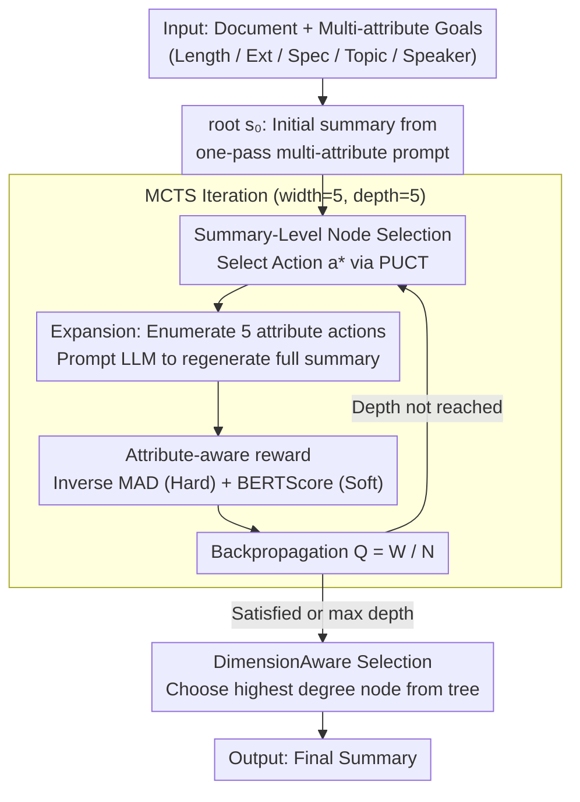

# Adaptive Planning for Multi-Attribute Controllable Summarization with Monte Carlo Tree Search

**Conference**: ACL 2026  
**arXiv**: [2509.26435](https://arxiv.org/abs/2509.26435)  
**Code**: Not yet public  
**Area**: Text Generation / Controllable Summarization  
**Keywords**: Controllable Summarization, Multi-attribute Control, MCTS, Training-free, Sequential Planning

## TL;DR
This paper proposes PACO, which reformulates "multi-attribute controllable summarization" as a planning problem to find an "attribute control sequence." Using a customized Monte Carlo Tree Search (where nodes are full summaries and actions are single-attribute adjustments), it identifies the optimal adjustment path during the prompting stage without any attribute-specific training. With Llama-3.2-1B, it achieves controllability comparable to the Llama-3.3-70B baseline, while Llama-3.3-70B + PACO surpasses all existing methods.

## Background & Motivation

**Background**: Controllable summarization generates summaries according to multiple user-specified attributes (length, extractiveness, specificity, topic, speaker, etc.). Existing mainstream solutions involve either MoE (e.g., HydraSum learning one attribute per decoder) or hard prompt + soft prefix tuning (e.g., MACSum). Both require fine-tuning for each individual attribute, leading to poor flexibility and difficulty in generalizing to unseen combinations of preferences.

**Limitations of Prior Work**: (1) **Complex correlation between attributes**—for example, increasing extractiveness may passively change length, and adjusting specificity may affect topic alignment. Simultaneously forcing all attributes in a single decoding pass often leads to a "whack-a-mole" effect. (2) The autoregressive generation of LLMs is inherently ill-suited for satisfying multiple numerical constraints in a single forward pass. (3) Even if one considers "step-by-step adjustment," the number of possible adjustment orders explodes with the number of attributes, lacking a systematic exploration mechanism.

**Key Challenge**: There is a structural conflict between "one-pass satisfaction of all constraints" and the "token-by-token generation paradigm" of language models. Furthermore, the search space for "which order to adjust attributes" is too large to be covered by manual heuristics.

**Goal**: (1) Replace attribute-specific fine-tuning with an inference-time method to achieve a training-free approach; (2) Convert "multi-attribute satisfaction" from a single-pass generation problem into a sequential decision-making problem; (3) Use a search algorithm to automatically find the optimal control sequence.

**Key Insight**: Summarization attribute control is essentially "iterative modification"—humans adjust summaries by "first fixing the length, then checking the topic, then refining named entity density." If each single-attribute adjustment is viewed as an action in an MDP and the current summary as a state, attribute control becomes a tree search problem in the summary space.

**Core Idea**: Perform planning using MCTS at the summary level (rather than the token level)—where a Node = a complete summary, an Action = adjusting a specific attribute, and a Reward = alignment with target attributes. This avoids the search space explosion of token-level MCTS in long text generation while systematically exploring optimal adjustment paths.

## Method

### Overall Architecture
PACO models multi-attribute controllable summarization as an MDP: state $s$ = current summary (including all historical adjustments), action $a \in \{ext, len, spc, top, spk\}$ = adjusting a specific attribute, root $s_0$ = initial summary obtained by prompting all attributes at once. The LLM acts as the policy $\pi$, and each action is implemented by "prompting the LLM to regenerate a summary optimized specifically for that attribute." The termination condition is when all attributes are satisfied or the maximum depth is reached. After the MCTS run, the node with the highest degree (attribute alignment) is selected from the entire tree as the final output—this is crucial as PACO does not force the repair of all attributes but finds the best compromise.

### Key Designs

**1. Summary-Level MCTS Node Design: Moving granularity from token-level to summary-level**

Traditional LLM-MCTS defines nodes at the token or sentence level. However, a summary can easily contain thousands of tokens, causing the search space to explode, and partial token sequences cannot be evaluated for attribute satisfaction. PACO defines each node as a **complete summary**: during expansion, all actions are enumerated (all five attributes are legal actions, even if previously adjusted), and the LLM regenerates $s_{t+1}$ based on the full history $s_0, s_1, \ldots, s_t$. The selection step uses a PUCT variant $a = \arg\max_a[Q(s,a) + U(s,a)]$, where $U(s,a) = c_{\text{puct}}\cdot\pi_\theta(s,a)\cdot\sqrt{\sum_b N(s,b)}/(1+N(s,a))$, and $c_{\text{puct}}$ dynamically adjusts exploration/exploitation logarithmically based on visit counts.

Retrying the same attribute is permitted because subsequent actions often disrupt previously optimized ones (e.g., adjusting specificity might inadvertently change length). The cost is that each expansion requires a full generation, which is significantly more expensive than a token-level step, but it reduces the search depth to 5–10 steps and ensures every node is a usable answer.

**2. Attribute-aware reward design: Precision for hard constraints, alignment for soft constraints**

Attributes in controllable summarization are heterogeneous—length is a hard target ("exactly 50 words"), whereas topic is a soft target ("maximum alignment"). Mixing them in a single metric leads to incomparable values and distorted MCTS signals. PACO categorizes attributes into two types: **deterministic** (extractiveness, length, specificity—requiring exact numerical hits) using the inverse of MAD (mean absolute deviation), and **non-deterministic** (topic, speaker—requiring alignment) using BERTScore. They are combined as:

$$\text{Local reward} = \frac{\alpha}{avg_{\text{det}} + \varepsilon} + \frac{1}{\beta}\cdot avg_{\text{non-det}}$$

where $\alpha, \beta$ adjust relative weights. Metrics are defined uniquely: extractiveness is the ratio of summary words in the source, length is the word count, specificity is the named entity ratio, topic is the average BERTScore between keywords and summary, and speaker is the BERTScore between the summary and target speaker's utterances.

**3. DimensionAware Termination / Selection Strategy: Picking the node with the highest degree, not just the deepest leaf**

Attributes often conflict; "perfect satisfaction of all" is frequently unreachable. Forcing the search toward max depth can degrade quality. Therefore, PACO does not select the most-visited leaf like standard MCTS. Instead, it selects the node with the highest attribute alignment (degree) from the **entire tree**. This is equivalent to "adaptively abandoning attributes that cannot be simultaneously satisfied," allowing the algorithm to discover the point of maximum return. Degree aggregation supports three strategies: Weighted Mean (default, with recency-decay $\lambda$ to weight later actions), Geometric Mean (emphasizing balance), and Min Score (safety-critical). Backpropagation still follows standard updates $W(s,a) \leftarrow W(s,a) + V(s_l)$, $Q = W/N$.

### Loss & Training
**Entirely training-free**, utilizing pure inference-time MCTS. The tree default is width=5 (number of actions), depth=5, with each simulation using weighted mean to aggregate rewards. Recency decay $\lambda=0.5$ is the sweet spot. Any LLM can serve as the backbone.

## Key Experimental Results

### Main Results
Benchmarks: MACSumDial (5 attributes), MACSumDoc (4 attributes), DialogSum. Backbones: Llama-3.2-1B, Qwen2.5-7B, Llama-3.3-70B. Metrics: MAD for det attributes (lower is better), alignment for non-det (higher is better), ROUGE/BERTScore for quality.

| Backbone | Method | Ext MAD↓ | Len MAD↓ | Spc MAD↓ | Top↑ | Spk↑ | ROUGE↑ |
|----------|------|---------|---------|---------|------|------|--------|
| HP+SP (BART-large) | - | 6.66 | 34.66 | 7.08 | 0.807 | 0.804 | 0.315 |
| Llama-3.2-1B | base | 10.79 | 55.68 | 9.30 | 0.783 | 0.795 | 0.270 |
| Llama-3.2-1B | **Ours** | 9.30 | **17.96** | 7.22 | 0.792 | 0.794 | 0.288 |
| Qwen2.5-7B | base | 9.70 | 17.82 | 6.99 | 0.797 | 0.795 | 0.301 |
| Qwen2.5-7B | **Ours** | 8.72 | **11.79** | 5.43 | 0.799 | 0.794 | 0.302 |
| Llama-3.3-70B | base | 6.43 | 15.72 | 7.11 | 0.800 | 0.798 | 0.328 |
| Llama-3.3-70B | Implicit self-plan | 7.35 | 27.70 | 8.09 | 0.802 | 0.795 | 0.304 |
| Llama-3.3-70B | Explicit self-plan | 7.44 | 28.19 | 7.32 | 0.808 | 0.794 | 0.287 |
| Llama-3.3-70B | Joint-iterative | 5.19 | 11.19 | 5.18 | 0.797 | 0.797 | 0.319 |
| Llama-3.3-70B | Random sequential | 5.44 | 11.16 | 4.24 | 0.797 | 0.797 | 0.322 |
| Llama-3.3-70B | **Ours** | **4.91** | **7.63** | **3.81** | 0.795 | 0.798 | **0.328** |

### Ablation Study (DeepSeek 70B / MACSumDial)

| Configuration | Avg Det MAD↓ | Top↑ |
|------|------------|------|
| Full PACO (local reward + DA filter) | 5.45 | 0.795 |
| Local reward only (No heuristic) | 5.45 | 0.795 |
| Heuristic only (Binary probability) | 5.53 | 0.796 |
| Local + heuristic combination | 5.67 | 0.795 |
| Joint-iterative (Matched budget) | 7.19 | 0.797 |
| Random sequential (Matched budget) | 6.95 | 0.797 |

### Key Findings
- **Small model + PACO ≈ Large model baseline**: Llama-3.2-1B + PACO reduces length MAD from 55.68 to 17.96, matching the 70B baseline, proving "planning > model scale" for controllability.
- **Budget-matched comparisons prove gains from planning, not just compute**: Both Joint-iterative and Random sequential, using the same number of inference calls, lag behind PACO by 1.3 MAD, showing structured tree search is superior.
- **Self-planning fails**: Both implicit and explicit self-plans perform worse than the baseline, proving current LLMs' planning capabilities cannot replace explicit search.
- **Length is the hardest attribute to control**: It consistently has the highest MAD due to high coupling with other attributes; 70B + PACO tends to put length adjustments last.
- **Heuristics are counterproductive**: LLMs struggle to reliably predict if a partial summary can satisfy all remaining attributes, introducing noise into the search.
- **No quality trade-off**: While controllability significantly improves, ROUGE/BERTScore remain stable or slightly increase.

## Highlights & Insights
- **Optimal Granularity**: Setting MCTS nodes at the "complete summary" level is the key to why this works for long text generation without search space explosion.
- **Attribute Ontology**: Categorizing rewards into deterministic/non-deterministic based on fiscal meaning is far more robust than simple normalization to [0,1].
- **Anti-traditional Selection Strategy**: Bypassing the "most-visited leaf" rule in favor of "highest degree in tree" prevents over-searching and allows for early-exit optimal solutions.
- **Negative Result Value**: The failure of self-planning and heuristic value functions suggests that LLM meta-reasoning (lookahead) is far weaker than execution, making external MCTS a reliable engineering choice.

## Limitations & Future Work
- High computational overhead: Each instance requires 5–10 LLM generations, making it 5–10× slower than a single pass.
- Attribute scalability: 5 attributes currently push prompt reliability limits; 10+ might require hierarchical search.
- Lack of learning signal: No successful plans are distilled back into the model; SFT on successful trajectories could potentially give 1B models PACO-level zero-shot performance.
- Evaluation metrics (like NER ratios for specificity) may have a gap with human perception.

## Related Work & Insights
- **vs HydraSum / MACSum**: Unlike these which fine-tune specialized modules, PACO needs no training and wins on Llama-70B.
- **vs Tree of Thoughts**: While ToT uses token/thought snippets, PACO uses full summaries and allows repeated actions since attribute adjustment is not monotonic.
- **vs Best-of-N sampling**: PACO uses PUCT signals to guide search rather than random sampling, proving more effective under identical budgets.

## Rating
- Novelty: ⭐⭐⭐⭐ Reframing control as sequential planning via summary-level MCTS is clean and effective.
- Experimental Thoroughness: ⭐⭐⭐⭐ 3 datasets × 3 backbones + matched-budget baselines + ablation.
- Writing Quality: ⭐⭐⭐⭐ Clear diagrams and concise logic.
- Value: ⭐⭐⭐⭐ Training-free and allows small models to punch above their weight; highly practical for real-world systems.

<!-- RELATED:START -->

## Related Papers

- [\[ACL 2026\] ThreadSumm: Summarization of Nested Discourse Threads Using Tree of Thoughts](threadsumm_summarization_of_nested_discourse_threads_using_tree_of_thoughts.md)
- [\[ICML 2026\] Score-Repellent Monte Carlo: Toward Efficient Non-Markovian Sampler with Constant Memory in General State Spaces](../../ICML2026/nlp_generation/score-repellent_monte_carlo_toward_efficient_non-markovian_sampler_with_constant.md)
- [\[ACL 2026\] Are Emotion and Rhetoric Neurons in LLM? Neuron Recognition and Adaptive Masking for Emotion-Rhetoric Prediction Steering](are_emotion_and_rhetoric_neurons_in_llm_neuron_recognition_and_adaptive_masking_.md)
- [\[ACL 2025\] DTCRS: Dynamic Tree Construction for Recursive Summarization](../../ACL2025/nlp_generation/dtcrs_dynamic_tree_construction_for_recursive_summarization.md)
- [\[ACL 2026\] ConlangCrafter: Constructing Languages with a Multi-Hop LLM Pipeline](conlangcrafter_constructing_languages_with_a_multi-hop_llm_pipeline.md)

<!-- RELATED:END -->
