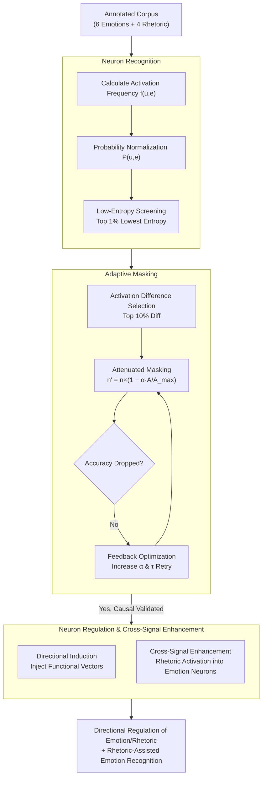

# Are Emotion and Rhetoric Neurons in LLM? Neuron Recognition and Adaptive Masking for Emotion-Rhetoric Prediction Steering

**Conference**: ACL 2026  
**arXiv**: [2604.17255](https://arxiv.org/abs/2604.17255)  
**Code**: None  
**Area**: Text Generation  
**Keywords**: Emotion Neurons, Rhetorical Neurons, Adaptive Masking, Neuron Regulation, LLM Interpretability

## TL;DR

This paper systematically investigates the representation mechanisms and intrinsic correlations of emotion and rhetorical neurons in LLMs. By proposing a neuron recognition framework combined with multi-dimensional screening and an adaptive masking verification method, it achieves directional induction of emotion/rhetoric prediction and utilizes rhetorical neurons to assist emotion recognition.

## Background & Motivation

**Background**: The ability of LLMs in emotion understanding and rhetorical generation is increasingly important. Existing improvements mainly rely on external optimizations (prompt engineering, fine-tuning), with insufficient exploration of internal representation mechanisms. A small amount of neuron research is limited to emotion neurons, ignoring rhetorical neurons and the intrinsic connection between the two.

**Limitations of Prior Work**: Traditional neuron functional verification methods (hard zeroing, mean substitution) exhibit counter-intuitive phenomena in emotion and rhetoric tasks—after masking target neurons considered highly relevant, the task accuracy increases instead of decreasing. This makes reliable causal verification unfeasible.

**Key Challenge**: The objective is to verify and regulate emotional/rhetorical expression through neuron intervention, but existing masking methods are unreliable. Hard zeroing may trigger the model's functional compensation mechanism (complementary neuron clusters taking over), and mean substitution fails to truly disrupt the specific representation of core neurons.

**Goal**: (1) Systematically identify neurons for 6 types of emotions and 4 types of rhetoric; (2) Propose a reliable causal verification method; (3) Achieve directional regulation and cross-signal enhancement.

**Key Insight**: Starting from the activation differentiation of neurons, an attenuation masking strategy is designed instead of all-zero masking, coordinated with feedback optimization to ensure reliable masking effects.

**Core Idea**: Replace traditional hard masking with adaptive masking (dynamic screening + attenuation masking + feedback optimization) to achieve reliable neuron functional verification and regulation.

## Method

### Overall Architecture

Based on Llama-3.1-8B-Instruct, the study focuses on FFN layer neurons. The process consists of three stages: Neuron Recognition (activation frequency + probability normalization + entropy screening) → Adaptive Masking Verification (dynamic selection + attenuation masking + feedback optimization) → Neuron Regulation (directional induction + cross-signal enhancement).

### Key Designs

**1. Neuron Recognition: Screening neurons with high selective response to specific emotions/rhetoric via low entropy**

The first step in studying "emotion/rhetorical neurons" is to extract them from the FFN. The difficulty lies in determining whether a neuron specifically responds to a certain type of input. This paper employs a three-step statistical screening: first, calculating the activation frequency $f_{u,e}$ of each FFN neuron under different labels; second, performing activation probability normalization $P_{u,e} = f_{u,e}/T_e$; finally, using information entropy $H = -\sum P_{u,e}\log(P_{u,e})$ to measure how concentrated the neuron's activation is across categories. The top 1% with the lowest entropy are selected as target neurons.

The focus on low entropy is because lower entropy represents activations concentrated on a specific label—indicating stronger selectivity. Such neurons can reliably distinguish different emotions/rhetoric, while "general-purpose" neurons activated uniformly across categories are naturally excluded by high entropy.

**2. Adaptive Masking: Solving counter-intuitive phenomena of traditional hard masking via attenuation masking + feedback optimization**

Traditional hard zeroing or mean substitution produces strange results in emotion/rhetoric tasks—masking neurons identified as highly relevant leads to an accuracy increase, preventing causal verification. This paper postulates that hard masking triggers functional compensation (complementary neuron clusters taking over). Consequently, it adopts a milder, self-calibrating three-step masking. First, activation difference is calculated as $D_i = |A_{i,target} - A_{i,non\text{-}target}| / A_{all}$, selecting the top 10% as core neurons. Then, **attenuated masking** $n'_u = n_u \times (1 - \alpha \times A_i/A_i^{max})$ is applied instead of zeroing. Finally, feedback optimization is introduced: if the accuracy does not drop after masking, the attenuation coefficient $\alpha$ and selection threshold $\tau$ are automatically increased.

Attenuation rather than zeroing disrupts specific representations without being strong enough to activate compensation clusters. Feedback optimization ensures masking effectiveness, ultimately achieving a stable accuracy drop across all 10 categories, which signifies the success of causal verification.

**3. Neuron Regulation and Cross-Signal Enhancement: Directional induction via functional vectors and leveraging rhetorical neurons for emotion recognition**

Recognition and masking prove the "necessity" of neurons; this step further verifies "sufficiency" and explores synergy. For directional induction, functional vectors $n'_{s_i} = n_{s_i} + \beta \times \bar{n}_{s_i}$ of target neurons are injected into non-target inputs to steer predictions. For cross-signal enhancement, the average activation of rhetorical neurons is injected into emotion neurons $a_{i,joint} = a_i + \omega \cdot \bar{a}_{i,meta}$.

The former confirms that these neurons causally control corresponding expressions (they can be both masked and induced), while the latter investigates whether rhetoric and emotion share internal mechanisms. Experiments show rhetorical injection improves emotion recognition by 1–5%, suggesting rhetoric is not just "decoration" but actively participates in emotional representation within the model.

### Loss & Training

LLM parameters remain frozen; intervention occurs only at the FFN activation level. Feedback optimization (adjusting $\alpha$ and $\tau$) is performed only on the development set.

## Key Experimental Results

### Main Results

Accuracy changes under different masking methods ($\Delta$ACC %):

| Masking Method | Happiness | Sadness | Anger | Fear | Metaphor | Sarcasm |
|:---|:---|:---|:---|:---|:---|:---|
| Zero (Hard Zeroing) | +5.46 | +4.32 | +7.92 | +1.22 | +3.37 | -4.17 |
| Mean (Mean Sub.) | +6.79 | -1.13 | +5.84 | +5.37 | +5.62 | -5.78 |
| **Adaptive** | **-9.25** | **-8.63** | **-10.14** | **-7.85** | **-7.29** | **-10.61** |

### Ablation Study

| Configuration | Effect | Description |
|:---|:---|:---|
| All-layer Masking | Max Performance Drop | Emotion/Rhetoric rely on cross-layer synergy |
| Top-layer Masking Only | Second Largest Drop | Consistent with dense neuron distribution |
| Bottom-layer Masking Only| Minimal Drop | Fewer neurons in bottom layers |
| Rhetoric into Emotion | 1-5% Gain | Validates cross-signal enhancement |

### Key Findings

- Traditional masking methods (Zero/Mean) generally show counter-intuitive accuracy increases in emotional tasks, proving hard masking is unreliable.
- Adaptive masking produces stable accuracy drops (-4% to -14%) across all 10 emotion/rhetoric categories, validating the method's reliability.
- Emotion and rhetorical neurons are mainly concentrated in the upper layers (layers 25-32), which is particularly evident in 8B models.
- Hyperbole rhetorical neurons have a positive enhancement effect on all emotional categories, consistent with the natural property of hyperbole amplifying emotional intensity.
- Sarcasm rhetoric most significantly promotes sadness, stemming from the compatibility between the implicit criticism of sarcasm and the restrained nature of sadness.

## Highlights & Insights

- Adaptive masking solves a long-standing issue in interpretability research: the counter-intuitive phenomenon of traditional masking. The combination of attenuated masking and feedback optimization is both simple and effective, and can be extended to other neuron functional verification scenarios.
- Rhetoric-assisted emotion recognition is an interesting discovery: rhetoric is not just linguistic "decoration"; it truly affects emotional representation within the model. This provides a new direction for multi-signal collaborative LLM regulation.
- The discovery of hierarchical neuron distribution (upper-layer clustering) is consistent with existing research on knowledge storage, further confirming that the FFN upper layers are key areas for semantic integration.

## Limitations & Future Work

- The scope is limited to 6 basic emotions and 4 rhetorical techniques, excluding more complex emotional states and rhetorical forms.
- Neuron regulation relies on static functional vectors without considering context-dependent dynamic adjustments.
- Results are only validated on Llama-3.1; whether similar distributions exist in other architectures (e.g., Qwen, Mistral) remains to be confirmed.
- The adjustment strategy for the attenuation coefficient $\alpha$ is relatively simple; more sophisticated adaptive strategies might further improve performance.

## Related Work & Insights

- **vs Lee et al. (2025)**: Validated the existence of emotion neurons in the Llama series but did not study rhetoric; Ours first systematically studies rhetorical neurons and reveals the emotion-rhetoric synergy.
- **vs Di Palma et al. (2025)**: Achieved emotion recognition through probing techniques, but this belongs to passive analysis; Ours achieves proactive intervention and directional regulation.
- **vs Radford et al. (2018)**: First discovered the concept of the sentiment neuron; Ours conducts more systematic and reliable research on modern LLMs.

## Rating
- Novelty: ⭐⭐⭐⭐ First systematic study of rhetorical neurons and emotion-rhetoric synergy.
- Experimental Thoroughness: ⭐⭐⭐⭐ 5 datasets + cross-dataset validation + multi-layer masking analysis.
- Writing Quality: ⭐⭐⭐⭐ Clear motivation and rigorous experimental design.
- Value: ⭐⭐⭐⭐ Provides reliable tools for LLM neuron-level interpretability and regulation.

<!-- RELATED:START -->

## Related Papers

- [\[ACL 2026\] Adaptive Planning for Multi-Attribute Controllable Summarization with Monte Carlo Tree Search](adaptive_planning_for_multi-attribute_controllable_summarization_with_monte_carl.md)
- [\[ACL 2026\] ConlangCrafter: Constructing Languages with a Multi-Hop LLM Pipeline](conlangcrafter_constructing_languages_with_a_multi-hop_llm_pipeline.md)
- [\[ACL 2025\] Personalized Text Generation with Contrastive Activation Steering](../../ACL2025/nlp_generation/personalized_text_generation_with_contrastive_activation_steering.md)
- [\[ACL 2026\] Can You Make It Sound Like You? Post-Editing LLM-Generated Text for Personal Style](can_you_make_it_sound_like_you_post-editing_llm-generated_text_for_personal_styl.md)
- [\[ACL 2025\] Balancing Diversity and Risk in LLM Sampling: How to Select Your Method and Parameter for Open-Ended Text Generation](../../ACL2025/nlp_generation/balancing_diversity_and_risk_in_llm_sampling_how_to_select_your_method_and_param.md)

<!-- RELATED:END -->
