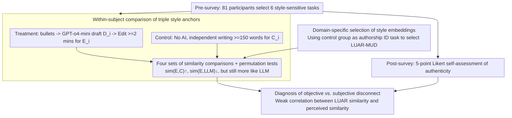

# Can You Make It Sound Like You? Post-Editing LLM-Generated Text for Personal Style

**Conference**: ACL 2026  
**arXiv**: [2604.24444](https://arxiv.org/abs/2604.24444)  
**Code**: https://github.com/ctbaumler/personal_style_postedit  
**Area**: Text Generation / Style  
**Keywords**: personal writing style, post-editing, LLM collaborative writing, style embedding, user study

## TL;DR
The authors conducted a pre-registered online study with 81 participants who used GPT-o4-mini to draft and then manually post-edit style-sensitive texts such as wedding vows and apology letters. The findings reveal that while post-editing significantly moves the text toward the user's personal style and away from the LLM's style, the edited texts still systematically retain more "AI-like" traces than independent writing—a residue that participants themselves fail to perceive.

## Background & Motivation

**Background**: The dominant paradigm of LLM writing assistance is "AI drafting + human post-editing." This workflow, matured during the machine translation era, has been widely adopted for emails and document collaboration. Prior research (Reza et al. 2025, Hwang et al. 2025) suggests that while users welcome AI drafting for content-heavy tasks, they strongly resist AI intervention in "style-heavy" writing (e.g., wedding vows, eulogies, apologies), fearing they will not "sound like themselves."

**Limitations of Prior Work**: (1) No controlled study has yet verified whether post-editing actually makes an LLM draft sound like the user—a central controversy in social media discussions regarding AI wedding vows. (2) Even if post-editing is effective, the location of "edited text" on the style continuum has not been quantified: is it closer to independent writing or does an LLM "fingerprint" remain? (3) It is unclear whether "machine-measured style similarity" aligns with "user-perceived stylistic authenticity," which poses an invisible risk where users believe they have controlled the style while readers still detect AI traces.

**Key Challenge**: Style serves as a social signal through which writers express identity, group belonging, and relationships. Multiple studies confirm that default LLM styles have detectable statistical fingerprints (em-dashes, specific hedging words, sentence templates), creating a systematic distribution gap from human styles. Theoretically, when users post-edit to override LLM style, they may only modify differences they can perceive, leaving unperceived LLM features intact—leading to a mismatch between high self-ratings and actual "AI-like" quality.

**Goal**: This pre-registered study aims to answer three sets of questions: (H1) Does post-edited text style become more like the participant and less like the LLM? (H2) Does post-edited text form an independent, detectable "third style"? (H3) Does the user's subjective perception of "style self-similarity" align with objective embedding-based measurements?

**Key Insight**: The authors employ LUAR (Rivera-Soto et al. 2021), an author-level embedding, to measure style similarity. Unlike traditional stylometry, it captures individual linguistic habits more sensitively in small-sample tasks. This is paired with the Pangram AI detector to cross-verify "LLM style residue." Participants completed tasks in treatment and control blocks (Treatment: draft from bullets + post-edit; Control: independent writing), with the control group writing serving as the anchor for "authentic style."

**Core Idea**: By using a within-subject design, multiple style embedding measurements, and subjective user ratings for triangulation, the study transforms the debate over whether humans can override LLM style fingerprints through editing into a measurable empirical problem.

## Method

### Overall Architecture
The study consists of five phases: (1) **pre-survey** where 100 Prolific participants selected 6 "most style-sensitive" tasks from 8 options; (2) tutorial; (3) **treatment block** where participants provided $\ge 30$ words of bulleted details for 4 tasks, GPT-o4-mini generated drafts, and participants spent at least 2 minutes post-editing; (4) **control block** where participants wrote independently ($\ge 150$ words) for 2 tasks without AI; (5) **post-survey** for demographics and 5-point Likert ratings on stylistic authenticity, future intent, and reasoning. 81 valid participants remained after pre-registered exclusion. Similarity was calculated using cosine similarity of LUAR-MUD embeddings, with $p$-values from 10,000 permutation tests and effect sizes using Hedges' $g$ with 1,000 bootstrap confidence intervals. Multiple comparisons were controlled via Benjamini–Hochberg at $q=0.05$.

### Key Designs

**1. Within-subject comparison of triple style anchors: Quantifying whether editing captures personal style**

Evaluating only "pre- vs. post-edit" changes leaves a loophole: participants might simply make text sound more "human" rather than more like "themselves." To decouple these, the study collects three anchors per participant: control text $C_i$ (independent), original LLM draft $D_i$, and post-edited text $E_i$. Key comparisons include: (H1a) $\mathrm{sim}(E_i, C_i)$ vs. $\mathrm{sim}(D_i, C_i)$ for shift toward self; (H1b) $\mathrm{sim}(E_i, \mathrm{LLM})$ vs. $\mathrm{sim}(D_i, \mathrm{LLM})$ for shift away from LLM; (H1a′) $\mathrm{sim}(E_i, C_i)$ vs. $\mathrm{sim}(E_i, C_{j\neq i})$ to verify the shift is toward "self" rather than generic "humanity"; and (H1c) $\mathrm{sim}(E_i, \mathrm{LLM})$ vs $\mathrm{sim}(E_i, C_i)$ to quantify relative LLM residue.

**2. Domain-specific selection of style embeddings: Using study data as ground truth**

Style embeddings that rank first on general benchmarks might not be the most sensitive for "short text + specific scenarios." The authors treated the control data as an authorship identification task: given a query control text, the model must identify the true author out of 80 others. After comparing six candidates (LUAR-MUD, LUAR-CRUD, multilingual-style-representation, CISR, StyleDistance, SAURON), LUAR-MUD significantly led with MRR $= 0.589$ and R@1 $= 0.451$, and was chosen for the main analysis.

**3. Diagnosis of objective vs. subjective disconnect: Parallel assessment lines**

Whether post-editing solves user pain points depends on the alignment between machine-measured similarity and user-perceived authenticity. After each task, participants rated "how much this text sounds like me" (perceived self-similarity). Repeated-measures correlation with LUAR objective similarity yielded $r=0.244 \pm 0.076, p < .0001$, indicating significant but weak calibration. Crucially, while participants perceived no difference in representativeness between post-edited and control texts ($p=.9062$), objective measurements showed post-edited texts remained significantly more similar to the LLM (H1c, $g = -1.43$).

## Key Experimental Results

### Main Results

| Hypothesis | Comparison | Direction | Hedges' $g$ | 95% CI | $p$ |
|------|------|---------|-------------|--------|-----|
| H1a | Post-edit vs. Pre-edit sim to self-control | Significant increase | $+0.55$ | $[0.38, 0.71]$ | $.0002$ |
| H1a′ | Post-edit sim to self vs. others' control | More like self | $-0.56$ | $[-0.70, -0.43]$ | $.0002$ |
| H1b | Post-edit vs. Pre-edit sim to LLM (LUAR) | Significant decrease | $-0.41$ | $[-0.44, -0.39]$ | $.0002$ |
| H1b | Same as above using Pangram AI score | Significant decrease | $-0.45$ | $[-0.55, -0.35]$ | $.0002$ |
| H1c | Post-edit sim to LLM vs. to self-control | Still more like LLM | $-1.43$ | $[-1.55, -1.32]$ | $.0002$ |
| H2a | Post-edit vs. control population homogeneity | More homogeneous | $+1.42$ | $[1.33, 1.51]$ | $.0002$ |
| H2b | Post-edit vs. LLM population homogeneity | More diverse | $-0.69$ | $[-0.74, -0.63]$ | $.0002$ |
| H2c | Post-edit sim to others' edits vs. self-control | Shared AI fingerprint | $+1.14$ | $[1.02, 1.26]$ | $.0002$ |
| H3 | Perceived vs. LUAR self-similarity | Weak positive correlation | $r=0.244$ | $\pm 0.076$ | $<.0001$ |

### Ablation Study

| Configuration / Slice | Key Metric | Description |
|-------------|---------|------|
| Main Analysis LUAR-MUD (Full) | H1a $g=+0.55$, H1c $g=-1.43$ | All main conclusions significant |
| Replaced with CISR embedding | H1a $g=+0.48$, H1c $g=-2.30$ | Consistent direction, slight magnitude change |
| Pangram AI Detector H1b | $g=-0.45$ | Consistent with LUAR |
| Tasks with lower "style importance" | Style importance interaction $\beta=0.020, p<.001$ | Less effort to erase AI traces when style is less valued |
| Word-level: Contractions | Post-edit has $5\times$ more than LLM draft | Key personal trait restored |
| Em-dash removal rate | $23\%$ (58 out of 254 removed) | "Known" AI features are erased |
| "Delve" occurrences | $0$ (Never used by any participant) | Highly stigmatized AI word |

### Key Findings
- **H1c is the most critical conclusion**: The position of post-edited text is highly asymmetric—it is much closer to the LLM ($g = -1.43$) than to the self-control ($+0.55$), showing post-editing only masks a small portion of the AI fingerprint.
- **H2c reveals "shared AI ruins"**: Post-edited texts by different participants are more similar to each other than to their own control texts, suggesting "collective blind spots" in what AI features are left unedited.
- **H3 exposes a dangerous disconnect**: Participants perceive their post-edited text as representative of themselves ($p=.906$), yet objective measures show a huge gap ($g=-1.43$). Users' stylistic self-assessments are unreliable in the AI era.
- **Motivation-driven cleaning**: Style importance significantly moderates the reduction in LLM-similarity ($\beta=0.020, p<.001$), indicating that "cleaning" is an intentional rather than automatic behavior.
- **Non-standard edits matter**: Typos and missing spaces after commas significantly improved self-similarity ($\beta=-0.116, p=.003$), suggesting "imperfect habits" are authentic identity signals.

## Highlights & Insights
- **Confirmation of the "Third Style"**: Post-edited text exists as a distinct, mutually identifiable hybrid in embedding space—neither pure LLM nor pure human.
- **Pre-registration + Within-subject Design**: This methodological rigor elevates the "wedding vow debate" from speculation to falsifiable science.
- **Perception $\neq$ Reality**: This is the major takeaway. Traditional personalization studies using satisfaction as ground truth systematically overestimate alignment.
- **Domain-specific model selection**: Choosing the embedding model based on its performance in an authorship task provides a robust methodological baseline for small-data style studies.
- **Identified AI-isms**: While em-dashes are erased, words like "exploring/guiding/understanding" remain. "Delve" is now a highly recognized AI marker.

## Limitations & Future Work
- Style is measured primarily via LLM embeddings rather than expert forensic linguistic analysis.
- The use of different tasks for control and treatment may introduce task-specific style confounding.
- The writing context is "simulated"; real-world risks (e.g., actually sending the vows) might increase the depth of editing.
- Drafting via specific bullet prompts may not represent all user prompting habits.
- The study focuses solely on "AI draft $\rightarrow$ human post-edit," excluding human-first or multi-turn interaction models.
- Only the writer's perspective was tested; whether readers (friends/family) can detect the residue remains unknown.

## Related Work & Insights
- **vs. Chakrabarty et al. 2025**: While they studied experts editing for "quality," this work focuses on average users editing for "personal style."
- **vs. Reza et al. 2025 / Hwang et al. 2025**: This study confirms that while users are willing to post-edit, the objective output remains AI-inflected.
- **vs. Padmakumar & He 2024**: Similar to their findings on content diversity, this study shows post-editing reduces stylistic diversity (H2a).
- **vs. Russell et al. 2025**: While experienced users are better at detecting AI, they might still overestimate the "cleanliness" of their own edited drafts.

## Rating
- Novelty: ⭐⭐⭐⭐ first systematic quantification of style recovery via post-editing.
- Experimental Thoroughness: ⭐⭐⭐⭐⭐ robust pre-registration and triangulation.
- Writing Quality: ⭐⭐⭐⭐⭐ exceptionally clear hypothesis testing.
- Value: ⭐⭐⭐⭐⭐ critical implications for AI detection and alignment evaluation.

<!-- RELATED:START -->

## Related Papers

- [\[ACL 2026\] ConlangCrafter: Constructing Languages with a Multi-Hop LLM Pipeline](conlangcrafter_constructing_languages_with_a_multi-hop_llm_pipeline.md)
- [\[ACL 2025\] Writing Like the Best: Exemplar-Based Expository Text Generation](../../ACL2025/nlp_generation/writing_like_best_exemplar.md)
- [\[ACL 2026\] Are Emotion and Rhetoric Neurons in LLM? Neuron Recognition and Adaptive Masking for Emotion-Rhetoric Prediction Steering](are_emotion_and_rhetoric_neurons_in_llm_neuron_recognition_and_adaptive_masking_.md)
- [\[ACL 2025\] Enhancing Text Editing for Grammatical Error Correction: Arabic as a Case Study](../../ACL2025/nlp_generation/enhancing_text_editing_for_grammatical_error_correction_arabic_as_a_case_study.md)
- [\[ACL 2026\] Frankentext: Stitching Random Text Fragments into Long-Form Narratives](frankentext_stitching_random_text_fragments_into_long-form_narratives.md)

<!-- RELATED:END -->
