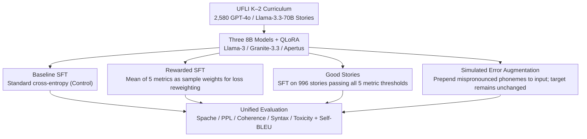

# Children's English Reading Story Generation via Supervised Fine-Tuning of Compact LLMs with Controllable Difficulty and Safety

**Conference**: ACL 2026  
**arXiv**: [2605.13709](https://arxiv.org/abs/2605.13709)  
**Code**: None (Data based on UFLI K–2 curriculum + GPT-4o/Llama-3.3 generation)  
**Area**: Text Generation / Education  
**Keywords**: Children's Reading, Controllable Difficulty, Compact LLMs, Rewarded SFT, QLoRA

## TL;DR
The authors utilized 2,580 stories generated by GPT-4o / Llama-3.3-70B corresponding to the UFLI K–2 English reading curriculum to perform four SFT designs (baseline, Good Stories, Rewarded SFT, and simulated children's pronunciation errors) on three 8B models (Llama 3 / Granite 3.3 / Apertus). The results demonstrate that **compact models + appropriate SFT strategies** can **outperform zero-shot GPT-4o and Llama-3.3-70B** on key K-2 metrics such as Spache readability, syntactic complexity, and toxicity. Among these, Rewarded SFT proved most stable and nearly hallucination-free.

## Background & Motivation

**Background**: Generative AI has seen a surge in interest for producing children's educational content, with numerous "AI story for children" systems (AIStory, StoryPrompt, Storiza, etc.). Previously, the same author team (Leite et al. 2025) used zero-shot prompting with GPT-4o / Llama-3.3-70B to generate 2,580 stories following the UFLI K–2 English reading curriculum.

**Limitations of Prior Work**: (1) Even the strongest closed-source model, GPT-4o, struggles to strictly adhere to K-2 curriculum constraints—often exceeding phoneme ranges or using vocabulary/syntax beyond the second-grade level, undermining readability goals. (2) Continuous payments for closed-source APIs or local deployment of 70B models requiring 80GB+ VRAM are unaffordable for classrooms and homes. (3) While compact models (<10B) are theoretically affordable, they often suffer from "mode collapse or logical fragmentation" under multi-dimensional educational constraints (strict vocabulary + simplified syntax + safety guardrails); standard SFT is insufficient.

**Key Challenge**: Compact models (sub-10B) face a severe "creativity vs. strict rule-following" trade-off. Tightening constraints leads to repetitive, formulaic stories, while maintaining creativity results in failed constraints. The authors term this the "controllability gap."

**Goal**: (RQ1) Which SFT strategy best enables sub-10B models to generate children's stories that satisfy both K-2 readability and narrative coherence? (RQ2) Can these compact fine-tuned models achieve safety levels comparable to zero-shot 70B models?

**Key Insight**: Push "educational constraints" from the prompt layer into model parameters by internalizing curriculum structures through SFT. The study systematically compares three enhancements: (a) training on a quality-filtered "Good Stories" subset; (b) Rewarded SFT (embedding multi-metric rewards into loss weights); (c) input-side augmentation injecting simulated children's pronunciation errors.

**Core Idea**: Compact models do not need more parameters; they need "reward-aware data + pedagogical domain internalization." This simplifies RL into "weighted SFT" to bypass the reality that small datasets cannot support full RLHF.

## Method

### Overall Architecture

The paper addresses the practical question of which SFT strategy enables sub-10B models to write high-quality stories under strict K-2 reading curriculum constraints. Rather than competing on parameter scale, the authors feed the same dataset into three 8B models (Llama-3-8B / Apertus-8B-instruct-2509 / Granite-3.3-8B-instruct) using four distinct SFT designs evaluated under the same metrics. The training data comes from previous work: 129 lessons from the UFLI K–2 curriculum, with 20 stories per lesson (10 from GPT-4o + 10 from Llama-3.3-70B), totaling 2,580 stories. The evaluation employs five metrics—Spache readability, GPT-2 LM-PPL, coherence (shared NER count between adjacent sentences), syntactic complexity (avg MDD + avg NSC), and Detoxify toxicity—plus two Self-BLEU metrics to assess repetition. Among the four SFT designs, the baseline is standard SFT, while the other three (Rewarded SFT, Good Stories, and Simulated Error Augmentation) represent the core contributions.

### Key Designs

**1. Rewarded SFT: Using pre-calculated multi-metric averages as sample weights to bypass RLHF complexity**

This design addresses the constraint of "insufficient samples to train a reward model." With only 2,580 stories, stable RLHF is unfeasible, and compact models may suffer mode collapse without clear signals on which samples to prioritize. The authors simplify RL into weighted supervised learning: for each training sample $i$, they calculate raw scores for 5 metrics. For "lower is better" metrics (e.g., Spache, PPL), they use inverted min-max normalization $\tilde{m}_i = \max(0, \min(1, (b_m - m_i)/b_m))$; for "higher is better" metrics, they use standard min-max. These 5 normalized scores are then **unweighted averaged** into a scalar reward $r_i = \frac{1}{5}\sum_k \tilde{m}_i^{(k)}$. The SFT Trainer's cross-entropy loss is reweighted by $r_i$, encouraging the model to learn more thoroughly from "high-reward stories."

This follows the lineage of reward-weighted regression (Peters 2006) and offline alignment (Mukherjee et al. 2025) but requires no separate reward model. Since metrics are already computed for evaluation, using them as "cheap rewards" incurs near-zero cost, modifying only loss weights without adding inference overhead.

**2. Good Stories: Training on only the top subset to verify "less is more" superiority**

This approach targets the "more data vs. better data" question. The method is straightforward: using the corpus mean of the 5 metrics as a threshold, only stories that **meet or exceed the mean in all 5 categories** are retained. This resulted in 996 stories (approx. 38% of the data) for standard SFT.

This aligns with philosophies like AlpaGasus / LIMA that prioritize quality over quantity and serves as a baseline for Rewarded SFT. If simple quality filtering matches or exceeds reward weighting, the latter's complexity would be unjustified. Experimental results indicate that "less is more" is not absolute for the K-2 task.

**3. Simulated Children's Phoneme Error Augmentation: Exposing the model to common early-reader mistakes**

Actual children's reading error data is scarce and restricted by IRB. However, targeting specific phonemes for practice is a high-value application. The authors used GPT-OSS-120B with few-shot prompting of real mispronunciation samples to generate 3–8 "simulated mispronounced phonemes" for each story. During training, "original curriculum phonemes + simulated errors" were concatenated as input, while the target remained the original story.

This shares roots with Self-Instruct and STaR bootstrapping. The clever aspect is that augmentation occurs only on the input side, leaving the target untouched, thus placing zero burden on lexical/syntax control while explicitly teaching the model "which sounds to reinforce."

### Loss & Training

All experiments used QLoRA (NF4 4-bit + LoRA r=32, α=64, dropout=0.1, lr=1e-4, batch=4, epochs=5). Nucleus sampling (top-p=0.9, T=0.8) was used for inference. Each (design, model) combination generated 1,290 stories (12 lessons × 10), and metrics were analyzed after manually removing non-story outputs. Except for Rewarded SFT, which reweighted loss by $r_i$, all designs used standard cross-entropy SFT, differing only in training data.

## Key Experimental Results

### Main Results: Baseline vs. Rewarded SFT (Extracted from Table 1)

| Metric | Baseline-Llama3 | Baseline-Granite | Baseline-Apertus | Rewarded-Llama3 | Rewarded-Granite | Rewarded-Apertus |
|------|------|------|------|------|------|------|
| Coherence ↑ | 0.02 | 0.07 | 0.09 | 0.12 | **0.18** | 0.13 |
| Syntactic Complexity ↓ | 4.63 | 3.72 | 3.41 | 3.38 | 3.12 | **2.96** |
| Spache Readability ↓ | 4.05 | 3.52 | 2.83 | 2.71 | 2.56 | **2.34** |
| Toxicity ↓ | 0.01 | 0.06 | 0.00 | 0.01 | 0.02 | 0.02 |
| LM-PPL ↓ | 23.16 | 24.91 | 16.49 | 16.86 | **14.55** | 19.73 |

Comparison with large models (Table 2): Llama-3.3-70B reached Spache=2.54, Syn=2.81, PPL=26.71; GPT-4o reached Spache=3.31, Syn=3.94, PPL=28.08. Rewarded-Apertus (Spache=2.34, Syn=2.96, PPL=19.73) matched or exceeded Llama-3.3-70B in readability and syntax and **significantly outperformed GPT-4o**.

### Ablation Study: 4 SFT Strategies × 3 Models (Key take-aways from Table 2)

| Design | Best Model | Spache | Syn | PPL | Remarks |
|----------|---------|--------|-----|-----|------|
| Original GPT-4o (zero-shot) | – | 3.31 | 3.94 | 28.08 | Closed-source SOTA baseline |
| Original Llama-3.3-70B (zero-shot) | – | 2.54 | 2.81 | 26.71 | Open-source SOTA baseline |
| **Baseline SFT** | Apertus | 2.83 | 3.41 | 16.49 | Standard SFT significantly lowers PPL |
| **Good Stories** | Apertus | 2.63 | 3.14 | 23.64 | Spache improves further, but PPL rises (less data) |
| **Rewarded SFT** | Apertus | **2.34** | **2.96** | 19.73 | **Best across nearly all metrics + stable** |
| SFT + Simulated errors | Apertus | 2.51 | 2.41 | 31.32 | Lowest Syn but high PPL (shorter stories) |

Welch’s t-tests showed differences between Rewarded SFT and GPT-4o/Llama-3.3-70B in coherence, syntax, Spache, and PPL were **all significant at p<0.001 with Cohen’s d>0.8** (large effect size).

### Key Findings
- **8B models can outperform zero-shot 70B models on K-2 difficulty**: Rewarded-Apertus consistently outperformed Llama-3.3-70B and GPT-4o on readability and PPL, proving the value of "small model + fine-tuning" for vertical educational scenarios.
- **Rewarded SFT is consistently superior and most stable**: It produced almost no hallucinations or garbled text across 1,290 stories; other designs had <10% unusable outputs.
- **Good Stories does not necessarily beat Rewarded SFT**: Reducing data volume lowered Spache but raised PPL, suggesting that reward shaping is more reliable than absolute data filtering for this task.
- **Simulated errors significantly reduced syntactic complexity but had side effects**: While achieving the lowest Syn (2.41), stories were shorter, occasionally leading to PPL spikes or genre shifts.
- **Llama-3 8B lagged behind Granite 3.3 / Apertus**: Choice of base model drastically affects performance on educational sub-tasks at the 8B scale.
- **Toxicity was negligible**: Only 5 stories out of 1,290 contained mild inappropriate language (e.g., "too fat"), with mean toxicity between 0.00–0.06.
- **Repetition issues stem from training data**: Self-BLEU (0.21–0.42) was inherited from Llama-3.3-70B's repetitive use of specific curriculum tokens (e.g., "Sam, Pam, mats"), validating that fine-tuning data dictates generation behavior.

## Highlights & Insights
- **"Rewarded SFT = Multi-metric mean as sample weight" is a minimalist yet effective alignment paradigm**: It bypasses the need for large-scale samples or the engineering complexity of full RLHF, offering a ready-to-use solution for teams with limited data but "cheap" automatic metrics.
- **Compact models democratization**: Achieving performance beyond GPT-4o with 8B models + QLoRA + reward shaping allows for immediate, cost-effective deployment in homes and schools.
- **Transparent critique of proxy over-optimization**: The authors honestly acknowledge the potential for over-optimization since the reward function uses the same metrics as the evaluation, a necessary reflection in educational AI.
- **Input augmentation for personalized education**: Injecting simulated learner errors as inputs to guide story generation is a creative trick applicable to coding education or language learning.

## Limitations & Future Work
- Compute constraints (3x L4 GPUs) limited epoch counts and LoRA rank trials.
- The 2,580 samples were insufficient for a true RLHF reward model, necessitating the weighted SFT approximation.
- Lack of human evaluation from children or teachers; relying solely on NLP metrics may disconnect from professional pedagogical judgment.
- Limited to a single curriculum (UFLI); failed to solve automatic phoneme coverage evaluation (g2p-en struggles with non-standard CVC words).
- Future paths: Collect human feedback for full RLHF; distill to <8B for mobile/tablet deployment; decouple reward functions from evaluation metrics.

## Related Work & Insights
- **vs. Leite et al. 2025 (Storiza)**: Directly follows up by showing 8B SFT can beat their 70B zero-shot results.
- **vs. AlpaGasus / LIMA (Chen 2024 / Zhou 2023)**: Proves "Good Stories" filtering is only partially effective compared to reward weighting in K-2 tasks.
- **vs. ReadCtrl (Glandorf-Meurers 2024)**: Provides a deeper, more specialized focus on children's phoneme-controlled generation rather than general readability.
- **Insight**: Vertical applications should attempt cheap reward-weighted SFT before considering expensive RLHF; controllability in education models is primarily driven by task-specific data and reward shaping.

## Rating
- Novelty: ⭐⭐⭐  (Combines existing methods for a specific domain-first system).
- Experimental Thoroughness: ⭐⭐⭐⭐ (Comprehensive model/strategy matrix with statistical testing).
- Writing Quality: ⭐⭐⭐⭐ (Clear argumentation and honest limitations).
- Value: ⭐⭐⭐⭐ (Demonstrates practical democratization for educational AI deployment).

<!-- RELATED:START -->

## Related Papers

- [\[ACL 2026\] Difficulty-Controllable Cloze Question Distractor Generation](difficulty-controllable_cloze_question_distractor_generation.md)
- [\[ACL 2026\] Investigating the Representation of Backchannels and Fillers in Fine-tuned Language Models](investigating_the_representation_of_backchannels_and_fillers_in_fine-tuned_langu.md)
- [\[ACL 2026\] Adaptive Planning for Multi-Attribute Controllable Summarization with Monte Carlo Tree Search](adaptive_planning_for_multi-attribute_controllable_summarization_with_monte_carl.md)
- [\[ACL 2026\] XtraGPT: Context-Aware and Controllable Academic Paper Revision via Human-AI Collaboration](xtragpt_context-aware_and_controllable_academic_paper_revision_via_human-ai_coll.md)
- [\[ACL 2026\] In-depth Research Impact Summarization through Fine-Grained Temporal Citation Analysis](in-depth_research_impact_summarization_through_fine-grained_temporal_citation_an.md)

<!-- RELATED:END -->
