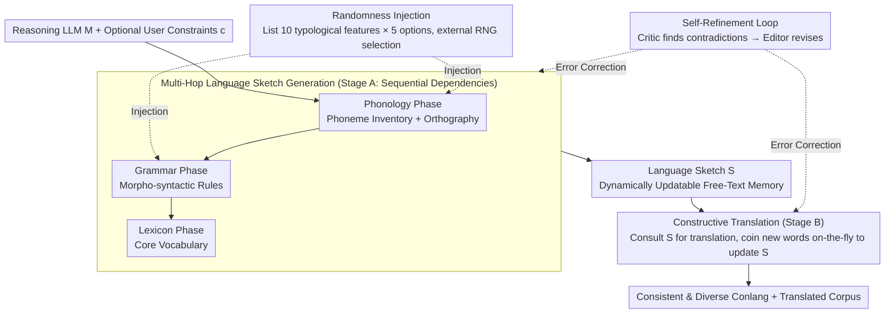

# ConlangCrafter: Constructing Languages with a Multi-Hop LLM Pipeline

**Conference**: ACL 2026  
**arXiv**: [2508.06094](https://arxiv.org/abs/2508.06094)  
**Code**: [Project Page](https://conlangcrafter.github.io)  
**Area**: Computational Linguistics / Creative Generation  
**Keywords**: Conlangs, Multi-hop Reasoning, Typological Diversity, Self-Refinement, Metalinguistic Reasoning

## TL;DR

This paper introduces ConlangCrafter, an LLM-based multi-hop pipeline that decomposes constructed language (conlang) design into modular stages of phonology, grammar, and lexicon. It ensures typological diversity through randomness injection and internal consistency via self-refinement loops, while proposing an automated evaluation framework encompassing typological diversity analysis and translation consistency.

## Background & Motivation

**Background**: Constructed languages (conlangs) such as Esperanto and Elvish play vital roles in art, philosophy, and international communication. Foundation models have revolutionized creative generation across text and image domains.

**Limitations of Prior Work**: (1) Conlang creation is extremely time-consuming—designers may spend years or decades reaching the scope and complexity of natural languages; (2) LLMs struggle to generate internally consistent complex linguistic systems under single-turn prompting; (3) LLMs tend to produce outputs lacking typological diversity (Hopkins and Renda 2023), resulting in overly similar languages; (4) There is a lack of automated frameworks for evaluating the quality of computational conlangs—no ground truth exists.

**Key Challenge**: While LLMs possess metalinguistic reasoning capabilities, directly generating a complete language description leads to internal contradictions and insufficient diversity—linguistic levels (phonology, grammar, lexicon) are interdependent and require staged construction.

**Goal**: (1) Investigate whether LLMs can generate internally consistent and typologically diverse linguistic systems; (2) Propose scalable automated evaluation metrics; (3) Explore applications of computational conlangs in creative assistance and game generation.

**Key Insight**: Drawing from linguistic typology and documentation practices, language descriptions are divided into three layers: phonology $\rightarrow$ grammar $\rightarrow$ lexicon. Each layer is constructed via multi-step prompting, utilizing RNG to inject typological diversity and self-refinement to ensure consistency.

**Core Idea**: Conlang generation is modeled as a multi-hop reasoning task—each linguistic level constitutes a reasoning step, accumulating and harmonizing linguistic knowledge by maintaining a dynamically updatable "Language Sketch" memory bank.

## Method

### Overall Architecture

Constructing a language is difficult due to internal dependencies: phonology determines possible word forms, grammar depends on word forms, and the lexicon depends on grammar. Directly prompting an LLM to output a complete description often results in inter-layer contradictions and excessive similarity between generated languages. ConlangCrafter addresses this by decomposing the process into "multi-hop reasoning"—each linguistic level is a reasoning step, maintaining a dynamically updatable "Language Sketch" $S$ to accumulate and unify knowledge. The pipeline consists of two stages: Stage A (Language Sketch Guidance) prompts the LLM layer-by-layer in the order of phonology $\rightarrow$ grammar $\rightarrow$ lexicon to update $S$; Stage B (Constructive Translation) uses $S$ to translate new text into the conlang, potentially expanding the vocabulary and grammar within $S$ during the process. The core components include a reasoning LLM $M$ (e.g., DeepSeek-R1), a free-text memory bank $S$, and optional user constraints $c$.

### Key Designs

**1. Multi-Hop Language Sketch Generation: Decomposing "Language Creation" into Sequential Reasoning Steps**

Single-turn prompting cannot generate a sufficiently detailed and self-consistent linguistic system, which is the fundamental pain point of direct generation. The authors slice the task into three layers following natural linguistic dependencies—Phonology first (providing word forms), Grammar second (relying on word forms), and Lexicon last (relying on grammar)—with each layer further subdivided into sub-steps for incremental LLM prompting. Results are consolidated into the Language Sketch $S$.

This structure is cognate with multi-hop methods in other complex reasoning tasks: rather than forcing a model to succeed in one step, it allows for layer-by-layer refinement on human-readable external memory. As a persistent state, $S$ enables subsequent steps to reference prior decisions and serves as the object for self-refinement.

**2. Randomness Injection: Delegating Diversity Decisions to an External RNG**

LLMs exhibit a strong tendency toward "convergence"; if left to their own devices, generated languages cluster typologically and resemble one another. The authors' solution is to have the LLM list a checklist of 10 linguistic typological features (each with 5 options) at the start of the phonology and grammar phases. An **external random number generator (RNG)** is then used to select one option for each feature, which the LLM must then follow to instantiate the specific language description.

The key lies in the division of labor: the LLM provides the knowledge of "which typological options are reasonable," while the RNG decides "which one to choose this time." Diversity no longer relies on sampling temperature or luck but is enforced by an external random source, preventing languages from clustering in $t$-SNE visualizations.

**3. Self-Refinement Cycle: Using LLMs as Critic and Editor to Capture Contradictions**

Once contradictions are embedded in the Language Sketch, they propagate through the pipeline. Since translation must strictly adhere to the constructed grammar, consistency checks are indispensable. Utilizing the observation that "evaluation is easier than generation," the system employs the same LLM in two roles: the Critic identifies errors and ambiguities to create a query list, and the Editor modifies the sketch accordingly. This iterates until no new issues are found or the maximum iteration limit is reached.

By performing local corrections on the existing sketch rather than regenerating from scratch, this loop is efficient and stable, serving as the crucial link that converges a "diverse but potentially contradictory" draft into a "diverse and self-consistent" final product.

## Method

### Example Walkthrough: Constructing a Language and Translating a Sentence

Using DeepSeek-R1 as $M$ without user constraints: **Phonology Phase**: The LLM lists 10 features (e.g., syllable structure, tone, consonant clusters); the RNG selects "CV syllables + No tone + No clusters." The LLM writes phoneme tables and rules into $S$. **Grammar Phase**: 10 morpho-syntactic features are listed (word order, case marking, agreement); the RNG selects "SOV + Postpositions + Case marking." The LLM writes rules into $S$. The Critic checks if "case markers violate phonological syllable constraints" and the Editor resolves any conflicts. **Lexicon Phase**: A core vocabulary is generated within the established framework and added to $S$. **Stage B Translation**: Given a new English sentence, the LLM consults $S$ for translation; missing words are coined on-the-fly and added to $S$, with the self-refinement loop ensuring the translation does not violate existing grammar.

### Loss & Training

No model training is involved. Large reasoning models utilizing inference-time Chain-of-Thought (e.g., DeepSeek-R1, Gemini 2.5 Flash/Pro) are employed. Evaluation uses OpenAI o3 as a judge LLM to avoid self-evaluation bias.

## Key Experimental Results

### Main Results

**Typological Diversity Score ($D_{mean}$, Higher is better)**

| Method | $D_{mean}$ |
|------|-------|
| Natural Languages (WALS Database, 1874 langs) | ~0.55 |
| ConlangCrafter (DeepSeek-R1) | Highest |
| ConlangCrafter (Gemini 2.5 Pro) | High |
| ConlangCrafter (Gemini 2.5 Flash) | High |
| Single-stage Baseline | Low |

**Translation Consistency Score ($N_{c,t}/N_{t,t}$, Higher is better)**

| Method | Consistency Rate |
|------|---------|
| ConlangCrafter (DeepSeek-R1) | Highest |
| ConlangCrafter (Gemini 2.5 Pro) | High |
| Single-stage Baseline | Significantly Lower |

### Ablation Study

| Configuration | Diversity | Consistency |
|------|--------|--------|
| Full ConlangCrafter | High | High |
| Remove Randomness Injection | Low (Significant drop) | High |
| Remove Self-Refinement | High | Low (Significant drop) |
| Single-stage Baseline | Low | Low |

## Key Findings

- Multi-hop pipelines significantly outperform single-stage methods in both typological diversity and translation consistency.
- Randomness injection is the key to ensuring diversity—removing it causes generated languages to cluster in $t$-SNE visualizations.
- The self-refinement cycle is critical for consistency; without it, translations exhibit numerous grammatical violations.
- Human expert evaluations moderately align with automated scores, supporting the validity of the automated framework.
- DeepSeek-R1 performs best in consistency, while Gemini 2.5 is competitive in diversity.

## Highlights & Insights

- "Computational Conlanging" represents a new paradigm—transforming LLM "hallucination" into a creative feature rather than a defect.
- The architecture of multi-hop reasoning + memory bank + self-refinement is applicable to any LLM task requiring the construction of complex, consistent systems.
- The strategy of using typological checklists + RNG for diversity control can be transferred to other creative generation tasks.

## Limitations & Future Work

- The Language Sketch does not yet cover semantics, pragmatics, or advanced orthography.
- Automated evaluation based on LLM-as-judge remains limited for such highly specialized tasks.
- Experiments were conducted on a limited scale (10 test sentences, ~20 languages).
- Future work could extend to auxiliary documentation for low-resource languages and educational applications.

## Related Work & Insights

- **vs. Low-resource Translation**: In standard translation, hallucinations are harmful; in conlanging, "hallucination" is necessary creativity as the target language does not pre-exist.
- **vs. Procedural World Generation**: ConlangCrafter can be directly applied to the procedural generation of societies and languages in open-world games.
- **vs. Chain-of-Thought Reasoning**: The multi-hop pipeline is essentially a structured Chain-of-Thought where each layer corresponds to a reasoning step.

## Rating

- Novelty: ⭐⭐⭐⭐⭐ Established a new research paradigm for "Computational Conlanging."
- Experimental Thoroughness: ⭐⭐⭐⭐ Comprehensive automated and human evaluation, though sample size is limited.
- Writing Quality: ⭐⭐⭐⭐ Clear motivation and detailed methodology.
- Value: ⭐⭐⭐⭐ Insightful for creative AI and linguistics with broad application potential.

<!-- RELATED:START -->

## Related Papers

- [\[ACL 2026\] Adaptive Planning for Multi-Attribute Controllable Summarization with Monte Carlo Tree Search](adaptive_planning_for_multi-attribute_controllable_summarization_with_monte_carl.md)
- [\[ACL 2026\] Are Emotion and Rhetoric Neurons in LLM? Neuron Recognition and Adaptive Masking for Emotion-Rhetoric Prediction Steering](are_emotion_and_rhetoric_neurons_in_llm_neuron_recognition_and_adaptive_masking_.md)
- [\[ACL 2026\] Can You Make It Sound Like You? Post-Editing LLM-Generated Text for Personal Style](can_you_make_it_sound_like_you_post-editing_llm-generated_text_for_personal_styl.md)
- [\[ACL 2025\] Multi-document Summarization through Multi-document Event Relation Graph Reasoning in LLMs](../../ACL2025/nlp_generation/event_graph_bias_mitigation_summarization.md)
- [\[ICLR 2026\] p-less Sampling: A Robust Hyperparameter-Free Approach for LLM Decoding](../../ICLR2026/nlp_generation/p-less_sampling_a_robust_hyperparameter-free_approach_for_llm_decoding.md)

<!-- RELATED:END -->
