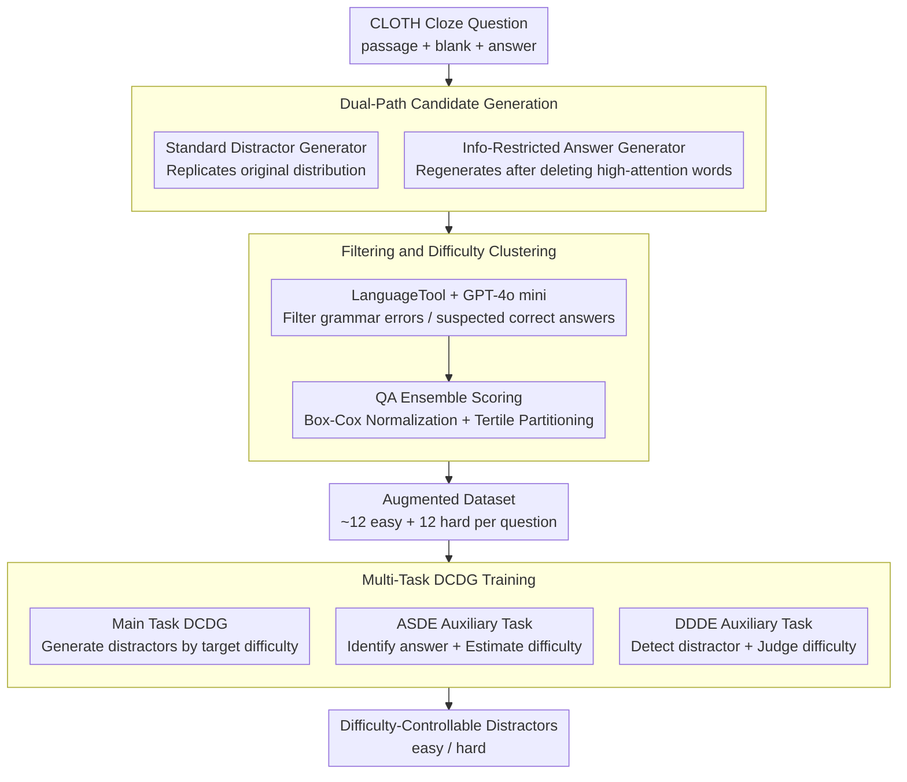

# Difficulty-Controllable Cloze Question Distractor Generation

**Conference**: ACL2026  
**arXiv**: [2511.01526](https://arxiv.org/abs/2511.01526)  
**Code**: https://github.com/ksh108405/DCDG  
**Area**: Text Generation / Educational NLP  
**Keywords**: Cloze, Distractor Generation, Difficulty Control, Data Augmentation, Multi-task Learning

## TL;DR
This paper proposes DCDG, which enables cloze distractor generation models to control difficulty (easy/hard) through dual-path distractor data augmentation, QA ensemble difficulty clustering, and multi-task seq2seq training, significantly outperforming GPT-4o in both automatic and human evaluations.

## Background & Motivation
**Background**: Multiple-choice cloze tests are common in language proficiency testing and online education. Automatic question generation systems typically need to generate the correct answer first, followed by several distractors that are plausible but incorrect. Recent methods mostly use PLMs or text-to-text models to direct learn existing distractors in datasets, or use candidate word lists and knowledge bases for filtering.

**Limitations of Prior Work**: Existing methods tend to replicate the original distractor distribution of the training set. They can generate words that "look like distractors" but cannot specify whether they are easy to eliminate or highly confusing to learners. Another practical issue is that public cloze datasets usually contain few human-authored distractors and lack large-scale difficulty annotations, making it difficult to train difficulty-aware models directly.

**Key Challenge**: Distractor difficulty is related to semantic similarity and contextual substitutability, while also being influenced by learner proficiency. To make the problem operational, the authors narrow the research boundary to "contextual semantic plausibility" in language assessment: the more a candidate appears fillable but remains incorrect, the harder it is; the more it clearly violates context, the easier it is.

**Goal**: The authors aim to solve two sub-problems: first, how to augment a large number of easy/hard distractors from the CLOTH dataset which lacks difficulty labels; second, how to train a model that stably generates distractors of a specified difficulty given an input signal.

**Key Insight**: A key observation is that an answer generator knows which context words are most critical for the correct answer. If these high-attention words are intentionally deleted and the answer generator is then asked to fill the blank, it generates candidates that are related to the original answer but no longer fully constrained by the original context—making them naturally suitable as distractors of varying difficulty.

**Core Idea**: Supplement a standard distractor generator with an "information-restricted answer generator," use a QA ensemble to cluster candidates into easy/hard categories, and finally incorporate difficulty control signals into the generative model via a main task plus two auxiliary tasks.

## Method

### Overall Architecture

The DCDG method is divided into two layers: the upstream stage constructs an augmented dataset with easy/hard labels from the unlabeled CLOTH dataset, and the downstream stage uses it to train a difficulty-controllable distractor generator. The upstream stage expands each original cloze item into approximately 12 easy and 12 hard candidates. The downstream stage aims to stably generate distractors of the specified difficulty given the passage, blank, answer, target difficulty, and quantity.

Specifically, the first phase trains two Gemma 2 9B generators: a standard distractor generator to learn the original distractor distribution, and an answer generator that first learns to generate the correct answer and is then repurposed to generate "misled answers" from "partially deleted passages." The second phase uses LanguageTool and GPT-4o mini to filter grammatical errors or candidates that might be correct answers. The third phase uses a QA ensemble of multiple fine-tuned PLMs to score candidates, using these scores to partition the ends of the distribution into hard and easy. Finally, the main DCDG model is trained on this augmented data, integrated with two auxiliary tasks (ASDE and DDDE) to ensure the model understands the semantic relationship between answers, distractors, and difficulty.

### Key Designs

**1. Dual-Path Candidate Generation: Augmenting candidates via "Standard Generator + Info-Restricted Answer Generator"**

If only the original distractors are replicated, candidates are locked into the dataset's inherent difficulty distribution; if candidates are generated by an LLM from scratch, they may not fit the cloze context. The authors' key observation is that answer generators know which context words are critical for the correct answer. Thus, the standard distractor generator reproduces typical distractors from the dataset, while the answer generator first produces an answer on the full passage to accumulate attention. Then, by **deleting words with high attention** and regenerating, it produces candidates that are "related to the original answer but no longer fully bound by the context," naturally serving as distractors of varying difficulty. Deletion ratios of 0.1, 0.2, 0.4, etc., are used—higher deletion ratios lead to candidates further from the answer and lower difficulty.

The two paths complement each other, with one focusing on in-dataset style and the other on broader difficulty coverage (experimental results show a semantic overlap of only 0.29 and Jaccard overlap of 0.13).

**2. Filtering and Difficulty Clustering: Removing invalid candidates and approximating difficulty with QA ensemble "mis-selection tendency"**

Augmented candidates are of varying quality, and difficulty cannot be labeled arbitrarily by a model. The authors first use LanguageTool to remove grammatically incorrect items and GPT-4o mini to identify and remove candidates that might actually be correct answers. Remaining candidates are passed to a multi-choice cloze QA ensemble (comprising 18 small PLMs from 11 model families) to measure "how much this option looks like the correct answer." The top third are labeled hard, the bottom third easy, and the middle segment is discarded.

The advantage here is that difficulty is not subjective but approximated by the "probability of being mis-selected as the answer by a QA model"—higher probability means higher difficulty. Since score distributions across models are right-skewed, Box-Cox normalization is used to bring them to a comparable scale before aggregation.

**3. Multi-Task DCDG Training: Auxiliary tasks forcing the model to understand "why this is a distractor"**

If trained only to "generate distractors given difficulty," the model may treat difficulty tokens as superficial labels. To address this, while the main DCDG task takes the passage, quantity, target difficulty, and answer as input to output distractors, the ASDE (Answer Selection & Difficulty Estimation) task requires the model to identify the correct answer in a mixed set and estimate distractor difficulty. The DDDE (Distractor Detection & Difficulty Estimation) task fills a distractor back into the blank, requiring the model to detect if it is a distractor and judge its difficulty.

By training on three tasks simultaneously, the model is forced to learn "answer substitutability," "properties of incorrect options," and "relative difficulty levels," significantly improving the separability of hard and easy outputs.

### Loss & Training

All tasks are unified into a seq2seq cross-entropy training framework. Gemma 2 9B is used for both candidate generation and the main DCDG model. During data augmentation, 5-fold cross-validation is used to prevent the model from seeing the training answers of the same questions. DCDG utilizes LoRA with $r=16, \alpha=16$ and a warm-up ratio of 0.1. The learning rate for DDDE is $5e^{-5}$, while for other tasks it is $3e^{-5}$, with early stopping to control overfitting.

## Key Experimental Results

### Main Results

| Target | Metric | Ours | Comparison | Key Conclusion |
|--------|--------|------|------------|----------------|
| Augmented Dataset | No. Easy Distractors per Q | 12.06 | Original CLOTH ~2.998 | Significant increase in quantity |
| Augmented Dataset | No. Hard Distractors per Q | 12.02 | Original CLOTH ~2.998 | Sufficient samples for both difficulty ends |
| Augmented Easy | GPT-4o judged "Easiest" | 73.17% | Original Distractor 21.21% | Easy labels match expectations |
| Augmented Hard | GPT-4o judged "Hardest" | 70.05% | Original Distractor 26.53% | Hard labels are significantly more confusing |
| DCDG + ASDE + DDDE | Easy gen judged "Easiest" | 64.23% | GPT-4o 0-shot 33.54%, 5-shot 46.39% | Better difficulty control than GPT-4o |
| DCDG + ASDE + DDDE | Hard gen judged "Hardest" | 73.25% | GPT-4o 0-shot 56.77%, 5-shot 53.81% | Strongest control on hard distractors |

### Ablation Study

| Configuration | Key Metric | Description |
|---------------|------------|-------------|
| Answer generator w/ IR | 19.25 candidates/Q, semantic diversity 0.6928 | Info-restricted candidates are more diverse |
| Distractor generator | 29.66 candidates/Q, semantic diversity 0.6684 | Higher yield but narrower semantic coverage |
| Path Overlap | semantic overlap 0.2908, Jaccard overlap 0.1281 | Two paths are highly complementary |
| Deletion ratio 0.1 | diversity 0.6554, plausibility 0.3404 | Closer to answer, higher difficulty |
| Deletion ratio 0.5 | diversity 0.6734, plausibility 0.2920 | More dispersed, lower difficulty |
| DCDG + ASDE + DDDE | invalid ratio: easy 0.2%, hard 5.1% | Reduces invalid distractors while maintaining control |

### Key Findings
- High-attention deletion is more effective than random or low-attention deletion; the paper reports that at 25% deletion, low-attention/random deletion causes over 40% of candidates to be duplicates of the correct answer, whereas high-attention deletion keeps this below 20%.
- Human ESL evaluations align with automatic metrics: 72.8% of easy outputs were rated "Easiest," and 45.6% of hard outputs were "Hardest," with invalid ratios below 1.6%.
- Spearman correlation between GPT-4o and human difficulty ranking is 0.54 (close to inter-human agreement of 0.62), suggesting GPT-4o is an acceptable proxy for large-scale difficulty evaluation in this three-way ranking setup.

## Highlights & Insights
- The most ingenious aspect is turning "answer generator failure" into "distractor generation capability": by deleting critical context, a model seeking correct answers produces candidates related to the answer but not entirely correct, which is more controllable than direct prompting.
- Difficulty labels do not rely on subjective scoring but are approximated through QA ensemble selection bias, allowing easy/hard labels to be automatically extended to large-scale data.
- The value of ASDE and DDDE lies in letting the model understand "why this is a distractor" rather than just "generating a word labeled hard," a concept transferable to educational NLP tasks like answer generation, error explanation, and item quality control.

## Limitations & Future Work
- The authors acknowledge that this work only controls distractor difficulty and does not incorporate other factors like passage readability, syntactic structure, or blank position into a unified difficulty model.
- Difficulty is discretized into easy/hard categories, which avoids arbitrary thresholds but loses fine-grained pedagogical adaptation.
- The info-restriction strategy is primarily designed for word-level cloze questions; its effectiveness for open-ended QA, math problems, or other types requires redesigned deletion rules and filtering.

## Related Work & Insights
- **vs. Knowledge Base/Wordlist methods**: Early methods relied on WordNet or Probase, which provided explainability but had limited coverage; this paper uses generative models and filters for broader coverage.
- **vs. Direct PLM distractor generation**: Previous methods can generate natural distractors but have weak difficulty control; this paper explicitly introduces difficulty signals through augmented data and multi-task training.
- **vs. IRT-based difficulty modeling**: Item Response Theory (IRT) is closer to real learner ability but requires large student response datasets; this paper uses a discrete difficulty proxy suitable for public cloze datasets lacking student data.

## Rating
- Novelty: ⭐⭐⭐⭐☆ Using info-restricted answer generators for distractor augmentation is distinctive.
- Experimental Thoroughness: ⭐⭐⭐⭐⭐ Includes automatic, human ESL, and expert evaluations with robust ablation and overlap analysis.
- Writing Quality: ⭐⭐⭐⭐☆ The method pipeline is clear and well-supported by data.
- Value: ⭐⭐⭐⭐☆ Highly practical for educational NLP and automated item generation.

<!-- RELATED:START -->

## Related Papers

- [\[ACL 2026\] Children's English Reading Story Generation via Supervised Fine-Tuning of Compact LLMs with Controllable Difficulty and Safety](childrens_english_reading_story_generation_via_supervised_fine-tuning_of_compact.md)
- [\[ACL 2026\] Adaptive Planning for Multi-Attribute Controllable Summarization with Monte Carlo Tree Search](adaptive_planning_for_multi-attribute_controllable_summarization_with_monte_carl.md)
- [\[ACL 2026\] XtraGPT: Context-Aware and Controllable Academic Paper Revision via Human-AI Collaboration](xtragpt_context-aware_and_controllable_academic_paper_revision_via_human-ai_coll.md)
- [\[CVPR 2025\] ArtFormer: Controllable Generation of Diverse 3D Articulated Objects](../../CVPR2025/nlp_generation/artformer_controllable_generation_of_diverse_3d_articulated_objects.md)
- [\[ACL 2026\] FACTS: Table Summarization via Offline Template Generation with Agentic Workflows](facts_table_summarization_via_offline_template_generation_with_agentic_workflows.md)

<!-- RELATED:END -->
