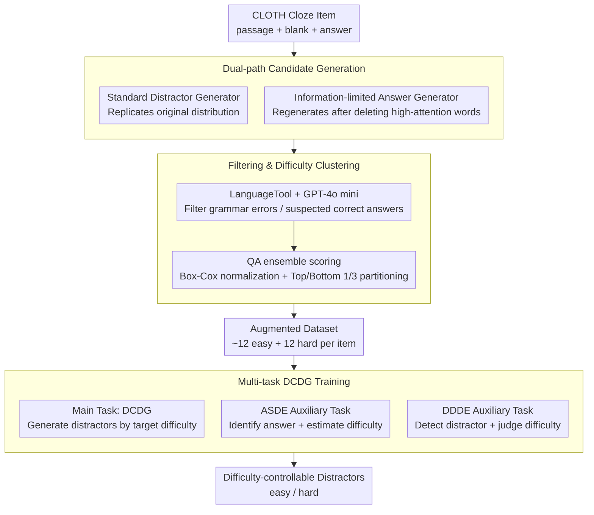

# Difficulty-Controllable Cloze Question Distractor Generation

**Conference**: ACL2026  
**arXiv**: [2511.01526](https://arxiv.org/abs/2511.01526)  
**Code**: https://github.com/ksh108405/DCDG  
**Area**: Text Generation / Educational NLP  
**Keywords**: Cloze test, distractor generation, difficulty control, data augmentation, multi-task learning

## TL;DR
This paper proposes DCDG, which enables easy/hard difficulty control for cloze distractor generation via dual-path data augmentation, QA ensemble difficulty clustering, and multi-task seq2seq training, significantly outperforming GPT-4o in both automatic and human evaluations.

## Background & Motivation
**Background**: Multiple-choice cloze tests are common in language proficiency testing and online education. Automatic item generation systems typically generate the correct answer first, followed by several plausible distractors that should not be the correct answer. Recent methods mainly use PLMs or text-to-text models to directly learn the distribution of existing distractors in datasets, while some work utilizes candidate word lists or knowledge bases for filtering.

**Limitations of Prior Work**: Existing methods tend to replicate the original distractor distribution of the training set. While they can generate "distractor-like" words, it is difficult to specify whether a distractor should be easier to eliminate or harder (more distracting) for learners. Another practical issue is that public cloze datasets usually contain few manual distractors and lack large-scale difficulty annotations, making it difficult to train difficulty-aware models directly.

**Key Challenge**: Distractor difficulty is related to both semantic similarity and contextual substitutability, while also being influenced by learner proficiency. To make the problem tractable, the authors narrow the research scope to "contextual semantic plausibility" in language assessment: candidates that appear fillable but are ultimately incorrect are "hard," while those clearly inconsistent with the context are "easy."

**Goal**: The authors aim to solve two sub-problems: first, how to augment the unannotated CLOTH dataset with a large number of easy/hard distractors; second, how to train a model that stably generates distractors of a specified target difficulty.

**Key Insight**: The authors observe that an answer generator knows which contextual words are most critical for the correct answer. If these high-attention words are intentionally deleted and the generator is prompted to fill the blank, it will generate candidates that are related to the original answer but no longer fully constrained by the original context—these are naturally suitable for distractors of varying difficulty.

**Core Idea**: Complement a standard distractor generator with an "information-limited answer generator," use a QA ensemble to cluster candidates into easy/hard categories, and finally incorporate difficulty control signals into the generation model through a primary task and two auxiliary tasks.

## Method

### Overall Architecture

The DCDG framework consists of two levels: the upstream stage creates an augmented dataset with easy/hard labels from the unannotated CLOTH dataset, and the downstream stage uses this data to train a difficulty-controllable distractor generator. The upstream stage expands each original cloze item into approximately 12 easy and 12 hard candidates. The downstream goal is to stably generate distractors of the specified difficulty given the passage, blank, answer, target difficulty, and quantity.

Specifically, Phase 1 trains two Gemma 2 9B generators: a standard distractor generator to learn the original distractor distribution, and an answer generator that first learns to generate the correct answer and is then reused on "partially deleted passages" to generate "misled answers." Phase 2 uses LanguageTool and GPT-4o mini to filter grammatical errors or candidates that might serve as correct answers. Phase 3 uses a QA ensemble of multiple fine-tuned PLMs to score candidates, partitioning them into hard/easy categories based on the top and bottom thirds. Finally, the main DCDG model is trained on this augmented data along with two auxiliary tasks, ASDE and DDDE, allowing the model to understand the semantic relationships between answers, distractors, and difficulty.

### Key Designs

**1. Dual-path Candidate Generation: Augmenting candidates with "Standard Generator + Information-limited Answer Generator"**

Relying only on original distractors locks the candidates into the difficulty distribution of the training data; relying only on LLM zero-shot generation may not fit the cloze context. The authors observe that an answer generator knows which contextual words are most critical. Thus, the standard distractor generator replicates typical distractors from the dataset, while the answer generator calculates attention on the full passage, **deletes high-attention words**, and regenerates. This produces candidates that are "related to the answer but no longer fully constrained," naturally covering different difficulty levels. Deletion ratios (e.g., 0.1, 0.2, 0.4) allow for further control: higher deletion ratios yield candidates further from the answer (lower difficulty).

The two paths complement each other—one follows intra-dataset style and the other provides broader semantic coverage (semantic overlap is only 0.29, Jaccard overlap only 0.13).

**2. Filtering and Difficulty Clustering: Removing invalid candidates and approximating difficulty via QA ensemble "mis-selection tendency"**

Augmented candidates vary in quality, and difficulty cannot be assigned subjectively at scale. The authors first use LanguageTool to remove grammatically incorrect items and GPT-4o mini to filter candidates that could potentially be correct answers. The remaining candidates are handed to a QA ensemble of 18 small PLMs (11 model families) fine-tuned for cloze tasks. The scores measure "how much this option looks like the correct answer." The top third are labeled hard, the bottom third easy, and the middle segment is discarded.

The ingenuity lies in approximating difficulty through the "probability of the candidate being mistakenly selected as the answer by QA models." Since score distributions across models are right-skewed, Box-Cox normalization is applied to scale and aggregate them.

**3. Multi-task DCDG Training: Auxiliary tasks to force understanding of "why this is a distractor"**

If only trained to "generate distractors given difficulty," the model may treat the difficulty token as a superficial label. To address this, the main DCDG task generates distractors based on passage, quantity, target difficulty, and answer. The ASDE (Answer Selection and Difficulty Estimation) task requires the model to find the correct answer in a mixed set and estimate distractor difficulty. The DDDE (Distractor Detection and Difficulty Estimation) task involves filling a distractor back into the blank and asking the model to detect its status and difficulty.

Training these tasks jointly forces the model to learn "answer substitutability," "distractor attributes," and "relative difficulty," significantly improving the separability of hard and easy outputs.

### Loss & Training

All tasks are unified under seq2seq cross-entropy training. Gemma 2 9B is used for both candidate generation and the main DCDG model. Data augmentation uses 5-fold cross-validation to ensure the model does not see the training answers for the same items during generation. DCDG is trained using LoRA with $r=16, \alpha=16$, a warm-up ratio of 0.1, and a learning rate of $5e^{-5}$ for DDDE and $3e^{-5}$ for other tasks, utilizing early stopping to prevent overfitting.

## Key Experimental Results

### Main Results

| Object | Metric | Ours | Baseline | Key Conclusion |
|--------|------|----------|----------|----------|
| Augmented Dataset | Easy distractors per item | 12.06 | CLOTH original ~2.998 | Significant expansion in quantity |
| Augmented Dataset | Hard distractors per item | 12.02 | CLOTH original ~2.998 | Sufficient samples for both difficulty ends |
| Augmented Easy | GPT-4o judged "Easiest" | 73.17% | Original distractor 21.21% | Easy labels match expectations |
| Augmented Hard | GPT-4o judged "Hardest" | 70.05% | Original distractor 26.53% | Hard labels significantly more distracting |
| DCDG + ASDE + DDDE | Easy gen judged "Easiest" | 64.23% | GPT-4o 0-shot 33.54% | Difficulty control outperforms GPT-4o |
| DCDG + ASDE + DDDE | Hard gen judged "Hardest" | 73.25% | GPT-4o 0-shot 56.77% | Strongest control on hard distractors |

### Ablation Study

| Configuration | Key Metric | Description |
|------|---------|------|
| Answer generator w/ IR | 19.25 items/item, semantic diversity 0.6928 | Inf.-limited generator provides more diverse candidates |
| Distractor generator | 29.66 items/item, semantic diversity 0.6684 | Standard generator has higher yield but narrower coverage |
| Dual-path overlap | semantic overlap 0.2908, Jaccard 0.1281 | Two paths are highly complementary |
| Deletion ratio 0.1 | diversity 0.6554, plausibility 0.3404 | Closer to answer, higher difficulty |
| Deletion ratio 0.5 | diversity 0.6734, plausibility 0.2920 | More diverse, lower difficulty |
| DCDG + ASDE + DDDE | invalid ratio: easy 0.2%, hard 5.1% | Reduces invalid distractors while maintaining control |

### Key Findings
- High-attention deletion is much more effective than random or low-attention deletion. Removing 25% of low-attention words causes >40% of candidates to duplicate the correct answer, while high-attention deletion keeps this under 20%.
- Human ESL evaluations align with automatic results: 72.8% of generated "easy" items were rated "Easiest," and 45.6% of "hard" items were rated "Hardest," with invalid ratios below 1.6%.
- The Spearman correlation between GPT-4o and human difficulty rankings is 0.54 (close to human inter-annotator agreement of 0.62), validating GPT-4o as an acceptable proxy for large-scale difficulty evaluation in this 3-option ranking setup.

## Highlights & Insights
- The most clever aspect is turning "answer generator failure" into "distractor generation capability": by deleting critical context, a model striving for the correct answer produces candidates related to the answer but incorrect, which is more controllable than directly prompting an LLM to generate distractors.
- Difficulty labels do not rely on subjective scoring but are approximated through the selection bias of a QA ensemble, providing a task-defined difficulty metric that scales.
- The value of ASDE and DDDE lies in making the model understand "why this is a distractor" rather than just "generate a word labeled hard." This approach is transferable to answer generation, distractor explanation, and quality control in reading comprehension items.

## Limitations & Future Work
- The authors acknowledge that the work only controls distractor difficulty, without incorporating holistic item factors like passage readability, syntactic structure, or blank position.
- Difficulty is discretized into easy/hard binary categories, which loses fine-grained adaptability for specific pedagogical needs.
- The information-limited strategy is mainly designed for word-level cloze questions; its extension to open-ended QA or math problems requires re-designing deletion rules and filters.

## Related Work & Insights
- **vs. Traditional Knowledge Bases**: Early methods relied on WordNet or Probase, which are interpretable but have limited domain coverage. This paper uses generative models and filters for broader coverage.
- **vs. PLM Direct Generation**: Methods like Chiang et al. can generate natural distractors but have weak difficulty control. This work introduces explicit signals through augmented data and multi-task learning.
- **vs. IRT-based Modeling**: IRT reflects actual learner ability but requires massive student response data. This paper uses a discrete difficulty proxy suitable for public datasets lacking student data.
- **Insight**: For many educational generation tasks, one can first construct "automated behavioral proxy metrics" then train controllable models, rather than expecting LLMs to understand abstract pedagogical difficulty through prompts alone.

## Rating
- Novelty: ⭐⭐⭐⭐☆ Using information-limited answer generators for augmentation is highly distinctive.
- Experimental Thoroughness: ⭐⭐⭐⭐⭐ Comprehensive automatic, ESL human, and expert evaluations.
- Writing Quality: ⭐⭐⭐⭐☆ Clear methodology and well-supported by tables.
- Value: ⭐⭐⭐⭐☆ Highly practical for educational NLP and automated item generation.

<!-- RELATED:START -->

## Related Papers

- [\[ACL 2026\] Children's English Reading Story Generation via Supervised Fine-Tuning of Compact LLMs with Controllable Difficulty and Safety](childrens_english_reading_story_generation_via_supervised_fine-tuning_of_compact.md)
- [\[ICLR 2026\] Unveiling the Potential of Diffusion Large Language Model in Controllable Generation](../../ICLR2026/nlp_generation/unveiling_the_potential_of_diffusion_large_language_model_in_controllable_genera.md)
- [\[ICLR 2026\] Improving Attributed Long-form Question Answering with Intent Awareness](../../ICLR2026/nlp_generation/improving_attributed_long-form_question_answering_with_intent_awareness.md)
- [\[ACL 2026\] Adaptive Planning for Multi-Attribute Controllable Summarization with Monte Carlo Tree Search](adaptive_planning_for_multi-attribute_controllable_summarization_with_monte_carl.md)
- [\[ACL 2026\] XtraGPT: Context-Aware and Controllable Academic Paper Revision via Human-AI Collaboration](xtragpt_context-aware_and_controllable_academic_paper_revision_via_human-ai_coll.md)

<!-- RELATED:END -->
