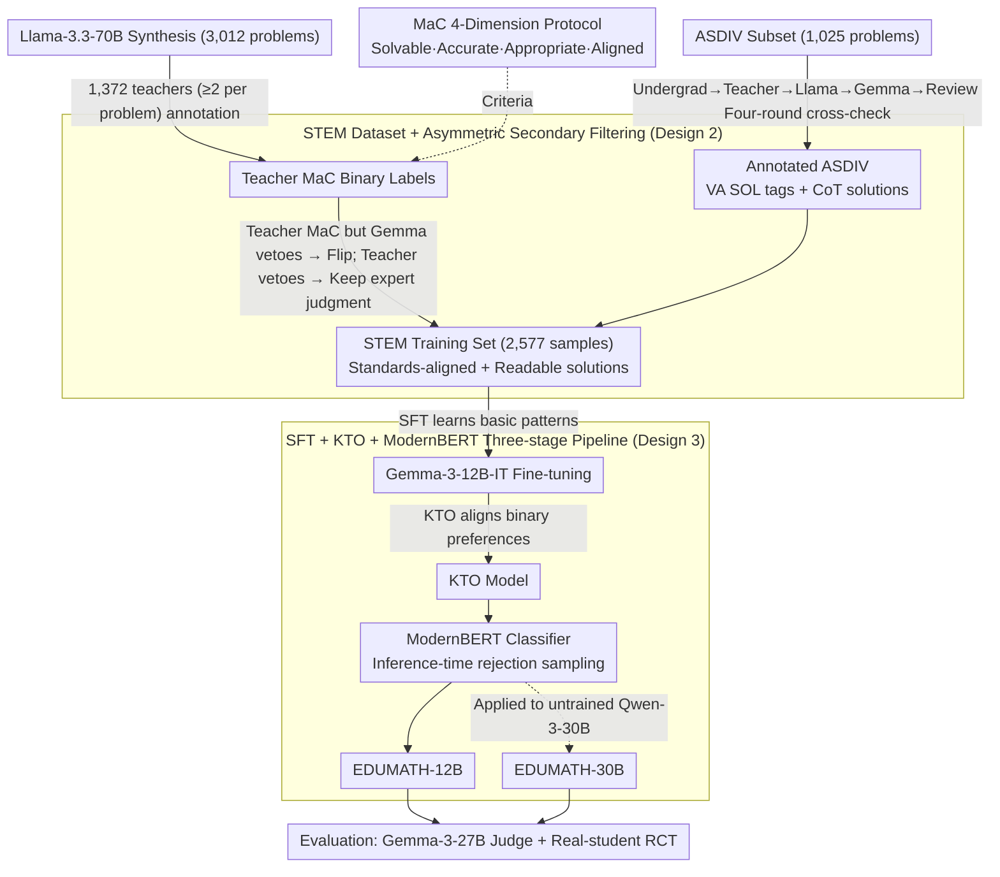

# EDUMATH: Generating Standards-aligned Educational Math Word Problems

**Conference**: ACL 2026  
**arXiv**: [2510.06965](https://arxiv.org/abs/2510.06965)  
**Code**: https://github.com/bryanchrist/EDUMATH  
**Area**: Text Generation / Education  
**Keywords**: Math Word Problem Generation, Standards Alignment, Teacher Annotation, KTO, ModernBERT Filtering

## TL;DR
The authors systematize the task of "generating math word problems (MWP) aligned with K-12 math curriculum standards," collecting 11,000+ STEM MWP training data points annotated by real US teachers. Through an SFT + KTO + ModernBERT filtering pipeline, they trained two open-source SOTA generators, EDUMATH-12B/30B. They conducted the first RCT on actual 3rd-5th grade students, finding that while student accuracy was comparable between LLM-generated and human-written problems, students showed an **almost unanimous preference for customized LLM problems**.

## Background & Motivation

**Background**: Math word problems (MWPs) are core assessment tools in K-12 math education. Customizing problems based on student interest and ability has been widely proven to improve learning outcomes. However, teachers face severe burnout and lack the time to write individualized problems, often relying on limited problem banks. While the linguistic capabilities of LLMs make "automatic MWP generation" appear straightforward, prior works such as Christ 2024 and Ariyarathne 2025 have found that LLMs still lag significantly in educational-grade MWP generation.

**Limitations of Prior Work**: (1) **Lack of Solutions**: Existing generation works (Ariyarathne 2025, Sun 2025) produce only the problem text without step-by-step solutions, making them unusable for teachers/students; (2) **Coarse Granularity**: Alignment is often limited to broad topics like "addition/subtraction" rather than complete standards like "single-step addition/subtraction within two digits," preventing fine-grained difficulty control; (3) **Lack of Real Evaluation**: Previous evaluations relied on LLM self-assessment or college students rather than practicing teachers, missing "product-grade" signals; (4) **Lack of Training Data**: Datasets like GSM8K, ASDIV, and SVAMP are not labeled according to K-12 standards and cannot be used to train generators directly.

**Key Challenge**: Educational MWPs must simultaneously satisfy four conflicting hard constraints: solvability, accurate solutions, educational appropriateness, and strict standards alignment. Failure in any single dimension results in rejection by teachers. However, existing LLM training data typically satisfies only 1-2 of these criteria.

**Goal**: (1) Define the "standards-aligned educational MWP generation" task and provide four evaluation dimensions; (2) Construct STEM, the first teacher-annotated training set with readable solutions; (3) Train small-scale open-source generators that rival closed-source SOTA models; (4) Conduct the first controlled user study on real elementary school students.

**Key Insight**: The authors chose the Virginia SOL (VA SOL) instead of the Common Core because VA SOL specifies quantifiable difficulty constraints (e.g., numerical ranges, number of steps) for each standard, making it more suitable for "strict alignment."

**Core Idea**: A "Teacher + LLM dual annotation" process is used to filter an ASDIV subset and 3,012 LLM-synthesized MWPs into a "Meets All Criteria" (MaC) set. This is followed by a three-stage pipeline of SFT $\rightarrow$ KTO $\rightarrow$ ModernBERT training and filtering, contributing "high-quality data" and "classifier post-processing" to small and large models respectively.

## Method

### Overall Architecture
A five-stage pipeline: (1) **Annotating ASDIV Subset**—1,025 problems for grades 3-5 were cross-checked through four rounds (undergraduate education students $\rightarrow$ K-12 teachers $\rightarrow$ Llama-3.3-70B $\rightarrow$ Gemma-3-27B $\rightarrow$ final review by education students) to provide VA SOL tags and CoT solutions; (2) **Synthesis + Teacher Annotation**—Llama-3.3-70B generated 80-90 problems for each of the 23 covered and 15 uncovered SOL combinations (3,012 total). 1,372 Prolific US teachers annotated each problem across 4 dimensions (at least 2 teachers per problem, tie-breaking with a third). MaC labels were obtained via majority vote, followed by a "quality re-check" by Gemma-3-27B to flip suspicious labels; (3) **Training EDUMATH 12B**—Gemma-3-12B-IT underwent SFT on STEM, followed by KTO on all teacher annotations (MaC and non-MaC) for binary preference alignment, and finally a ModernBERT MaC classifier for rejection sampling; (4) **Training EDUMATH 30B**—The ModernBERT classifier is applied directly to Qwen-3-30B outputs for filtering **without training** the backbone; (5) **Evaluation**—250-1000 samples were taken from 5 open-source and 3 closed-source baselines, evaluated by Gemma-3-27B as an automatic judge (benchmarked against teacher $\kappa$) and via a real-student RCT.

### Key Designs

**1. 4-Dimension MaC (Meets-All-Criteria) Protocol: Compressing "educational-grade" into a strict binary threshold**

Previous MWP evaluations focused only on solvability and correctness, allowing problems with mismatched standards or convoluted solutions to pass. MaC replicates the teacher's workflow by decomposing a problem into four binary criteria: Solvability (problem has a unique solution); Accuracy (CoT solution has a correct final answer and readable, logical steps); Educational Appropriateness (no grammar errors, conflicting info, and grade 3-5 appropriate); Standards Alignment (strictly meets VA SOL quantifiable constraints). A problem is MaC only if all four are True. This joint threshold is extremely high; teacher agreement on MaC was $65.5\pm1.7\%$—a direct cost of rigorous quality discrimination.

**2. STEM Dataset + Teacher × LLM Asymmetric Filtering: Refining scarce expert signals**

Since datasets like GSM8K and ASDIV lack K-12 standards, they cannot train aligned generators. The authors constructed STEM (2,577 samples), the first dataset combining teacher annotations, standards alignment, and readable solutions. It comprises an ASDIV subset (1,025) and teacher-validated MaC synthetic problems (1,552). The key is the asymmetric filtering: if a teacher labels a problem MaC but Gemma's re-check vetoes it, the label is flipped to non-MaC to eliminate human fatigue errors. Conversely, if a teacher vetoes a problem but Gemma passes it, the teacher's judgment is retained, trusting the expert's intuition for subtle inappropriateness. This rule extracts the maximum value from both human expertise and machine scale.

**3. SFT + KTO + ModernBERT Three-stage Pipeline: Maximizing the value of limited annotations**

To achieve cross-category performance leaps with limited data, SFT first uses STEM to teach the basic "solvable + aligned + readable CoT" pattern. Next, KTO (Kahneman-Tversky Optimization) uses binary MaC labels as positive/negative examples for alignment. KTO does not require paired preferences, fitting the natural binary signal from teacher voting and offering more stability than pairwise DPO/RLHF. Finally, a ModernBERT binary classifier (AUC-ROC 0.861) performs rejection sampling during inference. This post-processing grants EDUMATH-12B a +4.9% MaC boost and pushes the untrained Qwen-3-30B to SOTA levels. The classifier decouples training cost from quality thresholds, allowing future stronger LLMs to be integrated without retraining.

### Loss & Training
SFT: Gemma-3-12B-IT, 5 epochs, lr=$1\times 10^{-6}$, bs=1, 10% warm-up, checkpoint selected by validation loss (step 10k); KTO: Merged teacher annotations + ASDIV = 4,039 samples, 4×A100-80G, 5 epochs, lr=$5\times 10^{-6}$, bs=8, desirable/undesirable weights by inverse frequency; ModernBERT: 3,664 rows, 10 epochs, lr=$1\times 10^{-5}$, bs=8, weighted cross-entropy; Evaluation: 8-shot prompting using STEM examples, 1,000 (open) / 250 (closed) problems generated per model.

## Key Experimental Results

### Main Results
Comparison of 8 models across 4-dimension MaC (evaluated by Gemma-3-27B judge, benchmarked against teacher $\kappa$):

| Model | PPL ↓ | BF1 vs Self | ASDIV BF1 | Q Len | A Len | MaC ↑ |
|------|-------|-----------|-----------|--------|--------|-------|
| GPT-4o (API) | 16.1 | 75.2 | 74.2 | 63.5 | 152.3 | 92.8 |
| GPT-4.1 (API) | 16.3 | 75.3 | 74.3 | 64.5 | 150.2 | 92.8 |
| GPT-4.5 (API) | 15.7 | 75.0 | 74.1 | 61.8 | 150.6 | 92.0 |
| Gemma-3-12B-IT | 11.3 | 77.2 | 74.0 | 84.7 | 240.8 | 63.9 |
| Gemma-3-27B-IT | 12.2 | 77.1 | 74.5 | 76.1 | 215.1 | 75.4 |
| Qwen-3-30B-IT | 12.3 | 76.9 | 74.0 | 68.1 | 202.9 | 87.3 |
| Qwen-3-235B-IT | 12.5 | 76.1 | 74.1 | 66.5 | 186.5 | 89.0 |
| **EDUMATH-12B** | **9.5** | 74.5 | 73.8 | 54.9 | 166.7 | 85.9 |
| **EDUMATH-30B** | 12.0 | 76.1 | 73.8 | 60.4 | 163.5 | **94.6** |

Key points: (1) EDUMATH-30B becomes SOTA with 94.6% MaC, surpassing GPT-4.5 (92.0%) and GPT-4o (92.8%); (2) EDUMATH-12B (85.9%) approaches 30B-level open-source models with only 12B parameters; (3) EDUMATH-12B achieves the lowest PPL (9.5) and a question length (54.9) closest to the human average (53.9); (4) BERTScore shows EDUMATH's homogeneity with ASDIV is nearly equal to ASDIV's internal BF1, implying "diversity ≈ human levels."

### Ablation Study (EDUMATH-12B Three-stage pipeline)

| Stage | MaC % |
|------|-------|
| Gemma-3-12B-IT base | 63.9 (±1.5) |
| + SFT on STEM | 76.2* (+12.3) |
| + KTO | 81.0* (+4.8) |
| + ModernBERT filtering (Final EDUMATH-12B) | **85.9*** (+4.9) |

Each stage shows a significant improvement ($p<0.01$). Topic decomposition (Table 3) shows EDUMATH-30B is the only model achieving MaC > 90% across 8 major math topics, demonstrating balanced capability.

### Key Findings
- **Three-stage pipeline is essential**: SFT provides basic imitation, KTO calibrates binary preferences, and ModernBERT provides the safety net. The leap from 63.9% to 85.9% for the 12B model relies entirely on the synergy of data, training, and post-processing.
- **Filtering classifier benefits untrained large models**: Applying ModernBERT directly to Qwen-3-30B results in SOTA performance, proving the "annotation value" is model-agnostic and transferable.
- **Error Analysis**: The primary failure mode for all models is Accuracy (verbose or illogical reasoning), accounting for 30-60% of errors. Educational Appropriateness is nearly saturated for LLMs, but "clear, concise logic" remains a bottleneck.
- **Real-student RCT Conclusions**: Test of 94 students across two schools showed that while accuracy was nearly identical between EDUMATH and human problems, the **vast majority of students preferred customized LLM problems** (e.g., in School 2's personalized scenario, 11 out of 12 students chose the LLM problem). The primary reason was "liking the topic in the problem"—providing the first controlled evidence for the "customization $\rightarrow$ engagement" chain.

## Highlights & Insights
- **Pushing "educational alignment" from 'topic-level' to 'standards-level'**: By using VA SOL's machine-verifiable constraints, the task becomes quantifiable. This philosophy of "standards $\rightarrow$ difficulty vectors" can be applied to any K-12 education LLM.
- **KTO + ModernBERT as the optimal solution for "unpaired preference" educational scenarios**: DPO/RLHF require pairwise preferences, while teacher voting is naturally binary. KTO embraces this granularity, and the classifier raises the quality floor at inference.
- **First elementary student RCT for MWP generation**: Moving beyond automatic metrics or college student proxies, this work proves LLM problems can be "equally effective and more engaging," a rare "human-centric" result in AI-for-Education.
- **Asymmetric Teacher-Gemma flip rule**: This effectively absorbs the strengths of both humans and LLMs, serving as a valuable data cleaning strategy to increase signal-to-noise ratio without extra cost.

## Limitations & Future Work
- Only covers grades 3-5 and English SOL; expansion to K-2/6-12 or other languages requires new teacher annotations.
- Re-evaluation is needed for multi-modal MWPs, as the current model is text-only and lacks diagrams/geometry.
- Standardized prompts were used for fairness, but closed-source models might perform better with their own customized prompts.
- High dependence on a single automatic judge (Gemma-3-27B); despite its correlation with teachers, potential "judge bias" remains.
- The student RCT sample ($n=94$) is relatively small and limited to two schools.

## Related Work & Insights
- **vs MATHWELL (Christ 2024)**: MATHWELL aligned to interests but not standards and used only 3 evaluation dimensions; this work adds Standards Alignment and scales both data and models.
- **vs Mathwizards / Sun 2025**: These generate topic-aligned problems but **lack solutions**; EDUMATH outputs both problem text and readable CoT solutions.
- **vs GSM8K / ASDIV / SVAMP**: These datasets train solvers; STEM trains generators. This represents the other side of "educational LLM" research.
- **vs OpenAI GPT series**: While closed-source MaC is high (92%+), EDUMATH-30B is more balanced across topics and has superior PPL, proving high-quality open data + inference filtering can lead to an overtake.
- **Insight**: Any domain requiring "strictly regulated output + scarce labels" (e.g., medical QA, legal contracts, exam banks) can adopt this "Human+LLM dual annotation $\rightarrow$ SFT+KTO+Classifier pipeline $\rightarrow$ Real-user RCT" paradigm.

## Rating
- Novelty: ⭐⭐⭐⭐ Standards-level alignment + MaC protocol + KTO/ModernBERT combo.
- Experimental Thoroughness: ⭐⭐⭐⭐⭐ 11,000+ teacher annotations + 8 model comparison + 8 topic breakdown + real-student RCT.
- Writing Quality: ⭐⭐⭐⭐ Clear five-stage narrative; high information density in tables.
- Value: ⭐⭐⭐⭐⭐ Open-sourcing data, models, and evaluation provides direct social value for reducing teacher burnout.

<!-- RELATED:START -->

## Related Papers

- [\[ACL 2026\] Can You Make It Sound Like You? Post-Editing LLM-Generated Text for Personal Style](can_you_make_it_sound_like_you_post-editing_llm-generated_text_for_personal_styl.md)
- [\[ACL 2026\] Investigating the Representation of Backchannels and Fillers in Fine-tuned Language Models](investigating_the_representation_of_backchannels_and_fillers_in_fine-tuned_langu.md)
- [\[ACL 2026\] Are Emotion and Rhetoric Neurons in LLM? Neuron Recognition and Adaptive Masking for Emotion-Rhetoric Prediction Steering](are_emotion_and_rhetoric_neurons_in_llm_neuron_recognition_and_adaptive_masking_.md)
- [\[ACL 2026\] Frankentext: Stitching Random Text Fragments into Long-Form Narratives](frankentext_stitching_random_text_fragments_into_long-form_narratives.md)
- [\[ACL 2026\] XtraGPT: Context-Aware and Controllable Academic Paper Revision via Human-AI Collaboration](xtragpt_context-aware_and_controllable_academic_paper_revision_via_human-ai_coll.md)

<!-- RELATED:END -->
