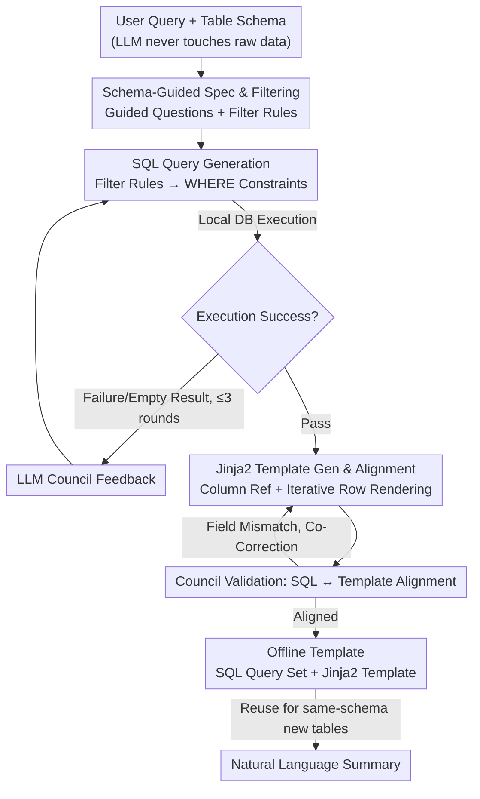

# FACTS: Table Summarization via Offline Template Generation with Agentic Workflows

**Conference**: ACL 2026 Findings  
**arXiv**: [2510.13920](https://arxiv.org/abs/2510.13920)  
**Code**: [GitHub](https://github.com/BorealisAI/FACTS)  
**Area**: Data Analysis / Table Understanding  
**Keywords**: Table Summarization, Offline Template, Agentic Workflow, SQL Generation, Privacy Compliance

## TL;DR

Ours proposes FACTS (Fast, Accurate, and Privacy-Compliant Table Summarization), which automatically generates reusable offline templates (SQL queries + Jinja2 templates) through a three-stage Agentic workflow. It achieves rapid, accurate, and privacy-compliant query-focused table summarization, outperforming baselines across FeTaQA, QTSumm, and QFMTS benchmarks.

## Background & Motivation

**Background**: Query-focused table summarization requires generating natural language summaries from tabular data based on user queries. This differs from simple table QA (returning short answers) and general table summarization (capturing all key content). Professionals in fields like finance, healthcare, and law rely on customized summaries for decision-making.

**Limitations of Prior Work**: (1) Table-to-text models (e.g., TAPEX, ReasTAP) require expensive fine-tuning and perform poorly in numerical reasoning and logical faithfulness; (2) Prompting-based methods (e.g., DirectSumm) query LLMs directly, which is limited by token constraints, exposes sensitive data, and requires re-generation for every new table; (3) Existing Agentic frameworks (e.g., Binder, Dater) rely on decomposition planning or manual templates, lacking robustness and scalability.

**Key Challenge**: Practical solutions must simultaneously satisfy four attributes—Fast (reusable), Accurate (execution-based rather than free generation), Scalable (not requiring transmission of all rows), and Privacy-Compliant (not exposing raw data to LLMs)—but no existing method meets all four.

**Goal**: Design the first Agentic framework for automated offline template generation that allows for one-time generation and multi-time reuse, satisfying all four attributes.

**Key Insight**: Decompose table summarization into SQL queries (extracting precise values) + Jinja2 templates (rendering natural language), forming offline templates independent of specific data values.

**Core Idea**: Offline templates are bound to table schemas and query semantics rather than specific data values—once generated, they can be directly applied to any new table sharing the same schema, avoiding repetitive LLM inference.

## Method

### Overall Architecture

FACTS consists of three interconnected stages, with outputs from each stage iteratively validated and improved by an LLM Council (multi-model ensemble verification). The final output is an offline template—a set of SQL queries + a Jinja2 rendering template. The LLM only interacts with schema information throughout the process, never exposing raw data.

### Key Designs

**1. Schema-Guided Specification and Filtering: Translating high-level NL queries into schema-level operations**

User queries are typically high-level natural language. Feeding them directly to models is difficult for precise execution and risks data exposure. Therefore, the first stage performs "translation." The agent receives only the user query and table schema, producing two outputs: guided questions to identify relevant columns, relations, and operations; and filtering rules to specify rows or category values to exclude. Crucially, the LLM never touches raw data, proposing abstract rules like `exclude rows where category='expense'`, which are later converted into SQL WHERE clauses. This clarifies intent while keeping data inspection strictly local.

**2. SQL Queries Generation: Grounding summarization in executable programs to eliminate hallucinations**

The primary risk of free-text generation is the fabrication of numerical and logical data. FACTS counters this by routing data extraction through SQL. The agent generates candidate SQL based on first-stage specifications, translating filtering rules into constraints. Each query is validated through actual execution on a local database: failures or empty results trigger feedback to the LLM Council, allowing the agent to iteratively correct the query with a maximum patience of 3 rounds. Since final numbers come from database execution rather than model estimation, factual correctness is guaranteed by the mechanism.

**3. Jinja2 Template Generation and Alignment: Decoupling data extraction and text rendering for verification and reuse**

Once precise SQL results are obtained, they must be converted into natural language. This is handled by Jinja2 templates, which are required to reference exact column names, correctly iterate through returned rows, and handle empty results gracefully. The LLM Council specifically checks whether the SQL output and template references are aligned—if fields are missing or shapes are incompatible, the SQL and template are co-corrected. By splitting "data retrieval" (SQL) and "composition" (Jinja2), correctness is ensured by program execution while readability is handled by template rendering. Most importantly, once generated, this combination is bound to the schema and query semantics, allowing it to be applied to any shared-schema table without further LLM inference.

### A Complete Example

Example query: "Summarize non-expense income and expenditures for each department this quarter." In Stage 1, the agent sees the schema (e.g., `dept, category, amount, quarter`), generates the guided question "Need to aggregate amount by dept," and produces the filtering rule `exclude rows where category='expense'`. In Stage 2, the rule is translated to `SELECT dept, SUM(amount) ... WHERE category != 'expense' GROUP BY dept` and executed locally; if a column name is misspelled, the Council provides feedback for correction (avg. 1.36 rounds). In Stage 3, the agent generates a Jinja2 template to render the results into text like "Marketing net income this quarter is ...; R&D is ...," with the Council ensuring field alignment (avg. 1.84 rounds). Once saved, a new table for the next quarter with the same schema only requires SQL execution and rendering, with no further LLM calls.

### Loss & Training

FACTS is a training-free method. The primary agent uses GPT-4o-mini as the backbone. The LLM Council consists of GPT-4o-mini, Claude-4 Sonnet, and DeepSeek v3, utilizing majority voting to accept/reject and aggregated feedback to guide improvements. Each sample averages 2.47 guided questions/filtering rules, 1.36 SQL correction rounds, and 1.84 template correction rounds.

## Key Experimental Results

### Main Results

| Method | FeTaQA BLEU/RL/MET | QTSumm BLEU/RL/MET | QFMTS BLEU/RL/MET |
|------|---------------------|---------------------|---------------------|
| CoT | 28.2 / 51.0 / 56.9 | 19.3 / 39.0 / 47.2 | 31.5 / 54.3 / 58.1 |
| DirectSumm | 29.8 / 51.7 / 58.2 | 20.7 / 40.2 / 50.3 | 33.6 / 57.0 / 62.8 |
| SPaGe | 33.8 / 55.7 / 62.3 | 20.9 / 41.3 / 47.7 | 45.7 / 68.3 / 73.4 |
| FACTS (GPT-Only) | 30.8 / 55.7 / 66.0 | 20.1 / 43.1 / 50.5 | 45.4 / 70.5 / 73.2 |
| **Ours (FACTS)** | **32.6 / 58.9 / 67.7** | **21.9 / 45.8 / 51.3** | **46.0 / 70.8 / 73.2** |

### Ablation Study

| Evaluation Metric | FACTS Score |
|----------|-----------|
| Intent Matching | 97% |
| SQL Execution Accuracy | 94% |
| Template Rendering Accuracy | 98% |
| Council Consensus Error Rate | ~3% |
| Overall Factual Correctness | ~92% |

### Key Findings

- FACTS achieves best or second-best results across all three datasets, showing significant advantages in ROUGE-L and METEOR.
- Human Preference Study: Comparing FACTS vs SPaGe—55% prefer FACTS for completeness, 59% for correctness, and 60% for reduced hallucinations.
- Reusability Test: With 100 same-schema tables, FACTS significantly accelerates via template reuse (only SQL execution + Jinja2 rendering required).
- The GPT-Only variant still outperforms most baselines, proving the effectiveness of the core workflow, while Council diversity further enhances performance.
- Average consumption per sample is 9,922 input tokens and 1,045 output tokens, maintaining controllable computation costs.

## Highlights & Insights

- The "offline template" concept is an elegant engineering innovation—amortizing one-time LLM inference costs over infinite reuses, particularly suitable for enterprise scenarios (e.g., recurring annual financial reports).
- The LLM Council's majority voting + aggregated feedback mechanism provides a lightweight self-correction capability; a ~3% consensus error rate demonstrates the effectiveness of multi-model integration.
- Privacy compliance is a core advantage—LLMs only see the schema, while raw data values remain entirely within the local SQL engine.
- The combination of SQL + Jinja2 decouples "correctness" from "readability"—the former is guaranteed by program execution, and the latter is implemented via template rendering.

## Limitations & Future Work

- Assumes templates are fully reusable under the same schema, not accounting for schema drift or column renaming.
- Complex multi-table JOINs and nested queries may require more correction rounds.
- A SQL execution accuracy of 94% means 6% errors still exist—potentially insufficient for high-stakes decision-making.
- Natural language expression in Jinja2 templates may require adjustment across different languages or cultural contexts.

## Related Work & Insights

- **vs DirectSumm**: The latter passes the entire table + query to the LLM at once, exposing data and preventing reuse; FACTS solves both issues via offline templates.
- **vs SPaGe**: SPaGe uses graph-structured planning for reliability, but its plans are only partially reusable; FACTS's offline templates are fully reusable.
- **vs Binder/Dater**: These methods convert queries into executable programs but lack templating and reuse capabilities; FACTS adds a Jinja2 rendering layer to achieve natural language output.

## Rating

- **Novelty**: ⭐⭐⭐⭐ The offline template generation concept is novel and practical, though individual components (SQL gen, Jinja2, LLM Council) have precedents.
- **Experimental Thoroughness**: ⭐⭐⭐⭐⭐ Comprehensive evaluation across three benchmarks, including human assessment, reusability analysis, and ablation.
- **Writing Quality**: ⭐⭐⭐⭐⭐ Clear problem definition, intuitive attribute comparison table, and concrete examples.
- **Value**: ⭐⭐⭐⭐⭐ Highly practical—the privacy-compliant + reusable design directly addresses enterprise deployment pain points.

<!-- RELATED:START -->

## Related Papers

- [\[ACL 2025\] Theme-Explanation Structure for Table Summarization Using Large Language Models](../../ACL2025/nlp_generation/theme-explanation_structure_for_table_summarization_using_large_language_models_.md)
- [\[ACL 2026\] SCURank: Ranking Multiple Candidate Summaries with Summary Content Units for Enhanced Summarization](scurank_ranking_multiple_candidate_summaries_with_summary_content_units_for_enha.md)
- [\[ACL 2026\] Planning Beyond Text: Graph-based Reasoning for Complex Narrative Generation](planning_beyond_text_graph-based_reasoning_for_complex_narrative_generation.md)
- [\[ACL 2026\] Losses that Cook: Topological Optimal Transport for Structured Recipe Generation](losses_that_cook_topological_optimal_transport_for_structured_recipe_generation.md)
- [\[ACL 2026\] ThreadSumm: Summarization of Nested Discourse Threads Using Tree of Thoughts](threadsumm_summarization_of_nested_discourse_threads_using_tree_of_thoughts.md)

<!-- RELATED:END -->
