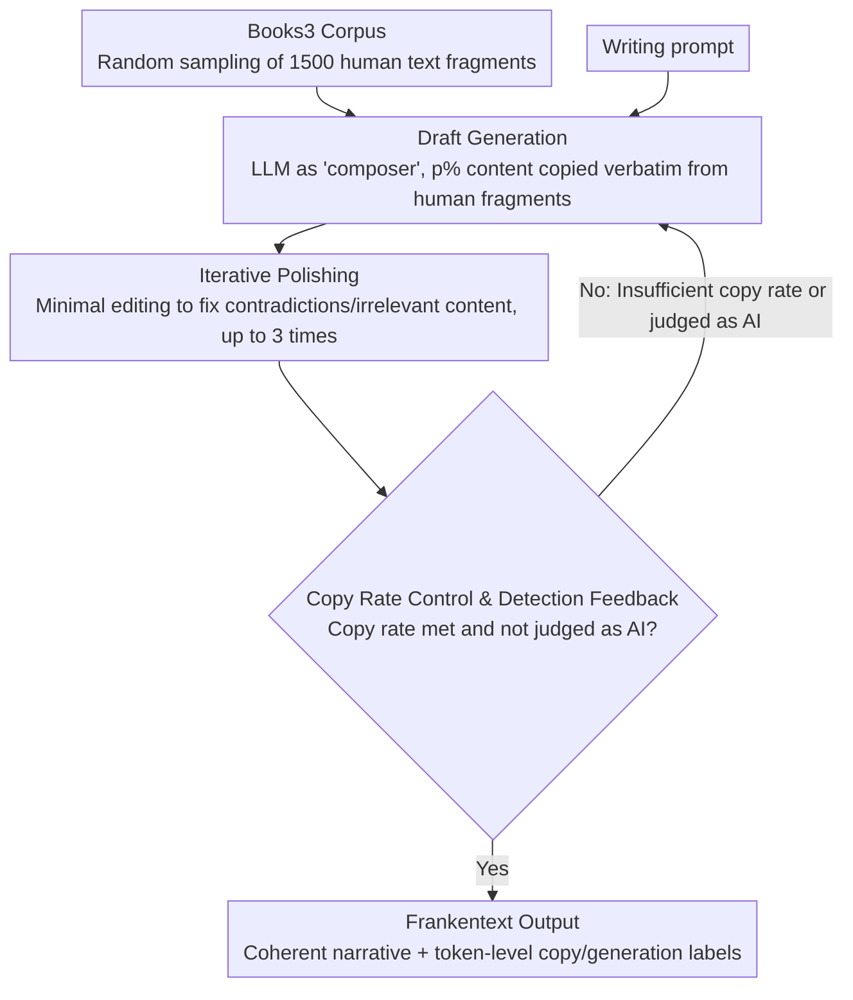

# Frankentext: Stitching Random Text Fragments into Long-Form Narratives

**Conference**: ACL 2026  
**arXiv**: [2505.18128](https://arxiv.org/abs/2505.18128)  
**Code**: [GitHub](https://github.com/chtmp223/Frankentext)  
**Area**: AIGC Detection  
**Keywords**: AIGC detection, mixed authorship attribution, controllable text generation, AI text detectors, human-AI collaborative writing

## TL;DR

This paper proposes the Frankentext paradigm, which enables LLMs to stitch random human text fragments into coherent long-form narratives under extreme constraints (90% of text copied verbatim from human writing). This reveals the severe failure of current AI text detectors in mixed-authorship scenarios (72% of Frankentext is misclassified as human writing).

## Background & Motivation

**Background**: As the quality of text generated by LLMs continues to improve, AI text detection has become a critical requirement for academic integrity and content provenance. Existing detectors are primarily based on the assumption of binary classification (AI vs. Human).

**Limitations of Prior Work**: In reality, there is a large "gray area" of human-AI collaborative writing where text is neither purely AI nor purely human-written, but a mixture of both. Existing binary detectors (such as Binoculars and FastDetectGPT) cannot effectively identify such mixed texts.

**Key Challenge**: Current detection methods rely on surface-level features (e.g., perplexity, statistical signatures). However, when AI-generated content is heavily embedded with authentic human text, these statistical features are diluted, leading to detection failure.

**Goal**: To systematically study an extreme controllable generation paradigm—Frankentext—where LLMs generate coherent narratives under the constraint that most tokens must be copied verbatim from human writing, thereby revealing the vulnerability of detectors and promoting the development of fine-grained detection methods.

**Key Insight**: Inspiration is drawn from Frankenstein—assembling a complete "creature" from "fragments" of different sources. The LLM acts as a composer rather than a writer, selecting, arranging, and stitching coherent stories from thousands of random human text fragments.

**Core Idea**: Through a prompt-based pipeline, LLMs are tasked to select and stitch randomly sampled human text passages. By maintaining a target copy rate (e.g., 90%) while generating coherent and relevant narratives, this poses a fundamental challenge to existing AI detectors.

## Method

### Overall Architecture

The Frankentext pipeline revolves around two core stages: "Draft Generation $\rightarrow$ Iterative Polishing," with an optional copy rate/detection feedback loop. First, 1500 human text fragments (approx. 103K BPE tokens) are randomly sampled from a large book corpus (Books3, containing 197K books and over 160M passages) and input into the LLM along with a writing prompt. The LLM then composes an initial draft under constraints. Subsequently, the same LLM performs iterative polishing (up to 3 times) to correct contradictions and incoherence. During this process, ROUGE-L or an AI detector can optionally serve as feedback signals. If the copy rate is insufficient or the text is judged as AI-generated, re-generation is triggered to ensure the output converges to the target copy rate while evading detection.

### Key Designs

**1. Draft Generation: LLM as "Composer" stitching narratives from random human fragments**

It is nearly impossible for humans to manually find combinations from thousands of unrelated fragments to form a story, but LLMs excel at implicit search within massive combinatorial spaces. The authors exploit this by providing the model with a writing prompt and 1500 randomly sampled passage-level human text fragments. The model is required to generate a story of approximately 500 words, where 90% of the content must be copied verbatim from the provided fragments, allowing only minor conjunctions and transitional phrases. Thus, the LLM functions not as an "author" but as a "composer"—its task is to select and arrange fragments from unrelated human texts into a coherent narrative, while the primary sentence bodies remain human-authored.

**2. Iterative Polishing: Correcting flaws without breaking copy constraints**

Directly stitched drafts often suffer from flaws such as character contradictions, factual conflicts, or irrelevant content, which hinder coherence. The polishing stage uses the same LLM to identify these issues and apply minimal edits (similar to self-correction) while strictly maintaining the verbatim copy constraints and the original writing prompt for up to 3 iterations. This step significantly improves coherence from 68% to 81%, demonstrating that the bottleneck in stitching quality lies in post-hoc integration rather than fragment selection.

**3. Copy Rate Control: Using optional feedback signals to optimize copy and evasion rates**

The final output must satisfy a preset proportion of human text (e.g., 90%) while ideally evading detectors. These two objectives share a feedback loop. The authors optionally treat ROUGE-L or AI text detectors themselves as feedback signals; if the copy rate is insufficient or the text is classified as AI-generated, the LLM is prompted to revise. While higher copy rates may decrease coherence, this feedback loop allows the generation process to converge dynamically, maximizing the probability of evading detection—a design that poses a fundamental challenge to current detectors.

## Key Experimental Results

### Main Results

| Model | Copy Rate | Relevance% | Coherence% | Pangram AI Det.% | Binoculars Det.% | FastDetectGPT Det.% |
|------|-----------|------------|------------|------------------|------------------|----------------------|
| Gemini-2.5-Pro (vanilla) | - | 100 | 100 | 100 | 52 | 99 |
| Gemini-2.5-Pro (FT) | 75% | 100 | 81 | 4 | 0 | 1 |
| o4-mini (FT) | 68% | 56 | 29 | 24 | 0 | 1 |
| Claude-3.7-Sonnet (FT) | 64% | 95 | 73 | 17 | 2 | 16 |
| DeepSeek-R1 (FT) | 42% | 91 | 72 | 74 | 0 | 0 |
| Qwen-3-32B thinking (FT) | 36% | 91 | 54 | 85 | 52 | 92 |

### Ablation Study

| Configuration | Key Metric | Remarks |
|---------------|------------|---------|
| Remove Polishing | Coherence 68% $\rightarrow$ 81% | Polishing significantly improves coherence |
| Use Relevant Passages (FAISS) | Copy rate only 38% | Relevance surprisingly reduces copy rate |
| Use Sentences instead of Passages | Coherence 89%, Det. Rate +14% | Smaller units improve coherence but increase detectability |
| Max Context (100K passages) | Copy rate 76%, Coherence 89% | Best performance but 10x cost |
| Single Book (Monte Cristo) | Coherence 89%, Relevance 97% | Effective even with a single source |
| Request 25% Human Text | Pangram AI Det. 54% | More AI text $\rightarrow$ easier detection |
| Request 90% Human Text | Pangram AI Det. 4% | More human text $\rightarrow$ harder detection |

### Key Findings

- Gemini-2.5-Pro is the optimal model for Frankentext generation, balancing coherence (81%), relevance (100%), and a low detection rate (4%).
- Binoculars and FastDetectGPT are almost entirely ineffective against Frankentext (detection rates <2%). Pangram performs slightly better but still misses 59%.
- Human evaluators can identify 56% of Frankentext as containing AI participation on average, outperforming automated detectors.
- There is an inverse relationship between copy rate and detection rate: a higher proportion of human text makes detection harder, though coherence may decline.
- The frequency of typical AI keywords (e.g., "Elara") in Frankentext drops from 686 instances in vanilla generation to just 10.

## Highlights & Insights

- **Discovery of the Gray Area**: Frankentext breaks the binary "AI vs. Human" assumption, revealing a mixed-authorship space that current detectors struggle to navigate.
- **Cost-Efficiency**: Each Frankentext instance costs approximately $1.32 (via Gemini), significantly lower than the $2.50 per instance for human-AI collaborative datasets like CoAuthor, without requiring complex setups.
- **Token-level Labeling**: Every Frankentext generated includes token-level labels for "copied" vs. "generated" content, which can be directly utilized to train mixed-authorship detection models.
- **Unique Human Perception**: Evaluators noted that Frankentext possesses a unique "human feel"—characterized by imaginative premises, vivid descriptions, and dry humor—precisely because the majority of the content is sourced from human writing.

## Limitations & Future Work

- It relies on large-scale, high-quality human text corpora in the target domain; application to low-resource languages or specialized fields (e.g., technical manuals) remains difficult.
- Copy rate metrics might underestimate the actual proportion of human text involved.
- This study primarily exposes the attack surface without proposing specific defense mechanisms.
- The quality of Frankentext in non-fiction (e.g., news) requires further improvement, as the current generation favors narrative styles.
- The use of Books3 involves copyrighted works, raising questions regarding creative attribution and copyright.

## Related Work & Insights

- **vs. Binoculars/FastDetectGPT**: These perplexity-based detectors almost entirely fail on Frankentext, indicating that surface statistical features are insufficient for mixed-authorship text.
- **vs. Pangram**: As a trained classifier, Pangram can partially detect mixed text (marking 37% as "mixed"), but it still misses 59% of Gemini-generated Frankentext.
- **vs. CoAuthor**: Frankentext provides a cheaper, more scalable method for generating mixed-authorship data with various granularities (word-level and sentence-level).
- **vs. Paraphrasing Attacks**: Unlike paraphrasing which modifies AI text to evade detection, Frankentext directly utilizes original human text, representing a novel attack vector.

## Rating

- Novelty: ⭐⭐⭐⭐⭐ Proposes a new text generation paradigm that positions the LLM as a "composer" rather than an "author."
- Experimental Thoroughness: ⭐⭐⭐⭐⭐ Covers 5 model families, 3 detectors, human evaluation, and multiple ablation studies.
- Writing Quality: ⭐⭐⭐⭐ Clear structure with a vivid Frankenstein analogy, though some sections could be further streamlined.
- Value: ⭐⭐⭐⭐⭐ Provides a critical warning for the AI text detection field and moves the discourse from binary to fine-grained detection.

<!-- RELATED:START -->

## Related Papers

- [\[ICLR 2026\] FS-DFM: Fast and Accurate Long Text Generation with Few-Step Diffusion Language Model](../../ICLR2026/nlp_generation/fs-dfm_fast_and_accurate_long_text_generation_with_few-step_diffusion_language_m.md)
- [\[ACL 2025\] Context-Aware Hierarchical Merging for Long Document Summarization](../../ACL2025/nlp_generation/context-aware_hierarchical_merging_for_long_document_summarization.md)
- [\[ACL 2026\] Right at My Level: A Unified Multilingual Framework for Proficiency-Aware Text Simplification](right_at_my_level_a_unified_multilingual_framework_for_proficiency-aware_text_si.md)
- [\[ACL 2026\] Can You Make It Sound Like You? Post-Editing LLM-Generated Text for Personal Style](can_you_make_it_sound_like_you_post-editing_llm-generated_text_for_personal_styl.md)
- [\[ACL 2026\] Planning Beyond Text: Graph-based Reasoning for Complex Narrative Generation](planning_beyond_text_graph-based_reasoning_for_complex_narrative_generation.md)

<!-- RELATED:END -->
