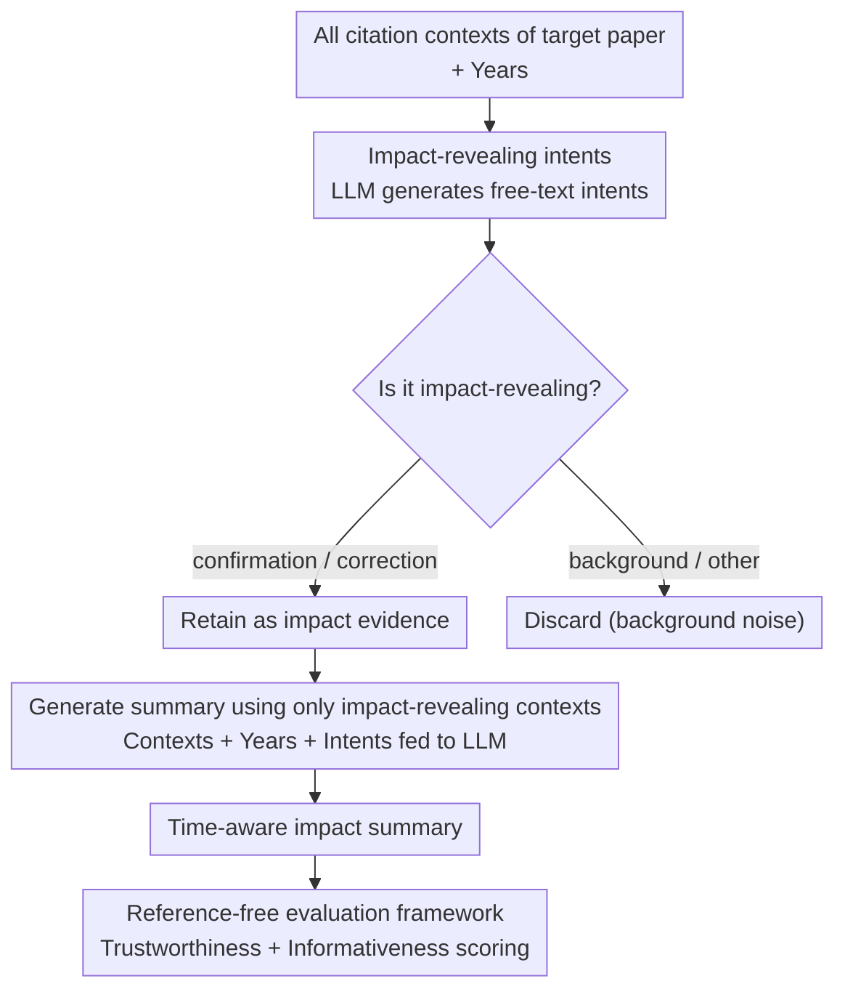

# In-depth Research Impact Summarization through Fine-Grained Temporal Citation Analysis

**Conference**: ACL2026  
**arXiv**: [2505.14838](https://arxiv.org/abs/2505.14838)  
**Code**: https://ukplab.github.io/acl2026-generating-impact-summaries  
**Area**: Scientific Literature Analysis / Text Generation  
**Keywords**: Research Impact Summarization, Citation Intent, Time-aware Summarization, citation context, LLM Evaluation  

## TL;DR
This paper proposes the task of "Scientific Impact Summarization": first identifying fine-grained intents that reveal true impact from citation contexts, and then generating an evolving narrative of impact over time. This approach better illustrates how a paper is adopted, criticized, and transformed by subsequent work compared to simple citation counts.

## Background & Motivation
**Background**: Research impact is typically measured by citation counts, h-index, or similar metrics. In NLP and scientometrics, significant work has focused on citation intent classification, using coarse-grained labels to indicate whether a citation serves as background, method, result, or motivation.

**Limitations of Prior Work**: Citation counts only indicate "how many times" a paper was cited, not "why." Two papers with 200 citations each could differ significantly: one might be reused as a primary method, another criticized for its limitations, and a third cited only as background. Existing intent classifications often stop at the individual citation context level and rarely aggregate large volumes of citations into a readable impact narrative.

**Key Challenge**: Genuine scientific impact encompasses both confirmation and correction. Subsequent papers may adopt a method or point out flaws and propose fixes. Relying solely on positive adoption or coarse labels misses the trajectory of "criticism, correction, and rediscovery" central to scientific progress.

**Goal**: The authors aim to filter "impact-revealing contexts" from all citation contexts of a target paper, identify their fine-grained citation reasons and years, and generate a time-aware impact summary describing how the paper influenced subsequent research across different stages.

**Key Insight**: Instead of allowing an LLM to generate freely based on titles and citation counts, the task is decomposed into two steps: first, utilizing in-context learning to generate fine-grained citation intents in free-text form and determining if they are impact-revealing; second, providing only the filtered impact-revealing contexts, years, and intents to an LLM to generate the summary.

**Core Idea**: Use "fine-grained citation intent + temporal information" as a structured intermediate layer to transform research impact from static numbers into verifiable, readable, and comparable historical narratives.

## Method

### Overall Architecture
The paper defines four concepts: citation context (text surrounding a citation), fine-grained citation intent (free-text description of the reason), impact-revealing intent (intents specifically showing impact, categorized as confirmation or critique/correction), and scientific impact summary (a temporal description of how a paper was used, extended, or corrected). The pipeline follows a three-step process—"filter evidence, write summary, reference-free evaluation": given citation contexts and years, the system generates intents and identifies impact-revealing ones; these indicators are fed to an LLM to generate a semi-structured impact summary; finally, a reference-free framework evaluates trustworthiness and informativeness.

### Key Designs

**1. Impact-revealing citation intent as an intermediate representation: Upgrading "why cited" from coarse labels to free-text evidence**

Scientific impact is often hidden in specific usage—fixed taxonomies are too coarse, and citation counts lose the semantics of how subsequent work actually utilizes a paper. The authors task the LLM to output a free-text intent for each context and categorize it as confirmation, correction, or other (e.g., "use of minimization methodology" is impact-revealing, while "background about NER methods" is not). To support this, a 4K context dataset was constructed: 1K positive examples from PST-Bench, 1K impact-revealing contexts filtered from S2AG via patterns, and 2K non-impact-revealing examples. Human checks showed 90% label accuracy. Free-text intents preserve fine-grained semantics and serve as "evidence labels" for summarization, reducing LLM hallucination.

**2. Generating summaries using only impact-revealing contexts: Filtering background noise from generation**

Citation contexts of highly cited papers often contain incidental background mentions. Including these in prompts can induce LLMs to misinterpret passing mentions as major impacts. The second stage filters results to keep only impact-revealing citations, years, and generated intents. The prompt requires the model to summarize the impact trajectory chronologically (e.g., early adoption of methods, mid-stage exposure of limitations, late-stage repurposing). Comparisons across different input settings (no citations, all citations, all + intents, only impact-revealing, only impact-revealing + intents) showed the latter performed best across most metrics.

**3. Reference-free evaluation framework for the new task: Assessing "trustworthiness" and "informativeness"**

Since no gold impact summaries exist, the authors split evaluation into trustworthiness and informativeness. Trustworthiness includes faithfulness, coverage, and citation year compliance: faithfulness breaks the summary into temporal segments, requiring an evaluator LLM to verify if segments are supported by contexts from the same period; coverage measures how many impact intents are captured. Informativeness includes insightfulness, trend awareness, and specificity, using G-Eval style LLM-as-a-judge scoring to assess whether the summary captures temporal shifts and specific impacts rather than generic paraphrasing.

### Loss & Training
The study employs a prompt-based LLM pipeline rather than training new models. Intent classification uses GPT-4o-mini with ICL ($K=50$ shots); each test sample is run 3 times with majority voting (72% complete agreement rate). Summary generation and automatic evaluation primarily use GPT-4o, with Qwen-2.5-72B and Gemini-2.5-flash used to check robustness. A human study involved 9 university professors evaluating impact summaries of their own papers.

## Key Experimental Results

### Main Results
| Task | Method | Precision | Recall | F1 | Accuracy |
|------|------|-----------|--------|----|----------|
| Impact-revealing Classification | random baseline | 0.54 | 0.51 | 0.52 | 0.50 |
| Impact-revealing Classification | always-impact-revealing | 0.53 | 1.00 | 0.69 | 0.53 |
| Impact-revealing Classification | Structural Scaffolds | 0.55 | 0.44 | 0.49 | 0.51 |
| Impact-revealing Classification | Meaningful Citations | 0.72 | 0.46 | 0.56 | 0.62 |
| Impact-revealing Classification | Multi-cite | 0.59 | 0.41 | 0.48 | 0.53 |
| Impact-revealing Classification | Ours | 0.74 | 0.65 | 0.69 | 0.69 |

Ours achieves the best performance across precision, recall, F1, and accuracy. High recall is particularly crucial for generating impact summaries, as missing influential citations results in incomplete impact trajectories.

### Ablation Study
| Summary Input | Provide Intents | Faithfulness | Coverage | Coverage@3 | Year Compliance | Insightfulness | Trend Awareness | Specificity |
|----------|------------------|--------------|----------|------------|--------------------------|----------------|-----------------|-------------|
| No citations | No | 0.77 | 0.25 | 0.58 | n/a | 0.70 | 0.94 | 0.75 |
| All citations | No | 0.83 | 0.32 | 0.74 | 0.55 | 0.80 | 0.95 | 0.85 |
| All citations | Yes | 0.84 | 0.32 | 0.73 | 0.48 | 0.80 | 0.97 | 0.86 |
| Only impact-revealing | No | 0.87 | 0.33 | 0.73 | 0.59 | 0.80 | 0.96 | 0.87 |
| Only impact-revealing | Yes | 0.88 | 0.34 | 0.75 | 0.56 | 0.83 | 0.98 | 0.88 |

### Key Findings
- By distinguishing between confirmatory and correction citations, Ours achieves F1 scores of 0.88 and 0.98 respectively, significantly outperforming existing intent classifiers in identifying "limitation and improvement" signals.
- The optimal summary input is "impact-revealing citations + intents," reaching the highest or tied-highest scores in faithfulness, coverage, insightfulness, trend awareness, and specificity.
- In manual evaluations by professors, Ours was preferred over a no-knowledge baseline by 63% for relevance and 75% for insightfulness. Approximately 60% of professors felt the summaries provided appropriate detail and new insights; this rose to 75% for papers in the top 10% of impact-revealing citation counts.

## Highlights & Insights
- The primary highlight is the redefinition of "impact": impact is not the number of citations, but how subsequent work uses, extends, questions, and corrects the original paper. This perspective is more useful for researchers to quickly judge a paper's historical role.
- Free-text intents are highly valuable. They avoid the information loss of coarse taxonomies and provide an "evidence label" layer for summary generation, reducing LLM hallucination risk.
- The evaluation framework is reusable. The combination of faithfulness, coverage, year compliance, and trend awareness can be migrated to tasks like survey generation, related work writing, and research trajectory analysis.

## Limitations & Future Work
- The study only processes English papers; cross-lingual citation contexts and varying disciplinary writing habits might affect intent expression.
- Human evaluation was limited in scale (9 professors). While quality is high, the sample pool is small.
- The full coverage of the best setting is only 0.34, and citation year compliance is around 0.56 to 0.59, suggesting LLMs still miss long-tail impact themes and are distracted by other years mentioned in contexts.
- Reliance on GPT-4o series models might introduce bias due to internal consistency between generation and evaluation tasks.
- Current impact is operationalized as confirmation and correction; future work could expand to parallel development, standardization, and cross-domain transfer.

## Related Work & Insights
- **vs citation count / h-index**: Traditional metrics are scalable but fail to explain citation reasons; this work extracts impact paths from citation context.
- **vs citation intent classification**: Existing methods focus on coarse single-citation classification; this work uses intent as a middle step for multi-document, time-aware summarization.
- **vs query-focused scientific summarization**: General scientific summaries focus on content or related work; here the query is "how did this paper influence others," using subsequent citations as evidence, effectively creating an automated draft of scientific history.

## Rating
- Novelty: ⭐⭐⭐⭐⭐ Highly novel task definition combining citation intent, timelines, and impact summarization.
- Experimental Thoroughness: ⭐⭐⭐⭐☆ Comprehensive automatic metrics and expert evaluation, though human eval scale and coverage remain limited.
- Writing Quality: ⭐⭐⭐⭐☆ Clear structure and definitions; dense tables require careful review.
- Value: ⭐⭐⭐⭐⭐ Extremely practical for literature review, academic evaluation, and analyzing research trajectories.

<!-- RELATED:START -->

## Related Papers

- [\[AAAI 2026\] AutoMalDesc: Large-Scale Script Analysis for Cyber Threat Research](../../AAAI2026/nlp_generation/automaldesc_large-scale_script_analysis_for_cyber_threat_research.md)
- [\[ACL 2026\] Investigating the Representation of Backchannels and Fillers in Fine-tuned Language Models](investigating_the_representation_of_backchannels_and_fillers_in_fine-tuned_langu.md)
- [\[ACL 2026\] Children's English Reading Story Generation via Supervised Fine-Tuning of Compact LLMs with Controllable Difficulty and Safety](childrens_english_reading_story_generation_via_supervised_fine-tuning_of_compact.md)
- [\[ACL 2025\] Multi-document Summarization through Multi-document Event Relation Graph Reasoning in LLMs](../../ACL2025/nlp_generation/event_graph_bias_mitigation_summarization.md)
- [\[ACL 2026\] ThreadSumm: Summarization of Nested Discourse Threads Using Tree of Thoughts](threadsumm_summarization_of_nested_discourse_threads_using_tree_of_thoughts.md)

<!-- RELATED:END -->
