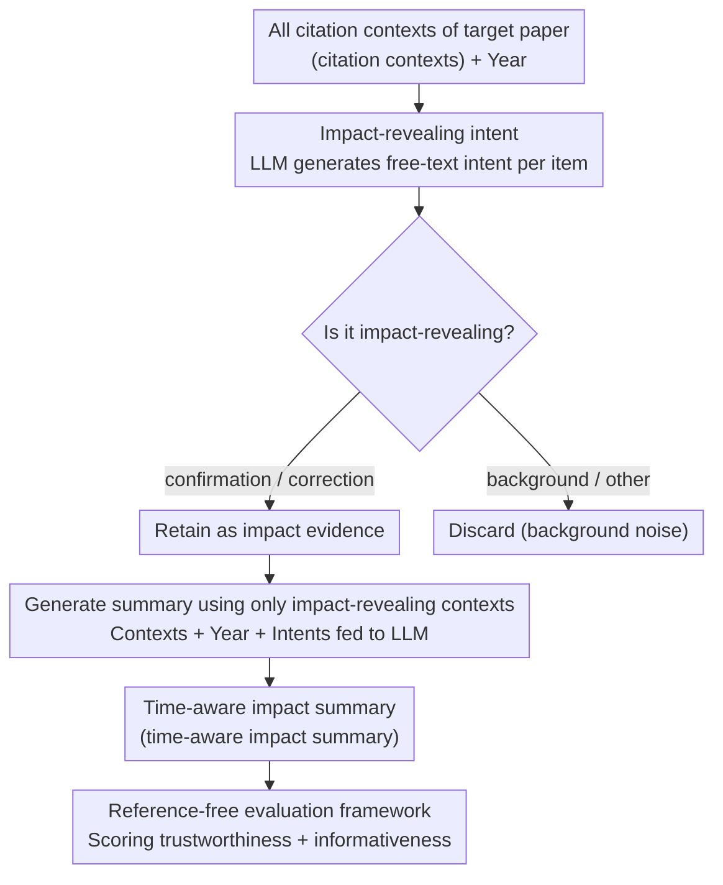

# In-depth Research Impact Summarization through Fine-Grained Temporal Citation Analysis

**Conference**: ACL2026  
**arXiv**: [2505.14838](https://arxiv.org/abs/2505.14838)  
**Code**: https://ukplab.github.io/acl2026-generating-impact-summaries  
**Area**: Scientific Literature Analysis / Text Generation  
**Keywords**: Scientific Impact Summarization, Citation Intent, Time-aware Summarization, citation context, LLM Evaluation  

## TL;DR
This paper proposes the "Scientific Impact Summarization" task: first identifying fine-grained intents that truly reveal impact from the citation contexts of a paper, and then generating an impact narrative that evolves over time. This approach better illustrates how a paper is adopted, criticized, and transformed by subsequent work compared to simple citation counts.

## Background & Motivation
**Background**: Scientific impact is typically measured by metrics like citation counts or the h-index. In NLP and scientometrics, extensive research has focused on citation intent classification, which uses coarse-grained labels to indicate whether a citation serves as background, method, result, or motivation.

**Limitations of Prior Work**: Citation counts only indicate "how many times" a paper is cited, rather than "why." For instance, out of 200 citations, one paper might be primarily reused as a method, while another might be cited mostly to point out its limitations, and a third might only be mentioned for background context. Furthermore, existing citation intent classification often remains at the level of individual citation contexts, rarely aggregating large numbers of citations into a readable impact narrative.

**Key Challenge**: Genuine scientific impact encompasses both confirmation and correction. Subsequent researchers may adopt a method, but they may also identify flaws and propose corrections. Focusing only on positive adoption or coarse-grained labels misses the trajectory of "criticism, correction, and rediscovery" inherent in scientific progress.

**Goal**: The authors aim to screen "impact-revealing contexts" from all citation contexts of a target paper, identify their fine-grained citation reasons and respective years, and generate a "time-aware impact summary" describing how the paper influenced subsequent research across different stages.

**Key Insight**: Instead of allowing an LLM to generate summaries freely based solely on titles and citation counts, the task is decomposed into two steps. First, in-context learning is used to generate fine-grained citation intents in free-text form and determine if they are impact-revealing. Second, only the filtered impact-revealing contexts, years, and intents are provided to the LLM to generate the final summary.

**Core Idea**: Utilizing "fine-grained citation intent + temporal information" as a structured intermediate layer transforms scientific impact from static metrics into verifiable, readable, and comparable historical narratives.

## Method

### Overall Architecture
The paper clearly defines four concepts: *citation context* (the text surrounding a citation), *fine-grained citation intent* (a free-text description of the reason for the citation), *impact-revealing intent* (intents specifically showing confirmation or critique/correction), and *scientific impact summary* (a narrative describing industrial/research impact over time). The pipeline follows a three-step process: screening evidence, writing the summary, and reference-free evaluation. Given a set of citation contexts and their years, the system generates fine-grained intents and determines if they are impact-revealing. Only those providing impact signals, along with their years and intents, are fed into an LLM to generate a semi-structured impact summary. Since no gold-standard summaries exist, a reference-free evaluation framework is used to measure trustworthiness and informativeness.

### Key Designs

**1. Impact-revealing citation intent as an intermediate representation: Upgrading "why cited" from coarse labels to free-text evidence**

Scientific impact is often hidden within specific usage patterns. Coarse-grained citation intent taxonomies are too broad, and citation counts lose the semantic nuance of how subsequent work actually utilizes a paper. Therefore, the authors prompt the LLM to output a free-text intent for each citation context and classify it as *confirmation*, *correction*, or *other*. For example, "use of minimization methodology" is considered impact-revealing, whereas "background about NER methods" is not. To support this task, the authors constructed a 4K citation context dataset: including 1K original positives from PST-Bench, 1K impact-revealing contexts filtered from S2AG using confirmation/correction patterns, and 2K non-impact-revealing examples. Human audits confirmed 90% label accuracy. Free-text intents preserve fine-grained semantics and serve as "evidence labels" that the LLM can cite during summary generation, reducing hallucinations.

**2. Generating summaries using only impact-revealing contexts: Filtering out background noise**

In highly-cited papers, many citation contexts are merely incidental background mentions. Including these in the prompt creates a long context that may mislead the LLM into treating a brief mention as a major impact. The authors designed a second stage that filters input to keep only impact-revealing citations, years, and generated intents. The prompt then instructs the model to summarize the impact trajectory across time periods (e.g., initial adoption of the method, mid-stage exposure of limitations, and late-stage repurposing). Comparative experiments showed that the "impact-revealing only + intents" setting outperformed inputs containing all citations in most metrics.

**3. Reference-free evaluation framework: Assessing "trustworthiness" and "informativeness" without gold answers**

As there are no "gold" impact summaries for this task, the authors split evaluation into *trustworthiness* and *informativeness*. *Trustworthiness* includes metrics such as faithfulness, coverage, and citation year compliance. Faithfulness involves decomposing the summary into impact descriptions by time period and requiring an evaluator LLM to check if each segment is supported by citation contexts from that same period. Coverage measures how many identified impact intents are captured. *Informativeness* includes insightfulness, trend awareness, and specificity, using a G-Eval style LLM-as-a-judge approach to assess whether the summary captures temporal shifts rather than just paraphrasing content. This dual-sided approach prevents both ungrounded fabrications and hollow statements.

### Loss & Training
This work does not train a new model but primarily uses a prompt-based LLM pipeline. Intent classification is performed using GPT-4o-mini via ICL with $K=50$ shots; classification is based on majority voting over three runs, which showed a 72% complete agreement rate. Summary generation and automatic evaluation primarily use GPT-4o, with Qwen-2.5-72B and Gemini-2.5-flash used to verify cross-model robustness in the appendix. A human study involved 9 university professors evaluating impact summaries generated for their own papers.

## Key Experimental Results

### Main Results

| Task | Method | Precision | Recall | F1 | Accuracy |
|------|------|-----------|--------|----|----------|
| Impact-revealing Classification | random baseline | 0.54 | 0.51 | 0.52 | 0.50 |
| Impact-revealing Classification | always-impact-revealing | 0.53 | 1.00 | 0.69 | 0.53 |
| Impact-revealing Classification | Structural Scaffolds | 0.55 | 0.44 | 0.49 | 0.51 |
| Impact-revealing Classification | Meaningful Citations | 0.72 | 0.46 | 0.56 | 0.62 |
| Impact-revealing Classification | Multi-cite | 0.59 | 0.41 | 0.48 | 0.53 |
| Impact-revealing Classification | **Ours** | 0.74 | 0.65 | 0.69 | 0.69 |

**Ours** performed best overall across precision, recall, F1, and accuracy. Notably, the recall was 19 percentage points higher than the second-best existing method. For generating impact summaries, high recall is crucial, as missing an impactful citation directly leads to the omission of a key impact trajectory.

### Ablation Study

| Summary Input | Intents provided? | Faithfulness | Coverage | Coverage@3 | Citation Year Compliance | Insightfulness | Trend Awareness | Specificity |
|----------|------------------|--------------|----------|------------|--------------------------|----------------|-----------------|-------------|
| No citations | No | 0.77 | 0.25 | 0.58 | n/a | 0.70 | 0.94 | 0.75 |
| All citations | No | 0.83 | 0.32 | 0.74 | 0.55 | 0.80 | 0.95 | 0.85 |
| All citations | Yes | 0.84 | 0.32 | 0.73 | 0.48 | 0.80 | 0.97 | 0.86 |
| Impact-revealing only | No | 0.87 | 0.33 | 0.73 | 0.59 | 0.80 | 0.96 | 0.87 |
| **Impact-revealing only** | **Yes** | 0.88 | 0.34 | 0.75 | 0.56 | 0.83 | 0.98 | 0.88 |

### Key Findings
- When subdividing into confirmatory and correction citations, the F1 of the proposed method reached 0.88 and 0.98 respectively, significantly outperforming existing intent classifiers. This suggests the method is particularly adept at identifying signals where a paper's limitations are pointed out and improved upon.
- The optimal summary input is the combination of impact-revealing citations and their intents, achieving the highest or tied-highest scores in faithfulness, coverage, Coverage@3, insightfulness, trend awareness, and specificity.
- In the human evaluation by professors, the generated summaries were chosen 63% of the time over a no-knowledge baseline for relevance and 75% for insightfulness. Approximately 60% of professors felt the level of detail was appropriate and provided new, non-obvious insights; this rose to 75% for papers with impact-revealing citations in the top 10%.

## Highlights & Insights
- The most significant highlight is the redefinition of "impact": it is not a citation count, but a measure of how subsequent work uses, extends, questions, and corrects a paper. This perspective is more valuable for researchers to quickly judge the actual historical role of a paper than bibliometrics.
- Free-text intents are highly valuable. They prevent the information loss associated with coarse taxonomies and provide an intermediate layer of "evidence labels" for summary generation, reducing the risk of LLM hallucinations.
- The evaluation framework itself is reusable. The combination of faithfulness, coverage, year compliance, and trend awareness can be transferred to tasks like survey generation, related work writing, and research trajectory analysis.

## Limitations & Future Work
- The current study only processes English papers; cross-lingual citation contexts and disciplinary writing styles might affect intent expression. Scientific impact summarization for other languages remains to be validated.
- The scale of human evaluation was limited to 9 professors. While professional evaluation is high-quality, the sample size is small.
- Even the best setting only achieved a full coverage of 0.34 and citation year compliance around 0.56 to 0.59, indicating that LLMs still miss long-tail impact themes and can be confused by other numerical years appearing in the context.
- The system was primarily tested on the GPT-4o series. While Qwen and Gemini were checked, a more systematic comparison across models is needed and biases could exist since the same LLM is used for both generation and evaluation.
- Impact is currently operationalized as confirmation and correction. Real scientific impact includes standardization, educational dissemination, and cross-domain transfer, which could be addressed in future expansions of the intent space.

## Related Work & Insights
- **vs citation count / h-index**: Traditional metrics are scalable but fail to explain why a citation occurred; this work extracts impact paths from citation contexts to distinguish between methodological reuse and critical correction.
- **vs citation intent classification**: Existing methods typically focus on coarse-grained single-citation classification; this work uses intent classification as an intermediate step toward multi-document, time-aware summarization.
- **vs query-focused scientific summarization**: General scientific summaries focus on the paper's contents; the query here is "How did this paper affect subsequent research," making it an automated draft of the history of scientific ideas.

## Rating
- **Novelty**: ⭐⭐⭐⭐⭐ The task definition is highly innovative, combining citation intent, timelines, and impact summarization into a coherent new problem.
- **Experimental Thoroughness**: ⭐⭐⭐⭐☆ The combination of automated metrics, ablation studies, expert evaluation, and cross-model checks is comprehensive, though human evaluation scale and coverage remain limited.
- **Writing Quality**: ⭐⭐⭐⭐☆ The structure is clear, with well-defined metrics; some dense tables require careful reading.
- **Value**: ⭐⭐⭐⭐⭐ Highly practical for literature review, academic assessment, and survey writing, especially when integrated into paper retrieval systems.

<!-- RELATED:START -->

## Related Papers

- [\[AAAI 2026\] AutoMalDesc: Large-Scale Script Analysis for Cyber Threat Research](../../AAAI2026/nlp_generation/automaldesc_large-scale_script_analysis_for_cyber_threat_research.md)
- [\[ACL 2026\] Investigating the Representation of Backchannels and Fillers in Fine-tuned Language Models](investigating_the_representation_of_backchannels_and_fillers_in_fine-tuned_langu.md)
- [\[ACL 2026\] Children's English Reading Story Generation via Supervised Fine-Tuning of Compact LLMs with Controllable Difficulty and Safety](childrens_english_reading_story_generation_via_supervised_fine-tuning_of_compact.md)
- [\[ACL 2025\] Multi-document Summarization through Multi-document Event Relation Graph Reasoning in LLMs](../../ACL2025/nlp_generation/event_graph_bias_mitigation_summarization.md)
- [\[ACL 2026\] ThreadSumm: Summarization of Nested Discourse Threads Using Tree of Thoughts](threadsumm_summarization_of_nested_discourse_threads_using_tree_of_thoughts.md)

<!-- RELATED:END -->
