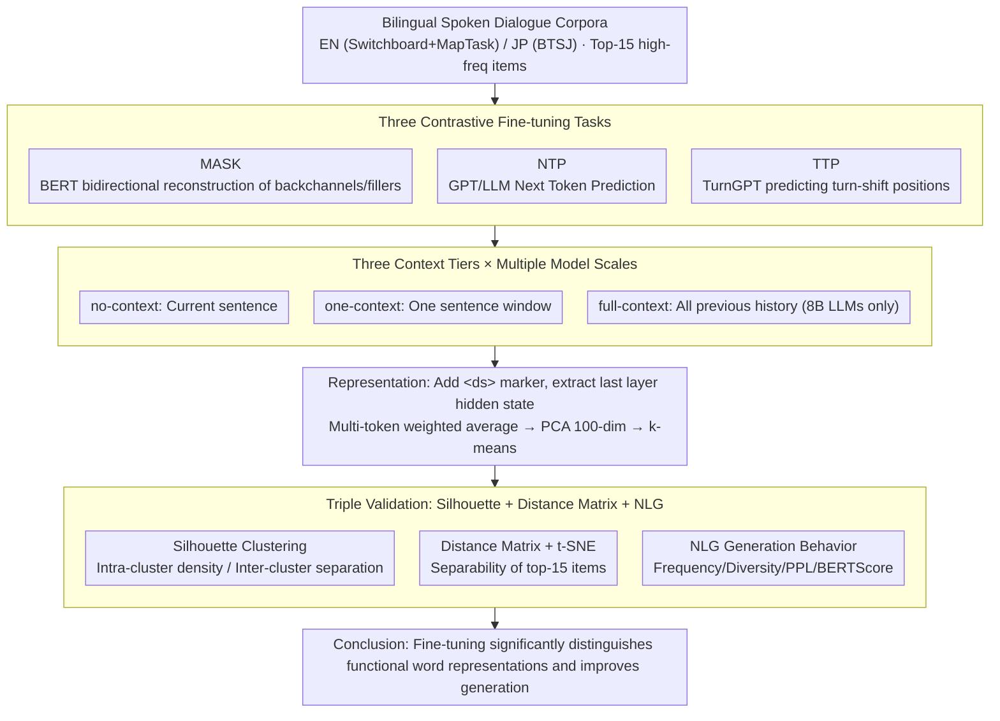

# Investigating the Representation of Backchannels and Fillers in Fine-tuned Language Models

**Conference**: ACL 2026  
**arXiv**: [2509.20237](https://arxiv.org/abs/2509.20237)  
**Code**: https://github.com/colalao/discourse_markers (Included)  
**Area**: Dialogue Generation / Representation Analysis / Discourse Markers  
**Keywords**: backchannel, filler, fine-tuning, silhouette clustering, dialogue language models

## TL;DR
The paper trains BERT, GPT-2, TurnGPT, LLaMA-3 8B, and Qwen-3 8B on English and Japanese spoken dialogue corpora using three fine-tuning tasks: MASK, NTP, and TTP. It utilizes t-SNE visualization and silhouette clustering to quantify the representation quality of "reactive tokens" (backchannels like *uh-huh*) and "hesitation tokens" (fillers like *um*). The authors find that fine-tuning enables these "semantically bleached" functional words to be significantly distinguished in the embedding space and allows models to naturally produce diverse backchannels/fillers during NLG, marking a quantifiable first step toward "human-like conversational LMs."

## Background & Motivation
**Background**: While backchannels (*uh-huh*, *yeah*) and fillers (*uh*, *um*) rank among the highest frequency words in spoken dialogue, NLP has long treated them as stop words to be removed during preprocessing—for instance, dependency parsing on Switchboard commonly excludes them to improve accuracy.

**Limitations of Prior Work**: (a) Mainstream text pre-training corpora contain almost no spoken markers, resulting in high token IDs and near-random embeddings for pre-trained LMs; (b) LMs lacking backchannels/fillers fail to provide feedback or mark cognitive load in dialogue agent tasks, making them unlike humans; (c) Existing research focuses on "word-level representation" changes after fine-tuning BERT/GPT-2, but **systematic research targeting low-frequency functional words is scarce**.

**Key Challenge**: Theoretically, backchannels/fillers are semantically bleached (lacking referential meaning), yet pragmatically they fulfill critical functions like grounding, turn-taking, and disfluency. Can LMs distinguish different pragmatic functions of the same backchannel in varying contexts, or do they merely assign random vectors?

**Goal**: (RQ1) Can fine-tuning improve LM representations of backchannels/fillers? (RQ2) What role does the context window size play? (RQ3) Which model architecture benefits the most? (RQ4) Are there differences between different fine-tuning tasks?

**Key Insight**: Clustering quality (silhouette score) naturally measures "whether the same backchannel is represented as multiple pragmatic sub-functions and whether different backchannels are mutually separable." This is used as a "microscope" to examine 4 models × 3 fine-tuning tasks × 3 context settings × 2 languages.

**Core Idea**: Using a triad of silhouette scores, t-SNE, and distance matrices, the authors convert the subjective question of "whether functional words are learned by LMs" into statistically verifiable metrics. These results are cross-validated with NLG generation evaluations to see if representation improvements translate into output behavior.

## Method

### Overall Architecture
The workflow consists of "Data Selection → Three Fine-tuning Tasks → Three Contextual Representation Extractions → Clustering / Distance Matrix / t-SNE / NLG Evaluation."

- **Data**: English uses Switchboard + MapTask (~150K utterances, 127,672 backchannels/fillers); Japanese uses the BTSJ 1000 Person Natural Conversation Corpus (170,898 instances). The top 15 frequent items are selected for each.
- **Models**: BERT, GPT-2 (EN 768-dim / JP 1024-dim), TurnGPT (GPT-2 based), LLaMA-3 8B, Qwen-3 8B (latter two are 4096-dim + LoRA fine-tuning, rank=16, applied to q_proj/v_proj).
- **Fine-tuning Tasks**: MASK (for BERT), NTP (GPT series + LLMs), and TTP (GPT-2 only under TurnGPT framework). MASK/NTP use an 80/20 data split; TTP uses standard train/val/test splits.
- **Representation Extraction**: A `<ds>` marker is added to sentences containing backchannels/fillers, and the hidden state of the final layer is extracted. Multi-token backchannels are weighted-averaged into a single vector; PCA reduces these to 100 dimensions for $k$-means.

Three context settings: no-context (current sentence only), one-context (one sentence before and after), and full-context (LLaMA-3 / Qwen-3 only, concatenating all previous history).

### Key Designs

**1. Three Contrastive Fine-tuning Tasks: Extracting pragmatic differences via diverse training objectives**

To determine if fine-tuning improves representations, the authors exclude the possibility that only a specific task is effective. MASK follows the BERT strategy, replacing backchannels/fillers with [MASK] / random / original tokens with 0.8/0.1/0.1 probability; NTP merges two speakers' sentences with `<s1>`/`<s2>` IDs for standard next-token prediction; TTP has TurnGPT predict $y^{*}=\arg\max_y P(y|X)$, the probability of a turn-shift. Despite the hypothesis that the specialized TTP would perform best, NTP achieved slightly higher silhouette scores—suggesting that general language modeling naturally encodes pragmatic differences without specialized turn-taking supervision.

**2. Factorial Design of 3 Context Tiers × Multiple Scales: Decoupling context window and model capacity**

"Context window" and "model capacity" are often confounded. The authors decouple them orthogonally. Context is set to: no-context (sentence only), one-context (±1 sentence), and full-context (history up to thousands of tokens, supported only by LLaMA-3 / Qwen-3). A counter-intuitive pattern emerged: more context actually lowered the silhouette score. Authors suggest that more context "dilutes" functional word representations with surrounding content. Furthermore, larger models are not always better; small models under specialized FT can approximate 8B LLM performance.

**3. Triple Validation (Silhouette + Distance Matrix + NLG): Preventing metric gaming**

Single metrics can be hacked—high silhouette scores don't guarantee natural use in generation. Triple validation combines internal representation, pairwise separability, and external behavior. Silhouette score $s(i)=\frac{b(i)-a(i)}{\max(a(i),b(i))}$ identifies if the same backchannel splits into multiple pragmatic functions. Distance matrices visualize Euclidean distances across top-15 backchannels via heatmaps. NLG evaluation involves continuing two-turn dialogues, measuring frequency, type diversity, frequency-weighted perplexity, BERTScore, and BLEU.

### Loss & Training
MASK uses token-level cross-entropy (mask positions only); NTP uses standard next-token cross-entropy; TTP optimizes binary turn-taking probability (GPT-2 + TurnGPT, batch 4, lr 5e-4, 15 epochs). LLaMA-3 / Qwen-3 utilize LoRA (rank 16, dropout 0.1, q/v_proj), with training times varying between 7–15 hours on 8×L40 GPUs.

## Key Experimental Results

### Main Results
Average silhouette scores (bootstrap n=1000, 95% CI):

| Model | Task | Lang | no-ctx Base → FT | one-ctx Base → FT | full-ctx Base → FT |
|---|---|---|---|---|---|
| BERT | MASK | EN | 0.144 → 0.241 | 0.213 → 0.391 | — |
| BERT | MASK | JP | 0.213 → 0.391 | 0.197 → **0.429** | — |
| GPT-2 | NTP | EN | 0.274 → 0.328 | 0.149 → 0.311 | — |
| GPT-2 | NTP | JP | 0.157 → 0.288 | 0.101 → 0.273 | — |
| GPT-2 | TTP | EN | — → 0.289 | — → 0.211 | — |
| GPT-2 | TTP | JP | — → 0.284 | — → 0.261 | — |
| LLaMA-3 8B | NTP | EN | 0.450 → **0.588** | 0.183 → 0.291 | 0.210 → 0.301 |
| LLaMA-3 8B | NTP | JP | 0.257 → 0.450 | 0.179 → 0.335 | 0.318 → 0.408 |
| Qwen-3 8B | NTP | EN | 0.253 → 0.379 | 0.157 → 0.292 | 0.189 → 0.322 |
| Qwen-3 8B | NTP | JP | 0.172 → 0.452 | 0.154 → 0.263 | 0.173 → 0.181 |

English LLaMA-3 no-context FT achieved a silhouette of 0.588, the highest across all combinations. Japanese BERT MASK FT for one-context reached 0.429, nearly equaling 8B LLMs.

### Ablation Study (NLG Behavior, one-context)

English backchannel/filler generation metrics:

| Model | Diversity ↑ | Frequency ↑ | Perplexity ↓ | BERTScore F1 ↑ | BLEU ↑ |
|---|---|---|---|---|---|
| LLaMA-3 no-FT | 73 | 4.29% | 197.7 | 78.69% | 0.0600 |
| **LLaMA-3 FT** | **83** | **18.61%** | **5.30** | **79.99%** | **0.0697** |
| Qwen-3 no-FT | 87 | 5.33% | 202.1 | 76.02% | 0.0698 |
| Qwen-3 FT | 95 | 9.19% | 91.3 | 79.73% | 0.0800 |
| GPT-2 no-FT | 68 | 6.68% | 158.6 | 79.67% | 0.0544 |
| GPT-2 FT | 90 | 17.43% | 6.98 | 79.99% | 0.0731 |

In Japanese, frequency increased from 0.31% → 7.57% (LLaMA-3) and PPL dropped from 256 → 28.5.

### Key Findings
- **Fine-tuning improves silhouette scores across nearly all combinations**: FT curves are consistently higher than base versions, with LLaMA-3 EN no-ctx increasing from 0.450 → 0.588 (+30%).
- **Context inversely dilutes functional word representations**: Silhouette scores generally decrease as context grows, likely because functional word embeddings are "smoothed" by surrounding content words.
- **NTP slightly outperforms TTP**: General language modeling captures pragmatic differences effectively without requiring explicit turn-taking supervision.
- **Small models are competitive**: Japanese BERT MASK (one-context) achieved 0.429, rivaling LLaMA-3 (0.450), proving that "bidirectional attention + specialized FT" is more cost-effective than pure scaling for this task.
- **Improved representations translate to generation behavior**: LLaMA-3 FT increased EN backchannel frequency fourfold (4.29% → 18.61%) and reduced PPL from 197 to 5.3; qualitative analysis shows natural integration of *yeah* (affirmation), *um* (disfluency), and *so* (topic shift).
- **Negligible side effects**: Dialogue act classification on MapTask showed minimal drops (0.4–1.4 points) for BERT/GPT-2/Qwen and a 5.8-point gain for LLaMA-3, proving specialized spoken word fine-tuning does not harm general NLU.

## Highlights & Insights
- **Repurposing "discarded stop words" as research objects**: Ours is one of few works treating backchannels/fillers as first-class citizens, serving as a reminder that cleaning data can remove vital social cues.
- **Silhouette + Distance Matrix + NLG Triad**: This multi-layered evaluation is highly applicable to any study on "low-frequency token representations" (e.g., dialects, emojis, low-resource pronouns).
- **Contextual Dilution as a Double-edged Sword**: The finding that context blunts backchannel distinctness suggests that dialogue systems should distinguish between "semantic tasks" (requiring long context) and "pragmatic tasks" (where context might be limited to preserve marker distinctness).
- **NTP > TTP Intuition Defied**: The fact that generic objectives outperform task-specific ones supports the view that general language modeling implicitly learns turn-taking signals.

## Limitations & Future Work
- Authors acknowledge: (a) Only EN/JP covered; (b) Max scale limited to 8B models; (c) Analysis restricted to final hidden layers; (d) Surgical fine-tuning not explored; (e) Lack of vocal model contrast (pitch/pauses are critical); (f) NLG evaluation relied on small-scale human samples.
- Ours observations: (g) LLaMA-3 FT frequency (18.61%) may exceed ground truth, indicating "over-compensation"; (h) Qwen-3 saw minimal gains in JP full-context (0.173 → 0.181), suggesting cross-lingual mechanism differences; (i) Dramatic PPL drops may reflect corpus overfitting.
- Future directions: Explicitly labeling functions (confirmation/hesitation) for multi-class silhouette evaluation; multimodal joint training; using RLHF for "naturalness" rewards rather than pure SFT.

## Related Work & Insights
- **vs. Qian & Skantze 2024**: They used contrastive feedback embeddings but focused only on feedback; Ours covers broader functional classes and avoids contrastive learning to reduce compute.
- **vs. Mosbach 2020 / Merchant 2020**: While they studied BERT FT effects on general embeddings, Ours focuses on the systematically ignored backchannels/fillers.
- **vs. Skantze 2017 / TurnGPT**: Ours reverses the paradigm of previous turn-taking work by using those architectures to study the representation of the markers themselves.

## Rating
- Novelty: ⭐⭐⭐⭐ Treats neglected backchannels/fillers as primary objects; the evaluation triad is robust but individual components are standard.
- Experimental Thoroughness: ⭐⭐⭐⭐⭐ Comprehensive coverage across 5 models, 3 tasks, 3 contexts, 2 languages, and various control experiments.
- Writing Quality: ⭐⭐⭐⭐ Clear RQs and rich visualization; slightly long conceptual introductory sections.
- Value: ⭐⭐⭐⭐ Directly relevant to dialogue agents, TTS, and spoken LMs; a strong reminder to the community regarding functional word preservation.

<!-- RELATED:START -->

## Related Papers

- [\[ACL 2025\] An Empirical Study of Many-to-Many Summarization with Large Language Models](../../ACL2025/nlp_generation/an_empirical_study_of_manytomany_summarization.md)
- [\[ACL 2025\] Theme-Explanation Structure for Table Summarization Using Large Language Models](../../ACL2025/nlp_generation/theme-explanation_structure_for_table_summarization_using_large_language_models_.md)
- [\[ACL 2026\] Children's English Reading Story Generation via Supervised Fine-Tuning of Compact LLMs with Controllable Difficulty and Safety](childrens_english_reading_story_generation_via_supervised_fine-tuning_of_compact.md)
- [\[ACL 2026\] In-depth Research Impact Summarization through Fine-Grained Temporal Citation Analysis](in-depth_research_impact_summarization_through_fine-grained_temporal_citation_an.md)
- [\[ACL 2025\] Tell, Don't Show: Leveraging Language Models' Abstractive Retellings to Model Literary Themes](../../ACL2025/nlp_generation/tell_dont_show_leveraging_language_models_abstractive_retellings_to_model_litera.md)

<!-- RELATED:END -->
