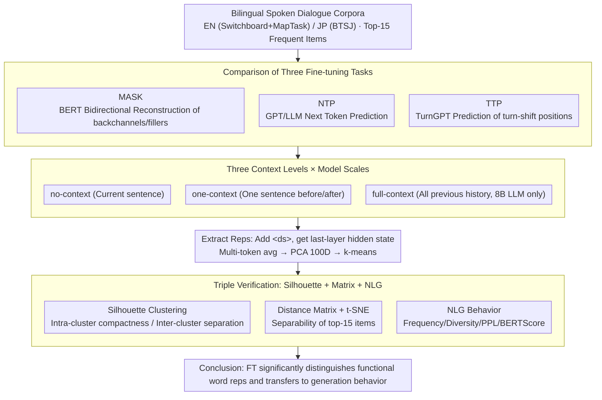

# Investigating the Representation of Backchannels and Fillers in Fine-tuned Language Models

**Conference**: ACL 2026  
**arXiv**: [2509.20237](https://arxiv.org/abs/2509.20237)  
**Code**: https://github.com/colalao/discourse_markers (Available)  
**Area**: Dialogue Generation / Representation Analysis / Discourse Markers  
**Keywords**: backchannel, filler, fine-tuning, silhouette clustering, dialogue language models

## TL;DR
This paper trains BERT, GPT-2, TurnGPT, LLaMA-3 8B, and Qwen-3 8B on English and Japanese spoken dialogue corpora using three fine-tuning tasks: MASK, NTP, and TTP. It utilizes t-SNE visualization and silhouette clustering to quantify the representation quality of "backchannels" (e.g., *uh-huh*) and "fillers" (e.g., *um*). The study finds that fine-tuning significantly distinguishes these "semantically bleached" functional words within the embedding space and enables models to naturally generate diverse backchannels/fillers during NLG, marking a quantifiable step toward "human-like conversational LMs."

## Background & Motivation
**Background**: Although backchannels (*uh-huh*, *yeah*) and fillers (*uh*, *um*) rank among the most frequent words in spoken dialogue, NLP has long treated them as stop words, removing them during preprocessing. For instance, dependency parsing on Switchboard commonly excludes them to improve parsing accuracy.

**Limitations of Prior Work**: (a) Mainstream text pre-training corpora contain almost no spoken discourse markers, leading to high token IDs and near-random embeddings in pre-trained LMs; (b) LMs lacking backchannels/fillers fail to provide feedback or mark cognitive load in dialogue agent tasks, making ASR and chatbots seem less human; (c) While existing research examines word-level representation changes after fine-tuning BERT/GPT-2, **systematic studies on low-frequency functional words are scarce**.

**Key Challenge**: Theoretically, backchannels/fillers are semantically bleached (lacking referential meaning), yet pragmatically they fulfill critical functions like grounding, turn-taking, and marking disfluency. Are LMs capable of distinguishing different pragmatic functions of the same backchannel in varying contexts, or are they limited to random vectors?

**Goal**: (RQ1) Can fine-tuning improve LM representations of backchannels/fillers? (RQ2) What role does the context window size play? (RQ3) Which models benefit the most? (RQ4) Are there differences between fine-tuning tasks?

**Key Insight**: Clustering quality (silhouette score) naturally measures "whether the same backchannel is represented as multiple pragmatic sub-functions and whether different backchannels are mutually separable." This acts as a microscope to examine 4 models × 3 fine-tuning tasks × 3 context settings across English and Japanese.

**Core Idea**: By using a toolkit of silhouette scores, t-SNE, and distance matrices, the paper transforms the subjective impression of "whether functional words are learned" into statistically verifiable metrics. NLG evaluation is then used to cross-validate whether representation improvements translate into output behavior.

## Method

### Overall Architecture
The workflow consists of "Data Selection → Three Fine-tuning Tasks → Representation Extraction under Three Contexts → Evaluation via Clustering / Distance Matrix / t-SNE / NLG."

- **Data**: English datasets include Switchboard + MapTask (~150K utterances, 127,672 backchannels/fillers); Japanese dataset is the BTSJ 1000 Person Natural Conversation Corpus (170,898 items). Top-15 high-frequency items are selected for both.
- **Models**: BERT, GPT-2 (EN: 768-dim / JP: 1024-dim), TurnGPT (GPT-2 based), LLaMA-3 8B, and Qwen-3 8B (4096-dim + LoRA fine-tuning, rank=16, applied to q_proj/v_proj).
- **Fine-tuning Tasks**: MASK (for BERT), NTP (for GPT series + LLMs), and TTP (only for GPT-2 within the TurnGPT framework). MASK/NTP use an 80/20 split, while TTP follows standard train/val/test splits.
- **Representation Extraction**: A `<ds>` marker is added to sentences containing backchannels/fillers. The last-layer hidden state is extracted. Multi-token markers are compressed into a single vector via weighted averaging. Finally, PCA reduces dimensions to 100 before $k$-means clustering.

Three context settings: no-context (current sentence only), one-context (one sentence before and after), and full-context (only supported by LLaMA-3 / Qwen-3, concatenating all previous history).

### Key Designs

**1. Comparison of Three Fine-tuning Tasks: Extracting pragmatic differences of backchannels/fillers via varying objectives**
To answer if fine-tuning improves representations, the authors first exclude the possibility that only specific tasks work. Three routes with different objectives are designed. MASK follows BERT's default strategy (0.8/0.1/0.1 mask/random/original), forcing bidirectional context to reconstruct tokens. NTP merges two speakers' sentences with `<s1>`/`<s2>` IDs for standard prediction. TTP makes TurnGPT predict $y^{*}=\arg\max_y P(y|X)$, where $y$ is the occurrence of a turn-shift, leveraging the strong correlation between backchannels and turn-holding. Interestingly, while TTP was hypothesized to be best, NTP achieved slightly higher silhouette scores, suggesting that general language modeling inherently captures pragmatic differences without requiring explicit turn-taking supervision.

**2. Factorial Design for Context vs. Scale: Decoupling context window and model capacity**
Context window and model capacity are often conflated. The authors decouple them: context is set at three levels (no-context, one-context, and full-context), while models range from BERT (110M) and GPT-2 (124M) to 8B LLMs. A counter-intuitive discovery emerged: more context actually lowers the silhouette score. Excessive context "dilutes" functional word representations by averaging them with surrounding content words. Backchannels/fillers are most distinguishable in the no-context setting. Furthermore, model scale is not the sole factor, as small models under specialized fine-tuning can approach the performance of 8B LLMs.

**3. Triple Verification (Silhouette + Distance Matrix + NLG): Preventing metric hacking**
Any single metric can be high without reflecting true quality. The authors validate across three dimensions: internal representation, pairwise separability, and external generation behavior. Silhouette $s(i)=\frac{b(i)-a(i)}{\max(a(i),b(i))}$ rewards intra-cluster compactness and inter-cluster separation. Distance matrices visualize Euclidean distances between the top-15 backchannels. NLG evaluation tests two-turn dialogue continuations, comparing frequency, diversity, frequency-weighted perplexity, BERTScore, and BLEU. A conclusion is only reached if all three levels align.

### Loss & Training
MASK uses token-level cross-entropy; NTP uses standard next-token cross-entropy; TTP optimizes binary turn-taking probability (GPT-2 + TurnGPT, batch 4, lr 5e-4, dropout 0.3, 15 epochs, using ckpt with lowest val loss). LLaMA-3 / Qwen-3 use LoRA (rank 16, dropout 0.1, q/v_proj only), with training times between 7–15 hours (8×L40 48G).

## Key Experimental Results

### Main Results
Average silhouette score (bootstrap n=1000, 95% CI):

| Model | Task | Language | no-ctx Base → FT | one-ctx Base → FT | full-ctx Base → FT |
|---|---|---|---|---|---|
| BERT | MASK | EN | 0.144 → 0.241 | 0.213 → 0.391 | — |
| BERT | MASK | JP | 0.213 → 0.391 | 0.197 → **0.429** | — |
| GPT-2 | NTP | EN | 0.274 → 0.328 | 0.149 → 0.311 | — |
| GPT-2 | NTP | JP | 0.157 → 0.288 | 0.101 → 0.273 | — |
| GPT-2 | TTP | EN | — → 0.289 | — → 0.211 | — |
| GPT-2 | TTP | JP | — → 0.284 | — → 0.261 | — |
| LLaMA-3 8B | NTP | EN | 0.450 → **0.588** | 0.183 → 0.291 | 0.210 → 0.301 |
| LLaMA-3 8B | NTP | JP | 0.257 → 0.450 | 0.179 → 0.335 | 0.318 → 0.408 |
| Qwen-3 8B | NTP | EN | 0.253 → 0.379 | 0.157 → 0.292 | 0.189 → 0.322 |
| Qwen-3 8B | NTP | JP | 0.172 → 0.452 | 0.154 → 0.263 | 0.173 → 0.181 |

EN LLaMA-3 no-context after FT reached a silhouette of 0.588, the highest overall. JP BERT MASK FT with one-context reached 0.429, nearly equaling the 8B LLM.

### Ablation Study (NLG Evaluation, one-context)

Key metrics for English backchannel/filler generation:

| Model | Diversity ↑ | Frequency ↑ | Perplexity ↓ | BERTScore F1 ↑ | BLEU ↑ |
|---|---|---|---|---|---|
| LLaMA-3 no-FT | 73 | 4.29% | 197.7 | 78.69% | 0.0600 |
| **LLaMA-3 FT** | **83** | **18.61%** | **5.30** | **79.99%** | **0.0697** |
| Qwen-3 no-FT | 87 | 5.33% | 202.1 | 76.02% | 0.0698 |
| Qwen-3 FT | 95 | 9.19% | 91.3 | 79.73% | 0.0800 |
| GPT-2 no-FT | 68 | 6.68% | 158.6 | 79.67% | 0.0544 |
| GPT-2 FT | 90 | 17.43% | 6.98 | 79.99% | 0.0731 |

In Japanese, frequency increased from 0.31% → 7.57% (LLaMA-3) and PPL dropped from 256 → 28.5.

### Key Findings
- **Fine-tuning improves silhouette across almost all combinations**: Curves show FT is consistently higher than base, most notably in EN LLaMA-3 no-ctx (+30%).
- **Context dilutes functional word representations**: Silhouette scores generally decrease as context increases. Higher context causes backchannel representations to be "masked" by neighboring content word information—a counter-intuitive yet reasonable finding for dialogue research.
- **NTP slightly outperforms TTP**: Despite TTP's intuitive link to turn-holding, NTP achieves higher silhouettes, suggesting generic modeling captures pragmatic nuances without specialized supervision.
- **Small models are competitive**: JP BERT MASK one-context (0.429) nearly ties LLaMA-3 (0.450), indicating that "specialized FT + bidirectional attention" can be more cost-effective than scaling model size.
- **Representation quality translates to generation behavior**: After FT, LLaMA-3's EN backchannel frequency quadrupled, and PPL plummeted. Qualitative analysis confirms the ability to insert *yeah* (confirmaton) or *um* (disfluency) in contextually appropriate slots.
- **Manageable side effects**: On MapTask dialogue act classification, BERT/GPT-2/Qwen dropped only 0.4–1.4 points, while LLaMA-3 improved by 5.8 points, proving specialized FT does not harm general language understanding.

## Highlights & Insights
- **Elevating "stop words" to research subjects**: This is a rare study treating backchannels/fillers as first-class citizens, reminding us that data cleaning often discards vital social cues.
- **Triple-threat evaluation suite**: The combination of silhouette, distance matrices, and NLG behavior is ideal for any study on low-frequency token representations.
- **The Context Dilution Paradox**: The finding that context can "blunt" marker distinctness suggests dialogue systems should differentiate between semantic tasks (requiring long context) and pragmatic tasks (requiring less context).
- **NTP > TTP Intuition**: More specialized tasks aren't always better; general language modeling appears to already contain implicit turn-taking signals.

## Limitations & Future Work
- Language coverage is limited to EN/JP (German excluded due to corpus scale/annotation differences).
- Models are limited to 8B due to compute constraints.
- Analysis focused primarily on the last layer.
- Lacks surgical fine-tuning techniques or a speech-model comparison (acoustic features like pitch/pause are vital for backchannels).
- NLG frequency for LLaMA-3 (18.61%) might suggest over-compensation ("over-verbosity") compared to ground truth.

## Related Work & Insights
- **vs. Qian & Skantze 2024**: They used contrastive learning for feedback embeddings on audio/text, but focused only on feedback. Ours covers broader categories with lighter compute.
- **vs. Mosbach 2020/Merchant 2020**: They studied BERT FT on general tokens; this work extends analysis to systematic spoken discourse markers.
- **vs. Skantze 2017 (TurnGPT)**: While they focused on turn-taking prediction, this work uses TurnGPT as a backbone to focus on the resulting representations.

## Rating
- Novelty: ⭐⭐⭐⭐ Systematic focus on functional words is a "gold mine in the corner," though individual methods are standard.
- Experimental Thoroughness: ⭐⭐⭐⭐⭐ Comprehensive coverage across models, tasks, contexts, and languages with bootstrap CI and side-effect testing.
- Writing Quality: ⭐⭐⭐⭐ Clear RQs and rich tables.
- Value: ⭐⭐⭐⭐ Directly applicable to dialogue agents, TTS, and spoken LMs.

<!-- RELATED:START -->

## Related Papers

- [\[ACL 2026\] Children's English Reading Story Generation via Supervised Fine-Tuning of Compact LLMs with Controllable Difficulty and Safety](childrens_english_reading_story_generation_via_supervised_fine-tuning_of_compact.md)
- [\[ACL 2025\] An Empirical Study of Many-to-Many Summarization with Large Language Models](../../ACL2025/nlp_generation/an_empirical_study_of_manytomany_summarization.md)
- [\[ACL 2025\] Theme-Explanation Structure for Table Summarization Using Large Language Models](../../ACL2025/nlp_generation/theme-explanation_structure_for_table_summarization_using_large_language_models_.md)
- [\[ICLR 2026\] Antislop: A Comprehensive Framework for Identifying and Eliminating Repetitive Patterns in Language Models](../../ICLR2026/nlp_generation/antislop_a_comprehensive_framework_for_identifying_and_eliminating_repetitive_pa.md)
- [\[ACL 2026\] In-depth Research Impact Summarization through Fine-Grained Temporal Citation Analysis](in-depth_research_impact_summarization_through_fine-grained_temporal_citation_an.md)

<!-- RELATED:END -->
